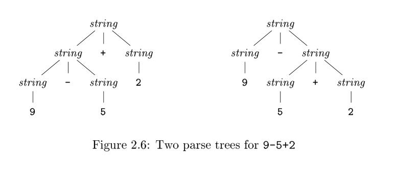

[TOC]

# 2.2 Syntax Definition

In this section, we introduce a notation — the "[context-free grammar](https://en.wikipedia.org/wiki/Context-free_grammar)," or "grammar" for short — that is used to specify the syntax of a language. Grammars will be used throughout this book to organize **compiler front ends**.

> TIPS: Wikipedia has a good **explanation** of [context-free grammar](https://en.wikipedia.org/wiki/Context-free_grammar)

> TIPS: It is a convention that there is a section called **language reference** or **language specification** to describe grammar of the programming language in the official document of the programming language , such as
>
> - [The Python Language Reference](https://docs.python.org/3/reference/index.html) use [extended BNF](https://en.wikipedia.org/wiki/Extended_Backus%E2%80%93Naur_Form) notation to describe syntax of Python language.
> - [The Java® Language Specification](https://docs.oracle.com/javase/specs/jls/se7/html/index.html)

## 2.2.1 Definition of Grammars

A [context-free grammar](https://en.wikipedia.org/wiki/Context-free_grammar) has four components:
1. A set of [terminal symbols](https://en.wikipedia.org/wiki/Terminal_and_nonterminal_symbols), sometimes referred to as "tokens." The terminals are the elementary symbols of the language defined by the grammar.
2. A set of [nonterminals](https://en.wikipedia.org/wiki/Terminal_and_nonterminal_symbols), sometimes called "syntactic variables." Each nonterminal represents a set of strings of terminals, in a manner we shall describe.
3. A set of [productions](https://en.wikipedia.org/wiki/Production_(computer_science)), where each production consists of a nonterminal, called the *head* or *left* side of the production, an arrow, and a sequence of terminals and/or nonterminals, called the *body* or *right* side of the production. 
4. A designation of one of the nonterminals as the *start* symbol.

**Example 2.1** : 
$$
\begin{align}
list \to list + digit   \tag {2.1}\\
list \to list - digit   \tag {2.2}\\
list \to digit   \tag {2.3}\\
digit \to 0 | 1 | 2 | 3 | 4 | 5 | 6 | 7 | 8 | 9 \tag {2.4}
\end{align}
$$

> TIPS:  Programmer should be sensitive of [recursion](https://en.wikipedia.org/wiki/Recursion_(computer_science)), it is obvious that [Context-free grammar](https://en.wikipedia.org/wiki/Context-free_grammar) above has the property of [recursion](https://en.wikipedia.org/wiki/Recursion_(computer_science)),  a [grammar](https://en.wikipedia.org/wiki/Formal_grammar) is informally called a [**recursive grammar**](https://en.wikipedia.org/wiki/Recursive_grammar) if it contains [production rules](https://en.wikipedia.org/wiki/Formal_grammar#The_syntax_of_grammars) that are [recursive](https://en.wikipedia.org/wiki/Recursion_(computer_science)).
>

## 2.2.2 Derivations

> TIPS: In addition to using the word **derivation**/derive,  word **expand** is also used a lot. I think word **expand** can visually reflect the process of expanding an inner nodes of the parse tree describing in 2.2.3.

A grammar derives strings by beginning with the start symbol and repeatedly replacing a nonterminal by the body of a production for that nonterminal. The **terminal strings** that can be derived from the start symbol form the *language* defined by the grammar.

> TIPS: Here is the definition of *language*, please recall my question in the first introduction that what a programming language is.

*Parsing* is the problem of taking a string of terminals and figuring out how to derive it from the **start symbol** of the grammar, and if it cannot be derived from the start symbol of the grammar, then reporting syntax errors within the string. 

> TIPS: The process of parsing is the **inverse** of the process of deriving. The process of deriving is to generate terminal strings in the direction of generation while the process of parsing is to find productions in the opposite direction of production. They are like [recursion](https://en.wikipedia.org/wiki/Recursion_(computer_science)) and [corecursion](https://en.wikipedia.org/wiki/Corecursion).

> TIPS: Implementation of *parsing* is described in chapter 2.4.

## 2.2.3 Parse Trees

> TIPS:  [Parse tree](https://en.wikipedia.org/wiki/Parse_tree) reveal us of the power of  [tree](https://en.wikipedia.org/wiki/Tree_(data_structure)) structure, and it is an typical application of  [tree](https://en.wikipedia.org/wiki/Tree_(data_structure)). Tree data structures figure prominently in compiling.

> TIPS:  [Parse tree](https://en.wikipedia.org/wiki/Parse_tree) is the software implementation of grammar.

> TIPS: Recall what concluded in 2.2.1 Definition of Grammars is that [Context-free grammar](https://en.wikipedia.org/wiki/Context-free_grammar) has the property of [recursion](https://en.wikipedia.org/wiki/Recursion_(computer_science))， so do  [tree](https://en.wikipedia.org/wiki/Tree_(data_structure)) structure. This is one of reason why [tree](https://en.wikipedia.org/wiki/Tree_(data_structure)) structure is selected as  implementation of grammar.

> TIPS: This chapter gives the algorithm of build a parse tree according to the grammar.

## 2.2.4 Ambiguity

> TIPS: Programming language should be accurate and the designer should be careful to design grammar to avoid ambiguity. Source of ambiguity includes
>
> - precedence of operators
> - associativity of operators

## 2.2.5 Associativity of Operators

> TIPS: We can define associativity by grammar, this reveals us of the power if context free grammar.

By convention, $9+5+2$ is equivalent to $(9+5)+2$ and $9-5-2$ is equivalent to $(9-5)-2$. When an operand like 5 has operators to its left and right, conventions are needed for deciding which operator applies to that operand. We say that the operator + associates to the left, because an operand with plus signs on both sides of it belongs to the operator to its left. In most programming languages the four arithmetic operators, addition, subtraction, multiplication, and division are left-associative.

Some common operators such as exponentiation are right-associative. As another example, the assignment operator in C and its descendants is right-associative; that is, the expression `a=b=c`is treated in the same way as the expression `a=(b=c)`.

> For clarity, sample grammar for left-associative operator and sample grammar for right-associative operator are listed below along their parse tree.

Strings like `a=b=c` with a right-associative operator are generated by the following grammar:
$$
\begin{align}
right \to letter=right|letter \\
letter \to a|b| \dots |z
\end{align}
$$
Strings like `1+2`, `1-2` with a left-associative operator are generated by the following grammar:
$$
\begin{align}
list \to list + digit   \\
list \to list - digit   \\
list \to digit  \\
digit \to 0 | 1 | 2 | 3 | 4 | 5 | 6 | 7 | 8 | 9
\end{align}
$$

The contrast between a parse tree for a left-associative operator like `-` and a parse tree for a right-associative operator like `= is` shown by Fig. 2.7. Note that the parse tree for `9-5-2` grows down towards the left, whereas the parse tree for `a=b=c` grows down towards the right.

> TIPS: Recall what concluded in 2.2.1 Definition of Grammars is that [Context-free grammar](https://en.wikipedia.org/wiki/Context-free_grammar) has the property of [recursion](https://en.wikipedia.org/wiki/Recursion_(computer_science))，a [grammar](https://en.wikipedia.org/wiki/Formal_grammar) is informally called a [**recursive grammar**](https://en.wikipedia.org/wiki/Recursive_grammar) if it contains [production rules](https://en.wikipedia.org/wiki/Formal_grammar#The_syntax_of_grammars) that are [recursive](https://en.wikipedia.org/wiki/Recursion_(computer_science)). Here we can further subdivide, a grammar for a [context-free language](https://en.wikipedia.org/wiki/Context-free_language) is [left recursive](https://en.wikipedia.org/wiki/Left_recursion) if there exists a non-terminal symbol *A* that can be put through the production rules to produce a string with *A* (as the leftmost symbol), so grammars for left-associative operator are [left recursive](https://en.wikipedia.org/wiki/Left_recursion)  while grammars for right-associative operator are [right recursive](https://en.wikipedia.org/wiki/Left_recursion). 

For comparison, here are the ambiguous grammars and its parse tree.
$$
list \to list + digit | list - digit | 0 | 1 | 2 | 3 | 4 | 5 | 6 | 7 | 8 | 9
$$

## 2.2.6 Precedence of Operators

We say that `*` has higher precedence than `+` if `*` takes its operands before `+` does. In ordinary arithmetic, multiplication and division have higher precedence than addition and subtraction. Therefore, 5 is taken by `*` in b oth `9+5*2` and `9*5+2`; i.e., the expressions are equivalent to `9+(5*2)` and `(9*5)+2`, respectively.

**Example 2.6** : A grammar for arithmetic expressions can be constructed from a table showing the **associativity** and **precedence** of operators. We start with the four common arithmetic operators and a precedence table, showing the operators in order of increasing precedence. Operators on the same line have the same associativity and precedence:

|                   |       |
| ----------------- | ----- |
| left-associative  | `+ -` |
| left-associative: | `* /` |

We create two **nonterminals** `expr` and `term` for the two levels of precedence(`expr`  for `+ -` and `term` for `* /`), and an extra **nonterminal** `factor` for generating basic units in expressions. The basic units in expressions are presently digits and parenthesized expressions.
$$
factor \to digit | ( expr )
$$
Now consider the binary operators, `*` and `/`, that have the highest precedence. Since these operators associate to the left, the productions are similar to those for lists that associate to the left.
$$
term \to term * factor \\
| term / factor \\
| factor
$$
Similarly, `expr` generates lists of terms separated by the additive operators.
$$
expr \to expr + term \\
| expr - term \\
| term
$$
The resulting grammar is therefore
$$
expr \to expr + term | expr - term | term \\
term \to term * factor | term / factor | factor \\
factor \to digit | ( expr )
$$

> TIPS: The priorities decrease from bottom to top

### Generalizing the Expression Grammar of Example 2.6

We can think of a **factor** as an expression that cannot b e "torn apart" by any operator. By "torn apart," we mean that placing an operator next to any factor, on either side, does not cause any piece of the **factor**, other than the **whole**, to become an operand of that operator. If the **factor** is a **parenthesized expression**, the parentheses protect against such "tearing," while if the factor is a single operand, it cannot be torn apart.

A **term** (that is not also a factor) is an expression that can be torn apart by operators of the highest precedence: `*` and `/`, but not by the lower-precedence operators. An expression (that is not a term or factor) can be torn apart by any operator.

We can generalize this idea to any number `n` of precedence levels. We need `n + 1` nonterminals. The first, like factor in Example 2.6, can never be torn apart. Typically, the production bodies for this nonterminal are only single operands and **parenthesized expressions**. Then, for each precedence level, there is one nonterminal representing expressions that can be torn apart only by operators at that level or higher. Typically, the productions for this nonterminal have bodies representing uses of the operators at that
level, plus one body that is just the nonterminal for the next higher level.

> TIPS:  The reason one more is needed is that it is for  **factor**

> TIPS:  When generating a parse tree from a grammar for expression, the higher the priority of operator, the earlier it is built, and the deeper it is

