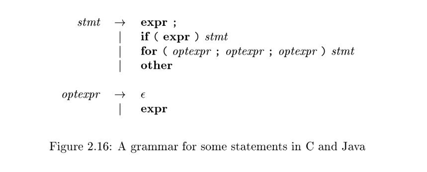

[TOC]


# 2.4 Parsing

Parsing is the process of determining how a string of **terminals** can be generated by a **grammar**. In discussing this problem, it is helpful to think of a **parse tree** being constructed, even though a compiler may not construct one, in practice. However, a parser must be capable of constructing the tree in principle, or else the translation cannot be guaranteed correct.

> NOTE: The concept of parsing is introduced in chapter 2.2.2 Derivations

This section introduces a parsing method called "[recursive descent](https://en.wikipedia.org/wiki/Recursive_descent_parser)," which can be used both to parse and to implement syntax-directed translators. A complete Java program, implementing the translation scheme of Fig. 2.15, appears in the next section. A viable alternative is to use a software tool to generate a translator directly from a translation scheme. Section 4.9 describes such a tool  Yacc; it can implement the translation scheme of Fig. 2.15 without modification.

For any context-free grammar there is a parser that takes at most $O (n^3)$ time to parse a string of n terminals. But cubic time is generally too expensive. Fortunately, for real programming languages, we can generally design a grammar that can be parsed quickly. Linear-time algorithms suffice to parse essentially all languages that arise in practice. Programming-language parsers almost always make a single left-to-right scan over the input, looking ahead one terminal at a time, and constructing pieces of the parse tree as they go.

Most parsing methods fall into one of two classes, called the [top-down](https://en.wikipedia.org/wiki/Top-down_parsing) and [bottom-up](https://en.wikipedia.org/wiki/Bottom-up_parsing) methods. These terms refer to the order in which **nodes** in the **parse tree** are constructed. In top-down parsers, construction starts at the root and proceeds towards the leaves, while in bottom-up parsers, construction starts at the leaves and proceeds towards the root. The popularity of top-down parsers is due to the fact that efficient parsers can be constructed more easily by hand using top-down methods. Bottom-up parsing, however, can handle a larger class of grammars and translation schemes, so software tools for generating parsers directly from grammars often use bottom-up methods.

> TIPS:  Wikipedia has a special section on parsing algorithms
>
> - [Parsing algorithms](https://en.wikipedia.org/wiki/Parsing)

## 2.4.1 Top-Down Parsing

We introduce **top-down parsing** by considering a grammar that is well-suited for this class of methods. Later in this section, we consider the construction of top-down parsers in general. The grammar in Fig. 2.16 generates a subset of the statements of C or Java. We use the boldface terminals **if** and **for** for the keywords "if" and "for", respectively, to emphasize that these character sequences are treated as units, i.e., as single terminal symbols. Further, the terminal `expr` represents expressions; a more complete grammar would use a nonterminal `expr` and have productions for nonterminal `expr`. Similarly, other is a terminal representing other statement constructs.



The **top-down** construction of a **parse tree** like the one in Fig. 2.17, is done by starting with the root, labeled with the starting nonterminal `stmt`, and repeatedly performing the following two steps.

1. At node `N` , labeled with nonterminal `A`, select one of the productions for `A` and construct children at `N` for the symbols in the production body.
2. Find the next node at which a subtree is to be constructed, typically the **leftmost** unexpanded **nonterminal** of the tree.


For some grammars, the above steps can be implemented during a single left-to-right scan of the input string. The current terminal being scanned in the input is frequently referred to as the *lookahead symbol*. Initially, the **lookahead symbol** is the first, i.e., leftmost, terminal of the input string. Figure 2.18 illustrates the construction of the parse tree in Fig. 2.17 for the input string

```pseudocode
for ( ; expr ; expr ) other
```


Initially, the terminal `for` is the **lookahead symbol**, and the known part of the parse tree consists of the root, labeled with the starting nonterminal `stmt` in Fig. 2.18(a). The objective is to construct the remainder of the parse tree in such a way that the string generated by the parse tree matches the input string.

For a match to occur, the nonterminal `stmt` in Fig. 2.18(a) must derive a string that starts with the lookahead symbol `for`. In the grammar of Fig. 2.16, there is just one production for `stmt` that can derive such a string, so we select it, and construct the children of the root labeled with the symbols in the production body. This expansion of the parse tree is shown in Fig. 2.18(b).

Each of the three snapshots in Fig. 2.18 has arrows marking the **lookahead symbol** in the input and the node in the parse tree that is being considered. Once children are constructed at a node, we next consider the leftmost child. In Fig. 2.18(b), children have just been constructed at the root, and the leftmost
child labeled with for is being considered.

At the nonterminal node labeled `optexpr`, we repeat the process of selecting a production for a nonterminal. Productions with $\epsilon$ as the body (" $\epsilon$ -productions") require special treatment. For the moment, we use them as a default when no other production can be used; we return to them in Section 2.4.3. With nonterminal `optexpr` and lookahead `;`, the $\epsilon$ -productions is used, since `;` does not match the only other production for `optexpr`, which has terminal `expr` as its body.

In general, the selection of a production for a nonterminal may involve [trial-and-error](https://en.wikipedia.org/wiki/Trial_and_error); that is, we may have to try a production and [backtrack](https://en.wikipedia.org/wiki/Backtracking) to try another production if the first is found to be unsuitable. A production is unsuitable if, after using the production, we cannot complete the tree to match the input string. Backtracking is not needed, however, in an important special case called predictive parsing, which we discuss next.

> NOTE: There is a good illustration of Top-Down Parser in [this blog](https://www.tutorialspoint.com/compiler_design/compiler_design_top_down_parser.htm).

## 2.4.2 Predictive Parsing

*Recursive-descent parsing* is a top-down method of syntax analysis in which a set of recursive procedures is used to process the input. One procedure is associated with each nonterminal of a grammar. Here, we consider a simple form of **recursive-descent parsing**, called *predictive parsing*, in which the **lookahead symbol** unambiguously determines the flow of control through the procedure body for each **nonterminal**. The sequence of procedure calls during the analysis of an input string **implicitly** defines a **parse tree** for the input, and can be used to build an **explicit parse tree**, if desired.

The predictive parser in Fig. 2.19 consists of procedures for the nonterminals `stmt` and `optexpr` of the grammar in Fig. 2.16 and an additional procedure match, used to simplify the code for `stmt` and `optexpr`. Procedure `match(t)` compares its argument `t` with the **lookahead symbol** and advances to the next input terminal if they match. Thus match changes the value of variable lookahead, a global variable that holds the currently scanned input terminal.

```pseudocode
void stmt () {
    switch ( lookahead ) {
    case expr:
    	match (expr); match (';'); break;
    case 'if':
    	match ('if'); match ('('); match (expr); match (')'); stmt ();
    	break;
    case 'for':
    	match ('for'); match ('(');
    	optexpr (); match (';'); optexpr (); match (';'); optexpr ();
    	match (')'); stmt (); break;
    case other;
    	match (other); break;
    default:
    	report ("syntax error");
}

void optexpr () {
    if ( lookahead == expr ) match (expr);
}

void match (terminal t) {
    if ( lookahead == t ) lookahead = nextTerminal;
    else report ("syntax error");
}
```

Figure 2.19: Pseudo code for a predictive parser

> NOTE: A predictive parsing approach is one that hardcodes the grammar into the program


Parsing begins with a call of the procedure for the starting nonterminal `stmt`. With the same input as in Fig. 2.18, lookahead is initially the first terminal `for`. Procedure `stmt` executes code corresponding to the production
$$
stmt \to for ( optexpr ; optexpr ; optexpr ) stmt
$$
In the code for the production body -- that is, the for case of procedure `stmt`--each terminal is matched with the lookahead symbol, and each nonterminal leads to a call of its procedure, in the following sequence of calls:

```pseudocode
match (for); match ('(');
optexpr (); match (';'); optexpr (); match (';'); optexpr ();
match (')'); stmt ();
```

**Predictive parsing** relies on information about the first symbols that can be generated by a production body. More precisely, let $\alpha$ be a string of grammar symbols (terminals and/or nonterminals). We define $FIRST (\alpha)$ to be the set of terminals that appear as the first symbols of one or more strings of terminals
generated from $\alpha$. If $\alpha$ is $\epsilon$ or can generate  $\epsilon$ , then  $\epsilon$  is also in $FIRST (\alpha)$.

> NOTE: Only when $FIRST (\alpha)$ is known, can flow of control determine.

The details of how one computes $FIRST (\alpha)$ are in Section 4.4.2. Here, we shall just use ad hoc reasoning to deduce the symbols in $FIRST (\alpha)$; typically, $\alpha$  will either begin with a terminal, which is therefore the only symbol in $FIRST (\alpha)$, or $\alpha$ will begin with a nonterminal whose production bodies begin with terminals, in which case these terminals are the only members of $FIRST (\alpha)$.

For example, with respect to the grammar of Fig. 2.16, the following are correct calculations of $FIRST$.

```
FIRST (stmt) = {expr; if; for; other}
FIRST(expr ;) = {expr}
```

> NOTE: `FIRST (stmt) ` corresponds to the case of `void stmt ()`.

The FIRST sets must be considered if there are two pro ductions $A \to \alpha$ and $A \to \beta$ . Ignoring $\epsilon$-productions for the moment, predictive parsing requires $FIRST (\alpha)$ and $FIRST(\beta )$ to b e disjoint. The lookahead symbol can then be used to decide which production to use; if the lookahead symbol is in $FIRST (\alpha)$, then
$\alpha$ is used. Otherwise, if the lookahead symbol is in $FIRST (\beta)$, then $\beta$ is used.

## 2.4.3 When to Use $\epsilon$-Productions

