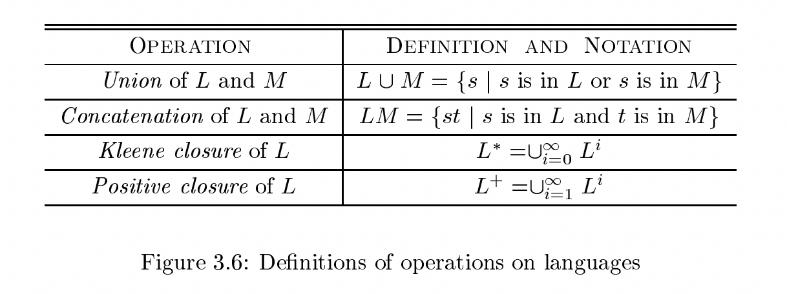

# 3.3 Specification of Tokens

## 3.3.2 Operations on Languages

In lexical analysis, the most important operations on languages are:

1、union

2、concatenation

3、closure

, which are defined formally in Fig. 3.6. 

Union is the familiar operation on sets. The concatenation of languages is all strings formed by taking a string from the first language and a string from the second language, in all possible ways, and concatenating them. 

The (Kleene) closure of a language $L$, denoted $L^\ast$ , is the set of strings you get by concatenating $L$ zero or more times. Note that $L^0$ , the concatenation of $L$ zero times," is defined to be ${\epsilon}$, and inductively, $L^i$ is $L^{i-1}L$. Finally, the positive closure, denoted $L^+$, is the same as the Kleene closure, but without the term $L^0$. That is, ${\epsilon}$ will not be in $L^+$ unless it is in $L$ itself.

