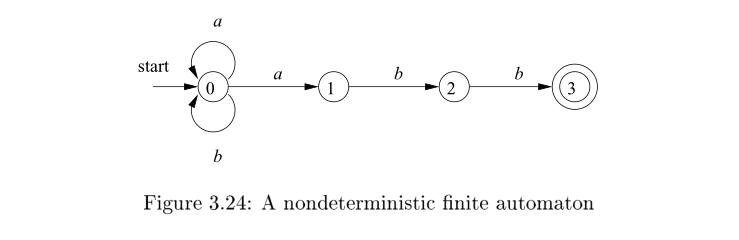
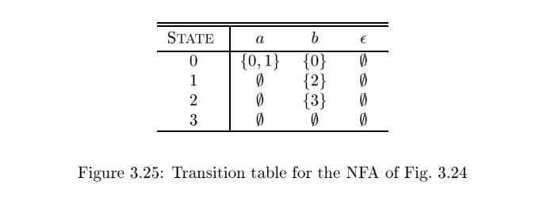

# 3.6 Finite Automata

We shall now discover how Lex turns its input program into a lexical analyzer. At the heart of the transition is the formalism known as [*finite automata*](https://en.wikipedia.org/wiki/Finite-state_machine). These are essentially graphs, like transition diagrams, with a few differences:

1、**Finite automata** are recognizers ; they simply say "yes" or "no" about each possible input string.

2、**Finite automata** come in two favors:

(a) [Nondeterministic finite automata (NFA)](https://en.wikipedia.org/wiki/Nondeterministic_finite_automaton) have no restrictions on the labels of their edges. A symbol can label several edges out of the same state, and $\epsilon$, the empty string, is a possible label.

(b) [Deterministic finite automata (DFA)](https://en.wikipedia.org/wiki/Deterministic_finite_automaton) have, for each state, and for each symbol of its input alphabet exactly one edge with that symbol leaving that state.

Both deterministic and nondeterministic finite automata are capable of recognizing the same languages. In fact these languages are exactly the same languages, called the [**regular languages**](https://en.wikipedia.org/wiki/Regular_language), that regular expressions can describe.

> There is a small lacuna: as we defined them, regular expressions cannot describe the empty language, since we would never want to use this pattern in practice. However, finite automata can define the empty language. In the theory, $\phi$ is treated as an additional regular expression for the sole purpose of defining the empty language.

> NOTE: In chapter 3.4 Recognition of Tokens, there are description as below
>
> A [trie](https://en.wikipedia.org/wiki/Trie) is a tree-structured transition diagram or **finite automaton**, 
>
> It is known to us all that tree is graph. In first paragraph, the author also regard [*finite automata*](https://en.wikipedia.org/wiki/Finite-state_machine) as graph.

## 3.6.1 Nondeterministic Finite Automata

A nondeterministic finite automaton (NFA) consists of:

1. A finite set of states `S` .
2. A set of input symbols $ \Sigma $, the *input alphabet*. We assume that $\epsilon$, which stands for the empty string, is never a member of $ \Sigma $.
3. A *transition function* that gives, for each state, and for each **symbol** in $ \Sigma \cup \{\epsilon\}$ a set of *next states*.
4. A state $s_0$ from $S$ that is distinguished as the *start state* (or initial state).
5. A set of states $F$ , a subset of $S$ , that is distinguished as the *accepting states* (or *final states*).

We can represent either an NFA or DFA by a *transition graph*, where the nodes are states and the labeled edges represent the transition function. There is an edge labeled `a` from state $s$ to state $t$ if and only if $t$ is one of the next states for state $s$ and input $a$. This graph(transition graph) is very much like a **transition diagram**, except:

a) The same symbol can label edges from one state to several different states, and

b) An edge may be labeled by $\epsilon$, the empty string, instead of, or in addition to, symbols from the input alphabet.

> NOTE: **Transition diagram** is formally described in chapter 3.4.1 Transition Diagrams

**Example 3.14** : The transition graph for an NFA recognizing the language of regular expression $(a|b)*abb$ is shown in Fig. 3.24. This abstract example, describing all strings of `a`'s and `b`'s ending in the particular string `abb`, will be used throughout this section. It is similar to regular expressions that describe languages of real interest, however. For instance, an expression describing all files whose name ends in `.o` is any
`*.o`, where any stands for any printable character.

> NOTE: There are two edges labeled with `a` from state 0 while this is not allowed in DFA. Below is come from [Finite-state machine](https://en.wikipedia.org/wiki/Finite-state_machine#Determinism):
>
> In a deterministic automaton, every state has exactly one transition for each possible input. In a non-deterministic automaton, an input can lead to one, more than one, or no transition for a given state. The [powerset construction](https://en.wikipedia.org/wiki/Powerset_construction) algorithm can transform any nondeterministic automaton into a (usually more complex) deterministic automaton with identical functionality.

Following our convention for transition diagrams, the double circle around state 3 indicates that this state is accepting. Notice that the only ways to get from the start state 0 to the accepting state is to follow some path that stays in state 0 for a while, then go es to states 1, 2, and 3 by reading `abb` from the input. Thus, the only strings getting to the accepting state are those that end in `abb`. 

## 3.6.2 Transition Tables

We can also represent an NFA by a *transition table*, whose rows correspond to states, and whose columns correspond to the input symbols and $\epsilon$. The entry for a given state and input is the value of the transition function applied to those arguments. If the transition function has no information about that state-input
pair, we put $\phi$ in the table for the pair.

**Example 3.15** : The transition table for the NFA of Fig. 3.24 is shown in Fig. 3.25.

The transition table has the advantage that we can easily find the transitions on a given state and input. Its disadvantage is that it takes a lot of space, when the input alphabet is large, yet most states do not have any moves on most of the input symbols.

> NOTE: Transition diagrams and transition table correspond to two kind of data structure describing finite automata

## 3.6.4 Deterministic Finite Automata

A *deterministic finite automaton* (DFA) is a special case of an NFA where:

1. There are no moves on input $\epsilon$ , and
2. For each state `s` and input symbol `a`, there is exactly one edge out of `s` labeled `a`.

If we are using a **transition table** to represent a DFA, then each entry is a single state. We may therefore represent this state without the curly braces that we use to form sets.

While the NFA is an abstract representation of an algorithm to recognize the strings of a certain language, the DFA is a simple, concrete algorithm for recognizing strings. It is fortunate indeed that every regular expression and every NFA can be converted to a DFA accepting the same language, because it is the DFA that we really implement or simulate when building lexical analyzers. The following algorithm shows how to apply a DFA to a string.

**Algorithm 3.18** : Simulating a DFA.

**INPUT**: An input string `x` terminated by an end-of-file character **eof**. A DFA `D` with start state $s_0$, accepting states `F` , and transition function `move`.

**OUTPUT**: Answer "yes" if `D` accepts `x`;"no" otherwise.

**METHOD**: Apply the algorithm in Fig. 3.27 to the input string `x`. The function `move(s, c)` gives the state to which there is an edge from state `s` on input `c`. The function `nextChar` returns the next character of the input string `x`. 

**Example 3.19** : In Fig. 3.28 we see the transition graph of a DFA accepting the language $(a|b)*abb$ , the same as that accepted by the NFA of Fig. 3.24. Given the input string `ababb`, this DFA enters the sequence of states 0, 1, 2, 1, 2, 3 and returns  " yes." 

