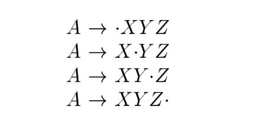

# 4.6 Introduction to LR Parsing: Simple LR

The most prevalent(流行的) type of **bottom-up parser** to day is based on a concept called **LR(k )** parsing; the "L" is for left-to-right scanning of the input, the "R" for constructing a rightmost derivation in reverse, and the k for the number of input symbols of lookahead that are used in making parsing decisions. The cases k = 0 or k = 1 are of practical interest, and we shall only consider LR parsers with $k \le 1$ here. When (k ) is omitted, k is assumed to be 1.

This section introduces the basic concepts of LR parsing and the easiest method for constructing **shift-reduce parsers**, called "**simple LR**" (or **SLR**, for short). Some familiarity with the basic concepts is helpful even if the LR parser itself is constructed using an **automatic parser generator**. We begin with "items" and "parser states;" the diagnostic output from an LR parser generator typically includes **parser states**, which can be used to isolate the sources of parsing conflicts.

Section 4.7 introduces two, more complex methods canonical-LR and LALR that are used in the majority of LR parsers.

## 4.6.1 Why LR Parsers?

LR parsers are table-driven, much like the nonrecursive LL parsers of Section 4.4.4. A grammar for which we can construct a parsing table using one of  the methods in this section and the next is said to be an **LR grammar**. Intuitively(直观的), for a grammar to be LR it is sufficient that a left-to-right shift-reduce parser be able to recognize handles of right-sentential forms when they appear on top of the stack.

## 4.6.2 Items and the LR(0) Automaton

How do es a shift-reduce parser know when to shift and when to reduce? For example, with stack contents `$T`  and next input symbol `*` in Fig. 4.28, how does the parser know that `T` on the top of the stack is not a handle, so the appropriate action is to shift and not to reduce `T` to `E`?

An **LR parser** makes shift-reduce decisions by maintaining **states** to keep track of where we are in a parse. States represent sets of "items." An *LR(0) item* (*item* for short) of a grammar G is a production of G with a dot at some position of the body. Thus, production $A \to XYZ$ yields the four items

The production $A \to \epsilon$ generates only one item, $A \to \bullet$ .

Intuitively, an item indicates how much of a production we have seen at a given point in the parsing process. For example, the item $A \to X Y Z$ indicates that we hope to see a string derivable from $X Y Z$ next on the input. Item $A \to X \cdot Y Z$ indicates that we have just seen on the input a string derivable from $X$ and that we hope next to see a string derivable from $Y Z$ . Item $A \to  X Y Z$ indicates that we have seen the body $X Y Z$ and that it may b e time to reduce $X Y Z$ to $A$.

One collection of sets of LR(0) items, called the *canonical* LR(0) collection, provides the basis for constructing a **deterministic finite automaton** that is used to make parsing decisions. Such an automaton is called an *LR(0) automaton*. In particular, each state of the LR(0) automaton represents a set of items in the **canonical LR(0) collection**. The automaton for the expression grammar (4.1), shown in Fig. 4.31, will serve as the running example for discussing the **canonical LR(0) collection** for a grammar.

To construct the **canonical LR(0) collection** for a grammar, we define an **augmented grammar** and two functions, CLOSURE and GOTO. 

If $G$ is a grammar with start symbol $S$ , then $\acute{G}$ , the augmented grammar for G, is $G$ with a new start symbol $\acute{S}$ and production $\acute{S} \to S $. The purpose of this new starting production is to indicate to the parser when it should stop parsing and announce acceptance of the input. That is, acceptance occurs when and only when the parser is about to reduce by $\acute{S} \to S $.

-automaton-for-the-expression-grammar(4.1).jpg)

### Closure of Item Sets

### The Function GOTO

### Use of the LR(0) Automaton

The central idea behind “Simple LR," or SLR, parsing is the construction from the grammar of the LR(0) automaton. The states of this automaton are the sets of items from the canonical LR(0) collection, and the transitions are given by the GOTO function. The LR(0) automaton for the expression grammar (4.1) appeared earlier in Fig. 4.31.

The **start state** of the **LR(0) automaton** is $CLOSURE({[ \acute{S} \to S]})$, where $\acute{S}$ is the **start symbol** of the augmented grammar. All states are accepting states. We say "state j " to refer to the state corresponding to the set of items $I_j$.

> # 文法和LR(0)自动机
>
> 一个产生式可能有多个状态，它们被成为项。根据项的定义，可以看出它是为reduction而生的，它表示了分析器在分析的过程中已经看到了**产生式体**的哪些部分，以及它所期望看到的合乎它的文法的符号串。已经看到的位于点的左边，期望看到的位于点的右边。显然，当已经看到了一个产生式体的全部符号后，就可以进行规约了。
>
> 既然定义了状态，那么肯定就会涉及到状态的转换：状态的转换或者说项的转换是由分析器在分析过程中看到的文法符号而触发的，每次看到一个文法符号，它就可以将产生式体中的$\bullet$向右移动一次，从而进入到了一个新的状态。
>
> 那给定文法，我们能否提前就分析出它会有哪些状态，哪些转换呢？答案是肯定的，这就是我们构造出的LR(0)自动机。显然，一个LR(0)自动机给出了给定文法中的所有的可能的有效的转换。
>
> # 从LR(0)自动机来看待LR语法分析算法
>
> LR(0)自动机是**确定有穷状态机**，它从**状态0**开始在每个符号上都有转换。如果一个状态表示的产生式的体已经全部都看到了，那么显然这个状态就不会再有转换了，因此在这种情况下可以选择对它进行**规约**。Example 4.43 中给出的LR parser可以认为有两个栈:
>
> - 字符栈
> - 状态栈
>
> **移入操作**对应的是在LR(0)状态机进行状态转换，即从一个状态转移到另外一个状态，这个过程中，会将INPUT中的symbol移入到字符栈中，相应的，也会将新到达的状态压入到状态栈中。显然，状态栈记录了状态转换的路径，即栈中每条记录是从它后面的一条记录转换而来的。
>
> 那么规约意味着对上述两个栈执行什么操作呢？规约意味着将字符栈中**产生式的体**弹出栈，相应的也要从状态栈中弹出相应数量的状态，并且将产生式的头压入栈中，那么此时要压入什么状态呢？
>
> 移入是沿着自动机的某条路径进行转换，规约则是回到这条路径的起点，显然规约会得到一个non-terminal（其实这就相当于已经构造好了子树了）。然后在当前栈顶的状态基于前面规约的符号进行转换，然后将转换得到的新状态压入栈中。为什么要这样呢？因为parser已经看到了这个non-terminal了，所以必然要进行状态的转换；
>
> # 树与栈
>
> 从Figure 4.31: LR(0) automaton for the expression grammar (4.1)中可以看出，LR(0) automaton也是树形的，LR语法分析器在这棵树上的操作也是基于**栈**的。其实在思考LR(0) parser的时候，我想到了程序的执行过程，如果将程序执行过程精简成函数调用的话，其实整个程序的执行过程也可以画成树形的，即程序的**函数调用树**：这棵树的 root节点就是main函数，main函数所调用的函数处于这棵树的第一层，第一层函数所调用的函数处于第二层，依次递推，就可以得到一棵完整的树了；并且和LR(0) parser一样，程序的执行过程也是使用的stack。显然，两种情况都涉及了tree和stack：
>
> - 在LR parser中，需要不断地将符号压栈直至看到了完整的产生式体才将产生式体弹出栈、规约得到产生式的头部->规约得到产生头依赖于得到所有的产生体->不断地将产生式体符号压栈，直到见到全部的产生式体符号就出栈
>
> - 在函数调用中，需要不断地将子函数压入call stack中，直至所有的子函数都返回主函数才得以执行完成
>
>   ->主函数的值依赖于所有的子函数->不断地将子函数压栈，知道最底层的子函数求解，才依次出栈
>
> 看，两者的执行过程是多么地类似；
>
> 从树的构造的角度来看待LR parser中的tree和函数调用中的树：LR parser中，tree的构造是自底向上的，而函数调用中树的构造是自顶向下的，函数调用中树的构造是比较类似于LR(0) parser中树的构造。
>
> 无论是**LR(0)自动机**以及**函数调用树**，它们都是是我们从全局的角度（整体的角度，分析的角度）来分析这个问题，它们是理论层面的分析，而不是实际的实现，实际的执行过程中，压根就不需要显式地构造出这样的一棵树，并且压根就无需知道整个树是怎样的。比如在LR parser中，parser是从左至右对输入串进行分析，一次只会取一个符号，函数的执行是顺序执行的，一次只会执行一个函数；为什么要这样呢？我觉得这是由计算机的体系结构所决定的，正如各种automaton模型所展示的那样，计算机就是这样的规则，就是这样的顺序，所以我们的算法设计也是需要寻找规则，顺序，这是一种计算思维；
>
> 所以实际的执行过程仅仅对应的是树中的一条路径（有起点，有终点），显然这条路径是**线性的**，是**连续的**（能够从终点再返回到起点）。如果我们将执行的路径连接起来（因为这些路径是连续的，所以能够将它们连接起来），以适当的方式画出了（正如Fig. 4.31），那么它就能够展现出我们的在理论层面分析的形态。
>
> 如果从树的构造来看的话，在parser是从左至右对输入串进行分析，一次只会取一个符号，从子树开始构造，然后将一棵一棵的子树结合起来构造更大的树。在data structure中，树是有一个一个的node连接而成的，所以访问一棵树只需要得到这棵树的根结点即可，所以可以使用node来代替一棵树。所以在树的构造过程中，所操作的是一个一个的node，所以使用使用stack就可以完成一棵树的构造。
>
> 在计算机科学中，对理论模型的实现时往往选择的是通用的，简单的方式（节约内存等），"实际的执行过程仅仅对应的是树中的一条路径"，所以我们仅仅需要的是能够满足这条路径的结构即可。而栈这种结构就正好符合这些要求：
>
> - 栈是线性的
> - 栈是连续的，所以能够实现从终点回到起点
>
> 再回到理论分析层面，实际执行过程和理论层面的模型之间是怎样的关联呢？实际执行流程对应的是对树执行深度优先后序遍历；

## 4.6.5 Viable Prefixes

Why can LR(0) automata be used to make shift-reduce decisions? The LR(0) automaton for a grammar characterizes the strings of grammar symbols that can appear on the stack of a shift-reduce parser for the grammar. The stack contents must be a **prefix** of a **right-sentential form**. If the stack holds $\alpha$ and the rest of the input is $x$, then a sequence of reductions will take $\alpha x$ to $S$ . In terms of derivations, $S \xrightarrow[rm]{*}  \alpha x$.

Not all prefixes of right-sentential forms can appear on the stack, however, since the parser must not shift past the **handle**. For example, suppose

$E \xrightarrow[rm]{ \ast } F \ast id \xrightarrow[rm]{} (E) \ast id$

Then, at various times during the parse, the stack will hold $($; $(E$ , and $(E )$, but it must not hold $(E ) \ast$, since $(E )$ is a handle, which the parser must reduce to $F$  before shifting $\ast$.

The prefixes of right sentential forms that can appear on the stack of a shift-reduce parser are called *viable prefixes*. They are defined as follows: a viable prefix is a prefix of a right-sentential form that does not continue past the right end of the **rightmost handle** of that **sentential form**. By this definition, it is always possible to add terminal symbols to the end of a viable prefix to obtain a right-sentential form.

> NOTE: In simple terms, a prefix cannot contain a handle. Once it does, it should be reduced.

SLR parsing is based on the fact that LR(0) automata recognize **viable prefixes**. We say item $A \to \beta _1 \beta _2$ is *valid* for a viable prefix $\alpha \beta _1$ if there is a derivation $S \xrightarrow [rm] {*} \alpha Aw \xrightarrow [rm]{*} \alpha \beta _1 \beta _2 w$ . In general, an **item** will be valid for many viable prefixes.

> NOTE: viable prefix和