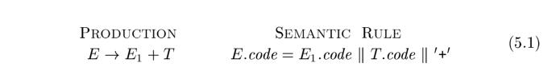
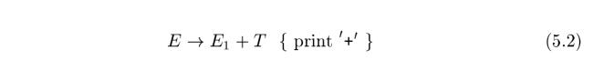

# Chapter 5 Syntax-Directed Translation

This chapter develops the theme of Section 2.3: the translation of languages guided by **context-free grammars**. The translation techniques in this chapter will be applied in Chapter 6 to **type checking** and **intermediate-code generation**. The techniques are also useful for implementing little languages for specialized tasks; this chapter includes an example from typesetting.

We associate information with a language construct by attaching **attributes** to the grammar symbol(s) representing the construct, as discussed in Section 2.3.2. A **syntax-directed definition** specifies the values of **attributes** by associating **semantic rules** with the grammar productions. For example, an infix-to-postfix translator might have a production and rule

From Section 2.3.5, a syntax-directed translation scheme embeds program fragments called **semantic actions** within production bodies, as in

By convention, semantic actions are enclosed within curly braces.

Between the two notations, syntax-directed definitions can be more readable, and hence more useful for specifications. However, translation schemes can be more efficient, and hence more useful for implementations.

|                                    |      |                 |
| ---------------------------------- | ---- | --------------- |
| syntax-directed definition         | SDD  | semantic rule   |
| syntax-directed translation scheme | SDT  | semantic action |

The most general approach to **syntax-directed translation** is to construct a **parse tree** or a **syntax tree**, and then to compute the values of attributes at the nodes of the tree by visiting the nodes of the tree. In many cases, translation can be done during parsing, without building an explicit tree. We shall therefore
study a class of syntax-directed translations called "L-attributed translations" (L for left-to-right), which encompass virtually all translations that can be performed during parsing. We also study a smaller class, called "S-attributed translations" (S for synthesized), which can be performed easily in connection with a bottom-up parse.

> NOTE: 本书对Syntax-directed translation的功能没有进行直接的描述，是非常任意让人糊涂的，wikipedia的[Syntax-directed translation](https://en.wikipedia.org/wiki/Syntax-directed_translation)非常直接简明的描述了Syntax-directed translation的功能:
>
> > **Syntax-directed translation** refers to a method of [compiler](https://en.wikipedia.org/wiki/Compiler) implementation where the source language translation is completely driven by the [parser](https://en.wikipedia.org/wiki/Parser).
> >
> > A common method of syntax-directed translation is translating a string into a sequence of actions by attaching one such action to each rule of a [grammar](https://en.wikipedia.org/wiki/Grammar). Thus, parsing a string of the grammar produces a sequence of rule applications. SDT provides a simple way to attach [semantics](https://en.wikipedia.org/wiki/Semantics) to any such [syntax](https://en.wikipedia.org/wiki/Syntax).
>
> 上面这段话已经将SDT和[semantics](https://en.wikipedia.org/wiki/Semantics)关联到一起了，其实SDT是[Semantic analysis](https://en.wikipedia.org/wiki/Semantic_analysis_(compilers))的一种实现方式，正如wikipedia的[compiler](https://en.wikipedia.org/wiki/Compiler)中所描述的：
>
> > A compiler is likely to perform many or all of the following operations: [preprocessing](https://en.wikipedia.org/wiki/Preprocessor), [lexical analysis](https://en.wikipedia.org/wiki/Lexical_analysis), [parsing](https://en.wikipedia.org/wiki/Parsing), [semantic analysis](https://en.wikipedia.org/wiki/Semantic_analysis_(compilers)) ([syntax-directed translation](https://en.wikipedia.org/wiki/Syntax-directed_translation)), conversion of input programs to an [intermediate representation](https://en.wikipedia.org/wiki/Intermediate_representation), [code optimization](https://en.wikipedia.org/wiki/Code_optimization) and [code generation](https://en.wikipedia.org/wiki/Code_generation_(compiler)). 

