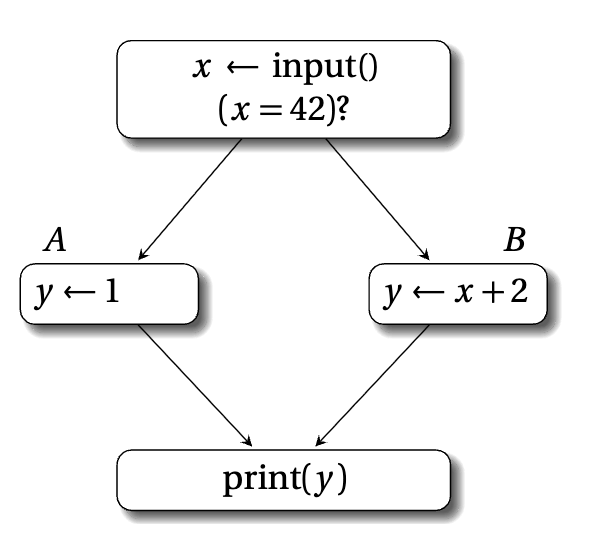
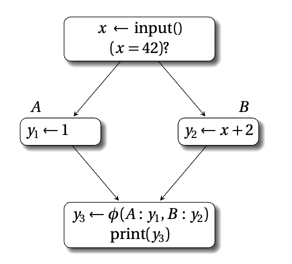
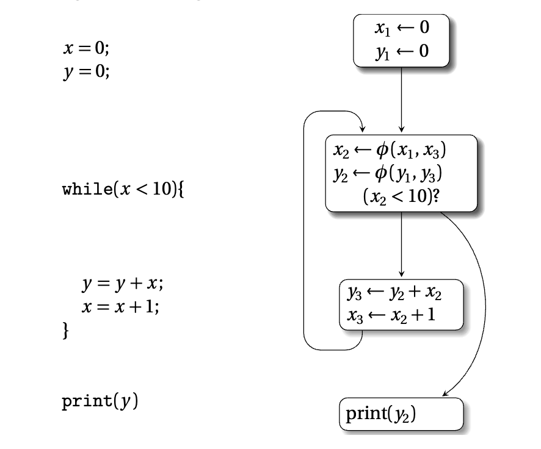

# CHAPTER 1 Introduction

This book is about the **static single assignment form** (SSA), which is a naming convention for storage **locations (variables)** in low-level representations of computer programs.

> NOTE: locations = variables

The term ***static*** indicates that SSA relates to properties and analysis of program text (code). 

The term ***single*** refers to the uniqueness property of **variable names** that SSA imposes. As illustrated above, this enables a greater degree of precision. 

> NOTE: 优势

The term ***assignment*** means variable definitions.

> NOTE: assignment = definition

$$
x = y + 1;
$$

the variable $x$ is being assigned the value of expression $(y + 1)$. This is a **definition**, or **assignment statement**, for $x$. A compiler engineer would interpret the above assignment statement to mean that the lvalue of $x$ (i.e., the memory location labeled as $x$) should be modified to store the value $(y + 1)$.

## 1.1 Definition of SSA

The simplest, least constrained, definition of SSA can be given using the following informal prose:

> “A program is defined to be in SSA form if each variable is a target of exactly one assignment statement in the program text.”

However there are various, more specialized, varieties of SSA, which impose further **constraints** on programs. Such constraints may relate to graph-theoretic properties of variable definitions and uses, or the encapsulation of specific **control-flow** or **data-flow** information. Each distinct SSA variety has specific characteristics. Basic varieties of SSA are discussed in Chapter 2. Part III of this book presents more complex extensions.

> 翻译: 当然还存在多种更专门化的SSA变体，它们会对程序施加更多约束。这类约束可能和变量定义与使用的图论性质相关，或是用于封装特定的控制流、数据流信息。每种不同的SSA变体都具备独有的特征。本书第2章讨论基础的SSA变体；第三部分介绍更复杂的扩展形式。

### Referential transparency

One important property that holds for all varieties of SSA, including the simplest definition above, is ***referential transparency***: i.e., since there is only a single definition for each variable in the program text, a variable's value is independent of its position in the program. We may refine our knowledge about a particular variable based on branching conditions, e.g. we know the value of $x$ in the conditionally executed block following an `if` statement that begins with

$$
\text{if } (x == 0)
$$

however the underlying value of $x$ does not change at this `if` statement. 

Programs written in pure functional languages are **referentially transparent**. Such **referentially transparent** programs are more amenable to formal methods and mathematical reasoning, since the meaning of an expression depends only on the meaning of its subexpressions and not on the order of evaluation or side effects of other expressions. For a **referentially opaque** program, consider the following code fragment.

```c
x = 1;
y = x + 1;
x = 2;
z = x + 1;
```

A naive (and incorrect) analysis may assume that the values of $y$ and $z$ are equal, since they have identical definitions of $(x + 1)$. However the value of variable $x$ depends on whether the current code position is before or after the second definition of $x$, i.e., variable values depend on their **context**. When a compiler transforms this program fragment to SSA code, it becomes **referentially transparent**. The translation process involves renaming to eliminate multiple assignment statements for the same variable. Now it is apparent that $y$ and $z$ are equal if and only if $x_1$ and $x_2$ are equal.

> NOTE: 普通命令式代码里，同一个名字`x`可以多次赋值，`x`的值取决于读到它的**位置**（上下文），引用不透明。
> SSA会把多次赋值重命名为`x₁, x₂, x₃`，每个名字只定义一次。
> 一旦进入SSA形式，`x₁`的值固定不变，**不管在哪一行读取`x₁`，取值永远一样**，这就是这里所说的引用透明。
> 这里的引用透明，**是针对SSA名字（$x_1,x_2$这类SSA变量）**，不是指整个程序消除内存副作用。SSA依然可以有store内存操作，只是SSA虚拟变量本身只读。

## 1.2 Informal semantics of SSA

> variable name: $\phi$-function
> $\phi$-function, as multiplexer control-flow graph

In the previous section, we saw how straightline sequences of code can be transformed to SSA by simple renaming of variable definitions. The ***target*** of the definition is the variable being defined, on the left-hand side of the **assignment statement**. In SSA, each definition target must be a unique variable name. Conversely **variable names** can be used multiple times on the right-hand side of any **assignment statements**, as ***source*** variables for definitions. Throughout this book, renaming is generally performed by adding integer subscripts to original variable names. In general this is an unimportant implementation feature, although it can prove useful for compiler debugging purposes.

### $\phi$-function: control flow merge points

The $\phi$-function is the most important SSA concept to grasp. It is a special statement, known as a ***pseudo-assignment*** function. Some call it a "notational fiction."<sup>1</sup> The purpose of a $\phi$-function is to merge values from different incoming paths, at **control flow merge points**.

> 翻译: 
> 
> $\boldsymbol{\phi}$函数是SSA中最需要掌握的核心概念。它是一种特殊语句，被称为**伪赋值**函数，也有人将其称作“符号虚构”。1 $\boldsymbol{\phi}$函数的作用是在**控制流汇合点**，合并来自不同传入路径的值。

Consider the following code example and its corresponding control-flow graph (CFG) representation:

```c
x = input();
if (x == 42)
then
    y = 1;
else
    y = x + 2;
end
print(y);
```



Control-flow graph:

- Start node: $x \leftarrow \text{input}()$, condition $(x = 42)?$
- Branch A: $y \leftarrow 1$
- Branch B: $y \leftarrow x+2$
- Merge node: $\text{print}(y)$

There is a distinct definition of $y$ in each branch of the `if` statement. So multiple definitions of $y$ reach the `print` statement at the **control flow merge point**. When a compiler transforms this program to SSA, the multiple definitions of $y$ are renamed as $y_1$ and $y_2$. However the `print` statement could use either variable, dependent on the outcome of the `if` conditional test. A $\phi$-function introduces a new variable $y_3$, which takes the value of either $y_1$ or $y_2$. Thus the SSA version of the program is:

```c
x = input();
if (x == 42)
then
    y₁ = 1;
else
    y₂ = x + 2;
end
y₃ = φ(y₁,y₂);
print(y₃);
```



> CFG图示文字描述：
> 起点：$x \leftarrow \text{input}()$，判断 $(x = 42)?$
> 分支A：$y_1 \leftarrow 1$
> 分支B：$y_2 \leftarrow x+2$
> 汇合块：$y_3 \leftarrow \phi(A:y_1,B:y_2)$，然后执行 $\text{print}(y_3)$

In terms of their position, $\phi$-functions are generally placed at **control flow merge points**, i.e., at the heads of basic blocks that have multiple predecessors in control-flow graphs. A $\phi$-function at block $b$ has $n$ parameters if there are $n$ incoming control-flow paths to $b$. The behavior of the $\phi$-function is to select dynamically the value of the parameter associated with the actually executed **control-flow path** into $b$. This parameter value is assigned to the fresh variable name, on the **left-hand side** of the $\phi$-function. Such pseudo-functions are required to maintain the SSA property of **unique variable definitions**, in the presence of **branching control flow**. Hence, in the above example, $y_3$ is set to $y_1$ if **control flows** from basic block $A$, and set to $y_2$ if it flows from basic block $B$. Notice that the CFG representation here adopts a more expressive syntax for $\phi$-functions than the standard one, as it associates **predecessor basic block** labels $B_i$ with corresponding SSA variable names $a_i$, i.e., $a_0=\phi(B_1:a_1,\dots,B_n:a_n)$. Throughout this book, basic block labels will be omitted from $\phi$-function operands when the omission does not cause ambiguity.

### 并行语义

It is important to note that, if there are multiple $\phi$-functions at the head of a **basic block**, then these are executed in **parallel**, i.e., **simultaneously** not sequentially. This distinction becomes important if the **target** of a $\phi$-function is the same as the **source** of another $\phi$-function, perhaps after optimizations such as **copy propagation**. When $\phi$-functions are eliminated in the SSA destruction phase, they are sequentialized using conventional copy operations, as described in 17.6. This subtlety is particularly important in the context of register allocated code.

### 并行语义解释

这段话讲的是 φ 函数的**并行语义**,以及它在 SSA 销毁(out-of-SSA)阶段带来的麻烦。

#### 并行语义是什么意思

基本块开头的多个 φ 函数不是从上到下依次求值,而是**同时**求值:所有 φ 先一起读取各自的源操作数(取自前驱块的值),然后再一起写入各自的目标。这等价于一次"并行拷贝"(parallel copy)。

平时这个区别看不出来,因为 φ 的源通常是别的块里定义的变量。但当**一个 φ 的目标恰好是另一个 φ 的源**时,顺序就有了可观测的差别。

#### 为什么 copy propagation 会制造这种情况

原始代码里这种交叉很少直接出现,往往是优化之后才出现的。比如一个交换两个变量的循环:

```
L0: x0 = ...
    y0 = ...
L1: x1 = φ(x0, x2)
    y1 = φ(y0, y2)
    x2 = y1
    y2 = x1
    goto L1
```

`x2 = y1` 和 `y2 = x1` 是纯拷贝,copy propagation 把 `x2` 替换成 `y1`、`y2` 替换成 `x1`,拷贝指令被删掉:

```
L1: x1 = φ(x0, y1)
    y1 = φ(y0, x1)
    goto L1
```

现在第一个 φ 的目标 `x1` 是第二个 φ 的源,反之亦然。按**并行语义**读,这两条 φ 表示的就是"每轮迭代把 x 和 y 互换",语义完全正确。这就是文献里常说的 **swap problem**(交换问题)。

> NOTE: 这是非常类似于python的swap语法

#### 顺序化时出错

SSA 销毁阶段要把 φ 换成前驱块末尾的普通拷贝指令。如果天真地按书写顺序逐条生成:

```
x = y   // 来自 x1 = φ(..., y1)
y = x   // 来自 y1 = φ(..., x1),但 x 已经被覆盖了
```

结果 `x` 和 `y` 都变成了原来的 `y`,交换语义丢失。正确做法是识别出这是一个**置换**(permutation),用临时变量打破环:

```
t = x
x = y
y = t
```

或者用目标机器的 `xchg` / 三次 xor。这正是 17.6 节讨论的内容(同时也处理 lost-copy problem 等情形)。

#### 为什么寄存器分配后特别要紧

在 SSA 形式上,打破环只需要再引入一个新的虚拟变量,代价几乎为零。但如果 φ 的操作数**已经被分配到具体的物理寄存器**,那条并行拷贝就变成了一组物理寄存器之间的置换,比如 `(r1, r2) ← (r2, r1)`。此时:

- 你需要一个空闲寄存器当临时存储,而那一刻可能根本没有空闲寄存器;
- 没有的话就得靠机器提供的交换指令,或者溢出(spill)到内存再读回,这会实打实地增加代码量和开销。

所以在"先分配寄存器、后销毁 SSA"的编译器里(例如基于 SSA 的寄存器分配),必须认真对待 φ 的并行语义:环状依赖不能靠调整顺序解决,只能靠额外的存储或交换指令。

---

### $\phi$-function是记号而不是指令

> NOTE: 在"Loop control-flow解释"中对此有着非常好的解释: "φ不是真实指令,而是一个记号,意思是"沿哪条边进来,就取对应那个操作数的值""

Strictly speaking, $\phi$-functions are not directly executable in software, since the **dynamic control-flow path** leading to the $\phi$-function is not explicitly encoded as an input to $\phi$-function. This is tolerable, since $\phi$-functions are generally only used during **static analysis** of the program. They are removed before any program interpretation or execution takes place. However, there are various **executable extensions** of $\phi$-functions, such as $\phi_{if}$ or $\gamma^\star$ functions (see Chapter 12), which take an extra parameter to encode the implicit **control dependence** that dictates the argument the corresponding $\phi$-function should select. Such extensions are useful for program interpretation (see Chapter 12), if conversion (see Chapter 16), or hardware synthesis (see Chapter 18).

> 翻译: 严格来说，$\boldsymbol{\phi}$函数无法在软件中直接执行，因为抵达$\boldsymbol{\phi}$函数的**动态控制流路径**并没有被显式编码为$\boldsymbol{\phi}$函数的输入。这一点并不会造成实际问题，因为$\boldsymbol{\phi}$函数通常仅用于程序的**静态分析**阶段，在程序解释或实际执行之前就会被移除。
> 
> 不过$\boldsymbol{\phi}$函数存在多种可执行的扩展形式，例如$\boldsymbol{\phi_{if}}$函数与$\boldsymbol{\gamma^\star}$函数（见第12章）。这类扩展会引入一个额外参数，用于编码隐式的控制依赖关系，以此决定对应的$\boldsymbol{\phi}$函数应当选取哪个参数值。这类扩展可应用于程序解释（见第12章）、**if转换**（见第16章）以及**硬件综合**（见第18章）等场景。

---

> 1 Kenneth Zadeck reports that $\phi$-functions were originally known as *phoney-functions*, during the development of SSA at IBM Research. Although this was an in-house joke, it did serve as the basis for the eventual name.

---

### Loop control-flow

We present one further example in this section, to illustrate how a **loop control-flow** structure appears in SSA. Here is the non-SSA version of the program and its corresponding control-flow graph SSA version:

```c
x = 0;
y = 0;

while(x < 10){
    y = y + x;
    x = x + 1;
}

print(y)
```

> SSA form control-flow graph:
> 
> - Entry block: $x_1 \leftarrow 0$, $y_1 \leftarrow 0$
> - Loop header (merge point):
>   $x_2 \leftarrow \phi(x_1, x_3)$
>   $y_2 \leftarrow \phi(y_1, y_3)$
>   condition: $(x_2 < 10)?$
> - Loop body block:
>   $y_3 \leftarrow y_2 + x_2$
>   $x_3 \leftarrow x_2 + 1$
> - Exit block: $\text{print}(y_2)$



The SSA code features two $\phi$-functions in the loop header; these merge incoming definitions from before the loop for the first iteration, and from the **loop body** for subsequent iterations.

### Loop control-flow解释

这张图是经典的"循环 + SSA"示例:左边是源程序,右边是把它转成 SSA 形式后的控制流图。核心看点是**变量如何被拆成版本**,以及**φ 函数为什么必须出现在循环头**。

#### SSA 的基本规则

SSA(static single assignment)要求:每个变量在程序文本里**只被赋值一次**。所以源码里被反复赋值的 `x` 和 `y`,在 SSA 里被拆成带下标的不同版本 `x₁, x₂, x₃` 和 `y₁, y₂, y₃`。每个版本是一个独立的"名字",定义点唯一。

好处是:看到一次使用,就能立刻知道它的定义在哪里(定义-使用关系直接显式化),不需要做数据流分析去追"这里的 x 可能来自哪几个赋值"。**常量传播**、**公共子表达式消除**、**活跃性分析**等都因此变得简单。

#### 四个基本块的对应关系

| CFG 块                                  | 对应源码       |
| -------------------------------------- | ---------- |
| `x₁ ← 0; y₁ ← 0`                       | 入口初始化      |
| `x₂ ← φ(...); y₂ ← φ(...); (x₂ < 10)?` | 循环头 + 条件判断 |
| `y₃ ← y₂ + x₂; x₃ ← x₂ + 1`            | 循环体        |
| `print(y₂)`                            | 循环退出后      |

注意循环体块末尾有一条回边指向循环头,循环头有一条出边指向 `print`。所以**循环头有两个前驱**:入口块和循环体块。

#### φ 函数为什么必须在这里

循环头读 `x` 的时候,这个 `x` 的来源取决于控制流走的是哪条边:

- 第一次进入循环,来自入口块的 `x₁`(值 0);
- 之后每轮迭代,来自循环体的 `x₃`(上一轮的 `x+1`)。

单一静态赋值的规则不允许"同一个名字有两个定义点",所以需要一个新名字 `x₂`,并用 φ 函数说明它从哪儿取值:

```
x₂ ← φ(x₁, x₃)
```

**φ 的操作数按位置与前驱边一一对应**:第一个操作数配第一个前驱(入口块),第二个配第二个前驱(回边)。它不是真实指令,而是一个记号,意思是"沿哪条边进来,就取对应那个操作数的值"。`y₂ ← φ(y₁, y₃)` 同理。

φ 需要插在**控制流汇合点**(join point),更精确地说是插在定义点的**支配边界**(dominance frontier)上。这里 `x₁` 和 `x₃` 都没有支配循环头,所以循环头是必须放 φ 的位置。而循环体块只有一个前驱,无需 φ;`print` 块也只有一个前驱(循环头),所以它直接用 `y₂`。

#### 为什么 print 用的是 y₂ 而不是 y₃

退出循环的那条边从**循环头**出发,不是从循环体出发。在循环头处,循环体最新算出的 `y₃` 已经被 φ 读入成了 `y₂`,所以退出时当前值就是 `y₂`。写成 `print(y₃)` 会有两个问题:一是当 `x` 初值就 ≥ 10、循环体一次都不执行时,`y₃` 根本没有定义;二是 `y₃` 并不支配 `print` 块,SSA 要求每个使用点必须被其定义点支配。

#### 与并行语义的联系

循环头的两条 φ 是**同时**求值的,等价于沿每条入边做一次并行拷贝:

- 沿入口边:`(x₂, y₂) ← (x₁, y₁)`
- 沿回边:`(x₂, y₂) ← (x₃, y₃)`

这个例子里 `x₂, y₂` 的源是 `x₁/x₃`、`y₁/y₃`,互不交叉,所以顺序化时逐条生成拷贝就行。但如果 copy propagation 之后出现 `x₂ ← φ(x₁, y₂)` 和 `y₂ ← φ(y₁, x₂)` 这种目标与源交叉的情况,就回到上一条里讲的 swap problem,销毁 SSA 时必须靠临时变量或交换指令打破环。

### SSA VS DSA VS simply SA

It is important to outline that **SSA** should not be confused with **(dynamic) single assignment** (**DSA** or **simply SA**) form used in **automatic parallelization**. **Static single assignment** does not prevent multiple assignments to a variable during program execution. For instance, in the SSA code fragment above, variables $y_3$ and $x_3$ in the loop body are redefined dynamically with fresh values at each loop iteration.

Full details of the SSA construction algorithm are given in Chapter 3. For now, it is sufficient to see that:

1. A $\phi$-function has been inserted at the appropriate **control flow merge point** where multiple reaching definitions of the same variable converged in the original program.
2. Integer subscripts have been used to rename variables $x$ and $y$ from the original program.

## 1.3 Comparison with classical data-flow analysis

As we will discover further in Chapter 11, one of the major advantages of SSA form concerns **data-flow analysis**. **Data-flow analysis** collects information about programs at compile time in order to make optimizing code transformations. During actual program execution, information flows between variables. Static analysis captures this behavior by propagating *abstract information*, or **data-flow facts**, using an operational representation of the program such as the **control-flow graph (CFG)**. This is the approach used in classical **data-flow analysis**.

Often, data-flow information can be propagated more efficiently using a *functional*, or *sparse*, representation of the program such as SSA. When a program is translated into SSA form, variables are renamed at definition points. For certain data-flow problems (e.g. constant propagation) this is exactly the set of program points where data-flow facts may change. Thus it is possible to associate data-flow facts directly with variable names, rather than maintaining a vector of data-flow facts indexed over all variables, at each program point.

**Figure 1.1** illustrates this point through an example of non-zero value analysis. For each variable in a program, the aim is to determine statically whether that variable can contain a zero integer value (i.e., null) at runtime. Here 0 represents the fact that the variable is null, $\emptyset$ the fact that it is non-null, and $\top$ the fact that it is maybe-null. With classical dense data-flow analysis on the CFG in **Figure 1.1(a)**, we would compute information about variables $x$ and $y$ for each of the entry and exit points of the six basic blocks in the CFG, using suitable data-flow equations. Using sparse SSA-based data-flow analysis on **Figure 1.1(b)**, we compute information about each variable based on a simple analysis of its definition statement. This gives us six data-flow facts, one for each SSA version of variables $x$ and $y$.

For other data-flow problems, properties may change at points that are not variable definitions. These problems can be accommodated in a sparse analysis framework by inserting additional pseudo-definition functions at appropriate points to induce additional variable renaming. See **Chapter 11** for one such instance. However, this example illustrates some key advantages of the SSA-based analysis.

1. Data-flow information *propagates directly* from definition statements to uses, via the def-use links implicit in the SSA naming scheme. In contrast, the classical data-flow framework propagates information throughout the program, including points where the information does not change, or is not relevant.
2. The results of the SSA data-flow analysis are *more succinct*. In the example, there are fewer data-flow facts associated with the sparse (SSA) analysis than with the dense (classical) analysis.

Part **II** of this textbook gives a comprehensive treatment of some SSA-based data-flow analysis.

## 1.5 About the rest of this book

In this chapter, we have introduced the notion of SSA. The rest of this book presents various aspects of SSA, from the pragmatic perspective of compiler engineers and code analysts. The ultimate goals of this book are:

1. To demonstrate clearly the *benefits* of SSA-based analysis.
2. To dispel the *fallacies* that prevent people from using SSA.
   1. 翻译: 破除阻碍人们使用 SSA 的那些误区

This section gives pointers to later parts of the book that deal with specific topics.

## 1.5.1 Benefits of SSA

SSA imposes a strict discipline on variable naming in programs, so that each variable has a unique definition. Fresh variable names are introduced at **assignment statements**, and **control-flow merge points**. This serves to simplify the structure of variable *def-use* relationships (see Section 2.1) and live ranges (see Section 2.3), which underpin **data-flow analysis**. Part II of this book focus on data-flow analysis using SSA. 

> 翻译: SSA 对程序中的变量命名施加了一套严格约束，使得每个变量只有唯一的定义点。新的变量名在赋值语句处以及控制流汇合点处被引入。这样做的目的是简化变量的 “定义 — 使用”（def-use）关系（见 2.1 节）和活跃区间（live range）的结构（见 2.3 节），而这两者正是数据流分析（data-flow analysis）的基础。本书第二部分（Part II）将聚焦于基于 SSA 的数据流分析。

There are three major advantages to SSA:

**Compile time benefit.** Certain compiler optimizations can be more efficient when operating on SSA programs, since **referential transparency** means that **data-flow information** can be associated directly with variables, rather than with variables at each **program point**. We have illustrated this simply with the **non-zero value analysis** in Section 1.3.

**Compiler development benefit.** Program analyses and transformations can be easier to express in SSA. This means that compiler engineers can be more productive, in writing new compiler passes, and debugging existing passes. For example, the **dead code elimination pass** in GCC 4.x, which relies on an underlying SSA-based intermediate representation, takes only 40% as many lines of code as the equivalent pass in GCC 3.x, which does not use SSA. The SSA version of the pass is simpler, since it relies on the general-purpose, factored-out, data-flow propagation engine.

> 翻译: 程序分析与变换用 SSA 表达起来更为容易。这意味着编译器工程师在编写新编译遍（pass）以及调试已有遍时，能获得更高的产出效率。例如，GCC 4.x 中的死代码消除遍（dead code elimination pass）依托于底层的基于 SSA 的中间表示，其代码行数仅为未使用 SSA 的 GCC 3.x 中同功能遍的 40%。由于该 SSA 版本遍依赖的是一个通用的、被抽取出来的数据流传播引擎，因此它更为简洁。

**Program runtime benefit.** Conceptually, any analysis and optimization that can be done under SSA form can also be done identically out of SSA form. Because of the compiler development mentioned above, several compiler optimizations are shown to be more effective when operating on programs in SSA form. These include the class of control-flow insensitive analyses, e.g. [112].


## 1.5.2 Fallacies(误区) about SSA

Some people believe that SSA is too cumbersome to be an effective program representation. This book aims to convince the reader that such a concern is unnecessary, given the application of suitable techniques. The table below presents some common myths about SSA, and references in this first part of the book contain material to dispell these myths.<sup>*</sup>


