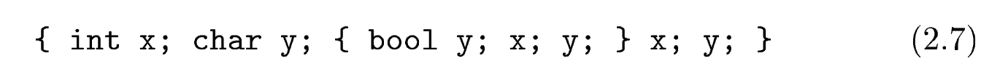
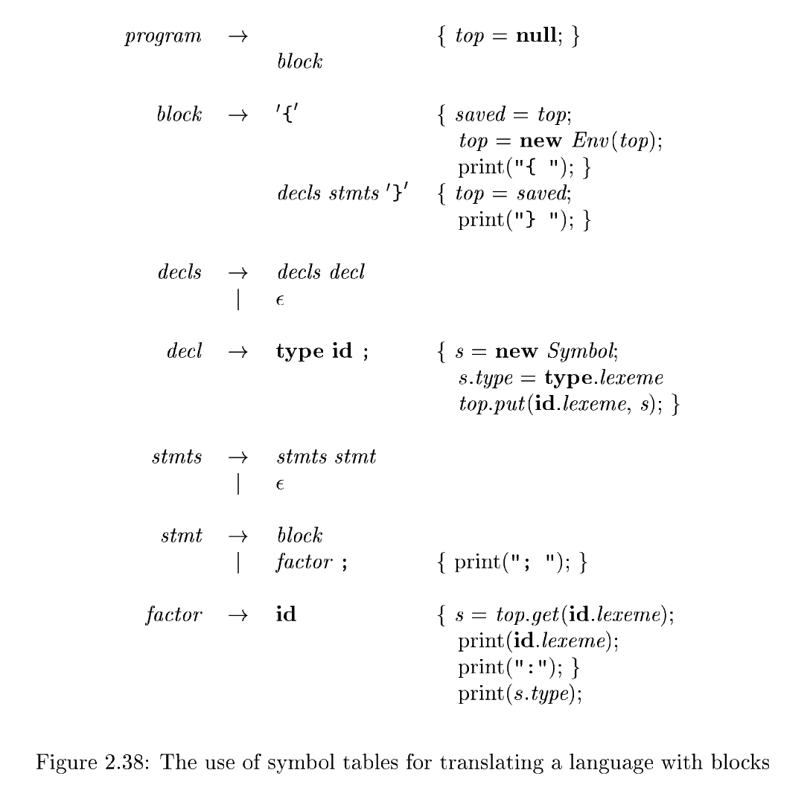

# 2.7 Symbol Tables

**Symbol tables** are data structures that are used by **compilers** to hold information about source-program constructs. The information is collected incrementally by the **analysis phases** of a **compiler** and used by the **synthesis phases** to generate the **target code**. Entries in the **symbol table** contain information about an **identifier** such as its character string (or lexeme), its type, its position in storage, and any other relevant information. **Symbol tables** typically need to support multiple declarations of the same identifier within a program.

From Section 1.6.1, the **scope** of a **declaration** is the portion of a program to which the **declaration** applies. We shall implement **scopes** by setting up a separate **symbol table** for each **scope**. A program block with declarations will have its own **symbol table** with an entry for each declaration in the block. This approach also works for other constructs that set up scopes; for example, a **class** would have its own table, with an entry for each **field** and **method**.

> NOTE: scope是context sensitive的，它是在semantic analysis阶段进行分析的

This section contains a symbol-table module suitable for use with the Java translator fragments in this chapter. The module will be used as is when we put together the translator in Appendix A. Meanwhile, for simplicity, the main example of this section is a stripped-down(被简化的) language with just the key constructs that touch symbol tables; namely, blocks, declarations, and factors. All of the other **statement** and **expression** constructs are omitted so we can focus on the symbol-table operations. A program consists of blocks with optional declarations and statements consisting of single identifiers. Each such statement represents a use of the identifier. Here is a sample program in this language:

> 翻译: 本节给出一个符号表模块，可配合本章的 Java 翻译程序片段使用。在附录 A 整合完整翻译器时，会直接使用该模块。为简化讨论，本节的主要示例采用了一门精简语言，仅保留和符号表相关的核心构造：程序块、声明、因子。其余所有**语句**与**表达式**构造全部省略，以便我们专注于**符号表**的操作。该语言的程序由若干程序块构成，块内可包含声明；语句仅由单个标识符组成，每一条这样的语句代表对该标识符的一次引用。下面给出该语言的一段示例程序。



The examples of block structure in Section 1.6.3 dealt with the definitions and uses of names; the input $ 2.7 $ consists solely of definitions and uses of names. The task we shall perform is to print a revised program, in which the declarations have been removed and each "statement" has its identifier followed by a colon and its type.

## Who Creates Symbol-Table Entries?

---

**Symbol-table entries** are created and used during the analysis phase by the **lexical analyzer**, the **parser**, and the **semantic analyzer**. In this chapter, we have the parser create entries. With its knowledge of the syntactic structure of a program, a parser is often in a better position than the **lexical analyzer** to distinguish among different declarations of an identifier.In some cases, a **lexical analyzer** can create a **symbol-table entry** as so on as it sees the characters that make up a lexeme. More often, the **lexical analyzer** can only return to the parser a token, say id, along with a pointer to the lexeme. Only the parser, however, can decide whether to use a previously created symbol-table entry or create a new one for the identifier.

翻译: 符号表表项在分析阶段由**词法分析器**、**语法分析器**和**语义分析器**共同创建与使用。在本章中，我们交由语法分析器来创建符号表表项。**语法分析器**掌握程序的语法结构，因此相比**词法分析器**，它通常更适合区分同一个标识符的多处不同声明。

在少数情况下，词法分析器一读到构成词素的字符，就可以创建符号表表项。但更普遍的情形是：**词法分析器**只能将记号（比如标识符`id`）连同指向该词素的指针返回给语法分析器。但究竟是复用已经存在的符号表表项，还是为这个标识符新建一条表项，只能由语法分析器来做判断。

---

## Optimization of Symbol Tables for Blocks

Implementations of symbol tables for blocks can take advantage of the most‑closely nested rule. Nesting ensures that the chain of applicable symbol tables forms a stack. At the top of the stack is the table for the current block. Below it in the stack are the tables for the enclosing blocks. Thus, symbol tables can be allocated and deallocated in a stack‑like fashion.

Some compilers maintain a single hash table of accessible entries; that is, of entries that are not hidden by a declaration in a nested block. Such a hash table supports essentially constant‑time lookups, at the expense of inserting and deleting entries on block entry and exit. Upon exit from a block $B$, the compiler must undo any changes to the hash table due to declarations in block $B$. It can do so by using an auxiliary stack to keep track of changes to the hash table while block $B$ is processed.

## 2.7.1 Symbol Table Per Scope

The term "scope of identifier $x$" really refers to the scope of a particular declaration of $x$. The term *scope* by itself refers to a portion of a program that is the **scope** of one or more declarations.

**Scopes** are important, because the same identifier can be declared for different purposes in different parts of a program. Common names like $\texttt{i}$ and $\texttt{x}$ often have multiple uses. As another example, subclasses can redeclare a method name to **override** a method in a superclass.

If blocks can be nested, several declarations of the same identifier can appear within a single block. The following syntax results in nested blocks when $stmts$ can generate a **block**:

$$
block \rightarrow '\{'\ decls\ stmts\ '\}'
$$

(We quote curly braces in the syntax to distinguish them from curly braces for **semantic actions**.) With the grammar in Fig. 2.38, $decls$ generates an optional sequence of declarations and $stmts$ generates an optional sequence of statements.

### 2.7.2 The Use of Symbol Tables(符号表的作用)

In effect, the role of a **symbol table** is to pass information from **declarations** to **uses**. A **semantic action** "puts" information about identifier $x$ into the **symbol table**, when the **declaration** of $x$ is analyzed. Subsequently, a **semantic action** associated with a production such as $factor \rightarrow \mathbf{id}$ "gets" information about the **identifier** from the **symbol table**. Since the translation of an expression $E_1\ \mathbf{op}\ E_2$, for a typical operator $\mathbf{op}$, depends only on the translations of $E_1$ and $E_2$, and does not directly depend on the **symbol table**, we can add any number of operators without changing the basic flow of information from declarations to uses, through the **symbol table**.

> 翻译: 实际上，符号表的作用是把信息从**声明处传递到使用处**。
> 分析标识符 $x$ 的声明时，会通过语义动作将标识符 $x$ 的相关信息**存入**符号表。
> 后续，对于类似产生式 $\boldsymbol{factor \rightarrow \mathbf{id}}$，其绑定的语义动作会从符号表中**取出**该标识符的信息。对于普通运算符 $\mathbf{op}$，表达式 $E_1\ \mathbf{op}\ E_2$ 的翻译仅依赖 $E_1$、$E_2$ 的翻译结果，并不直接依赖符号表。因此，我们可以新增任意多的运算符，而不会改变“经由符号表，信息从声明流向使用”这一基础信息流。

### Example 2.17

The translation scheme in Fig. 2.38 illustrates how class Env can be used. The translation scheme concentrates on scopes, declarations, and uses. It implements the translation described in Example 2.14. 

> 翻译: 图 2.38 中的翻译方案演示了`Env`类的使用方法。该翻译方案聚焦于**作用域、声明与引用**，实现了例 2.14 中描述的翻译逻辑。正如前文所述，面对输入



As noted earlier, on input

```c
{ int x; char y; { bool y; x; y; } x; y; }
```

the translation scheme strips the declarations and produces

```
{ { x:int; y:bool; } x:int; y:char; }
```
