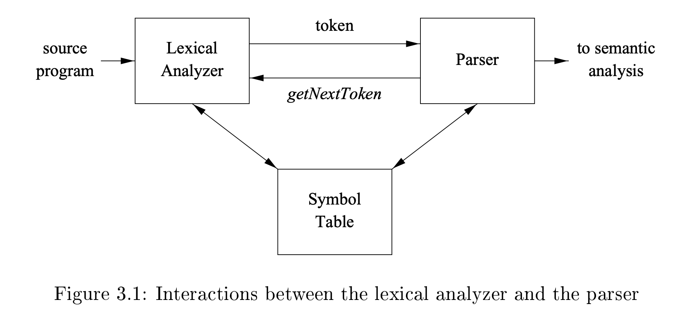

# 3.1 The Role of the Lexical Analyzer

As the first phase of a compiler, the main task of the lexical analyzer is to read the input characters of the source program, group them into **lexemes**, and produce as output a sequence of **tokens** for each **lexeme** in the source program. The stream of **tokens** is sent to the parser for **syntax analysis**. It is common for the **lexical analyzer** to interact with the **symbol table** as well. When the **lexical analyzer** discovers a lexeme constituting(组成) an identifier, it needs to enter that lexeme into the **symbol table**. In some cases, information regarding the kind of identifier may be read from the **symbol table** by the **lexical analyzer** to assist it in determining the proper token it must pass to the parser.

These interactions are suggested in Fig. 3.1. Commonly, the interaction is implemented by having the parser call the **lexical analyzer**. The call, suggestedby the `getNextToken` command, causes the **lexical analyzer** to read characters from its input until it can identify the **next lexeme** and produce for it the **next token**, which it returns to the **parser**.

Since the **lexical analyzer** is the part of the compiler that reads the source text, it may perform certain other tasks besides identication of lexemes. One such task is **stripping out comments and whitespace** (blank, newline, tab, andperhaps other characters that are used to separate tokens in the input). Another task is **correlating error messages generated by the compiler with the source program**. For instance, the **lexical analyzer** may keep track of the number of newline characters seen, so it can associate a **line number** with each **error message**. In some compilers, the **lexical analyzer** makes a copy of the source program with the error messages inserted at the appropriate positions. If the source program uses a **macro-preprocessor,** the expansion of macros may also be performed by the **lexical analyzer**.

Sometimes, **lexical analyzers** are divided into a cascade of two processes: 

a) ***Scanning*** consists of the simple processes that do not require tokenization of the input, such as deletion of comments and compaction of consecutive whitespace characters into one. 

b) ***Lexical analysis*** proper is the more complex portion, which produces tokens from the output of the scanner.

## 3.1.1 Lexical Analysis Versus Parsing 

TODO

## 3.1.2 Tokens, Patterns, and Lexemes 
