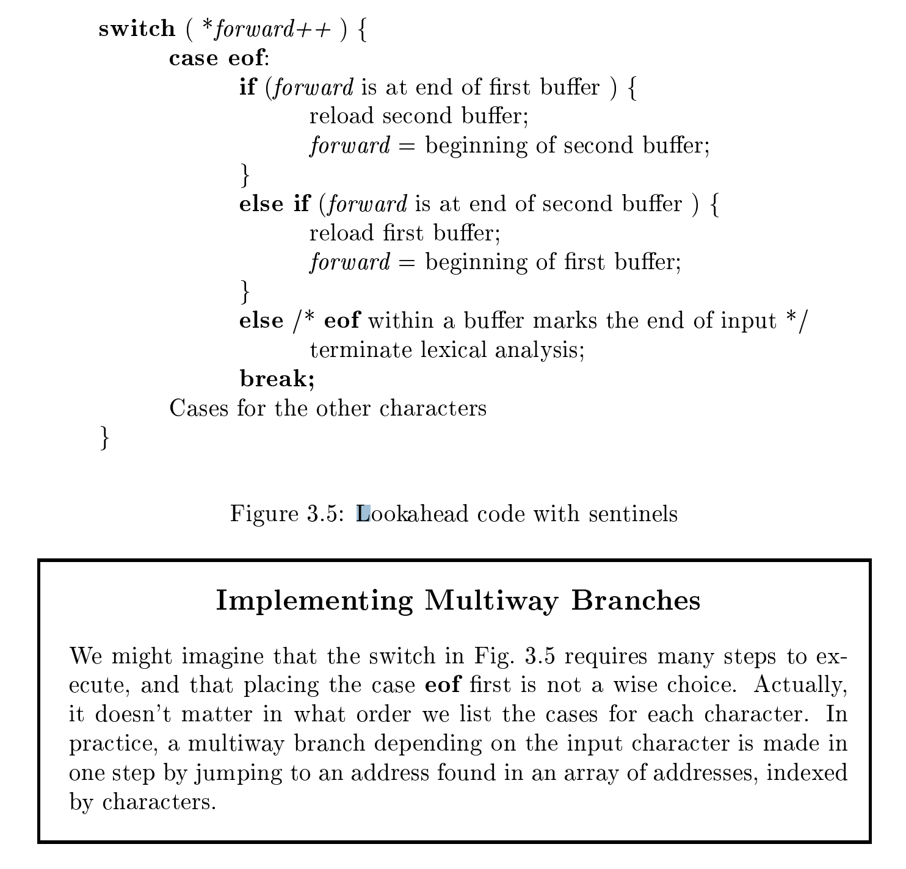

# 3.2 Input Buering 

Before discussing the problem of recognizing lexemes in the input, let us examine some ways that the simple but important task of reading the source program can be speeded. This task is made difficult by the fact that we often have to look one or more characters beyond the **next lexeme** before we can be sure we have the right lexeme. The box on "Tricky Problems When RecognizingTokens" in Section 3.1 gave an extreme example, but there are many situations where we need to look at least one additional character ahead. For instance, we cannot be sure we've seen the end of an identfier until we see a character that is not a letter or digit, and therefore is not part of the lexeme for id. In C, single-character operators like `-`, `=`, or `<` could also be the beginning of a two-character operator like `->`, `==`, or `<=`. Thus, we shall introduce a **two-buffer scheme** that handles large **lookaheads** safely. We then consider an improvement involving "**sentinels**" that saves time checking for the ends of bffuers.

> NOTE:
>
> lookahead

## 3.2.1 Buffer Pairs 

> NOTE:
>
> 一、使用两个buffer的目的是为了减少system call从而提升性能

Because of the amount of time taken to process characters and the large number of characters that must be processed during the compilation of a large source program, specialized buffering techniques have been developed to reduce the amount of overhead required to process a single input character. An important scheme involves **two buffers** that are alternately reloaded, as suggested inFig. 3.3.

> NOTE:
>
> 一、最后一段话的翻译:
>
> "如图所示，一个重要的方案涉及两个交替重新加载的缓冲区"

Each buffer is of the same size `N`, and `N` is usually the size of a **disk block**, e.g., 4096 bytes. Using one **system read** command we can read N characters into a **buffer**, rather than using one **system call** per character. If fewer than N characters remain in the input file, then a special character, represented by `eof`, marks the end of the source file and is different from any possible character of the source program.

Two pointers to the input are maintained:

1、Pointer `lexemeBegin`, marks the beginning of the current lexeme, whose extent we are attempting to determine. 

2、Pointer `forward` scans ahead until a pattern match is found; the exact strategy whereby this determination is made will be covered in the balance of this chapter.

Once the **next lexeme** is determined, `forward` is set to the character at its right end. Then, after the lexeme is recorded as an attribute value of a token returned to the parser, `lexemeBegin` is set to the character immediately after the lexeme just found. In Fig. 3.3, we see `forward` has passed the end of the next lexeme, `**` (the Fortran exponentiation operator), and must be retracted(倒退) one positionto its left.

> NOTE:
>
> 一、"lexeme-is-attribute-of-token"、lexeme 可以看作是 token 的attribute

Advancing `forward` requires that we first test whether we have reached the end of one of the buffers, and if so, we must reload the other buffer from the input, and move `forward` to the beginning of the newly loaded buffer. As long as we never need to look so far ahead of the actual lexeme that the sum of the lexeme's length plus the distance we look ahead is greater than N, we shall never overwrite the lexeme in its buffer before determining it.

> NOTE:
>
> 一、最后一段话的意思: "只要我们不需要比实际的词位看得太远，以至于词位的长度加上我们向前看的距离之和大于N，那么在确定它之前，我们就永远不会覆盖它的缓冲区中的词位"

## 3.2.2 Sentinels 

> NOTE:
>
> 一、"We then consider an improvement involving "sentinels" that saves time checking for the ends of bffuers"
>
> 显然使用sentinel的目的是简化代码、" saves time checking for the ends of bffuers"

If we use the scheme of Section 3.2.1 as described, we must check, each time we advance `forward`, that we have not moved off one of the buers; if we do, then we must also reload the other buffer. Thus, for each character read, we make two tests: 

1、one for the end of the buffer, 

2、one to determine what character is read (the latter may be a multiway branch). 

We can combine the buffer-end test with the test for the current character if we extend each buffer to hold a **sentinel character** at the end. The sentinel is a special character that cannot be part of the source program, and a natural choice is the character `eof`.

Figure 3.4 shows the same arrangement as Fig. 3.3, but with the **sentinels** added. Note that `eof` retains its use as a marker for the end of the entire input. Any `eof` that appears other than at the end of a buffer means that the input is at an end. Figure 3.5 summarizes the algorithm for advancing `forward`. Notice how the first test, which can be part of a multiway branch based on the character pointed to by `forward`, is the only test we make, except in the case where we actually are at the end of a buffer or the end of the input.

## Can We Run Out of Buer Space?

> NOTE:
>
> 一、对于lexical analyzer，可以断定是不会存在长度超过两个buffer的lexeme的，因此不需要考虑使用三个buffer

In most modern languages, **lexemes** are short, and one or two characters of **lookahead** is suffcient. Thus a buffer size N in the thousands is ample, and the **double-buffer scheme** of Section 3.2.1 works without problem. However, there are some risks. For example, if character strings can be very long, extending over many lines, then we could face the possibility that a **lexeme** is longer than N. To avoid problems with long character strings, we can treat them as a concatenation of **components**, one from each line over which the string is written. For instance, in Java it is conventional to represent long strings by writing a piece on each line and concatenating pieces with a `+` operator at the end of each piece.

> NOTE:
>
> 一、最后一段的意思: "为了避免长字符串的问题，我们可以将它们视为组件的串联，每个组件来自字符串所在的行。例如，在Java中，通过在每行上写一段并在每段末尾用+运算符连接段来表示长字符串是常规的。"

A more difficult problem occurs when arbitrarily long **lookahead** may be needed. For example, some languages like PL/I do not treat keywords as ***reserved***; that is, you can use identifiers with the same name as a keyword like `DECLARE`. If the **lexical analyzer** is presented with text of a PL/I program that begins `DECLARE ( ARG1, ARG2,...` it cannot be sure whether `DECLARE` is a keyword, and `ARG1` and so on are variables being declared, or whether `DECLARE` is a procedure name with its arguments. For this reason, modern languages tend to reserve their keywords. However, if not, one can treat a keyword like `DECLARE` as an ambiguous identifier, and let the parser resolve the issue, perhaps in conjunction with symbol-table lookup.
