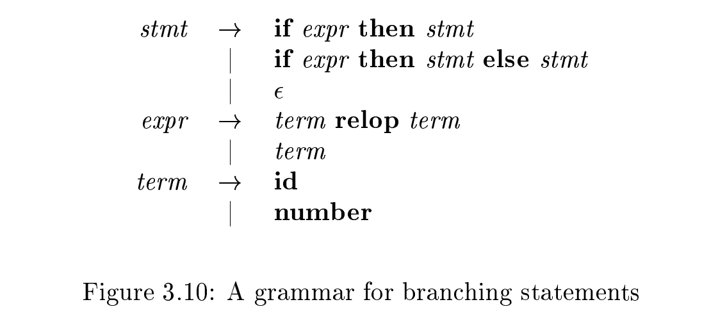
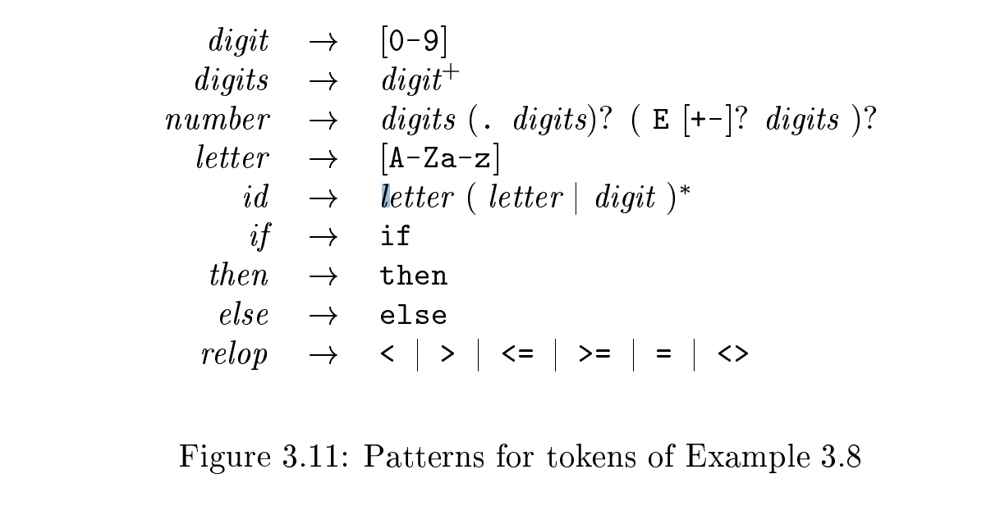
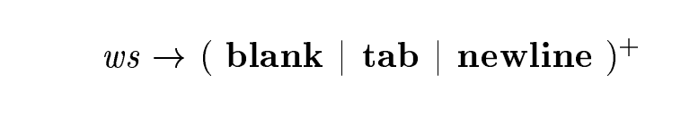
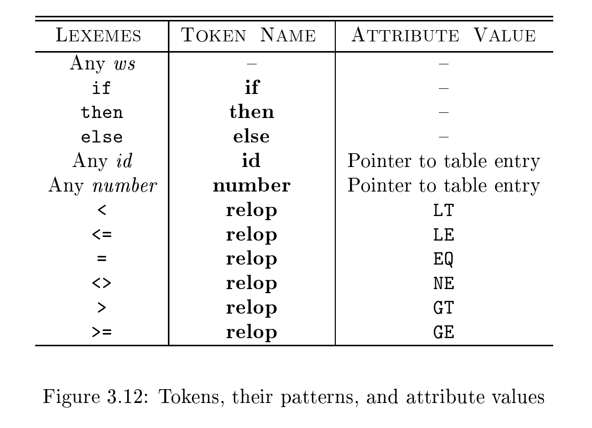

# 3.4 Recognition of Tokens

> NOTE:  
>
> This chapter  describes conversion from regular-expression patterns to **transition diagrams** by hand, which is intended to help reader to understand the **finite automaton**(finite state machine) widely used in engineering described in section 3.5. In essence, a transition diagram is a visual representation of a finite state machine.

In the previous section we learned how to express patterns using regular expressions. Now, we must study how to take the patterns for all the needed tokens and build a piece of code that examines the input string and finds a prefix that is a lexeme matching one of the patterns. Our discussion will make use of the following running example.




## Example 3.8

Example 3.8 : The grammar fragment of Fig. 3.10 describes a simple form of branching statements and conditional expressions. This syntax is similar to that of the language Pascal, in that then appears explicitly after conditions.

For `relop`, we use the **comparison operators** of languages like Pascal or SQL, where `=` is "equals" and `<>` is "not equals," because it presents an interesting structure of lexemes.

The terminals of the grammar, which are `if`, `then`, `else`, `relop`, `id`, and `number`, are the names of tokens as far as the **lexical analyzer** is concerned. The patterns for these tokens are described using **regular definitions**, as in Fig. 3.11. The patterns for `id` and `number` are similar to what we saw in Example 3.7.




For this language, the **lexical analyzer** will recognize the keywords `if`, `then`, and `else`, as well as lexemes that match the patterns for `relop`, id, and number. To simplify matters, we make the common assumption that keywords are also reserved words : that is, they are not identiers, even though their lexemes match the pattern for identiers.

In addition, we assign the **lexical analyzer** the job of stripping out whitespace, by recognizing the "token" `ws` defined by:




Here, `blank`, `tab`, and `newline` are abstract symbols that we use to express the ASCII characters of the same names. Token `ws` is different from the other tokens in that, when we recognize it, we do not return it to the parser, but rather restart the lexical analysis from the character that follows the whitespace. It is the following token that gets returned to the parser.



## 3.4.1 Transition Diagrams 


## Aho-Corasick algorithm 

> NOTE: 
>
> The main content of this chapter is passed, but in the exercise,  the author introduce [Aho-Corasick algorithm](https://en.wikipedia.org/wiki/Aho%E2%80%93Corasick_algorithm) and [KMP algorithm](https://en.wikipedia.org/wiki/Knuth%E2%80%93Morris%E2%80%93Pratt_algorithm) which are interesting.

The following exercises, up to Exercise 3.4.12, introduce the Aho-Corasick algorithm for recognizing a collection of keywords in a text string in time proportional to the length of the text and the sum of the length of the keywords. This algorithm uses a special form of transition diagram called a [trie](https://en.wikipedia.org/wiki/Trie). A [trie](https://en.wikipedia.org/wiki/Trie) is a tree-structured transition diagram with distinct labels on the edges leading from a node to its children. Leaves of the trie represent recognized keywords.

> NOTE: A [trie](https://en.wikipedia.org/wiki/Trie) is a tree-structured transition diagram or **finite automaton**, do you see the power of tree structure here as I do

Knuth, Morris, and Pratt presented an algorithm for recognizing a single keyword $b_1 b_2 \dots b_n$(length of the word is n) in a text string. Here the trie is a transition diagram with n+ 1 states, 0 through n. State 0 is the initial state, and state n represents acceptance, that is, discovery of the keyword. From each state s from 0 through n - 1, there is a transition to state s + 1, labeled by symbol $b_{s+1}$ . For example, the trie for the keyword `ababaa` is:


In order to process text strings rapidly and search those strings for a keyword, it is useful to define, for keyword $b_1 b_2 \dots b_n$ and position `s` in that keyword (corresponding to state `s` of its trie),  a *failure function*, `f(s)`, computed as in Fig. 3.19.  The objective is that $b_1 b_2 \dots b_{f(s)}$ is the longest proper prefix of $b_1 b_2 \dots b_s$ that is also a suffix of $b_1 b_2 \dots b_s$.  The reason $f (s)$ is important is that if we are trying to match a text string for $b_1 b_2 \dots b_n$,  and we have matched the first `s` positions, but we then fail (i.e., the next position of the text string does not hold $b_{s+1}$ ), then $f (s)$ is the longest prefix of  $b_1 b_2 \dots b_n$ that could possibly match the text string up to the point we are at. Of course, the next character of the text string must be $b_{f (s)+1}$, or else we still have problems and must consider a yet shorter prefix, which will be $b_{f (f (s))}$.

```pseudocode
 t = 0;
 f (1) = 0;
 for (s = 1; s < n; s + +) f
 	while (t > 0 && b[s+1] ! = b[t+1]) t = f (t);
 	if (b[s+1] == b[t+1]) {
         t = t + 1;
         f (s + 1) = t;
    }
 	else f (s + 1) = 0;
}
```

Figure 3.19: Algorithm to compute the failure function for keyword $b_1 b_2 \dots b_n$

As an example, the failure function for the trie constructed above for `ababaa` is:

|      |      |      |      |      |      |      |
| ---- | ---- | ---- | ---- | ---- | ---- | ---- |
| s    | 1    | 2    | 3    | 4    | 5    | 6    |
| f(s) | 0    | 0    | 1    | 2    | 3    | 1    |

For instance, states 3 and 1 represent prefixes `aba` and `a`, respectively. `f (3) = 1` because `a` is the longest proper prefix of `aba` that is also a suffix of `aba`. Also, `f (2) = 0`, because the longest proper prefix of `ab` that is also a suffix is the empty string.


Aho and Corasick generalized the KMP algorithm to recognize any of a set of keywords in a text string. In this case, the trie is a true tree, with branching from the root. There is one state for every string that is a prefix (not necessarily proper) of any keyword. The parent of a state corresponding to string $b_1 b_2 \dots b_n$ is the state that corresponds to $b_1 b_2 \dots b_k$. A state is accepting if it corresponds to a complete keyword. For example, Fig. 3.21 shows the trie for the keywords `he`, `she`, `his`, and `hers`.


