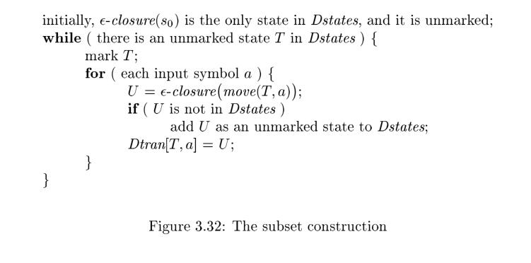

# 3.7 From Regular Expressions to Automata

> NOTE: 
>
> 一、What this chapter describe is mainly three algorithms
>
> | Name                                                         | Function                                                     | chapter                                                |
> | ------------------------------------------------------------ | ------------------------------------------------------------ | ------------------------------------------------------ |
> | [Thompson's construction algorithm](https://en.wikipedia.org/wiki/Thompson%27s_construction) | transforming a [regular expression](https://en.wikipedia.org/wiki/Regular_expression) into an equivalent [nondeterministic finite automaton](https://en.wikipedia.org/wiki/Nondeterministic_finite_automaton) (NFA) | 3.7.4 Construction of an NFA from a Regular Expression |
> | [subset construction algorithm](https://en.wikipedia.org/wiki/Subset_construction_algorithm) | [converting](https://en.wikipedia.org/wiki/Automata_construction) a [nondeterministic finite automaton](https://en.wikipedia.org/wiki/Nondeterministic_finite_automaton) (NFA) into a [deterministic finite automaton](https://en.wikipedia.org/wiki/Deterministic_finite_automaton) (DFA) which recognizes the same [formal language](https://en.wikipedia.org/wiki/Formal_language) | 3.7.1 Conversion of an NFA to a DFA                    |
> | [DFA minimization](https://en.wikipedia.org/wiki/DFA_minimization) | transforming a given [deterministic finite automaton](https://en.wikipedia.org/wiki/Deterministic_finite_automaton) (DFA) into an equivalent DFA that has a minimum number of states. |                                                        |
>
>
> Using the algorithms above, a regular expression can be converted to the corresponding best DFA. 

The regular expression is the notation of choice for describing lexical analyzers and other pattern-processing software, as was reflected in Section 3.5. However, implementation of that software requires the simulation of a DFA, as in Algorithm 3.18, or perhaps simulation of an NFA. Because an NFA often has a choice of move on an input symbol (as Fig. 3.24 does on input a from state 0) or on $\epsilon$ (as Fig. 3.26 does from state 0), or even a choice of making a transition on $\epsilon$  or on a real input symbol, its simulation is less straightforward than for a DFA. Thus often it is important to convert an NFA to a DFA that accepts the
same language.

## 3.7.1 Conversion of an NFA to a DFA

> NOTE: 
>
> The subset construction explained in this book is too abstract to grasp, [wikipedia's explanation about this algorithm](https://en.wikipedia.org/wiki/Powerset_construction) is more intuitionistic.

The general idea behind the **subset construction** is that each state of the constructed DFA corresponds to a set of NFA states. After reading input $a_1 a_2 \dots a_n$, the DFA is in that state which corresponds to the set of states that the NFA can reach, from its start state, following paths labeled $a_1 a_2 \dots a_n$.

> NOTE:
>
> 一、因为NFA在同一个字符可能有多个转换，因此"each state of the constructed DFA corresponds to a set of NFA states"

It is possible that the number of DFA states is **exponential** in the number of NFA states, which could lead to difficulties when we try to implement this DFA. However, part of the power of the automaton-based approach to lexical analysis is that for real languages, the NFA and DFA have approximately the same number of states, and the exponential behavior is not seen.

**Algorithm 3.20** : The *subset construction* of a DFA from an NFA.

**INPUT**: An **NFA** `N` .

**OUTPUT**: A DFA `D` accepting the same language as `N` .

**METHOD**: Our algorithm constructs a **transition table** $D_{tran}$ for `D` . Each state of `D` is a set of NFA states, and we construct $D_{tran}$ so `D` will simulate "in parallel" all possible moves `N` can make on a given input string. Our first problem is to deal with **$\epsilon$-transitions** of `N` properly. In Fig. 3.31 we see the definitions of several functions that describe basic computations on the states of `N` that are needed in the algorithm. Note that `s` is a **single state** of `N` , while `T`  is a **set of states** of `N` .

| OPERATION             | DESCRIPTION                                                  |
| --------------------- | ------------------------------------------------------------ |
| $\epsilon-closure(s)$ | Set of NFA states reachable from NFA state `s` on **$\epsilon$-transitions** alone. |
| $\epsilon-closure(T)$ | Set of NFA states reachable from some NFA state `s` in set `T` on **$\epsilon$-transitions** alone; $= \cup _{s \in T} {\epsilon-closure(s)}$ |
| `move(T, a)`          | Set of NFA states to which there is a transition on input symbol a from some state `s` in `T` . |

Figure 3.31: Operations on NFA states

We must explore those sets of states that `N` can be in after seeing some input string. As a basis, before reading the first input symbol, `N` can be in any of the states of $\epsilon-closure(s_0)$, where $s_0$ is its **start state**. For the **induction**, suppose that `N` can be in set of states `T` after reading input string `x`. If it next reads input `a`, then `N` can immediately go to any of the states in $move (T , a)$. However, after reading `a`, it may also make several $\epsilon-transitions$; thus `N` could be in any state of $\epsilon-closure(move(T, a))$ after reading input `xa`. Following these ideas, the construction of the set of `D` 's states, $D_{states}$, and its transition function $D_{tran}$, is shown in Fig. 3.32.

The **start state** of `D` is $\epsilon-closure(s_0)$, and the **accepting states** of `D` are all those sets of `N` 's states that include at least one accepting state of N . To complete our description of the **subset construction**, we need only to show how $\epsilon-closure(T)$ is computed for any set of NFA states `T` .  This process, shown in Fig. 3.33, is a straightforward search in a graph from a set of states. In this case, imagine that only the $\epsilon$-labeled edges are available in the graph. 

.jpg)

## 3.7.2 Simulation of an NFA 

A strategy that has been used in a number of text-editing programs is to construct an NFA from a regular expression and then simulate the NFA using something like an on-the-fly subset construction. The simulation is outlinedbelow.

## 3.7.3 Efficiency of NFA Simulation 

## 3.7.4 Construction of an NFA from a Regular Expression

We now give an algorithm for converting any **regular expression** to an **NFA** that defines the same language. The algorithm is **syntax-directed**, in the sense that it works recursively up the **parse tree** for the regular expression. For each **subexpression** the algorithm constructs an NFA with a **single accepting state**.

> NOTE: 
>
> 一、bottom-up
>
> 二、How to build a parse tree for a regular expression? 
>
> [Efficiently building a parse tree from a regular expression](http://www.iro.umontreal.ca/~feeley/papers/DubeFeeleyACTAINFORMATICA00.pdf)

### Algorithm 3.23 

The [McNaughton-Yamada-Thompson algorithm](https://en.wikipedia.org/wiki/Thompson%27s_construction) to convert a **regular expression** to an **NFA**.

**INPUT**: A regular expression `r` over alphabet $\Sigma$.

**OUTPUT**: An NFA `N` accepting `L(r)`.

**METHOD**: Begin by parsing `r` into its constituent **subexpressions**. The rules for constructing an NFA consist of:

1、**basis rules** for handling **subexpressions** with no operators, 

2、**inductive rules** for constructing larger NFA's from the NFA's for the immediate subexpressions of a given expression.

#### **BASIS**: 

For expression $\epsilon$ construct the **NFA**

Here, `i` is a new state, the **start state** of this NFA, and `f` is another new state, the **accepting state** for the **NFA**.

For any subexpression a in $\Sigma$, construct the **NFA**

where again `i` and `f` are new states, the **start** and **accepting states**, respectively. Note that in both of the basis constructions, we construct a distinct NFA, with new states, for every occurrence of $\epsilon$ or some `a` as a subexpression of `r`.

#### **INDUCTION**: 

Suppose `N (s)` and `N (t)` are NFA's for **regular expressions** `s` and `t`, respectively.

a) Suppose `r = s|t`. Then `N (r)`, the NFA for `r` , is constructed as in Fig. 3.40. Here, `i` and `f` are new states, the start and accepting states of `N (r)`, respectively. There are $\epsilon$-transitions from `i` to the **start states** of `N(s)` and `N(t)`, and each of their **accepting states** have $\epsilon$-transitions to the **accepting state** `f` . Note that the accepting states of `N(s)` and `N(t)` are not accepting in `N(r)`. Since any path from `i` to `f` must pass through either `N(s)` or `N(t)` exclusively, and since the label of that path is not changed by the $\epsilon$'s leaving `i` or entering `f` , we conclude that `N(r)` accepts $L(s) \cup L(t)$, which is the same as `L(r)`. That is, Fig. 3.40 is a correct construction for the union operator.

b) Suppose `r = st`. Then construct `N(r)` as in Fig. 3.41. The **start state** of `N(s)` becomes the **start state** of `N(r)`, and the **accepting state** of `N(t)` is the only **accepting state** of `N(r)`. The **accepting state** of `N(s)` and the **start state** of `N(t)` are merged into a single state, with all the transitions in or out of either state. A path from `i` to `f` in Fig. 3.41 must go first through `N (s)`, and therefore its label will begin with some string in `L(s)`. The path then continues through `N(t)`, so the path's label finishes with a string in `L(t)`. As we shall so on argue, **accepting states** never have edges out and start states never have edges in, so it is not possible for a path to re-enter `N(s)` after leaving it. Thus, `N(r)` accepts exactly `L(s)L(t)`, and is a correct NFA for `r = st`.

c) Suppose $r = s^*$. Then for `r` we construct the NFA `N(r)` shown in Fig. 3.42. Here, `i` and `f` are new states, the start state and lone accepting state of `N(r)`. To get from `i` to `f` , we can either follow the introduced path labeled $\epsilon$, which takes care of the one string in $L(s)^0$ , or we can go to the start state of `N(s)`, through that NFA, then from its accepting state back to its start state zero or more times. These options allow `N(r)` to accept all the strings in $L(s)^1$, $L(s)^2$, and so on, so the entire set of strings accepted by `N(r)` is $L(s^*)$.

d) Finally, suppose `r = (s)`. Then `L(r)=L(s)`, and we can use the NFA `N(s)` as `N(r)`.

> NOTE:
>
> 这条规则描述的是加上括号

> NOTE: 
>
> Implementing a [regular expression engine](https://en.wikipedia.org/wiki/Comparison_of_regular_expression_engines) is far more complex than the algorithm described here.

The method description in Algorithm 3.23 contains hints as to why the **inductive construction** works as it should. We shall not give a formal correctness proof, but we shall list several properties of the constructed NFA's, in addition to the all-important fact that `N(r)` accepts language `L(r)`. These properties are interesting in their own right, and helpful in making a formal proof.

1、`N(r)` has at most twice as many states as there are operators and operands in `r` . This bound follows from the fact that each step of the algorithm creates at most two new states.

2、`N(r)` has one **start state** and one **accepting state**. The accepting state has no outgoing transitions, and the start state has no incoming transitions.

3、Each state of `N(r)` other than the accepting state has either one outgoing transition on a symbol in $\Sigma$ or two outgoing transitions, both on $\epsilon$.

**Example 3.24** : Let us use Algorithm 3.23 to construct an NFA for $r = (a | b) ^*abb$. Figure 3.43 shows a **parse tree** for `r` that is analogous to the **parse trees** constructed for **arithmetic expressions** in Section 2.2.3. For subexpression $r_1$ , the first `a`, we construct the **NFA**:

State numbers have been chosen for consistency with what follows. For $r_2$ we construct:

We can now combine $N (r_1)$ and $N (r_2)$, using the construction of Fig. 3.40 to obtain the NFA for $r_3
=r_1|r_2$; this NFA is shown in Fig. 3.44.

The NFA for $r_4= (r_3)$ is the same as that for $r_3$. The NFA for $r_5= (r_3)$ is then as shown in Fig. 3.45. We have used the construction in Fig. 3.42 to build this NFA from the NFA in Fig. 3.44.

Now, consider subexpression $r_6$, which is another `a`. We use the basis construction for `a` again, but we must use new states. It is not permissible to reuse the NFA we constructed for $r_1$, even though $r_1$ and $r_6$ are the same expression. The NFA for $r_6$ is:

To obtain the NFA for $r_7= r_5r_6$, we apply the construction of Fig. 3.41. We merge states 7 and $7^{'}$, yielding the NFA of Fig. 3.46. Continuing in this fashion with new NFA's for the two subexpressions `b` called $r_8$
and $r_{10}$, we eventually construct the NFA for  tha$r = (a | b) ^*abb$ that we first met in Fig. 3.34. 

## 3.7.5 Eciency of String-Processing Algorithms 

