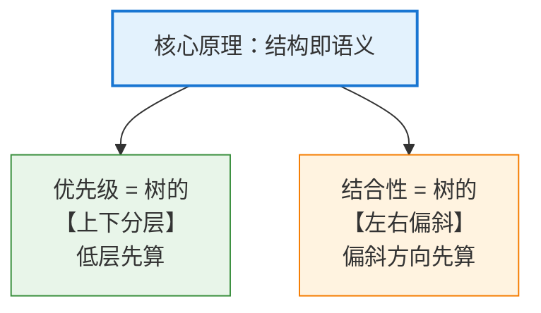
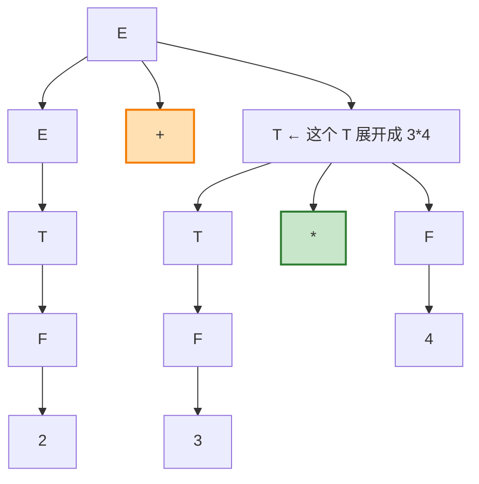
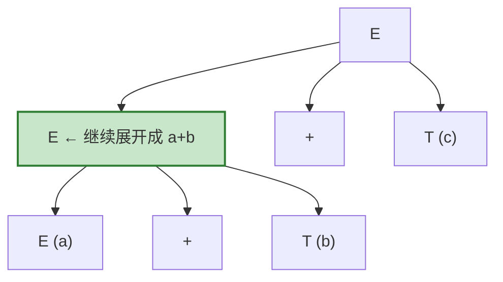
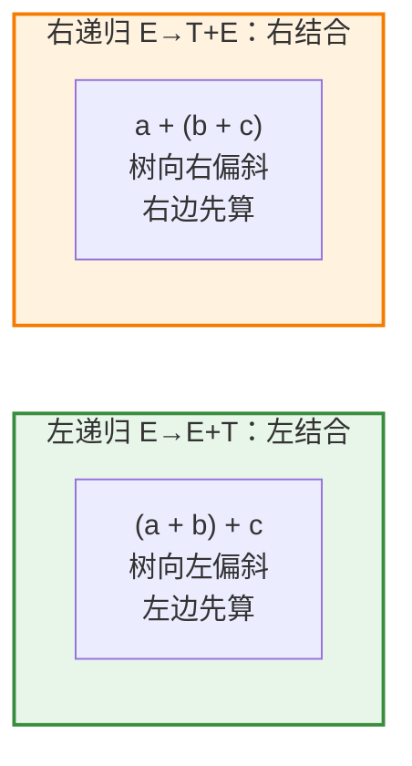
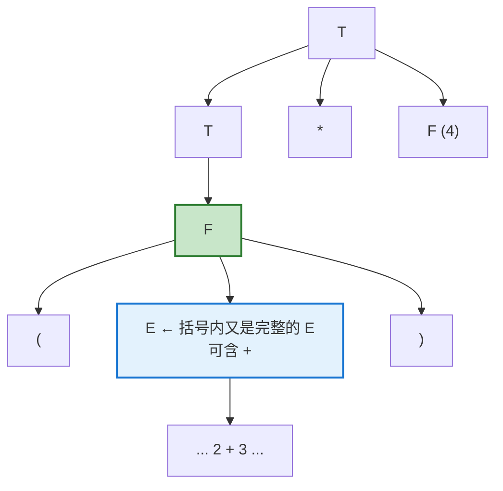
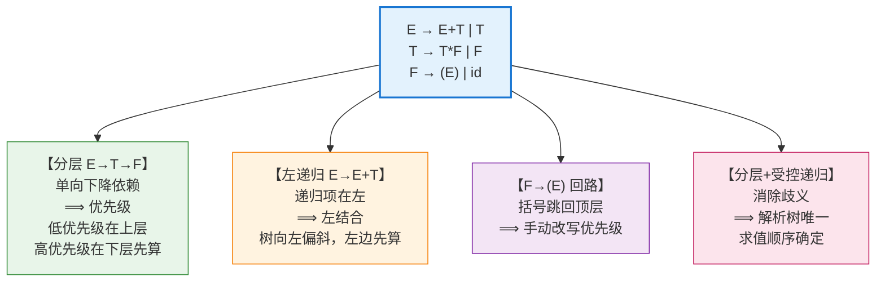

# 表达式文法如何"编码"结合性与优先级：拆解经典的 E-T-F 文法

## 1. 引言：一个文法承载的两条规则

我们从小就知道 `2 + 3 * 4` 等于 `14` 而不是 `20`——因为"乘法优先于加法"；也知道 `8 - 3 - 2` 等于 `3` 而不是 `7`——因为"减法从左往右算"。这两条直觉分别叫做**优先级（precedence）**和**结合性（associativity）**。

但一个自然的问题是：编译器怎么"知道"这些规则？答案出人意料地优雅——**这些规则并没有写在解析器的代码里，而是直接编码在文法的结构中**。经典的表达式文法（龙书中的 4.1）就是范例：

$$
\begin{align*}
E &\rightarrow E + T \mid T \\
T &\rightarrow T * F \mid F \\
F &\rightarrow (E) \mid \mathbf{id}
\end{align*}
$$

它把三个概念分层：

- **E（expression，表达式）**：由 `+` 连接的若干项；
- **T（term，项）**：由 `*` 连接的若干因子；
- **F（factor，因子）**：括号表达式或标识符。

本文将逐层揭示：**为什么仅凭这个文法的结构，就能同时"自动"捕获优先级与结合性。**

---

## 2. 核心原理：结构即语义

理解这个文法的关键洞见是：

> **一个（无歧义）文法生成的解析树，其"形状"唯一决定了运算的求值顺序。谁在树的"底部"（离叶子近），谁就先被计算。**

因此，只要文法能强制生成**特定形状**的解析树，它就能强制特定的**求值顺序**——而**求值顺序**正是**优先级**和**结合性**的本质。

下面分别看这两点如何实现。

---

## 3. 优先级：靠"分层"实现

### 3.1 三个层级的高低之分

文法把运算符分到了**不同的层级**：

$$
\underbrace{E \rightarrow E + T}_{\text{最上层：} +} \qquad \underbrace{T \rightarrow T * F \mid F }_{\text{中间层：} *} \qquad \underbrace{F \rightarrow (E) \mid \mathbf{id}}_{\text{最底层：原子}}
$$

关键在于这条**单向的"下降"链**：

$$
E \;\longrightarrow\; T \;\longrightarrow\; F
$$

- `E` 的产生式里会用到 `T`（`E → E + T` 和 `E → T`）；
- `T` 的产生式里会用到 `F`（`T → T * F` 和 `T → F`）；
- 但**反过来不行**——`T` 不能直接展开出一个"裸的 `+`"，`F` 也不能直接展开出"裸的 `*`"。

**这个单向依赖是优先级的根源**：要让一个 `+` 出现在树里，必须从 `E` 层开始；而 `+` 的操作数（`T`）内部才轮到 `*` 出现。于是 `*` 天然被"埋"在比 `+` 更深的层次。

### 3.2 实例：`2 + 3 * 4` 的解析树

看文法如何强制 `3 * 4` 先算：

**观察这棵树**：

- `+` 出现在**顶部**（`E → E + T`）；
- `*` 出现在**下方**（藏在右边那个 `T` 内部，`T → T * F`）；
- 由于 `*` 离叶子更近、位于树的更低层，**它对应的子树 `3 * 4` 会先被归约（先计算）**，其结果再作为 `+` 的右操作数。

#### 为什么不可能生成"`2 + 3` 先算"的树

**为什么不可能生成"`2 + 3` 先算"的树？** 那样的树意味着 `2 + 3` 要成为 `*` 的左操作数；而在 `T → T * F` 中，`*` 的左操作数是 `T`，于是就需要一个 `T` 能展开出 `2 + 3`——但 `T` 的产生式（`T → T * F | F`）里**根本没有 `+`**！文法从语法上就**堵死了**这条路。这正是"乘法优先级高于加法"被强制的机制。

这段推理有三个容易被弄错的细节，值得逐一点明：

**① `2 + 3` 是 `*` 的操作数，不是 `+` 的操作数。**

被排除的那棵树对应的分组是 $(2+3) * 4$，其根节点使用的产生式是 `T → T * F`——也就是说，这棵树的最外层运算符是 `*` 而非 `+`。因此 `2 + 3` 所要充当的角色，是 `*` 的左操作数。

**② 为什么落到 `T` 身上：因为 `*` 的左操作数在文法中就是 `T`。**

$$
T \rightarrow \underbrace{T}_{\text{左操作数}} * \underbrace{F}_{\text{右操作数}}
$$

所以"`2 + 3` 成为 `*` 的左操作数"这一要求，严格等价于要求存在推导：

$$
T \Rightarrow^{*} 2 + 3
$$

而 `T` 的两条产生式 `T → T * F | F` 中都不含 `+`，这条推导不存在。

**③ `F → (E)` 并不构成反例，因为它必须带上括号。**

有读者会想：`T → F`、`F → (E)`，而 `E` 里明明有 `+`，那 `T` 岂不是能推出 `+`？关键在于 `F → (E)` 的右部**包含终结符 `(` 和 `)`**，因此这条路径只能推出 `(2 + 3)` 这种**带括号**的串，推不出裸的 `2 + 3`：

$$
T \Rightarrow F \Rightarrow (E) \Rightarrow^{*} (2+3) \quad\text{而非}\quad 2+3
$$

这恰好解释了为什么想要 $(2+3)*4$ 的分组，就**必须**在源代码里显式写出括号——这正是第 5 节要讨论的机制。

> 💡 **一句话**：优先级低的运算符放在文法的**上层**（离根近），优先级高的放在**下层**（离叶子近）。层级越低 → 子树越深 → 越先计算。**分层，就是优先级。**

---

## 4. 结合性：靠"递归的方向"实现

优先级解决了"不同运算符谁先算"，但还有一个问题：**相同运算符连续出现时，从哪边开始算？** 比如 `8 - 3 - 2`，是 `(8-3)-2` 还是 `8-(3-2)`？这就是结合性，它由**产生式递归的方向**决定。

### 4.1 左递归 → 左结合

看加法的产生式：

$$
E \rightarrow \underbrace{E}_{\text{递归项在左}} + T
$$

这叫**左递归（left recursion）**——递归的非终结符 `E` 出现在产生式右部的**最左边**。它强制生成**向左偏斜（left-leaning）**的解析树。

以 `a + b + c` 为例：

**观察这棵树的形状**：

- 递归不断地在**左子树**展开：`E → E + T → (E + T) + T → ...`；
- 树整体**向左下方偏斜**；
- 因此 `a + b` 这个左边的子树位于更深处，**先被计算**，结果再与 `c` 相加。
- 等价于 **`(a + b) + c`** —— 这就是**左结合**。

### 4.2 对比：如果用右递归会怎样

假设我们把文法写成**右递归**：

$$
E \rightarrow T + E \quad(\text{递归项在右})
$$

那么 `a + b + c` 会生成**向右偏斜**的树，`b + c` 先算，变成 **`a + (b + c)`**——即**右结合**。

对于 `+` 和 `*` 这类满足数学结合律的运算，左结合还是右结合结果相同；但对于 **`-`（减法）和 `/`（除法）**，方向就至关重要了——`8 - 3 - 2` 必须是 `(8-3)-2 = 3`，所以必须用**左递归**。这正是龙书选择左递归形式的原因：它匹配了算术运算符的标准左结合约定。

> 💡 **一句话**：**递归项在左 → 左结合；递归项在右 → 右结合。** 递归的方向，就是结合的方向。

---

## 5. 括号：优先级的"逃生舱"

文法还留了一个精妙的出口：

$$
F \rightarrow (E)
$$

注意：**括号内部又回到了最顶层的 `E`**！这形成一个"循环回路"：

$$
E \rightarrow T \rightarrow F \rightarrow (E) \rightarrow \cdots
$$

**这条回路的意义**：它让程序员能**手动覆盖默认优先级**。因为一旦进入括号，就从最底层的 `F` 一下子"跳回"最高层的 `E`，括号里的表达式可以重新拥有完整的 `+`、`*` 结构。

例如 `(2 + 3) * 4`：括号强制 `2 + 3` 被包进一个 `F`，而 `F` 位于比 `*` 更低的层——于是 `2 + 3` 反而先算了。括号用一条 `F → (E)` 的规则，就实现了"人为提升优先级"。

---

## 6. 为什么这个文法是"无歧义"的

优先级和结合性能被稳定捕获，还有一个前提：**这个文法对任何合法输入只产生唯一的解析树**（无歧义, unambiguous）。

对比一个**有歧义**的朴素写法：

$$
E \rightarrow E + E \mid E * E \mid (E) \mid \mathbf{id}
$$

这个文法能为 `2 + 3 * 4` 生成**两棵不同的树**（一棵先算 `+`，一棵先算 `*`），因为它没有任何机制区分优先级——它是**有歧义的**，无法确定求值顺序。

而 4.1 文法通过**分层（E/T/F）**和**受控的递归方向**，消除了这种歧义：

- 分层保证了 `+` 和 `*` 不会"平起平坐"地竞争；
- 每层内部的左递归保证了同级运算符的唯一结合方向。

**正是"无歧义"这个性质，才让'解析树的形状唯一' → '求值顺序唯一' → '优先级与结合性被确定地捕获'这条推理链成立。**

---

## 7. 总结

这个经典文法之所以能**同时捕获优先级和结合性**，靠的是把两条语义规则**编码进语法结构**，具体机制如下：

- **优先级 ← 分层**：文法把运算符按优先级分到 `E`（`+`）、`T`（`*`）、`F`（原子）三层，通过 `E → T → F` 的单向依赖，把高优先级运算符"埋"到解析树的更深处，使其更先被计算。低优先级在上、高优先级在下。

- **结合性 ← 递归方向**：`E → E + T` 的**左递归**强制解析树向左偏斜，产生 **`(a+b)+c`** 式的左结合求值顺序。若改为右递归则得到右结合。递归项的位置，直接决定结合方向。

- **括号 ← F→(E) 回路**：`F → (E)` 让括号内部重新跳回最高层 `E`，为程序员提供了**手动覆盖默认优先级**的手段。

- **无歧义是前提**：分层与受控递归共同消除了歧义，保证每个输入只有唯一解析树——这才使得"结构决定语义"的推理成立。

**最深刻的启示**：优先级与结合性并非解析器"额外实现"的逻辑，而是**文法作者通过精心设计产生式结构，预先'雕刻'进语法本身的**。当解析器为输入构造出唯一的解析树时，正确的求值顺序便"免费"地随之确定了——**这正是形式文法优雅之所在：用结构表达语义。**

---

> 若你想继续深入，我可以展开：**① 如何消除左递归以适配自顶向下（LL）解析器，同时保持左结合语义**；**② 有歧义文法（如 `E→E+E`）配合优先级声明的另一种解决路径（如 Yacc/Bison 的做法）**；或 **③ 如何扩展此文法以支持一元负号、幂运算（右结合）等更多运算符**。告诉我你感兴趣的方向即可。😊
