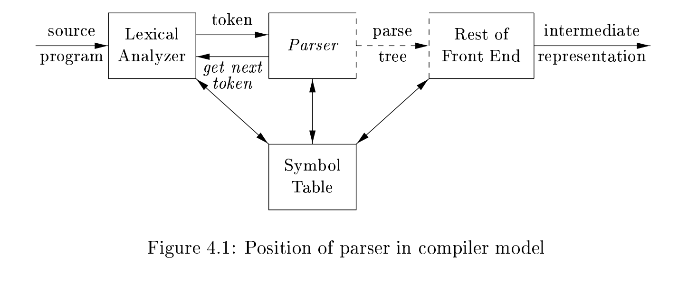

## 4.1 Introduction

In this section, we examine the way the parser fits into a typical compiler. We then look at typical grammars(文法) for **arithmetic expressions**. Grammars for **expressions** suffice for illustrating the essence of parsing, since parsing techniques for expressions carry over to most programming constructs. This section ends with a discussion of **error handling**, since the parser must respond gracefully to finding that its input cannot be generated by its grammar.

> 翻译: 在本节中，我们将考察语法分析器在典型编译器中的所处位置。随后我们研究算术表达式的典型文法。表达式文法足以阐明语法分析的核心要义，因为针对表达式的语法分析技术可以迁移到绝大多数程序语言构造上。本节最后会讨论**错误处理**，原因是当语法分析器发现输入无法由当前文法推导生成时，必须做出恰当的响应。
> 
> NOTE: topic: parser error handling

### 4.1.1 The Role of the Parser

In our compiler model, the parser obtains a string of tokens from the **lexical analyzer**, as shown in Fig. 4.1, and verifies that the string of token names can be generated by the grammar for the source language. We expect the parser to report any **syntax errors** in an intelligible(易于理解的) fashion and to recover from commonly occurring errors to continue processing the remainder of the program. 

> NOTE: topic: parser error handling

Conceptually, for well-formed programs, the parser constructs a **parse tree** and passes it to the rest of the compiler for further processing. In fact, the **parse tree** need not be constructed explicitly, since **checking** and **translation actions** can be interspersed(穿插) with parsing, as we shall see. Thus, the parser and the rest of the **front end** could well be implemented by a single module.

翻译: 从概念上讲，对于格式合法的程序，语法分析器会构建一棵**语法分析树（分析树）**，并将其交给编译器的其余模块做后续处理。但实际上并不需要显式地构造出语法分析树，正如后文将会讲到的那样，**检查动作**与**翻译动作**可以穿插在语法分析的过程之中执行。因此，语法分析器和前端其余部分完全可以由同一个模块实现。

> Q: 如何理解"In fact, the parse tree need not be constructed explicitly, since checking and translation actions can be interspersed with parsing, as we shall see"?
> 
> A: 借助syntax-directed-translation技术，比如attribute grammar。
> 
> "Thus, the parser and the rest of the front end could well be implemented by a single module"
> 
> 这是使用 syntax-directed-translation 的优势
> 
> parser是front end的核心，它驱动着整个compiler-front-end: "since **checking** and **translation actions** can be interspersed with parsing"，这其实就是syntax-directed-translation

There are three general types of parsers for grammars: 

- universal

- top-down

- bottom-up

#### Universal parser

**Universal parsing methods** such as the **Cocke-Younger-Kasami algorithm** and **Earley's algorithm** can parse any grammar (see the bibliographic notes). These general methods are, however, too inefficient to use in production compilers.

#### Top-down&bottom-up

The methods commonly used in compilers can be classified as being either
**top-down** or **bottom-up**. As implied by their names, **top-down methods** build **parse trees** from the top (root) to the bottom (leaves), **bottom-up methods** start from the leaves and work their way up to the root. In either case, the input to the parser is scanned from left to right, one symbol at a time.

The most efficient **top-down** and **bottom-up methods** work only for subclasses of grammars, but several of these classes, particularly, **LL** and **LR grammars**, are expressive enough to describe most of the **syntactic constructs** in modern programming languages. Parsers implemented by hand often use **LL grammars**; for example, the predictive-parsing approach of Section 2.4.2 works for **LL grammars**. Parsers for the larger class of **LR grammars** are usually constructed using automated tools. 

In this chapter, we assume that the output of the parser is some representation of the **parse tree** for the stream of tokens that comes from the **lexical analyzer**. In practice, there are a number of tasks that might be conducted during parsing, such as collecting information about various tokens into the **symbol table**, performing type checking and other kinds of **semantic analysis**, and **generating intermediate code**. We have lumped all of these activities into the "rest of the **front end**" box in Fig. 4.1. These activities will be covered indetail in subsequent chapters.

> 翻译: 在本章中，我们假定语法分析器的输出，是来自**词法分析器**的记号流所对应的**语法分析树**的某种表示形式。在实际实现中，语法分析阶段还可以完成多项工作：例如将各个记号的相关信息收集到**符号表**中、执行类型检查以及其他类型的**语义分析**、**生成中间代码**。我们已经将上述所有工作统一归入图 4‑1 里 “编译器前端其余部分” 这一模块。这些内容将在后续章节中进行详细讲解。
> 
> NOTE: syntax-directed-translation:
> 
> 1、**complete symbol table** 
> 
> 2、**semantic analysis such as type checking**
> 
> 3、**generate intermediate code**

### 4.1.2 Representative Grammars

> NOTE: 标题的含义是"代表性的文法"，具体来说就是expression

Some of the grammars that will be examined in this chapter are presented here for ease of reference. Constructs that begin with keywords like **while** or **int**, are relatively easy to parse, because the keyword guides the choice of the **grammar production** that must be applied to match the input. We therefore concentrate on expressions, which present more of challenge, because of the **associativity** and **precedence** of operators. 

> 翻译: 本章将要研究的部分文法在此列出，以方便查阅。以`while`、`int`这类关键字开头的语法构造相对容易进行语法分析，因为关键字能够引导我们选择需要应用的**文法产生式**去匹配输入串。因此我们将重点研究表达式；由于运算符存在**结合性**与**优先级**，表达式带来的语法分析难度更高。
> 
> NOTE: "**grammar production**"中"production"的含义是产生式

**Associativity** and **precedence** are captured in the following grammar, whichis similar to ones used in Chapter 2 for describing **expressions**, **terms**, and **factors**. `E` represents expressions consisting of **terms** separated by `+` signs, `T` represents **terms** consisting of **factors** separated by `*` signs, and `F` represents **factors** that can be either parenthesized expressions or identifiers:

**Expression grammar** (4.1) belongs to the class of **LR grammars** that are suitable for **bottom-up parsing**. This grammar can be adapted to handle additional operators and additional levels of **precedence**. However, it cannot be used for **top-down parsing** because it is **left recursive**.

> NOTE: 关于上述文法的介绍，参见"expression-grammar-associativity-and-precedence"

#### non-left-recursive

The following **non-left-recursive** variant of the **expression grammar** (4.1) will be used for **top-down parsing**:

#### ambiguous

The following grammar treats + and `*` alike, so it is useful for illustrating techniques for handling ambiguities during parsing:

Here, `E` represents expressions of all types. Grammar (4.3) permits more than one **parse tree** for expressions like `a + b * c`.

> NOTE: 关于上述文法的介绍，参见"expression-grammar-associativity-and-precedence"

### 4.1.3 Syntax Error Handling

The remainder of this section considers the nature of **syntactic errors** and general strategies for error recovery. Two of these strategies, called **panic-mode** and **phrase-level recovery**, are discussed in more detail in connection with specific parsing methods.

翻译: 本节余下部分将探讨**语法错误**的性质以及错误恢复的通用策略。其中两种策略 ——**恐慌模式恢复**与**短语级恢复**，会结合具体的语法分析方法展开更为详尽的讨论。

If a compiler had to process only correct programs, its design and implementation would be simplified greatly. However, a compiler is expected to assist the programmer in locating and tracking down errors that inevitably(不可避免地) creep into programs, despite the programmer’s best efforts. Strikingly, few languages have been designed with error handling in mind, even though errors are so commonplace(常见). Our civilization would be radically different if spoken languages had the same requirements for syntactic accuracy as computer languages. Most programming language specifications do not describe how a compiler should respond to errors; error handling is left to the compiler designer. Planning the error handling right from the start can both simplify the structure of a compiler and improve its handling of errors.

> **中文译文**: 如果编译器只需要处理完全正确的程序，那么它的设计与实现将会大大简化。然而，程序员即便再仔细，程序中也难免会出现错误，编译器应当帮助程序员定位并排查这些错误。值得注意的是，尽管程序错误十分常见，但很少有编程语言在设计之初就考虑到错误处理机制。倘若人类口头语言也和计算机语言一样，有着严苛的语法正确性要求，人类文明将会截然不同。绝大多数编程语言规范都不会规定编译器应当如何响应错误；错误处理方案交由编译器设计者自行决定。从项目一开始就规划好错误处理方案，既能够简化编译器的整体结构，又可以提升编译器的错误处理能力。

Common programming errors can occur at many different levels. 

- *Lexical errors* include misspellings of identifiers, keywords, or operators — e.g., the use of an identifier `elipseSize` instead of `ellipseSize` — and missing quotes around text intended as a string. 
  
  - 翻译: **词法错误**：包括标识符、关键字、运算符拼写错误（例如标识符写成`elipseSize`而非`ellipseSize`）；字符串文本缺少引号。

- *Syntactic errors* include misplaced semicolons or extra or missing braces; that is, "`{`" or "`}`." As another example, in C or Java, the appearance of a `case` statement without an enclosing `switch` is a **syntactic error** (however, this situation is usually allowed by the parser and caught later in the processing, as the compiler attempts to generate code). 
  
  - 翻译: **语法错误**：包括分号位置错误、大括号`{}`多写或漏写。另举一例：在C或Java语言中，`case`语句没有被包裹在`switch`内就属于语法错误（不过语法分析器通常不会拦截该错误，会等到编译器尝试生成代码的后续阶段才捕获）。

- *Semantic errors* include **type mismatches** between operators and operands, e.g., the return of a value in a Java method with result type `void`. 
  
  - 翻译: **语义错误**：包括运算符与操作数之间的类型不匹配；例如在返回类型为`void`的Java方法中返回了一个值。

- *Logical errors* can be anything from incorrect reasoning on the part of the programmer to the use in a C program of the assignment operator `=` instead of the comparison operator `==`. The program containing `=` may be well formed; however, it may not reflect the programmer’s intent.
  
  - 翻译: **逻辑错误**：范围很广，既可以是程序员本身逻辑思考出错，也可以是在C程序中将赋值运算符`=`误写为比较运算符`==`。这类含`=`的代码语法完全合法，但程序运行结果并不符合程序员原本的意图。

The precision of parsing methods allows syntactic errors to be detected very efficiently. Several parsing methods, such as the LL and LR methods, detect an error as soon as possible; that is, when the stream of tokens from the **lexical analyzer** cannot be parsed further according to the grammar for the language. More precisely, they have the ***viable-prefix property***(可行性前缀属性), meaning that they detect that an error has occurred as soon as they see a prefix of the input that cannot be completed to form a string in the language.

翻译: 语法分析方法具有很高的精确性，因此可以高效检测出语法错误。若干语法分析算法（例如 LL、LR 分析法）能够**尽早报错**：即当来自**词法分析器**的记号流再也无法按照该语言的文法继续向下分析时，就立刻检测到错误。更准确地说，这类算法具备**可行前缀属性（viable‑prefix property）**；该属性的含义为：只要读到输入串的某个前缀，并且该前缀无论后续补上什么符号都无法构成该语言的合法句子，分析器便可立即发现错误。

Another reason for emphasizing **error recovery** during parsing is that many errors appear syntactic, whatever their cause, and are exposed when parsing cannot continue. A few **semantic errors**, such as **type mismatches**, can also be detected efficiently; however, accurate detection of semantic and logical errors at compile time is in general a difficult task.

The error handler in a parser has goals that are simple to state but challenging to realize: 

1、Report the presence of errors clearly and accurately.  

2、Recover from each error quickly enough to detect subsequent errors.  

3、Add minimal overhead to the processing of correct programs.

### 4.1.4 Error-Recovery Strategies

Once an error is detected, how should the parser recover? 
