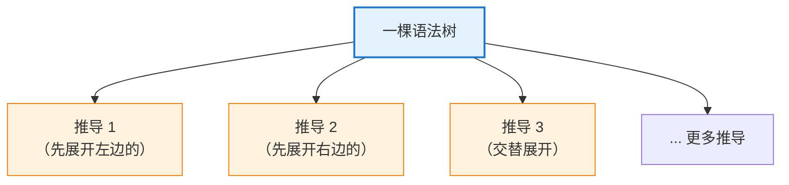
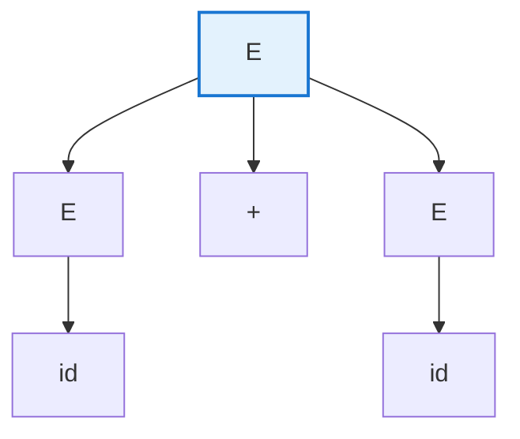
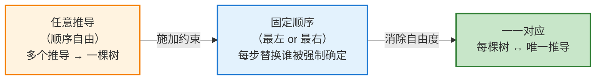
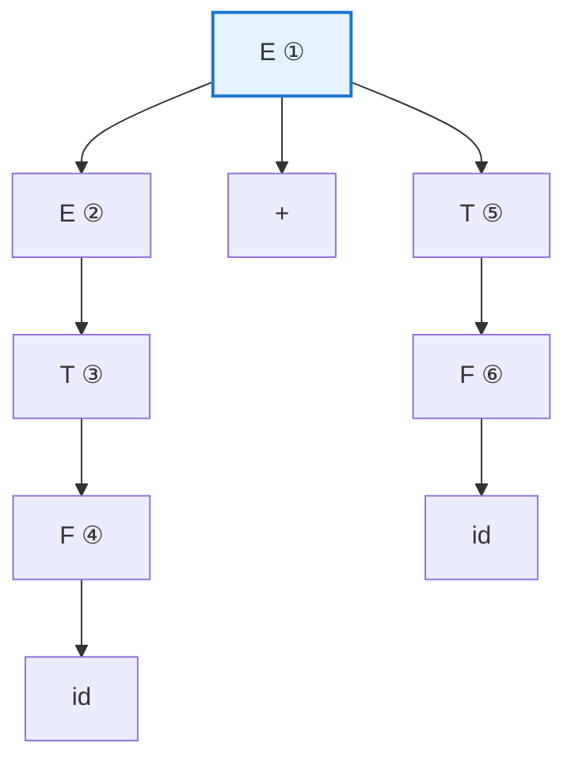
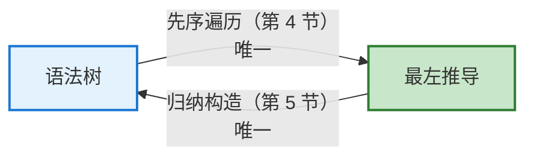
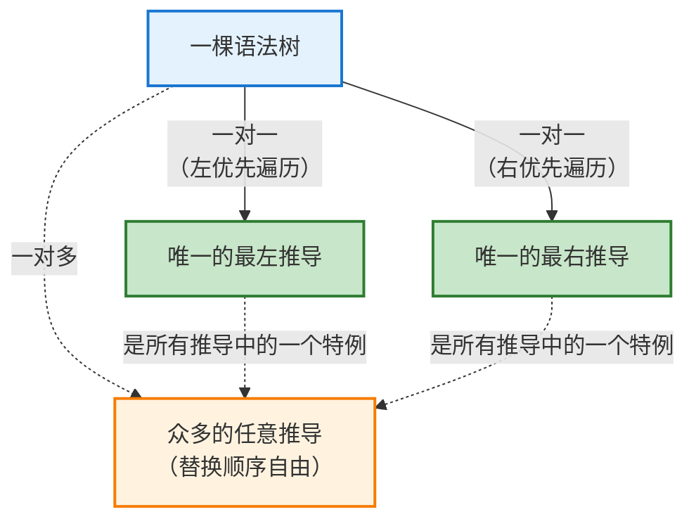
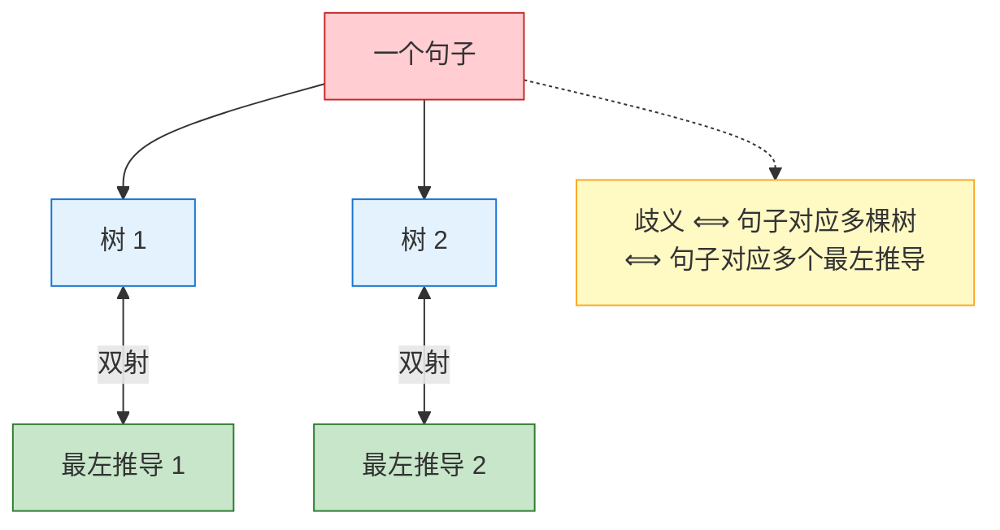

# 语法树与最左/最右推导的一一对应

> **本文要解决的问题**：龙书 4.2.4 节末尾有这样一句结论——"每一棵语法分析树都唯一对应一个最左推导和一个最右推导"（*It is not hard to show that every parse tree has associated with it a unique leftmost and a unique rightmost derivation*）。书中把它一句带过，但这条性质恰恰是 LL 与 LR 两大类解析算法的理论前提。本文补足其中的推理：为什么"推导 → 语法树"是多对一的，固定替换顺序如何恢复双射，以及这个结论对解析器意味着什么。
> 
> 原文与笔记见 [4.2 Context-Free Grammars](./index.md)。

---

## 目录

1. [问题：推导与语法树之间的不对称](#1-问题推导与语法树之间的不对称)
2. [多对一从何而来：推导中的两重选择](#2-多对一从何而来推导中的两重选择)
3. [解决之道：固定替换顺序](#3-解决之道固定替换顺序)
4. [正向：树 → 唯一的最左推导](#4-正向树--唯一的最左推导)
5. [反向：最左推导 → 唯一的树](#5-反向最左推导--唯一的树)
6. [最右推导：对称的论证](#6-最右推导对称的论证)
7. [三者关系总览](#7-三者关系总览)
8. [重要的精确性：双射的两端是什么](#8-重要的精确性双射的两端是什么)
9. [为什么这条性质是解析算法的基石](#9-为什么这条性质是解析算法的基石)
10. [总结](#10-总结)

---

## 1. 问题：推导与语法树之间的不对称

龙书 4.2.4 节先给出了一个构造性结论：**任意一个推导都可以机械地构造出一棵语法树**（对推导步数做归纳，每步"在从左数第 $j$ 个非 $\epsilon$ 叶子上挂孩子"）。

但反过来看，会发现一个不对称现象：

> **同一棵语法树，往往对应着多个不同的推导。**

原因在于，当一个句型（sentential form）中同时存在**多个非终结符**时，下一步替换哪一个是**自由的**。不同的选择顺序给出表面不同的推导序列，却"画出"同一棵树(**殊途同归**)。



这个"多对一"本身不是缺陷——它恰恰说明语法树**过滤掉了**（filter out）我们并不关心的顺序信息。龙书对语法树的定义就是这么说的：

> *A parse tree is a graphical representation of a derivation that filters out the order in which productions are applied to replace nonterminals.*

但对**解析器**设计而言，多对一是个麻烦：**解析器**需要**逐步**构造语法结构，它必须遵循某个确定的顺序。如果"推导"这个概念中掺杂着无关的顺序自由度，就无法把"解析器走过的步骤序列"与"输入的语法结构"划等号。

**解决之道就是固定替换顺序。** 规定每一步永远替换**最左（或最右）**的**非终结符**，自由度即被消除，多对一随之收缩为一一对应。

---

## 2. 多对一从何而来：推导中的两重选择

龙书明确指出，推导的每一步都要做**两个**选择：

> *At each step in a derivation, there are two choices to be made. We need to choose which nonterminal to replace, and having made this choice, we must pick a production with that nonterminal as head.*

| 选择      | 内容            | 是否影响最终的树               |
| ------- | ------------- | ---------------------- |
| **选择一** | 替换**哪一个**非终结符 | **不影响** —— 树不记录展开的时间顺序 |
| **选择二** | 用它的**哪一条**产生式 | **影响** —— 决定该节点的孩子是什么  |

结论很清晰：**只有"选择一"是造成多对一的那个自由度。** 因此只要把它固定下来，多对一就会消失。

### 2.1 龙书原例

用文法 (4.7) 中的片段与句子 $-(\mathbf{id}+\mathbf{id})$，龙书给出的两个推导只在最后两步分道扬镳：

$$
E \Rightarrow -E \Rightarrow -(E) \Rightarrow -(E+E) \Rightarrow -(\mathbf{id}+E) \Rightarrow -(\mathbf{id}+\mathbf{id}) \tag{4.8}
$$

$$
E \Rightarrow -E \Rightarrow -(E) \Rightarrow -(E+E) \Rightarrow -(E+\mathbf{id}) \Rightarrow -(\mathbf{id}+\mathbf{id}) \tag{4.9}
$$

两者中"每个非终结符被替换成什么"完全一致，**只有替换的先后次序不同**（4.8 先展开左边的 `E`，4.9 先展开右边的），因此它们对应的是**同一棵**语法树（书中图 4.3）。

### 2.2 最小化的例子

把文法简化到只剩关键点：

$$
E \rightarrow E + E \mid \mathbf{id}
$$

考虑句型 $E + E$，其中有两个 `E` 待替换。若两者都要变成 $\mathbf{id}$：

**顺序甲（先替换左边）**

$$
E + E \;\Rightarrow\; \mathbf{id} + E \;\Rightarrow\; \mathbf{id} + \mathbf{id}
$$

**顺序乙（先替换右边）**

$$
E + E \;\Rightarrow\; E + \mathbf{id} \;\Rightarrow\; \mathbf{id} + \mathbf{id}
$$

两个序列的中间句型不同，但对应同一棵树：



> **关键观察**：树只记录"谁是谁的孩子"这种**结构关系**，不记录"先展开哪个节点"这种**时间顺序**。替换顺序的差异在树中被抹平——这就是多对一的全部来源。

---

## 3. 解决之道：固定替换顺序

龙书给出的定义（4.2.3 节）：

- **最左推导（leftmost derivation）**：每一步总是替换句型中**最左边**的非终结符，记作 $\alpha \underset{lm}{\Rightarrow} \beta$；
- **最右推导（rightmost derivation）**：每一步总是替换句型中**最右边**的非终结符，记作 $\alpha \underset{rm}{\Rightarrow} \beta$。

按此定义，上面的 (4.8) 是最左推导，(4.9) 是最右推导。

配套的两个术语也值得记住：

- 若 $S \overset{*}{\underset{lm}{\Rightarrow}} \alpha$，则称 $\alpha$ 为该文法的**左句型（left-sentential form）**。最左推导的每一步都可写成 $wA\gamma \underset{lm}{\Rightarrow} w\delta\gamma$，其中 $w$ **只含终结符**——这个形式直接反映了"最左非终结符左侧已全部定型"。
- 最右推导有完全对应的定义，且常被称为**规范推导（canonical derivation）**。

固定顺序的效果可以概括为一条链：



要证明双射，需要分别验证两个方向的唯一性。下面两节各证一个方向。

---

## 4. 正向：树 → 唯一的最左推导

**待证**：给定一棵语法树，从它只能读出一个最左推导。

**论证**：最左推导要求每一步展开"当前句型中最左边的非终结符"。而在一棵**已经固定的**树上：

1. 叶子的左右次序由树结构固定，因此"当前最左的未展开非终结符"在每个时刻**唯一确定**——没有选择；
2. 该非终结符展开成什么，由它在树上的**孩子序列**唯一确定——也没有选择。

两处都无选择，故整个推导序列唯一。

### 4.1 实例

用无歧义文法与句子 $\mathbf{id} + \mathbf{id}$：

$$
E \rightarrow E + T \mid T \qquad T \rightarrow F \qquad F \rightarrow \mathbf{id}
$$

其语法树（圈中数字为最左推导下的展开次序）：



逐步读出：

| 步   | 当前句型            | 最左非终结符  | 树上该节点的孩子      | 得到                        |
| --- | --------------- | ------- | ------------- | ------------------------- |
| 0   | $E$             | E ①     | $E + T$       | $E+T$                     |
| 1   | $E+T$           | E ②     | $T$           | $T+T$                     |
| 2   | $T+T$           | 左边的 T ③ | $F$           | $F+T$                     |
| 3   | $F+T$           | F ④     | $\mathbf{id}$ | $\mathbf{id}+T$           |
| 4   | $\mathbf{id}+T$ | T ⑤     | $F$           | $\mathbf{id}+F$           |
| 5   | $\mathbf{id}+F$ | F ⑥     | $\mathbf{id}$ | $\mathbf{id}+\mathbf{id}$ |

得到唯一的最左推导：

$$
E \underset{lm}{\Rightarrow} E{+}T
  \underset{lm}{\Rightarrow} T{+}T
  \underset{lm}{\Rightarrow} F{+}T
  \underset{lm}{\Rightarrow} \mathbf{id}{+}T
  \underset{lm}{\Rightarrow} \mathbf{id}{+}F
  \underset{lm}{\Rightarrow} \mathbf{id}{+}\mathbf{id}
$$

注意第 3 步之后的句型是 $\mathbf{id}+T$：最左非终结符 $T$ 之前的部分 $\mathbf{id}$ 已全是终结符，这正是第 3 节所说的**左句型**形态 $wA\gamma$。

### 4.2 本质：最左推导就是先序遍历

上表的展开次序 ①②③④⑤⑥，正是对语法树做**先序遍历（preorder，优先深入左子树）**时访问内部节点的次序。

树固定 ⟹ 先序遍历路径固定 ⟹ 推导序列唯一。

这个观察同时解释了为什么递归下降解析器天然产生最左推导：递归下降对每个非终结符调用一个函数，函数体从左到右处理产生式右部——其调用栈的展开过程就是先序遍历。

---

## 5. 反向：最左推导 → 唯一的树

**待证**：一个最左推导只能构造出一棵树。

这个方向由龙书 4.2.4 节的**归纳构造**直接给出，且它对**任意**推导都成立（最左推导只是特例）：

- **基础**：$\alpha_1 = A$ 对应只有一个标号为 $A$ 的根节点的树。
- **归纳**：已有产物为 $\alpha_{i-1} = X_1 X_2 \cdots X_k$ 的树；若第 $i$ 步用产生式 $X_j \to \beta$（其中 $\beta = Y_1 Y_2 \cdots Y_m$）把 $X_j$ 替换掉，则在当前树中找到**从左数第 $j$ 个非 $\epsilon$ 叶子**（其标号必为 $X_j$），给它挂上从左到右标号为 $Y_1, \dots, Y_m$ 的 $m$ 个孩子。若 $m = 0$（即 $\beta = \epsilon$），则挂一个标号为 $\epsilon$ 的孩子。

这个过程中的每一个动作——**在哪里挂、挂什么、挂几个**——都被推导序列唯一决定，不存在任何选择。因此构造出的树唯一。

两个方向合起来：



- 树 → 最左推导：唯一（先序遍历，无选择）；
- 最左推导 → 树：唯一（机械构造，无选择）。

两个方向都唯一，故二者构成**双射（bijection）**。

---

## 6. 最右推导：对称的论证

把上述论证中的"最左"逐字替换为"最右"即可，无需新的思想：

- 每一步替换句型中**最右边**的非终结符；
- 在固定的树上，"当前最右的未展开非终结符"同样唯一确定；
- 从根到叶子记录**产生式展开**时，它等价于对内部节点做**根优先、右子树优先的先序遍历**；
- 最右推导的每一步形如 $\gamma A w \underset{rm}{\Rightarrow} \gamma \delta w$，其中 $w$ 只含终结符。

### 6.1 最右推导是后序遍历吗？

**不是。** 最右推导与最左推导一样，都是从开始符号出发、把一个叶子非终结符**展开**为产生式右部；因此每个内部节点对应的产生式，必然在其子树的产生式之前被使用。就这一"正向推导"的展开顺序而言，它属于**先序**而不是后序遍历。

区别只在于优先访问哪棵子树：

| 推导 | 内部节点对应产生式的访问顺序 | 遍历类比 |
| --- | --- | --- |
| 最左推导 | 根 → 左子树 → 右子树 | 左优先先序遍历 |
| 最右推导 | 根 → 右子树 → 左子树 | 右优先先序遍历 |

以本节的树为例，最右推导依次展开的非终结符是：

$$
E_{\text{根}} \;\to\; T_{\text{右}} \;\to\; F_{\text{右}} \;\to\; E_{\text{左}} \;\to\; T_{\text{左}} \;\to\; F_{\text{左}}
$$

根节点最先出现，已经足以说明它不是后序遍历；后序遍历必须在访问完左右子树之后才访问根。

**真正与后序遍历相关的是「最右推导的逆序」**。将上面的最右推导倒过来看，产生式的顺序变为：先完成左子树，再完成右子树，最后回到根。这正是通常按从左到右访问孩子的**后序遍历**顺序，也是 LR 等自底向上分析器执行归约时遵循的顺序：

$$
\underbrace{F \to \mathbf{id},\;T \to F,\;E \to T}_{\text{左子树}}
\quad\underbrace{F \to \mathbf{id},\;T \to F}_{\text{右子树}}
\quad\underbrace{E \to E+T}_{\text{根}}
$$

因此应严格区分：

$$
\boxed{\text{最右推导} = \text{右优先先序展开}}
\qquad
\boxed{\text{最右推导的逆序} = \text{左优先后序归约}}
$$

后一个等式正是"LR 解析构造最右推导的逆序"这一经典说法的遍历论解释。

同一棵树（仍是 $\mathbf{id}+\mathbf{id}$）对应的唯一最右推导：

| 步   | 当前句型            | 最右非终结符  | 替换为           | 得到                        |
| --- | --------------- | ------- | ------------- | ------------------------- |
| 0   | $E$             | $E$     | $E + T$       | $E+T$                     |
| 1   | $E+T$           | 右边的 $T$ | $F$           | $E+F$                     |
| 2   | $E+F$           | $F$     | $\mathbf{id}$ | $E+\mathbf{id}$           |
| 3   | $E+\mathbf{id}$ | $E$     | $T$           | $T+\mathbf{id}$           |
| 4   | $T+\mathbf{id}$ | $T$     | $F$           | $F+\mathbf{id}$           |
| 5   | $F+\mathbf{id}$ | $F$     | $\mathbf{id}$ | $\mathbf{id}+\mathbf{id}$ |

$$
E \underset{rm}{\Rightarrow} E{+}T
  \underset{rm}{\Rightarrow} E{+}F
  \underset{rm}{\Rightarrow} E{+}\mathbf{id}
  \underset{rm}{\Rightarrow} T{+}\mathbf{id}
  \underset{rm}{\Rightarrow} F{+}\mathbf{id}
  \underset{rm}{\Rightarrow} \mathbf{id}{+}\mathbf{id}
$$

与第 4 节的最左推导对比，从第 1 步起就完全不同，但两者对应的是**同一棵树**。

> 这说明：每棵树同时拥有**一个专属的最左推导**和**一个专属的最右推导**，二者一般不相等，但都由这棵树唯一确定。它们是同一棵树的两种"线性化读法"。

---

## 7. 三者关系总览



| 关系         | 基数      | 原因            |
| ---------- | ------- | ------------- |
| 语法树 ↔ 任意推导 | 一对多     | 替换顺序自由        |
| 语法树 ↔ 最左推导 | **一对一** | 固定"选最左"消除了自由度 |
| 语法树 ↔ 最右推导 | **一对一** | 固定"选最右"消除了自由度 |

---

## 8. 重要的精确性：双射的两端是什么

这条结论极易被误记，必须把双射的两端说准。

### 8.1 双射的一端是「树」，不是「句子」

正确表述是 **语法树 ↔ 最左推导**，而**不是** 句子 ↔ 最左推导。

一个句子可以对应多棵树——这正是**二义性（ambiguity）**。龙书 4.2.5 节给出的定义就利用了本文的结论：

> *An ambiguous grammar is one that produces more than one leftmost derivation or more than one rightmost derivation for the same sentence.*

因为"树 ↔ 最左推导"是双射，所以"一个句子有多棵树"与"一个句子有多个最左推导"是**等价**的说法。以歧义文法 (4.3) 和句子 $\mathbf{id} + \mathbf{id} * \mathbf{id}$ 为例，它有两个不同的最左推导，对应两棵不同的树（书中图 4.5）。



所以双射性与二义性并不冲突，二者描述的是不同层次的事：

- 双射：**树**与最左推导之间，永远一对一（无论文法是否有歧义）；
- 二义性：**句子**与树之间可能一对多。

### 8.2 最左与最右推导之间不存在"逐步对应"

树 ↔ 最左推导、树 ↔ 最右推导各自是双射，因此最左推导与最右推导之间也存在一个双射（经由树复合）。但要注意：**这个对应是整体性的，而非逐步的。** 第 4 节与第 6 节的两个推导长度相同（都是 6 步，因为使用的产生式集合相同），但第 $i$ 步的句型毫无关系。

### 8.3 双射针对固定文法与固定起始符

上述所有论证都以"同一个文法"为前提。此外，龙书的归纳构造从单个非终结符 $\alpha_1 = A$ 出发，因此严格来说，双射建立在"以 $A$ 为根的树"与"从 $A$ 开始的推导"之间；取 $A = S$（开始符号）便得到通常讨论的情形。

---

## 9. 为什么这条性质是解析算法的基石

龙书在给出结论前先说明了动机：

> *In what follows, we shall frequently parse by producing a leftmost or a rightmost derivation, since there is a one-to-one relationship between parse trees and either leftmost or rightmost derivations.*

两大类解析器正好各取一端：

| 解析方向     | 代表算法                                    | 与推导的关系                           |
| -------- | --------------------------------------- | -------------------------------- |
| **自顶向下** | 递归下降、LL(1)                              | 从左到右扫描输入，每次展开最左非终结符，**正向构造最左推导** |
| **自底向上** | LR(0)、SLR、LALR、Canonical LR（Yacc/Bison） | 移入-归约，其**归约序列是最右推导的逆序**          |

自底向上解析与最右推导的关联值得多说一句。LR 解析器每次归约都把栈顶的一个句柄（handle）替换回产生式左部；把这些归约步骤**倒过来看**，就是一个从开始符号出发、每步替换最右非终结符的推导。这也正是最右推导被称为**规范推导（canonical derivation）**的原因——它是自底向上分析的规范视角。

一一对应性在这里扮演的角色是：

> **它保证了"构造出某个固定顺序的推导"与"确定输入的语法结构"是同一件事。**

如果不是双射，解析器就会面临两个无法回避的问题：

1. **可能漏解**：构造出一个推导，却不能断定它对应输入的哪棵树；
2. **可能冗余**：同一棵树对应多个推导，解析器无法判断该产生哪一个，也无法据此定义确定性的分析动作。

正因为双射成立，解析器只需专注地构造那**唯一**的最左（或最右）推导，其结果就精确地、无歧义地对应输入程序的语法结构。所有确定性解析算法（LL、LR 及其变体）都建立在这个前提上。

顺带一提，这也解释了 LL 与 LR 名称中字母的含义：两者都从左向右（**L**eft-to-right）扫描输入，区别在于产生的是 **L**eftmost 推导还是 **R**ightmost 推导（的逆序）。

---

## 10. 总结

```
【问题】
    推导 → 语法树：多对一
    根源：推导每步有两个选择，其中
          "替换哪个非终结符" 不影响最终的树
          "用哪条产生式"     决定节点的孩子
    ⟹ 只有前者是多余的自由度

【解决】
    最左推导：永远替换最左非终结符（⇒lm，左句型 wAγ）
    最右推导：永远替换最右非终结符（⇒rm，又称规范推导）
    ⟹ 自由度被消除

【双向唯一性】
    树 → 最左推导：先序遍历，每步展开谁、展开成什么
                   都由树结构唯一确定
    最左推导 → 树：龙书的归纳构造（第 j 个非 ε 叶子挂孩子），
                   每步动作由推导唯一确定
    ⟹ 双射成立；最右推导同理（右优先遍历）

【必须说准的边界】
    双射的一端是「树」，不是「句子」
    句子 → 树 可以一对多，这就是二义性
    ⟹ 歧义 ⟺ 同一句子有多个最左推导（龙书 4.2.5 的定义）

【工程意义】
    自顶向下（LL、递归下降） = 正向构造最左推导
    自底向上（LR 系列）      = 归约序列是最右推导的逆序
    双射保证了"构造固定顺序的推导" = "确定输入的语法结构"
```

> **核心洞察**：这条性质的价值，在于它把**一个二维的结构**（语法树）与**一个一维的序列**（推导）严格等同起来。解析器本质上是一个顺序读入记号、顺序执行动作的程序——它天然只能产出序列；而我们真正想要的却是树。双射性正是连接二者的桥梁：只要固定替换顺序，"走一串步骤"就等价于"确定一棵树"。值得注意的是，消除多余自由度的手法与龙书 4.1 节用分层文法编码优先级如出一辙——都不是事后检查歧义，而是**通过施加结构约束让歧义无从产生**（参见 [结构即语义](../4.1-Introduction/structure-is-semantics.md)）。同时也要守住表述的边界：双射永远成立于"树与推导"之间，而"句子与树"之间的一对多才是二义性——把这两层分清，才算真正理解了这条结论。

---

## 延伸阅读

- [4.2 Context-Free Grammars 原文与笔记](./index.md) —— 推导的定义、归纳构造、二义性（4.2.3～4.2.5）
- [表达式文法如何"编码"结合性与优先级](../4.1-Introduction/expression-grammar-associativity-and-precedence.md) —— 用分层文法消除歧义的具体机制
- [结构即语义：从表达式文法到类型系统的一条主线](../4.1-Introduction/structure-is-semantics.md) —— "用结构约束消除自由度"这一思路的系统展开
- Aho, Lam, Sethi, Ullman. *Compilers: Principles, Techniques, and Tools*（龙书）：<https://suif.stanford.edu/dragonbook/>
