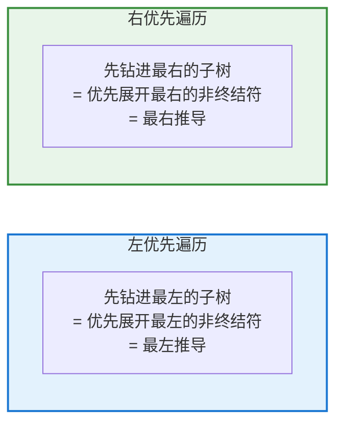
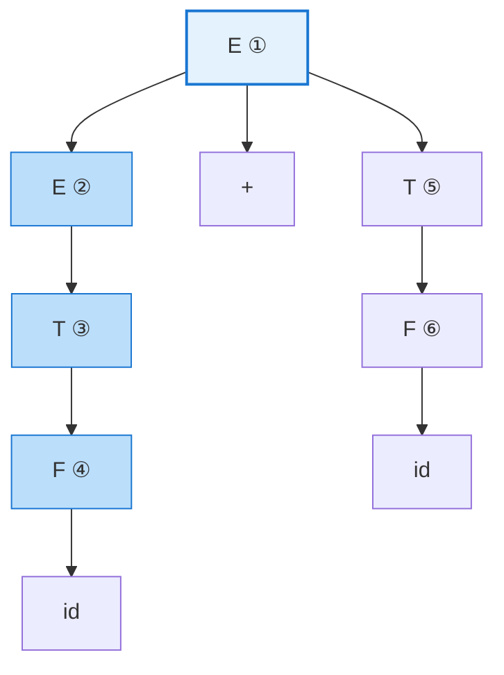
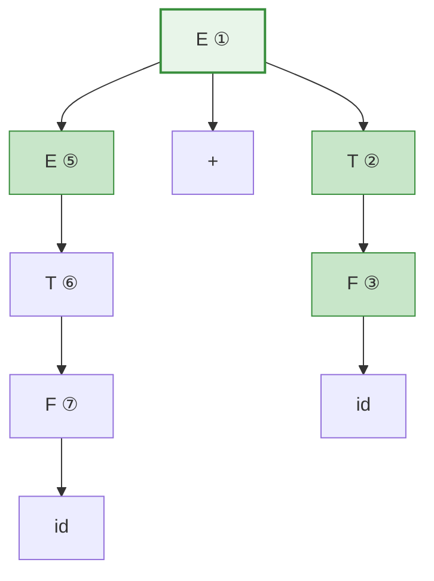
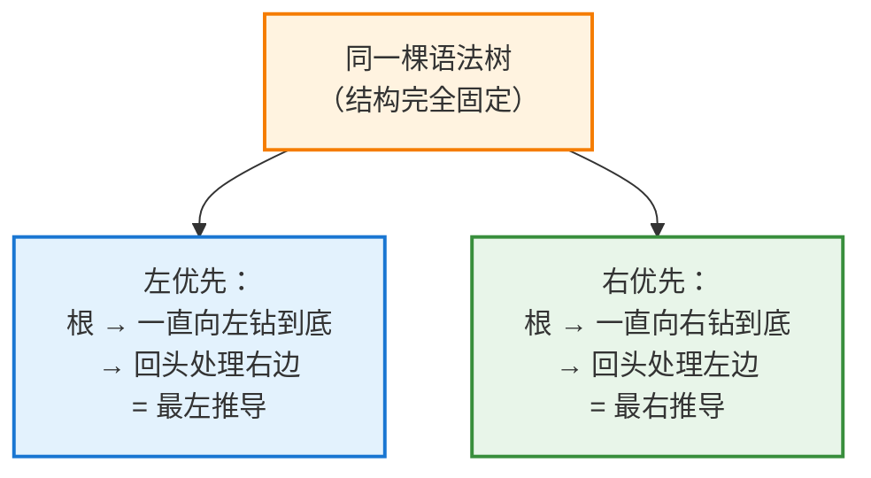

# 左优先遍历与右优先遍历：最左/最右推导的几何本质

> 在编译原理中，我们常说"最左推导是对语法树的左优先遍历，最右推导是右优先遍历"。这个说法背后隐藏着**推导**与**树遍历**之间深刻的对应关系。本文将把这层关系彻底讲透，揭示**为什么"每次替换最左（最右）非终结符"，在几何上就等价于"按某种顺序遍历一棵树"**。

---

## 摘要

**最左推导**与**最右推导**，是语法分析中两种固定顺序的推导方式。它们与语法树之间存在一一对应关系，而这种对应关系有一个直观的几何解释：**推导的每一步"选择展开哪个非终结符"，本质上就是"决定先访问树的哪个子结构"**。本文从"深度优先"这一共同前提出发，分别剖析**左优先遍历（对应最左推导）**与**右优先遍历（对应最右推导）**，并论证"遍历路径唯一"如何导致"推导唯一"——这正是"树 ↔ 推导一一对应"的几何本质。

---

## 1. 共同前提：深度优先

遍历一棵树有两个大方向：

- **广度优先（BFS）**：一层一层横着扫；
- **深度优先（DFS）**：先顺着一条路径往深处钻到底，走不动了再回头。

**最左推导与最右推导都属于深度优先。** 原因在于：推导总是"一路把某个非终结符展开到终结符为止"，而不是"把所有非终结符先展开一层再说"。

> **对应关系**：推导的"深度优先"特性体现在——展开一个非终结符后，会**继续深入它展开出的子结构**，而不是跳去处理旁边的兄弟节点。

深度优先内部还要区分"先访问哪个孩子"，这就引出了本文的主角——**左优先 vs 右优先**。

---

## 2. 左优先遍历：对应最左推导

### 2.1 规则

访问一个节点时，**先递归遍历它最左边的孩子，再依次向右**。用在推导上，就是"**永远先展开当前最靠左的、尚未展开的非终结符**"。

### 2.2 实例演示

取文法与句子 `id + id`：

$$
E \rightarrow E + T \mid T \qquad T \rightarrow F \qquad F \rightarrow \mathbf{id}
$$

对应的语法树（圈中数字 = 左优先遍历的**访问/展开顺序**）：

**遍历路径的直觉**：从根 E① 出发，**一头扎向最左的子树**——E② → T③ → F④，钻到 `id` 见底；然后回头，处理右边还没展开的 T⑤ → F⑥。

访问顺序 ①②③④⑤⑥，正好就是最左推导的每一步：

$$
E \Rightarrow E{+}T \Rightarrow T{+}T \Rightarrow F{+}T \Rightarrow \mathbf{id}{+}T \Rightarrow \mathbf{id}{+}F \Rightarrow \mathbf{id}{+}\mathbf{id}
$$

> **关键观察**：每一步，"当前最左的未展开非终结符"在树上是**唯一确定**的——因为树的形状固定、孩子的左右次序固定。所以左优先遍历路径唯一，最左推导也就唯一。

---

## 3. 右优先遍历：对应最右推导

### 3.1 规则

访问一个节点时，**先递归遍历它最右边的孩子，再依次向左**。用在推导上，就是"**永远先展开当前最靠右的非终结符**"。

### 3.2 同一棵树，换成右优先

还是上面那棵树，但圈中数字改成**右优先遍历顺序**：

**遍历路径的直觉**：从根 E① 出发，**先扎向最右的子树**——T② → F③，钻到右边的 `id`；再回头处理左边的 E⑤ → T⑥ → F⑦。

对应的最右推导：

$$
E \Rightarrow E{+}T \Rightarrow E{+}F \Rightarrow E{+}\mathbf{id} \Rightarrow T{+}\mathbf{id} \Rightarrow F{+}\mathbf{id} \Rightarrow \mathbf{id}{+}\mathbf{id}
$$

---

## 4. 两者对照：同一棵树，两种"钻法"

理解的关键在于——**树本身没变，变的只是"先钻哪边"**：

| 对比项         | 左优先遍历          | 右优先遍历           |
| ----------- | -------------- | --------------- |
| **访问孩子的顺序** | 从最左孩子开始向右      | 从最右孩子开始向左       |
| **在推导中的表现** | 每步展开最左非终结符     | 每步展开最右非终结符      |
| **对应的推导**   | 最左推导（leftmost） | 最右推导（rightmost） |
| **驱动的解析器**  | 自顶向下（LL、递归下降）  | 自底向上（LR，逆序）     |
| **路径是否唯一**  | 唯一（树结构固定）      | 唯一（树结构固定）       |

---

## 5. 为什么"遍历唯一" ⟹ "推导唯一"

这正是"树 ↔ 推导一一对应"的几何解释。核心逻辑只有一句话：

> **树的形状是固定的、孩子的左右次序是固定的，所以无论左优先还是右优先，"下一个该访问谁"在每一时刻都被唯一决定，没有任何选择余地。**

这就是为什么"树 → 最左推导"和"树 → 最右推导"都是**一对一**的——遍历规则一旦固定（左优先或右优先），在一棵确定的树上就只能走出一条确定的路径。

---

## 6. 一个容易混淆的澄清

需要区分几个相关但不同的概念，避免误解：

- **左优先 / 右优先 DFS**：指"先递归进入哪个孩子"，描述的是**展开节点的方向**，直接对应推导；
- **前序 / 中序 / 后序遍历（pre/in/post-order）**：描述的是"在递归过程中，何时**输出/记录**当前节点"——是访问时机的问题。

两者是不同维度。更准确地说，"最左推导 = 左优先先序遍历"意味着：**按左优先的方向做深度优先展开，每到一个节点就先记录它的展开动作（先序）**。

在实践理解上，你只需抓住核心直觉即可：**最左推导 = 优先往左钻，最右推导 = 优先往右钻。**

---

## 7. 结论

本文从遍历的角度重新审视了最左/最右推导，核心结论如下：

- **深度优先是共同前提**：最左/最右推导都是"一路展开到底再回头"，属于深度优先，而非逐层展开。

- **左优先遍历 = 最左推导**：访问节点时先钻最左的孩子，翻译成推导即"每步展开最左的非终结符"。它驱动了**自顶向下解析器**（LL、递归下降）。

- **右优先遍历 = 最右推导**：访问节点时先钻最右的孩子，即"每步展开最右的非终结符"。它的**逆序**驱动了**自底向上解析器**（LR 家族的归约顺序）。

- **同一棵树，两种钻法**：树结构完全不变，区别只在"先往哪边钻"。

- **遍历唯一 ⟹ 推导唯一**：因为树的形状与孩子次序都固定，遍历规则一旦定死（左或右优先），在确定的树上就只有一条确定路径——这正是"树 ↔ 最左/最右推导一一对应"的**几何本质**。

**一句话记忆**：

> 把语法树想象成一座迷宫，最左推导就是"每个岔路口都先走最左边那条道"，最右推导就是"每个岔路口都先走最右边那条道"——路线一旦定死，走法就唯一，这就是推导唯一性的来源。

---

> 这个"遍历"视角不仅优雅，更有实用价值：它解释了为什么自顶向下解析器（模拟左优先遍历）能自然地从左到右生成最左推导，也解释了为什么自底向上解析器的归约序列恰是最右推导的逆序。理解了这一层几何直觉，语法分析的诸多概念便会豁然贯通。
