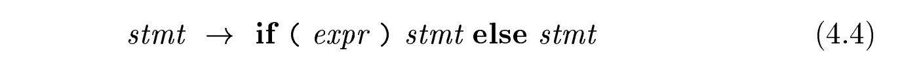
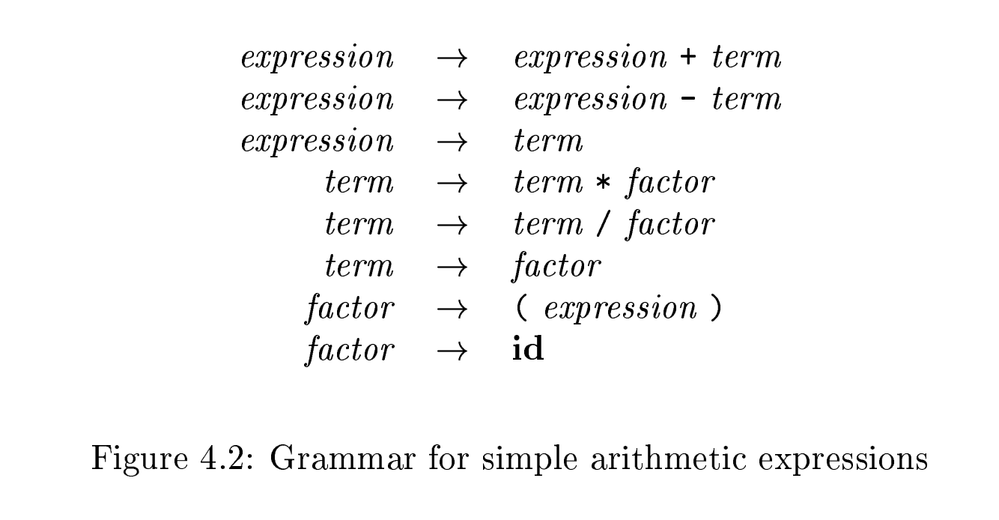
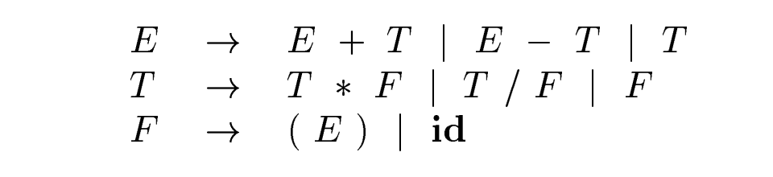
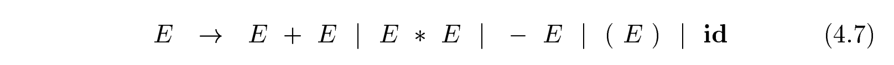
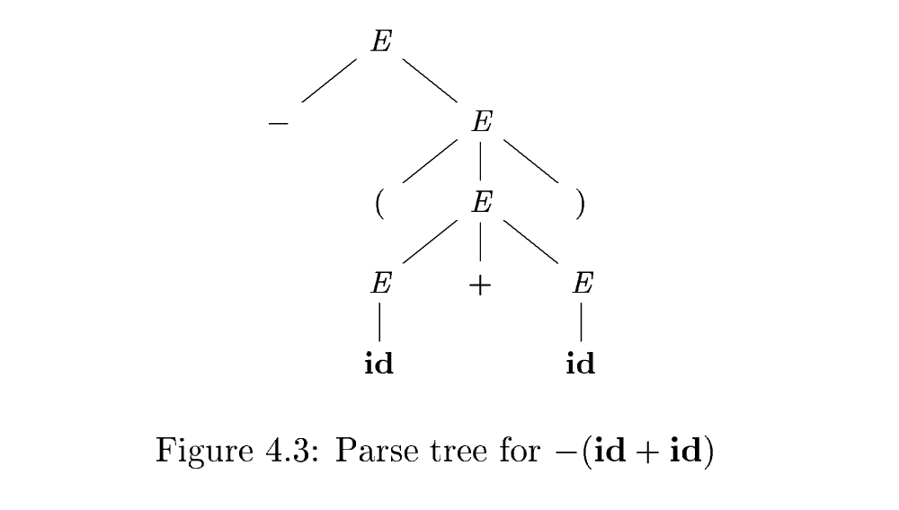

# 4.2 Context-Free Grammars

Grammars were introduced in Section 2.2 to systematically describe the syntaxof programming language constructs like **expressions** and **statements**. Usinga syntactic variable `stmt` to denote **statements** and variable `expr` to denote **expressions**, the production



species the structure of this form of **conditional statement**. Other **productions** then dene precisely what an `expr` is and what else a `stmt` can be.

This section reviews the definition of a **context-free grammar** and introduces terminology for talking about parsing. In particular, the notion of **derivations** is very helpful for discussing the order in which **productions** are applied during parsing.

## 4.2.1 The Formal Definition of a Context-Free Grammar

From Section 2.2, a **context-free grammar** (grammar for short) consists of **terminals**, **nonterminals**, a **start symbol**, and **productions**.

### Terminals

***Terminals*** are the basic symbols from which strings are formed. The term "**token name**" is a synonym for "terminal" and frequently we will use the word "**token**" for **terminal** when it is clear that we are talking about just the token name. We assume that the terminals are the first components of the tokens output by the **lexical analyzer**. In (4.4), the terminals are the keywords `if` and `else` and the symbols `(` and `)`.

### Nonterminals

***Nonterminals*** are **syntactic variables** that denote sets of strings. In (4.4), `stmt` and `expr` are **nonterminals**. The sets of strings denoted by **nonterminals** help define the language generated by the grammar. **Nonterminals** impose a hierarchical structure on the language that is key to **syntax analysis** and translation.

> 翻译: **非终结符（Nonterminals）**是用来表示字符串集合的**语法变量**。在 (4.4) 式中，`stmt`与`expr`就是**非终结符**。由非终结符所代表的字符串集合，用于定义该文法所生成的语言。非终结符为语言赋予了层次化结构，这对于语法分析与翻译至关重要。

### Start symbol

In a grammar, one nonterminal is distinguished as the ***start symbol***, and the set of strings it denotes is the language generated by the grammar. Conventionally, the productions for the ***start symbol*** are listed first.

### Productions

The **productions** of a grammar specify the manner in which the **terminals** and **nonterminals** can be combined to form strings. Each production consists of:

(a) A **nonterminal** called the ***head*** or ***left side*** of the **production**; this production defines some of the strings denoted by the **head**.

(b) The symbo $\to$. Sometimes `::=` has been used in place of the arrow.

(c) A ***body*** or ***right side*** consisting of zero or more **terminals** and **nonterminals**. The components of the body describe one way in which strings of the nonterminal at the head can be constructed.

### Example 4.5

The grammar in Fig. 4.2 defines simple arithmetic expressions. In this grammar, the **terminal symbols** are

```
id + - * / ( )
```

The **nonterminal symbols** are ***expression***, ***term*** and ***factor***, and ***expression*** is the **start symbol**



## 4.2.2 Notational Conventions(文法记法约)

To avoid always having to state that "these are the terminals," "these are the nonterminals," and so on, the following **notational conventions** for grammars will be used throughout the **remainder** of this book.

> 翻译: 为了不必每次都说明 “这些是终结符”、“这些是非终结符” 这类信息，本书后续章节将统一使用下述**文法记法约定**。

### These symbols are terminals

(a) **Lowercase letters** early in the alphabet, such as `a, b, c`. 

(b) **Operator symbols** such as `+`, `*`, and so on. 

(c) **Punctuation symbols** such as **parentheses**, comma, and so on. 

> 翻译: 诸如**圆括号**、逗号等标点符号

(d) The digits 0, 1,...9. 

(e) **Boldface** strings such as **id** or **if**, each of which represents a single **terminal symbol**. 

### These symbols are nonterminals

(a) Uppercase letters early in the alphabet, such as $A$, $B$, $C$.
(b) The letter $S$, which, when it appears, is usually the **start symbol**.
(c) Lowercase, italic names such as $expr$ or $stmt$.
(d) When discussing programming constructs, uppercase letters may be used to represent nonterminals for the constructs. For example, nonterminals for expressions, terms, and factors are often represented by $E$, $T$, and $F$, respectively.

### Grammar symbols

Uppercase letters late in the alphabet, such as X, Y, Z, represent ***grammar symbols***; that is, either **nonterminals** or **terminals**. 

### Strings of terminals

Lowercase letters late in the alphabet, chiefly u, v, ... z, represent (possibly empty) strings of terminals. 

### Strings of grammar symbols

Lowercase Greek letters $\alpha$, $\beta$,$\gamma$,  for example, represent (possibly empty) strings of grammar symbols. Thus, a generic production can be written as $A \to \alpha$, where A is the **head** and $\alpha$ the body.

### A set of productions

A set of productions $A \to \alpha_1$, $A \to \alpha_2$,...,$A \to \alpha_k$, with a common head `A` (call them ***A-productions***), may be written $A \to \alpha_1 | \alpha_2 | \dots | \alpha_k$ . Call $\alpha_1 \alpha_2 \dots \alpha_k$ the alternatives  for `A`.

### Example 4.6

Example 4.6 : Using these conventions, the grammar of Example 4.5 can be rewritten concisely as



The **notational conventions** tell us that `E`, `T`, and `F` are nonterminals, with `E` the start symbol. The remaining symbols are terminals

## 4.2.3 Derivations(推导)

The construction of a **parse tree** can be made precise by taking a **derivational view**(推导视角), in which **productions** are treated as **rewriting rules**. Beginning with the **start symbol**, each rewriting step replaces a **nonterminal** by the body of one of its productions. This **derivational view**(推导视角) corresponds to the **top-down** construction of a **parse tree**, but the precision afforded by **derivations** will be especially helpful when **bottom-up** parsing is discussed. As we shall see, **bottom-up parsing** is related to a class of derivations known as "**rightmost**" derivations, in which the **rightmost nonterminal** is rewritten at each step.

> 翻译: 采用**推导视角**可以对语法树的构造给出精确定义；在该视角下，**产生式**被视作**重写规则**。从**开始符号**出发，每一步重写都会把一个**非终结符**替换为它某条产生式的右部。这种推导视角对应语法树的**自顶向下**构造方式，不过，**推导**所带来的严谨性，在后续讨论**自底向上语法分析**时将尤为有用。我们将会看到，**自底向上语法分析**和一类叫作**最右推导**的推导密切相关，最右推导的每一步都对**最右侧非终结符**做重写。
> 
> NOTE: I still do not understand why bottom-up parsing corresponds "**rightmost**" derivations. $\Rightarrow$

### Example

For example, consider the following grammar, with a single nonterminal `E`, which adds a production $E \to - E$ to the grammar (4.3)



The production $E \to -E$ signifies(表示) that if `E` denotes an expression, the  `-E` must also denote an expression. The **replacement**(其实就是前面提到的rewrite) of a single `E` by `-E` will be described by writing

$$
E \Rightarrow -E
$$

which is read, "E derives -E."  The production $E \to ( E )$ can be applied to replace any instance of `E` in any string of grammar symbols by `(E)`, e.g., $E * E \Rightarrow (E) * E$ or $E * E \Rightarrow E * (E)$.  We can take a single `E` and repeatedly apply productions in any order to get a sequence of **replacements**. For example

$$
E \Rightarrow -E \Rightarrow -(E) \Rightarrow -(id)
$$

We call such a sequence of replacements a ***derivation***(推导) of `-(id)` from `E`. This derivation provides a proof that the string `-(id)` is one particular ***instance***(实例) of an expression. 

### General definition of derivation

For a general definition of **derivation**, consider a nonterminal `A` in the middle of a sequence of **grammar symbols**, as in $\alpha A \beta$, where $\alpha$ and $\beta$ are  are arbitrary strings of **grammar symbol**. Suppose $A \to \gamma$  is a **production**. Then, we write $\alpha A \beta \Rightarrow \alpha \gamma \beta$. The symbol $\Rightarrow$ means, "derives in one step." When a sequence of derivation steps $\alpha_1 \Rightarrow \alpha_2 \Rightarrow \dots \Rightarrow \alpha_n$ rewrites $\alpha_1$ to $\alpha_n$, we say $\alpha_1$ ***derives*** $\alpha_n$. Often, we wish to say, "derives in zero or more steps." For this purpose, we can use the symbol $S \xRightarrow {\text{*}}$.  Thus,

1、$\alpha \xRightarrow {\text{*}} \alpha$ , for any string $\alpha$, and

2、If $\alpha \xRightarrow {\text{*}} \beta$ and  $\beta \Rightarrow \gamma $ , then $\alpha \xRightarrow {\text{*}} \gamma$, 

Likewise, $\xRightarrow {\text{+}}$ means, "derives in one or more steps."

### sentential form&sentence&language&context‑free language

If $S \stackrel{*}{\Rightarrow} \alpha$, where $S$ is the **start symbol** of a grammar $G$, we say that $\alpha$ is a ***sentential form*** of $G$. Note that a **sentential form** may contain both terminals and nonterminals, and may be empty. 

A ***sentence*** of $G$ is a **sentential form** with no nonterminals. The **language generated by a grammar** is its set of sentences.

Thus, a string of terminals $w$ is in $L(G)$, the language generated by $G$, if and only if $w$ is a sentence of $G$ (or $S \stackrel{*}{\Rightarrow} w$). A language that can be generated by a grammar is said to be a **context‑free language**. 

If two grammars generate the same language, the grammars are said to be ***equivalent***.

> 翻译: 若 $S \stackrel{*}{\Rightarrow} \alpha$（$S$ 是文法 $G$ 的开始符号），则称 $\alpha$ 是 $G$ 的**句型**。注意：句型中可以同时包含终结符与非终结符，也可以是空串。
> 
> $G$ 的**句子**是不含任何非终结符的句型。文法所产生的**语言**就是它全部句子的集合。
> 
> 因此，终结符串 $w$ 属于 $L(G)$（文法 $G$ 生成的语言），当且仅当 $w$ 是 $G$ 的一个句子（即 $S \stackrel{*}{\Rightarrow} w$）。能够由某一文法产生的语言称为**上下文无关语言**。
> 
> 如果两个文法生成完全相同的语言，则称这两个文法**等价**。

#### example

The string $-(\mathbf{id}+\mathbf{id})$ is a sentence of grammar (4.7) because there is a derivation

$$
E \Rightarrow -E \Rightarrow -(E) \Rightarrow -(E+E) \Rightarrow -(\mathbf{id}+E) \Rightarrow -(\mathbf{id}+\mathbf{id}) \tag{4.8}
$$

The strings $E$, $-E$, $-(E)$, $\dots$, $-(\mathbf{id}+\mathbf{id})$ are all **sentential forms** of this grammar. We write $E \stackrel{*}{\Rightarrow} -(\mathbf{id}+\mathbf{id})$ to indicate that $-(\mathbf{id}+\mathbf{id})$ can be derived from $E$.

At each step in a **derivation**, there are two choices to be made. We need to choose which **nonterminal** to replace, and having made this choice, we must pick a **production** with that **nonterminal** as **head**. For example, the following alternative derivation of $-(\mathbf{id}+\mathbf{id})$ differs from derivation (4.8) in the last two steps:

$$
E \Rightarrow -E \Rightarrow -(E) \Rightarrow -(E+E) \Rightarrow -(E+\mathbf{id}) \Rightarrow -(\mathbf{id}+\mathbf{id}) \tag{4.9}
$$

Each nonterminal is replaced by the same body in the two derivations, but the order of replacements is different.

### leftmost derivations&rightmost derivations

> 翻译: 为理解语法分析器的工作原理，我们研究每一步按特定规则选择待替换非终结符的推导：
> 
> 1. **最左推导**：总是选择句型中最左边的非终结符进行替换。若一步推导 $\alpha\Rightarrow\beta$ 替换的是 $\alpha$ 的最左非终结符，记作 $\alpha \underset{lm}{\Rightarrow}\beta$。
> 2. **最右推导**：总是选择句型中最右边的非终结符进行替换，记作 $\alpha \underset{rm}{\Rightarrow}\beta$。

To understand how parsers work, we shall consider derivations in which the nonterminal to be replaced at each step is chosen as follows:

1. In **leftmost derivations**, the leftmost nonterminal in each sentential(句型) is always chosen. If $\alpha \Rightarrow \beta$ is a step in which the leftmost nonterminal in $\alpha$ is replaced, we write $\alpha \underset{lm}{\Rightarrow} \beta$.

2. In **rightmost derivations**, the rightmost nonterminal is always chosen; we write $\alpha \underset{rm}{\Rightarrow} \beta$ in this case.

Derivation (4.8) is leftmost, so it can be rewritten as

$$
E \underset{lm}{\Rightarrow} -E \underset{lm}{\Rightarrow} -(E) \underset{lm}{\Rightarrow} -(E+E) \underset{lm}{\Rightarrow} -(\mathbf{id}+E) \underset{lm}{\Rightarrow} -(\mathbf{id}+\mathbf{id})
$$

Note that (4.9) is a rightmost derivation.

### left‑sentential form

Using our notational conventions, every leftmost step can be written as
$wA\gamma \underset{lm}{\Rightarrow} w\delta\gamma$, where $w$ consists of terminals only, $A \to \delta$ is the production applied, and $\gamma$ is a string of grammar symbols. To emphasize that $\alpha$ derives $\beta$ by a leftmost derivation, we write $\alpha \overset{*}{\underset{lm}{\Rightarrow}} \beta$. If $S \overset{*}{\underset{lm}{\Rightarrow}} \alpha$, then we say that $\alpha$ is a **left‑sentential form** of the grammar at hand.

Analogous definitions hold for rightmost derivations. Rightmost derivations are sometimes called **canonical derivations**.

> 翻译:
> 
> 根据我们的记号约定，每一步最左推导都可以写成：
> $wA\gamma \underset{lm}{\Rightarrow} w\delta\gamma$
> 其中 $w$ 仅由终结符组成，$A \to \delta$ 是当前使用的产生式，$\gamma$ 是文法符号串。
> 为强调 $\alpha$ 通过**最左推导**推导出 $\beta$，记作 $\alpha \overset{*}{\underset{lm}{\Rightarrow}} \beta$。
> 若 $S \overset{*}{\underset{lm}{\Rightarrow}} \alpha$，则称 $\alpha$ 是该文法的**左句型**。
> 
> 最右推导有一套与之完全对应的定义。最右推导有时也称为**规范推导**。

## 4.2.4 Parse Trees and Derivations

A **parse tree** is a graphical representation of a **derivation** that filters out(忽略) the order in which **productions** are applied to replace nonterminals. Each **interior node** of a **parse tree** represents the application of a production. The **interior node** is labeled with the nonterminal $A$ in the head of the production; the children of the node are labeled, from left to right, by the symbols in the body of the production by which this $A$ was replaced during the derivation.

> 翻译: 语法分析树是推导的图形化表示，它忽略掉产生式替换非终结符的先后顺序。语法分析树的每一个内部节点代表一次产生式的使用。内部节点标记该产生式左部的非终结符 A；该节点的子节点从左到右，标记为推导过程中替换 A 的那条产生式右部的各个符号。


For example, the parse tree for $-(\mathbf{id}+\mathbf{id})$ in Fig. 4.3, results from the derivation (4.8) as well as derivation (4.9).





The leaves of a **parse tree** are labeled by nonterminals or terminals and, read from left to right, constitute a **sentential form**, called the *yield* or *frontier* of the tree.


> 翻译: 语法分析树的叶子节点标记为非终结符或者终结符，将叶子从左至右读出，就得到一个句型，称为这棵树的**产物（yield）**，也叫**边界（frontier）**。


To see the relationship between **derivations** and **parse trees**, consider any derivation $\alpha_1 \Rightarrow \alpha_2 \Rightarrow \dots \Rightarrow \alpha_n$, where $\alpha_1$ is a single nonterminal $A$. For each sentential form $\alpha_i$ in the derivation, we can construct a **parse tree** whose yield is $\alpha_i$. The process is an induction on $i$.


> 翻译: 为看清推导与语法树之间的关系，考察任意推导 $\alpha_1 \Rightarrow \alpha_2 \Rightarrow \dots \Rightarrow \alpha_n$，其中 $\alpha_1$ 是单个非终结符 $A$。对推导中每一个句型 $\alpha_i$，都可以构造一棵产物为 $\alpha_i$ 的语法分析树。该过程对 $i$ 做数学归纳。


**BASIS**: The tree for $\alpha_1 = A$ is a single node labeled $A$.

**INDUCTION**: Suppose we already have constructed a parse tree with yield $\alpha_{i-1}=X_1X_2\cdots X_k$ (note that according to our notational conventions, each grammar symbol $X_i$ is either a nonterminal or a terminal). Suppose $\alpha_i$ is derived from $\alpha_{i-1}$ by replacing $X_j$, a nonterminal, by $\beta=Y_1Y_2\cdots Y_m$. That is, at the $i$th step of the derivation, production $X_j \to \beta$ is applied to $\alpha_{i-1}$ to derive $\alpha_i = X_1X_2\cdots X_{j-1}\beta X_{j+1}\cdots X_k$.
To model this step of the derivation, find the $j$th non‑$\epsilon$ leaf from the left in the current parse tree. This leaf is labeled $X_j$. Give this leaf $m$ children, labeled $Y_1,Y_2,\dots,Y_m$, from the left. As a special case, if $m=0$, then $\beta=\epsilon$, and we give the $j$th leaf one child labeled $\epsilon$.
**Example 4.10**: The sequence of parse trees constructed from the derivation (4.8) is shown in Fig. 4.4. In the first step of the derivation, $E \Rightarrow -E$. To model this step, add two children, labeled $-$ and $E$, to the root $E$ of the initial tree. The result is the second tree.
In the second step of the derivation, $-E \Rightarrow -(E)$. Consequently, add three children, labeled $(,E,\text{ and })$, to the leaf labeled $E$ of the second tree, to obtain the third tree with yield $-(E)$. Continuing in this fashion we obtain the complete parse tree as the sixth tree. $\square$
Since a parse tree ignores variations in the order in which symbols in sentential forms are replaced, there is a many‑to‑one relationship between derivations and parse trees. For example, both derivations (4.8) and (4.9), are associated with the same final parse tree of Fig. 4.4.
In what follows, we shall frequently parse by producing a leftmost or a rightmost derivation, since there is a one‑to‑one relationship between parse trees and either leftmost or rightmost derivations. Both leftmost and rightmost derivations pick a particular order for replacing symbols in sentential forms, so they too filter out variations in the order. It is not hard to show that every parse tree has associated with it a unique leftmost and a unique rightmost derivation.


## 4.2.7 Context-Free Grammars Versus Regular Expressions

> NOTE: 
> 
> 下面这些内容是在阅读 wikipedia [Comparison of parser generators](https://en.wikipedia.org/wiki/Comparison_of_parser_generators) 中 [Regular languages](https://en.wikipedia.org/wiki/Comparison_of_parser_generators#Regular_languages) 章节时，发现这一段的内容正好和本节内容相关，可以作为一个补充，并且它的讲解也比较易懂：
> 
> > [Regular languages](https://en.wikipedia.org/wiki/Regular_language) are a category of languages (sometimes termed [Chomsky Type 3](https://en.wikipedia.org/wiki/Chomsky_hierarchy)) which can be matched by a state machine (more specifically, by a [deterministic finite automaton](https://en.wikipedia.org/wiki/Deterministic_finite_automaton) or a [nondeterministic finite automaton](https://en.wikipedia.org/wiki/Nondeterministic_finite_automaton)) constructed from a [regular expression](https://en.wikipedia.org/wiki/Regular_expression). In particular, a regular language can match constructs like "A follows B", "Either A or B", "A, followed by zero or more instances of B", but cannot match constructs which require consistency between non-adjacent elements, such as "some instances of A followed by the same number of instances of B", and also cannot express the concept of recursive "nesting" ("every A is eventually followed by a matching B"). A classic example of a problem which a regular grammar cannot handle is the question of whether a given string contains correctly-nested parentheses. (This is typically handled by a Chomsky Type 2 grammar, also termed a [context-free grammar](https://en.wikipedia.org/wiki/Context-free_grammar).)
> 
> regular expression属于[Regular languages](https://en.wikipedia.org/wiki/Regular_language)，使用[regular grammar](https://en.wikipedia.org/wiki/Regular_grammar)，按照[Chomsky hierarchy](https://en.wikipedia.org/wiki/Chomsky_hierarchy):
> 
> - [regular grammar](https://en.wikipedia.org/wiki/Regular_grammar)属于[Type-3 grammars](https://en.wikipedia.org/wiki/Chomsky_hierarchy#Type-3_grammars)
> - [context-free grammar](https://en.wikipedia.org/wiki/Context-free_grammar)属于[Type-2 grammars](https://en.wikipedia.org/wiki/Chomsky_hierarchy#Type-2_grammars)
> 
> [](https://en.wikipedia.org/wiki/File:Chomsky-hierarchy.svg)
> 
> Every **regular language** is **context-free**, every **context-free** language is **context-sensitive**, every **context-sensitive language** is **recursive** and every **recursive language** is recursively enumerable. These are all proper inclusions, meaning that there exist recursively enumerable languages that are not context-sensitive, context-sensitive languages that are not context-free and context-free languages that are not regular.
