# 4.2 Context-Free Grammars

Grammars were introduced in Section 2.2 to systematically describe the syntaxof programming language constructs like **expressions** and **statements**. Usinga syntactic variable `stmt` to denote **statements** and variable `expr` to denote **expressions**, the production


species the structure of this form of **conditional statement**. Other **productions** then dene precisely what an `expr` is and what else a `stmt` can be.

This section reviews the definition of a **context-free grammar** and introduces terminology for talking about parsing. In particular, the notion of **derivations** is very helpful for discussing the order in which **productions** are applied during parsing.

## 4.2.1 The Formal Definition of a Context-Free Grammar

From Section 2.2, a **context-free grammar** (grammar for short) consists of **terminals**, **nonterminals**, a **start symbol**, and **productions**.

### Terminals

***Terminals*** are the basic symbols from which strings are formed. The term "**token name**" is a synonym for "terminal" and frequently we will use the word "**token**" for **terminal** when it is clear that we are talking about just the token name. We assume that the terminals are the first components of the tokens output by the **lexical analyzer**. In (4.4), the terminals are the keywords `if` and `else` and the symbols `(` and `)`.

### Nonterminals

***Nonterminals*** are **syntactic variables** that denote sets of strings. In (4.4), `stmt` and `expr` are **nonterminals**. The sets of strings denoted by **nonterminals** help define the language generated by the grammar. **Nonterminals** impose a hierarchical structure on the language that is key to **syntax analysis** and translation.

> 翻译: **非终结符（Nonterminals）**是用来表示字符串集合的**语法变量**。在 (4.4) 式中，`stmt`与`expr`就是**非终结符**。由非终结符所代表的字符串集合，用于定义该文法所生成的语言。非终结符为语言赋予了层次化结构，这对于语法分析与翻译至关重要。

### Start symbol

In a grammar, one nonterminal is distinguished as the ***start symbol***, and the set of strings it denotes is the language generated by the grammar. Conventionally, the productions for the ***start symbol*** are listed first.

### Productions

The **productions** of a grammar specify the manner in which the **terminals** and **nonterminals** can be combined to form strings. Each production consists of:

(a) A **nonterminal** called the ***head*** or ***left side*** of the **production**; this production defines some of the strings denoted by the **head**.

(b) The symbo $\to$. Sometimes `::=` has been used in place of the arrow.

(c) A ***body*** or ***right side*** consisting of zero or more **terminals** and **nonterminals**. The components of the body describe one way in which strings of the nonterminal at the head can be constructed.

### Example 4.5

The grammar in Fig. 4.2 defines simple arithmetic expressions. In this grammar, the **terminal symbols** are

```
id + - * / ( )
```

The **nonterminal symbols** are ***expression***, ***term*** and ***factor***, and ***expression*** is the **start symbol**


## 4.2.2 Notational Conventions(文法记法约)

To avoid always having to state that "these are the terminals," "these are the nonterminals," and so on, the following **notational conventions** for grammars will be used throughout the **remainder** of this book.

> 翻译: 为了不必每次都说明 “这些是终结符”、“这些是非终结符” 这类信息，本书后续章节将统一使用下述**文法记法约定**。

### These symbols are terminals

(a) **Lowercase letters** early in the alphabet, such as `a, b, c`. 

(b) **Operator symbols** such as `+`, `*`, and so on. 

(c) **Punctuation symbols** such as **parentheses**, comma, and so on. 

> 翻译: 诸如**圆括号**、逗号等标点符号

(d) The digits 0, 1,...9. 

(e) **Boldface** strings such as **id** or **if**, each of which represents a single **terminal symbol**. 

### These symbols are nonterminals

(a) Uppercase letters early in the alphabet, such as $A$, $B$, $C$.
(b) The letter $S$, which, when it appears, is usually the **start symbol**.
(c) Lowercase, italic names such as $expr$ or $stmt$.
(d) When discussing programming constructs, uppercase letters may be used to represent nonterminals for the constructs. For example, nonterminals for expressions, terms, and factors are often represented by $E$, $T$, and $F$, respectively.

### Grammar symbols

Uppercase letters late in the alphabet, such as X, Y, Z, represent ***grammar symbols***; that is, either **nonterminals** or **terminals**. 

### Strings of terminals

Lowercase letters late in the alphabet, chiefly u, v, ... z, represent (possibly empty) strings of terminals. 

### Strings of grammar symbols

Lowercase Greek letters $\alpha$, $\beta$,$\gamma$,  for example, represent (possibly empty) strings of grammar symbols. Thus, a generic production can be written as $A \to \alpha$, where A is the **head** and $\alpha$ the body.

### A set of productions

A set of productions $A \to \alpha_1$, $A \to \alpha_2$,...,$A \to \alpha_k$, with a common head `A` (call them ***A-productions***), may be written $A \to \alpha_1 | \alpha_2 | \dots | \alpha_k$ . Call $\alpha_1 \alpha_2 \dots \alpha_k$ the alternatives  for `A`.

### Example 4.6

Example 4.6 : Using these conventions, the grammar of Example 4.5 can be rewritten concisely as


The **notational conventions** tell us that `E`, `T`, and `F` are nonterminals, with `E` the start symbol. The remaining symbols are terminals

## 4.2.3 Derivations(推导)

The construction of a **parse tree** can be made precise by taking a **derivational view**(推导视角), in which **productions** are treated as **rewriting rules**. Beginning with the **start symbol**, each rewriting step replaces a **nonterminal** by the body of one of its productions. This **derivational view**(推导视角) corresponds to the **top-down** construction of a **parse tree**, but the precision afforded by **derivations** will be especially helpful when **bottom-up** parsing is discussed. As we shall see, **bottom-up parsing** is related to a class of derivations known as "**rightmost**" derivations, in which the **rightmost nonterminal** is rewritten at each step.

> 翻译: 采用**推导视角**可以对语法树的构造给出精确定义；在该视角下，**产生式**被视作**重写规则**。从**开始符号**出发，每一步重写都会把一个**非终结符**替换为它某条产生式的右部。这种推导视角对应语法树的**自顶向下**构造方式，不过，**推导**所带来的严谨性，在后续讨论**自底向上语法分析**时将尤为有用。我们将会看到，**自底向上语法分析**和一类叫作**最右推导**的推导密切相关，最右推导的每一步都对**最右侧非终结符**做重写。
> 
> NOTE: I still do not understand why bottom-up parsing corresponds "**rightmost**" derivations. $\Rightarrow$

### Example

For example, consider the following grammar, with a single nonterminal `E`, which adds a production $E \to - E$ to the grammar (4.3)


The production $E \to -E$ signifies(表示) that if `E` denotes an expression, the  `-E` must also denote an expression. The **replacement**(其实就是前面提到的rewrite) of a single `E` by `-E` will be described by writing

$$
E \Rightarrow -E
$$

which is read, "E derives -E."  The production $E \to ( E )$ can be applied to replace any instance of `E` in any string of grammar symbols by `(E)`, e.g., $E * E \Rightarrow (E) * E$ or $E * E \Rightarrow E * (E)$.  We can take a single `E` and repeatedly apply productions in any order to get a sequence of **replacements**. For example

$$
E \Rightarrow -E \Rightarrow -(E) \Rightarrow -(id)
$$

We call such a sequence of replacements a ***derivation***(推导) of `-(id)` from `E`. This derivation provides a proof that the string `-(id)` is one particular ***instance***(实例) of an expression. 

### General definition of derivation

For a general definition of **derivation**, consider a nonterminal `A` in the middle of a sequence of **grammar symbols**, as in $\alpha A \beta$, where $\alpha$ and $\beta$ are  are arbitrary strings of **grammar symbol**. Suppose $A \to \gamma$  is a **production**. Then, we write $\alpha A \beta \Rightarrow \alpha \gamma \beta$. The symbol $\Rightarrow$ means, "derives in one step." When a sequence of derivation steps $\alpha_1 \Rightarrow \alpha_2 \Rightarrow \dots \Rightarrow \alpha_n$ rewrites $\alpha_1$ to $\alpha_n$, we say $\alpha_1$ ***derives*** $\alpha_n$. Often, we wish to say, "derives in zero or more steps." For this purpose, we can use the symbol $S \xRightarrow {\text{*}}$.  Thus,

1、$\alpha \xRightarrow {\text{*}} \alpha$ , for any string $\alpha$, and

2、If $\alpha \xRightarrow {\text{*}} \beta$ and  $\beta \Rightarrow \gamma $ , then $\alpha \xRightarrow {\text{*}} \gamma$, 

Likewise, $\xRightarrow {\text{+}}$ means, "derives in one or more steps."

### sentential form&sentence&language&context‑free language

If $S \stackrel{*}{\Rightarrow} \alpha$, where $S$ is the **start symbol** of a grammar $G$, we say that $\alpha$ is a ***sentential form*** of $G$. Note that a **sentential form** may contain both terminals and nonterminals, and may be empty. 

A ***sentence*** of $G$ is a **sentential form** with no nonterminals. The **language generated by a grammar** is its set of sentences.

Thus, a string of terminals $w$ is in $L(G)$, the language generated by $G$, if and only if $w$ is a sentence of $G$ (or $S \stackrel{*}{\Rightarrow} w$). A language that can be generated by a grammar is said to be a **context‑free language**. 

If two grammars generate the same language, the grammars are said to be ***equivalent***.

> 翻译: 若 $S \stackrel{*}{\Rightarrow} \alpha$（$S$ 是文法 $G$ 的开始符号），则称 $\alpha$ 是 $G$ 的**句型**。注意：句型中可以同时包含终结符与非终结符，也可以是空串。
> 
> $G$ 的**句子**是不含任何非终结符的句型。文法所产生的**语言**就是它全部句子的集合。
> 
> 因此，终结符串 $w$ 属于 $L(G)$（文法 $G$ 生成的语言），当且仅当 $w$ 是 $G$ 的一个句子（即 $S \stackrel{*}{\Rightarrow} w$）。能够由某一文法产生的语言称为**上下文无关语言**。
> 
> 如果两个文法生成完全相同的语言，则称这两个文法**等价**。

#### example

The string $-(\mathbf{id}+\mathbf{id})$ is a sentence of grammar (4.7) because there is a derivation

$$
E \Rightarrow -E \Rightarrow -(E) \Rightarrow -(E+E) \Rightarrow -(\mathbf{id}+E) \Rightarrow -(\mathbf{id}+\mathbf{id}) \tag{4.8}
$$

The strings $E$, $-E$, $-(E)$, $\dots$, $-(\mathbf{id}+\mathbf{id})$ are all **sentential forms** of this grammar. We write $E \stackrel{*}{\Rightarrow} -(\mathbf{id}+\mathbf{id})$ to indicate that $-(\mathbf{id}+\mathbf{id})$ can be derived from $E$.

At each step in a **derivation**, there are two choices to be made. We need to choose which **nonterminal** to replace, and having made this choice, we must pick a **production** with that **nonterminal** as **head**. For example, the following alternative derivation of $-(\mathbf{id}+\mathbf{id})$ differs from derivation (4.8) in the last two steps:

$$
E \Rightarrow -E \Rightarrow -(E) \Rightarrow -(E+E) \Rightarrow -(E+\mathbf{id}) \Rightarrow -(\mathbf{id}+\mathbf{id}) \tag{4.9}
$$

Each nonterminal is replaced by the same body in the two derivations, but the order of replacements is different.

### leftmost derivations&rightmost derivations

> 翻译: 为理解语法分析器的工作原理，我们研究每一步按特定规则选择待替换非终结符的推导：
> 
> 1. **最左推导**：总是选择句型中最左边的非终结符进行替换。若一步推导 $\alpha\Rightarrow\beta$ 替换的是 $\alpha$ 的最左非终结符，记作 $\alpha \underset{lm}{\Rightarrow}\beta$。
> 2. **最右推导**：总是选择句型中最右边的非终结符进行替换，记作 $\alpha \underset{rm}{\Rightarrow}\beta$。

To understand how parsers work, we shall consider derivations in which the nonterminal to be replaced at each step is chosen as follows:

1. In **leftmost derivations**, the **leftmost nonterminal** in each sentential(句型) is always chosen. If $\alpha \Rightarrow \beta$ is a step in which the **leftmost nonterminal** in $\alpha$ is replaced, we write $\alpha \underset{lm}{\Rightarrow} \beta$.

2. In **rightmost derivations**, the **rightmost nonterminal** is always chosen; we write $\alpha \underset{rm}{\Rightarrow} \beta$ in this case.

Derivation (4.8) is leftmost, so it can be rewritten as

$$
E \underset{lm}{\Rightarrow} -E \underset{lm}{\Rightarrow} -(E) \underset{lm}{\Rightarrow} -(E+E) \underset{lm}{\Rightarrow} -(\mathbf{id}+E) \underset{lm}{\Rightarrow} -(\mathbf{id}+\mathbf{id})
$$

Note that (4.9) is a rightmost derivation.

### left‑sentential form

Using our notational conventions, every leftmost step can be written as
$wA\gamma \underset{lm}{\Rightarrow} w\delta\gamma$, where $w$ consists of terminals only, $A \to \delta$ is the production applied, and $\gamma$ is a string of **grammar symbols**. 

> NOTE: 其中 $w$ **只含终结符**——这直接反映了"最左非终结符的左侧已全部定型。

To emphasize that $\alpha$ derives $\beta$ by a leftmost derivation, we write $\alpha \overset{*}{\underset{lm}{\Rightarrow}} \beta$. 

If $S \overset{*}{\underset{lm}{\Rightarrow}} \alpha$, then we say that $\alpha$ is a **left‑sentential form** of the grammar at hand.

> 翻译: 根据我们的记号约定，每一步最左推导都可以写成：
> $wA\gamma \underset{lm}{\Rightarrow} w\delta\gamma$
> 其中 $w$ 仅由终结符组成，$A \to \delta$ 是当前使用的产生式，$\gamma$ 是文法符号串。
> 为强调 $\alpha$ 通过**最左推导**推导出 $\beta$，记作 $\alpha \overset{*}{\underset{lm}{\Rightarrow}} \beta$。
> 若 $S \overset{*}{\underset{lm}{\Rightarrow}} \alpha$，则称 $\alpha$ 是该文法的**左句型**。

### right‑sentential form

Using our notational conventions, every rightmost step can be written as
$\gamma A w \underset{rm}{\Rightarrow} \gamma \delta w$, where $w$ consists of terminals only, $A \to \delta$ is the production applied, and $\gamma$ is a string of **grammar symbols**. 

To emphasize that $\alpha$ derives $\beta$ by a rightmost derivation, we write $\alpha \overset{*}{\underset{rm}{\Rightarrow}} \beta$. 

If $S \overset{*}{\underset{rm}{\Rightarrow}} \alpha$, then we say that $\alpha$ is a **right‑sentential form** of the grammar at hand.

Rightmost derivations are sometimes called **canonical derivations**.

> 翻译: 根据我们的记号约定，每一步最右推导都可以写成：
> $\gamma A w \underset{rm}{\Rightarrow} \gamma \delta w$
> 其中 $w$ 仅由终结符组成，$A \to \delta$ 是当前使用的产生式，$\gamma$ 是文法符号串。这里 $w$ 位于最右非终结符的右侧，因此它只含终结符，直接反映了“最右非终结符的右侧已全部定型”。
> 
> 为强调 $\alpha$ 通过**最右推导**推导出 $\beta$，记作 $\alpha \overset{*}{\underset{rm}{\Rightarrow}} \beta$。
> 
> 若 $S \overset{*}{\underset{rm}{\Rightarrow}} \alpha$，则称 $\alpha$ 是该文法的**右句型**。最右推导有时也称为**规范推导**。

## 4.2.4 Parse Trees and Derivations

A **parse tree** is a graphical representation of a **derivation** that filters out(忽略) the order in which **productions** are applied to replace nonterminals. Each **interior node** of a **parse tree** represents the application of a production. The **interior node** is labeled with the nonterminal $A$ in the head of the production; the children of the node are labeled, from left to right, by the symbols in the body of the production by which this $A$ was replaced during the derivation.

> 翻译: 语法分析树是推导的图形化表示，它忽略掉产生式替换非终结符的先后顺序。语法分析树的每一个内部节点代表一次产生式的使用。内部节点标记该产生式左部的非终结符 A；该节点的子节点从左到右，标记为推导过程中替换 A 的那条产生式右部的各个符号。

For example, the parse tree for $-(\mathbf{id}+\mathbf{id})$ in Fig. 4.3, results from the derivation (4.8) as well as derivation (4.9).


The leaves of a **parse tree** are labeled by nonterminals or terminals and, read from left to right, constitute a **sentential form**, called the *yield* or *frontier* of the tree.

> 翻译: 语法分析树的叶子节点标记为非终结符或者终结符，将叶子从左至右读出，就得到一个句型，称为这棵树的**产物（yield）**，也叫**边界（frontier）**。

### induction

To see the relationship between **derivations** and **parse trees**, consider any derivation $\alpha_1 \Rightarrow \alpha_2 \Rightarrow \dots \Rightarrow \alpha_n$, where $\alpha_1$ is a single nonterminal $A$. For each **sentential form** $\alpha_i$ in the derivation, we can construct a **parse tree** whose yield is $\alpha_i$. The process is an induction on $i$.

> 翻译: 为看清推导与语法树之间的关系，考察任意推导 $\alpha_1 \Rightarrow \alpha_2 \Rightarrow \dots \Rightarrow \alpha_n$，其中 $\alpha_1$ 是单个非终结符 $A$。对推导中每一个句型 $\alpha_i$，都可以构造一棵产物为 $\alpha_i$ 的语法分析树。该过程对 $i$ 做数学归纳。

**BASIS**: The tree for $\alpha_1 = A$ is a single node labeled $A$.

**INDUCTION**: Suppose we already have constructed a **parse tree** with yield(产物) $\alpha_{i-1}=X_1X_2\cdots X_k$ (note that according to our notational conventions, each grammar symbol $X_i$ is either a **nonterminal** or a **terminal**). Suppose $\alpha_i$ is derived from $\alpha_{i-1}$ by replacing $X_j$, a nonterminal, by $\beta=Y_1Y_2\cdots Y_m$. That is, at the $i$th step of the derivation, production $X_j \to \beta$ is applied to $\alpha_{i-1}$ to derive $\alpha_i = X_1X_2\cdots X_{j-1}\beta X_{j+1}\cdots X_k$.
To model this step of the derivation, find the $j$th non‑$\epsilon$ leaf from the left in the current parse tree. This leaf is labeled $X_j$. Give this leaf $m$ children, labeled $Y_1,Y_2,\dots,Y_m$, from the left. As a special case, if $m=0$, then $\beta=\epsilon$, and we give the $j$th leaf one child labeled $\epsilon$.

### 补充内容: 从推导到语法树：一步一步"长"出解析树的归纳构造

#### 1. 引言：这段话在证明什么

这段文字出自龙书，它在证明一个根本性的定理：

> **一个文法的"推导（derivation）"与它的"语法树（parse tree）"是一一对应的。**

具体来说，给定一个推导序列 $\alpha_1 \Rightarrow \alpha_2 \Rightarrow \cdots \Rightarrow \alpha_n$，我们总能构造出一棵对应的语法树；反之亦然。这段话展示的是**"给定推导，如何机械地构造出语法树"**这个方向。

而它采用的证明方法是**对推导的步数做数学归纳法**——每推导一步，就在语法树上做一次对应的"生长"操作。

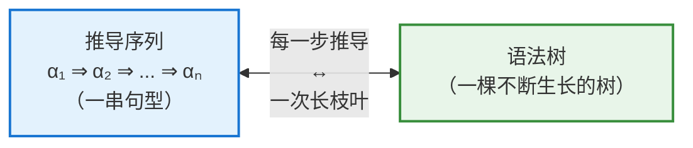
```mermaid
flowchart LR
    D["推导序列<br/>α₁ ⇒ α₂ ⇒ ... ⇒ αₙ<br/>（一串句型）"]
    T["语法树<br/>（一棵不断生长的树）"]
    D <-->|"每一步推导<br/>↔<br/>一次长枝叶"| T

    style D fill:#e3f2fd,stroke:#1976d2,stroke-width:2px
    style T fill:#e8f5e9,stroke:#388e3c,stroke-width:2px
```

在深入之前，先厘清几个关键概念。

---

#### 2. 预备概念

| 概念                      | 含义                                      |
| ----------------------- | --------------------------------------- |
| **推导（derivation）**      | 从起始符号出发，反复用产生式把非终结符替换成右部，得到的一系列字符串      |
| **句型（sentential form）** | 推导过程中出现的每一个中间字符串 $\alpha_i$（可含终结符和非终结符） |
| **语法树（parse tree）**     | 一棵树：根是起始符号，内部节点是非终结符，叶子是终结符或 ε          |
| **产出/yield**            | 把语法树的**所有叶子从左到右**读出来拼成的字符串              |

**这个定理的核心不变式（invariant）是**：

> 在构造过程中的每一步，**语法树的产出（yield）恰好等于当前的句型 $\alpha_i$**。

换句话说，语法树的叶子从左到右读出来，永远和推导到当前那一行的字符串完全一致。整段归纳证明，就是在维护这条不变式。

---

#### 3. 归纳法的整体框架

这段话是标准的数学归纳法结构：

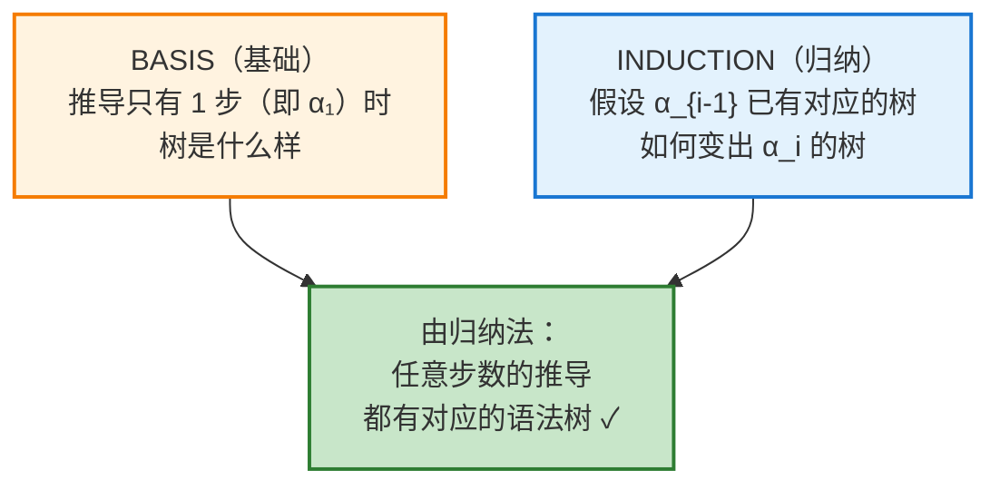
```mermaid
flowchart TD
    BASIS["BASIS（基础）<br/>推导只有 1 步（即 α₁）时<br/>树是什么样"]
    IND["INDUCTION（归纳）<br/>假设 α_{i-1} 已有对应的树<br/>如何变出 α_i 的树"]
    BASIS --> CONCLUDE["由归纳法：<br/>任意步数的推导<br/>都有对应的语法树 ✓"]
    IND --> CONCLUDE

    style BASIS fill:#fff3e0,stroke:#f57c00,stroke-width:2px
    style IND fill:#e3f2fd,stroke:#1976d2,stroke-width:2px
    style CONCLUDE fill:#c8e6c9,stroke:#2e7d32,stroke-width:2px
```

- **BASIS**：处理最开始的情形（推导的第一行 $\alpha_1 = A$）；
- **INDUCTION**：假设第 $i-1$ 行的树已经建好，说明如何"生长"出第 $i$ 行的树。

只要这两部分都成立，归纳法就保证了**任意长度的推导都能构造出语法树**。

---

#### 4. BASIS（基础步）详解

> **原文**：The tree for $\alpha_1 = A$ is a single node labeled $A$.

推导总是从**单个起始符号 $A$** 开始（$\alpha_1 = A$）。此时还没有应用任何产生式，字符串就是 `A` 本身。

对应的语法树自然也最简单——**一个孤零零的、标号为 $A$ 的节点**：

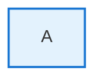
```mermaid
flowchart TD
    A["A"]
    style A fill:#e3f2fd,stroke:#1976d2,stroke-width:2px
```

**验证不变式**：这棵树只有一个叶子 `A`，它的产出就是 `A`，恰好等于 $\alpha_1 = A$ ✓。基础步成立。

---

#### 5. INDUCTION（归纳步）逐句拆解

这是全段的核心。我们把原文拆成几个动作逐一解释。

##### 5.1 归纳假设

> **原文**：Suppose we already have constructed a parse tree with yield $\alpha_{i-1}=X_1X_2\cdots X_k$。

**假设**：第 $i-1$ 步的语法树已经建好了，它的产出（从左到右读叶子）恰好是句型 $\alpha_{i-1} = X_1X_2\cdots X_k$。

这里每个 $X_i$ **既可能是终结符，也可能是非终结符**（这是龙书的记号约定）。也就是说，当前树的叶子序列就是这 $k$ 个符号。

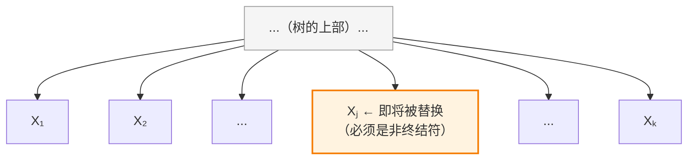
```mermaid
flowchart TD
    ROOT["...（树的上部）..."]
    ROOT --> X1["X₁"]
    ROOT --> X2["X₂"]
    ROOT --> Xdots["..."]
    ROOT --> Xj["Xⱼ ← 即将被替换<br/>（必须是非终结符）"]
    ROOT --> Xdots2["..."]
    ROOT --> Xk["Xₖ"]

    style Xj fill:#fff3e0,stroke:#f57c00,stroke-width:2px
    style ROOT fill:#f5f5f5,stroke:#999
```

##### 5.2 这一步推导做了什么

> **原文**：Suppose $\alpha_i$ is derived from $\alpha_{i-1}$ by replacing $X_j$, a nonterminal, by $\beta=Y_1Y_2\cdots Y_m$。

第 $i$ 步推导，是把 $\alpha_{i-1}$ 中的**某个非终结符 $X_j$**，用产生式 $X_j \to \beta$（其中 $\beta = Y_1Y_2\cdots Y_m$）替换掉，得到：

$$
\alpha_i = X_1\cdots X_{j-1}\;\underbrace{Y_1Y_2\cdots Y_m}_{\beta}\;X_{j+1}\cdots X_k
$$

注意：被替换的必须是**非终结符**（终结符不能再展开），且它是句型里从左数第 $j$ 个符号。

##### 5.3 在树上如何"生长"——最关键的操作

> **原文**：To model this step, find the $j$th non-ε leaf from the left in the current parse tree. This leaf is labeled $X_j$. Give this leaf $m$ children, labeled $Y_1,\dots,Y_m$。

这句话是整段的精华，包含三个动作：

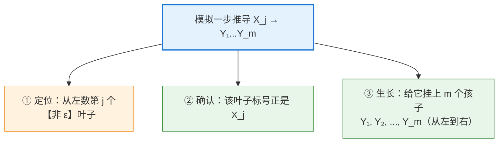
```mermaid
flowchart TD
    STEP["模拟一步推导 X_j → Y₁...Y_m"]
    STEP --> D1["① 定位：从左数第 j 个<br/>【非 ε】叶子"]
    STEP --> D2["② 确认：该叶子标号正是 X_j"]
    STEP --> D3["③ 生长：给它挂上 m 个孩子<br/>Y₁, Y₂, ..., Y_m（从左到右）"]

    style STEP fill:#e3f2fd,stroke:#1976d2,stroke-width:2px
    style D1 fill:#fff3e0,stroke:#f57c00
    style D2 fill:#e8f5e9,stroke:#388e3c
    style D3 fill:#e8f5e9,stroke:#388e3c
```

**动作图示**（把 $X_j$ 这个叶子变成内部节点）：

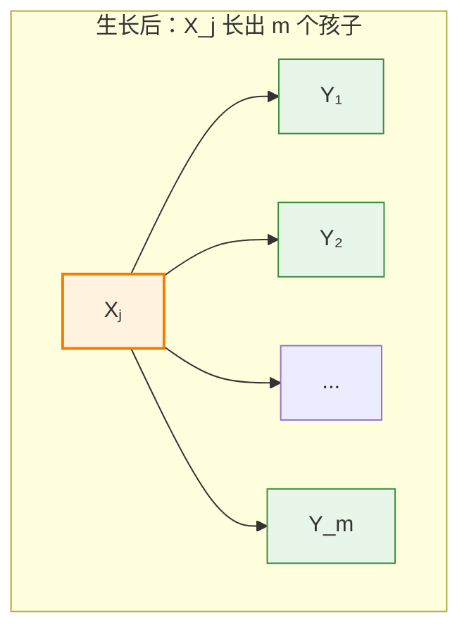
```mermaid
flowchart TD
    subgraph AFTER["生长后：X_j 长出 m 个孩子"]
        XjB["Xⱼ"] --> Y1["Y₁"]
        XjB --> Y2["Y₂"]
        XjB --> Ydots["..."]
        XjB --> Ym["Y_m"]
    end

    style XjB fill:#fff3e0,stroke:#f57c00,stroke-width:2px
    style Y1 fill:#e8f5e9,stroke:#388e3c
    style Y2 fill:#e8f5e9,stroke:#388e3c
    style Ym fill:#e8f5e9,stroke:#388e3c
```

原来的叶子 $X_j$ 现在变成了**内部节点**，它的 $m$ 个孩子 $Y_1,\dots,Y_m$ 成了新的叶子。这样一来，叶子序列从

$$
X_1\cdots X_{j-1}\,\boxed{X_j}\,X_{j+1}\cdots X_k
$$

变成了

$$
X_1\cdots X_{j-1}\,\boxed{Y_1Y_2\cdots Y_m}\,X_{j+1}\cdots X_k
$$

**这恰好就是 $\alpha_i$**！不变式继续维持 ✓。**每一步推导替换字符串的动作，被精确地翻译成了"某个叶子长出孩子"的树操作。**

##### 5.4 特例：$m = 0$（ε 产生式）

> **原文**：As a special case, if $m=0$, then $\beta=\epsilon$, and we give the $j$th leaf one child labeled $\epsilon$。

如果产生式是 $X_j \to \varepsilon$（右部为空，即 $m=0$），按理说应该"给 0 个孩子"——但那样 $X_j$ 就成了没有孩子的内部节点，容易产生歧义（分不清它是"待展开的非终结符"还是"已用 ε 规则展开完毕"）。

**约定**：给它挂**一个标号为 ε 的孩子**，明确表示"这里用了 ε 产生式，展开成了空"。

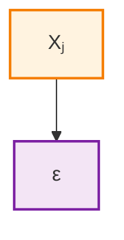
```mermaid
flowchart TD
    Xj2["Xⱼ"] --> eps["ε"]
    style Xj2 fill:#fff3e0,stroke:#f57c00,stroke-width:2px
    style eps fill:#f3e5f5,stroke:#7b1fa2,stroke-width:2px
```

由于 ε 代表空串，它**不给产出贡献任何字符**，所以不变式依然成立。

---

#### 6. 完整实例：一步步"长"出 `id + id` 的语法树

用文法演示整个过程会豁然开朗。文法：

$$
E \rightarrow E + T \mid T \qquad T \rightarrow T * F \mid F \qquad F \rightarrow (E) \mid \mathbf{id}
$$

考虑推导（最左推导）：

$$
E \Rightarrow E{+}T \Rightarrow T{+}T \Rightarrow F{+}T \Rightarrow \mathbf{id}{+}T \Rightarrow \mathbf{id}{+}F \Rightarrow \mathbf{id}{+}\mathbf{id}
$$

我们逐步应用上面的规则，追踪每一步：

| 步   | 推导动作                                                    | 用哪个产生式             | 找第几个非ε叶子  | 该叶子标号 | 挂上的孩子   |
| --- | ------------------------------------------------------- | ------------------ | --------- | ----- | ------- |
| 0   | $\alpha_1 = E$                                          | （基础）               | —         | —     | 单节点 E   |
| 1   | $E \Rightarrow E{+}T$                                   | $E\to E{+}T$       | 第 1 个     | E     | E, +, T |
| 2   | $E{+}T \Rightarrow T{+}T$                               | $E\to T$           | 第 1 个     | E     | T       |
| 3   | $T{+}T \Rightarrow F{+}T$                               | $T\to F$           | 第 1 个     | T     | F       |
| 4   | $F{+}T \Rightarrow \mathbf{id}{+}T$                     | $F\to \mathbf{id}$ | 第 1 个     | F     | id      |
| 5   | $\mathbf{id}{+}T \Rightarrow \mathbf{id}{+}F$           | $T\to F$           | **第 3 个** | T     | F       |
| 6   | $\mathbf{id}{+}F \Rightarrow \mathbf{id}{+}\mathbf{id}$ | $F\to \mathbf{id}$ | **第 3 个** | F     | id      |

**注意第 5、6 步**：这时句型是 `id + T`，第 3 个符号 `T` 才是要替换的对象，所以要**从左数到第 3 个叶子**。这就引出了下一节要重点解释的"non-ε 叶子"问题。

**最终长成的语法树**：

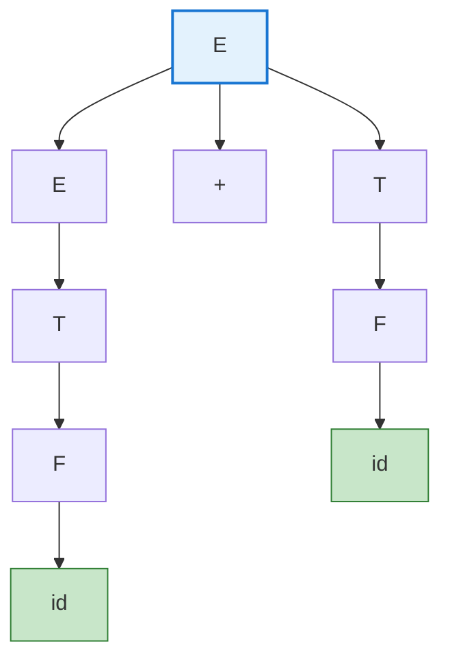
```mermaid
flowchart TD
    E0["E"] --> E1["E"]
    E0 --> plus["+"]
    E0 --> T0["T"]

    E1 --> T1["T"]
    T1 --> F1["F"]
    F1 --> id1["id"]

    T0 --> F0["F"]
    F0 --> id0["id"]

    style E0 fill:#e3f2fd,stroke:#1976d2,stroke-width:2px
    style id1 fill:#c8e6c9,stroke:#2e7d32
    style id0 fill:#c8e6c9,stroke:#2e7d32
```

从左到右读叶子：`id + id` ✓，与最终句型完全一致。

---

#### 7. 为什么强调"non-ε 叶子"？—— 一个易被忽略的关键

原文特意说"find the $j$th **non-ε** leaf"，这个"非 ε"三个字非常重要，值得单独解释。

**原因**：句型 $\alpha_{i-1} = X_1X_2\cdots X_k$ 是语法树的**产出**，而产出**不包含 ε**（ε 代表空，不贡献字符）。所以当我们要定位"句型里第 $j$ 个符号 $X_j$"对应哪个叶子时，必须**跳过所有 ε 叶子来计数**——因为 ε 叶子在句型里根本不出现。

用一个含 ε 的例子说明。文法：

$$
S \rightarrow a\,S \mid \varepsilon
$$

推导 `a`：$\;S \Rightarrow aS \Rightarrow a$（第二步用 $S \to \varepsilon$）。

**第一步** $S \Rightarrow aS$：给 S 挂上孩子 `a`、`S`：

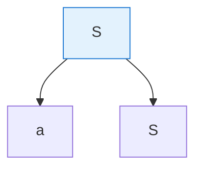
```mermaid
flowchart TD
    S0["S"] --> a0["a"]
    S0 --> S1["S"]
    style S0 fill:#e3f2fd,stroke:#1976d2
```

产出 = `aS` ✓

**第二步** $aS \Rightarrow a$：此时句型 `aS` 的第 2 个符号是 `S`，用 $S \to \varepsilon$（$m=0$）替换它。找**第 2 个非 ε 叶子** = 右边的 `S`，给它挂一个 ε 孩子：

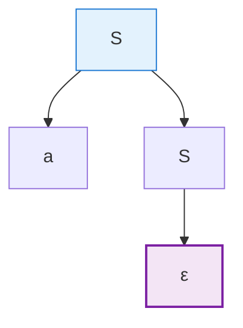
```mermaid
flowchart TD
    S0b["S"] --> a0b["a"]
    S0b --> S1b["S"]
    S1b --> eps["ε"]
    style S0b fill:#e3f2fd,stroke:#1976d2
    style eps fill:#f3e5f5,stroke:#7b1fa2,stroke-width:2px
```

现在叶子从左到右是 `a`、`ε`。产出 = `a`（ε 不算）✓。

> 💡 **如果不跳过 ε 叶子会怎样**：假设后续还要替换某个符号，若把 ε 叶子也算进计数，就会数错位置、定位到错误的叶子，从而破坏"树的产出 = 句型"这条不变式。所以**"non-ε"是保证计数与句型对齐的必要条件**。

---

#### 8. 总结

这段话通过**对推导步数的归纳**，精确地建立了"推导 ⟷ 语法树"的对应关系，其核心可以归纳为：

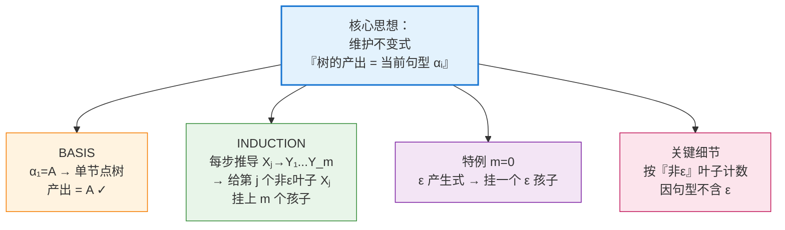
```mermaid
flowchart TD
    CORE["核心思想：<br/>维护不变式<br/>『树的产出 = 当前句型 αᵢ』"]
    CORE --> B["BASIS<br/>α₁=A → 单节点树<br/>产出 = A ✓"]
    CORE --> I["INDUCTION<br/>每步推导 Xⱼ→Y₁...Y_m<br/>→ 给第 j 个非ε叶子 Xⱼ<br/>挂上 m 个孩子"]
    CORE --> E["特例 m=0<br/>ε 产生式 → 挂一个 ε 孩子"]
    CORE --> K["关键细节<br/>按『非ε』叶子计数<br/>因句型不含 ε"]

    style CORE fill:#e3f2fd,stroke:#1976d2,stroke-width:2px
    style B fill:#fff3e0,stroke:#f57c00
    style I fill:#e8f5e9,stroke:#388e3c
    style E fill:#f3e5f5,stroke:#7b1fa2
    style K fill:#fce4ec,stroke:#c2185b
```

- **不变式是灵魂**：整个构造始终维持"语法树的产出（叶子从左到右）恰好等于当前句型 $\alpha_i$"。基础步和归纳步都在守护这条性质。

- **BASIS**：推导起点 $\alpha_1 = A$ 对应一棵单节点树，产出就是 $A$。

- **INDUCTION**：推导每替换一个符号（$X_j \to Y_1\cdots Y_m$），就把树上对应的叶子 $X_j$"长出" $m$ 个孩子 $Y_1,\dots,Y_m$。字符串上的替换动作，被一一翻译成树上的生长动作。

- **ε 特例（$m=0$）**：为避免"无孩子的内部节点"造成歧义，约定挂一个 ε 孩子作为标记，且 ε 不贡献产出。

- **"non-ε 叶子"的深意**：因为句型不含 ε，定位第 $j$ 个符号时必须跳过 ε 叶子计数，才能让叶子与句型符号严格对齐。

**最深刻的启示**：这段归纳构造证明了**推导（一维的字符串序列）和语法树（二维的树结构）是同一件事的两种表现**——每一步字符串重写，都精确对应树上一次局部生长。这正是"一个句子的推导过程"与"它的语法结构"本质等价的严格数学基础。

### Example 4.10

The sequence of parse trees constructed from the derivation (4.8) is shown in Fig. 4.4. In the first step of the derivation, $E \Rightarrow -E$. To model this step, add two children, labeled $-$ and $E$, to the root $E$ of the initial tree. The result is the second tree.
In the second step of the derivation, $-E \Rightarrow -(E)$. Consequently, add three children, labeled $(,E,\text{ and })$, to the leaf labeled $E$ of the second tree, to obtain the third tree with yield $-(E)$. Continuing in this fashion we obtain the complete parse tree as the sixth tree. $\square$
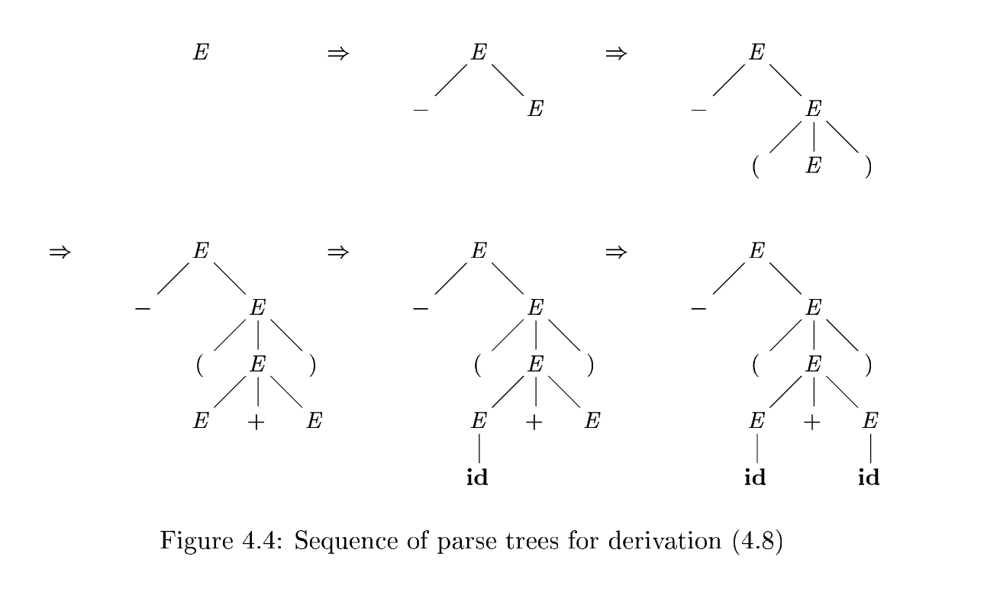

### parse tree和derivation的relationship

> NOTE: 本节内容非常重要，它是理解后面即将介绍的LL parser、LR parser的基础，为此做了很多补充: "Parse-tree&Derivation&Leftmost-Rightmost&Parser"

#### N:1

Since a **parse tree** ignores variations in the order in which symbols in **sentential forms** are replaced, there is a **many‑to‑one** relationship between **derivations** and **parse trees**. For example, both derivations (4.8) and (4.9), are associated with the same final parse tree of Fig. 4.4.

#### 1:1 bijection

In what follows, we shall frequently parse by producing a **leftmost** or a **rightmost** derivation, since there is a one‑to‑one relationship between **parse trees** and either **leftmost** or **rightmost** derivations. Both leftmost and rightmost derivations pick a particular order for replacing symbols in **sentential forms**, so they too filter out variations in the order. It is not hard to show that every **parse tree** has associated with it a unique **leftmost** and a unique **rightmost** derivation.

> 翻译: 由于语法分析树不区分句型中符号的替换顺序，因此**推导与语法分析树之间是多对一的关系**。例如，推导式 (4.8) 和 (4.9) 对应图 4.4 中同一棵最终语法分析树。
> 
> 接下来，我们经常通过构造最左推导或者最右推导来完成语法分析。这是因为：语法分析树与**最左推导、最右推导分别存在一一对应关系**。最左推导与最右推导都会选定一套固定顺序去替换句型中的符号，因此它们同样消除了替换顺序带来的多种变体。不难证明：每一棵语法分析树，都唯一对应一棵最左推导和唯一的一个最右推导。

## 4.2.5 Ambiguity

> NOTE: 在4.1.2 Representative Grammars节也讨论了这个topic，除此之外还可以参见:
> 
> - "expression-grammar-associativity-and-precedence"
> 
> - "Structure-is-semantics"

From Section 2.2.4, a grammar that produces more than one **parse tree** for some sentence is said to be **ambiguous**. Put another way, an ambiguous grammar is one that produces more than one **leftmost derivation** or more than one **rightmost derivation** for the same sentence.

> NOTE: 打破了之前约定的1:1 bijection

### Example 4.11

The arithmetic expression grammar (4.3) permits two distinct leftmost derivations for the sentence $\text{id} + \text{id} * \text{id}$:

$$
\begin{aligned}
E &\Rightarrow E+E \\
  &\Rightarrow \text{id}+E \\
  &\Rightarrow \text{id}+E*E \\
  &\Rightarrow \text{id}+\text{id}*E \\
  &\Rightarrow \text{id}+\text{id}*\text{id}
\end{aligned}
\qquad
\begin{aligned}
E &\Rightarrow E*E \\
  &\Rightarrow E+E*E \\
  &\Rightarrow \text{id}+E*E \\
  &\Rightarrow \text{id}+\text{id}*E \\
  &\Rightarrow \text{id}+\text{id}*\text{id}
\end{aligned}
$$

The corresponding parse trees appear in Fig. 4.5.

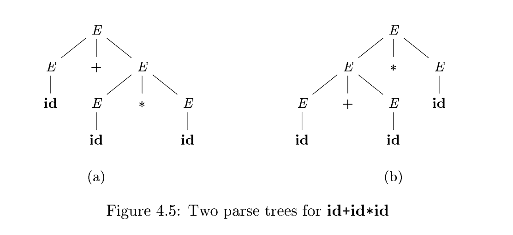

Note that the parse tree of Fig. 4.5(a) reflects the commonly assumed precedence of $+$ and $*$, while the tree of Fig. 4.5(b) does not. That is, it is customary to treat operator $*$ as having higher precedence than $+$, corresponding to the fact that we would normally evaluate an expression like $a + b * c$ as $a + (b * c)$, rather than as $(a + b) * c$. $\square$

### disambiguating rules

> NOTE: 参见"Structure-is-semantics"，其中对这个topic进行了讨论

For most parsers, it is desirable that the grammar be made **unambiguous**, for if it is not, we cannot uniquely determine which **parse tree** to select for a sentence. In other cases, it is convenient to use carefully chosen **ambiguous grammars**, together with **disambiguating rules** that "throw away" undesirable parse trees, leaving only one tree for each sentence.

> 翻译: 对于绝大多数语法分析器而言，我们希望文法是无二义的。倘若文法存在二义性，我们就无法为一个句子唯一确定应当选用哪一棵语法分析树。而在另一些场景中，可以使用经过精心挑选的二义文法，并配合**消除二义性规则**；这类规则会 “舍弃” 不符合预期的语法分析树，最终让每个句子仅保留唯一一棵语法树。

## 4.2.6 Verifying the Language Generated by a Grammar

> 翻译: 验证文法所产生的语言
> 
> 尽管编译器设计者很少对完整的程序设计语言文法做这件事，但能够证明一组给定产生式恰好生成某一门特定语言，是很有价值的。对于容易出问题的语法结构，可以编写一套简洁的抽象文法，研究它所生成的语言。后面我们将为条件语句构造这样一套文法。

Although **compiler designers** rarely do so for a complete programming‑language grammar, it is useful to be able to reason that a given set of productions generates a particular language. **Troublesome constructs** can be studied by writing a concise, abstract grammar and studying the language that it generates. We shall construct such a grammar for conditional statements below.

A proof that a grammar $G$ generates a language $L$ has two parts: show that every string generated by $G$ is in $L$, and conversely that every string in $L$ can indeed be generated by $G$.

> 翻译: 证明文法 $G$ 生成语言 $L$ 需要分为两部分：证明由 $G$ 推导出的每一个串都属于 $L$；反过来，证明 $L$ 中的每一个串都能够由 $G$ 推导出来。

### Example 4.12

Consider the following grammar:

$$
S \rightarrow (S)\,S \mid \epsilon \tag{4.13}
$$

It may not be initially apparent, but this simple grammar generates all strings of **balanced parentheses**, and only such strings. To see why, we shall show first that every sentence derivable from $S$ is balanced, and then that every balanced string is derivable from $S$. To show that every sentence derivable from $S$ is balanced, we use an inductive proof on the number of steps $n$ in a derivation.

> 翻译: 乍看并不直观，但这个简单文法恰好生成全部**括号平衡串**，并且只生成括号平衡串。为证明该结论，分两步：先证明从 $S$ 推导出的所有句子都是括号平衡的；再证明任意括号平衡串都可以从 $S$ 推导得到。第一部分对**推导的步数 $n$**做数学归纳证明。

**BASIS**: The basis is $n=1$. The only string of terminals derivable from $S$ in one step is the empty string, which surely is balanced.

**INDUCTION**: Now assume that all derivations of fewer than $n$ steps produce **balanced sentences**, and consider a leftmost derivation of exactly $n$ steps. Such a derivation must be of the form

$$
S \underset{lm}{\Rightarrow} (S)S \underset{lm}{\overset{*}{\Rightarrow}} (x)S \underset{lm}{\overset{*}{\Rightarrow}} (x)y
$$

The derivations of $x$ and $y$ from $S$ take fewer than $n$ steps, so by the inductive hypothesis $x$ and $y$ are balanced. Therefore, the string $(x)y$ must be balanced. That is, it has an equal number of left and right parentheses, and every prefix has at least as many left parentheses as right.

> 翻译: 从 $S$ 推导出 $x$、$y$ 的推导步数均小于 $n$，根据归纳假设，$x$、$y$ 都是括号平衡串。因此串 $ (x)y $ 必然括号平衡：左右括号数量相等，并且它的任意前缀中左括号数目不少于右括号数目。
> 
> 至此证明：凡是从 $S$ 推导出的串一定括号平衡。接下来证明：**每一个括号平衡串都可以从 $S$ 推导出来**，此处对**字符串长度**做归纳。

Having thus shown that any string derivable from $S$ is balanced, we must next show that every balanced string is derivable from $S$. To do so, use induction on the length of a string.

**BASIS**: If the string is of length $0$, it must be $\epsilon$, which is balanced.

**INDUCTION**: First, observe that every balanced string has even length. Assume that every balanced string of length less than $2n$ is derivable from $S$, and consider a balanced string $w$ of length $2n,\ n \ge 1$. Surely $w$ begins with a left parenthesis. Let $(x)$ be the shortest nonempty prefix of $w$ having an equal number of left and right parentheses. Then $w$ can be written as $w=(x)y$ where both $x$ and $y$ are balanced. Since $x$ and $y$ are of length less than $2n$, they are derivable from $S$ by the inductive hypothesis. Thus, we can find a derivation of the form

$$
S \Rightarrow (S)S \overset{*}{\Rightarrow} (x)S \overset{*}{\Rightarrow} (x)y
$$

proving that $w=(x)y$ is also derivable from $S$. $\square$

> 翻译: **归纳步骤**：首先，任意括号平衡串长度必为偶数。假设所有长度小于 $2n$ 的平衡串都可由 $S$ 推导出；取一个长度为 $2n\ (n\ge1)$ 的平衡串 $w$。$w$ 的首字符一定是左括号。设 $(x)$ 是 $w$ 的最短非空前缀，满足左右括号数目相等。于是 $w$ 可以写为 $w=(x)y$，其中 $x$ 和 $y$ 均为平衡串。$x$、$y$ 的长度都小于 $2n$，由归纳假设可知二者都能从 $S$ 推出。于是存在推导：
> 
> 这就证明 $w=(x)y$ 同样可以由 $S$ 推导得到。$\square$

## 4.2.7 Context-Free Grammars Versus Regular Expressions

Before leaving this section on grammars and their properties, we establish that grammars are a more powerful notation than regular expressions. Every construct that can be described by a regular expression can be described by a grammar, but not vice‑versa. Alternatively, every regular language is a context‑free language, but not vice‑versa.

For example, the regular expression $({\bf a}|{\bf b})^*{\bf abb}$ and the grammar
$$
\begin{aligned}
A_0 &\rightarrow aA_0 \mid bA_0 \mid aA_1 \\
A_1 &\rightarrow bA_2 \\
A_2 &\rightarrow bA_3 \\
A_3 &\rightarrow \epsilon
\end{aligned}
$$
describe the same language, the set of strings of $a$'s and $b$'s ending in $abb$.

We can construct mechanically a grammar to recognize the same language as a nondeterministic finite automaton (NFA). The grammar above was constructed from the NFA in Fig. 3.24 using the following construction:

1. For each state $i$ of the NFA, create a nonterminal $A_i$.
2. If state $i$ has a transition to state $j$ on input $a$, add the production $A_i \rightarrow aA_j$. If state $i$ goes to state $j$ on input $\epsilon$, add the production $A_i \rightarrow A_j$.
3. If $i$ is an accepting state, add $A_i \rightarrow \epsilon$.
4. If $i$ is the start state, make $A_i$ be the start symbol of the grammar.

On the other hand, the language $L=\{a^nb^n \mid n \ge 1\}$ with an equal number of $a$'s and $b$'s is a prototypical example of a language that can be described by a grammar but not by a regular expression. To see why, suppose $L$ were the language defined by some regular expression. We could construct a DFA $D$ with a finite number of states, say $k$, to accept $L$. Since $D$ has only $k$ states, for an input beginning with more than $k$ $a$'s, $D$ must enter some state twice, say $s_i$, as in Fig. 4.6. Suppose that the path from $s_i$ back to itself is labeled with a sequence $a^{j-i}$. Since $a^ib^i$ is in the language, there must be a path labeled $b^i$ from $s_i$ to an accepting state $f$. But, then there is also a path from the initial state $s_0$ through $s_i$ to $f$ labeled $a^jb^i$, as shown in Fig. 4.6. Thus, $D$ also accepts $a^jb^i$, which is not in the language, contradicting the assumption that $L$ is the language accepted by $D$.

> Figure 4.6: DFA $D$ accepting both $a^ib^i$ and $a^jb^i$.

Colloquially, we say that "finite automata cannot count," meaning that a finite automaton cannot accept a language like $\{a^nb^n \mid n \ge 1\}$ that would require it to keep count of the number of $a$'s before it sees the $b$'s. Likewise, "a grammar can count two items but not three," as we shall see when we consider non‑context‑free language constructs in Section 4.3.5.

### 补充内容

下面这些内容是在阅读 wikipedia [Comparison of parser generators](https://en.wikipedia.org/wiki/Comparison_of_parser_generators) 中 [Regular languages](https://en.wikipedia.org/wiki/Comparison_of_parser_generators#Regular_languages) 章节时，发现这一段的内容正好和本节内容相关，可以作为一个补充，并且它的讲解也比较易懂：

> [Regular languages](https://en.wikipedia.org/wiki/Regular_language) are a category of languages (sometimes termed [Chomsky Type 3](https://en.wikipedia.org/wiki/Chomsky_hierarchy)) which can be matched by a state machine (more specifically, by a [deterministic finite automaton](https://en.wikipedia.org/wiki/Deterministic_finite_automaton) or a [nondeterministic finite automaton](https://en.wikipedia.org/wiki/Nondeterministic_finite_automaton)) constructed from a [regular expression](https://en.wikipedia.org/wiki/Regular_expression). In particular, a regular language can match constructs like "A follows B", "Either A or B", "A, followed by zero or more instances of B", but cannot match constructs which require consistency between non-adjacent elements, such as "some instances of A followed by the same number of instances of B", and also cannot express the concept of recursive "nesting" ("every A is eventually followed by a matching B"). A classic example of a problem which a regular grammar cannot handle is the question of whether a given string contains correctly-nested parentheses. (This is typically handled by a Chomsky Type 2 grammar, also termed a [context-free grammar](https://en.wikipedia.org/wiki/Context-free_grammar).)

regular expression属于[Regular languages](https://en.wikipedia.org/wiki/Regular_language)，使用[regular grammar](https://en.wikipedia.org/wiki/Regular_grammar)，按照[Chomsky hierarchy](https://en.wikipedia.org/wiki/Chomsky_hierarchy):

- [regular grammar](https://en.wikipedia.org/wiki/Regular_grammar)属于[Type-3 grammars](https://en.wikipedia.org/wiki/Chomsky_hierarchy#Type-3_grammars)
- [context-free grammar](https://en.wikipedia.org/wiki/Context-free_grammar)属于[Type-2 grammars](https://en.wikipedia.org/wiki/Chomsky_hierarchy#Type-2_grammars)

Every **regular language** is **context-free**, every **context-free** language is **context-sensitive**, every **context-sensitive language** is **recursive** and every **recursive language** is recursively enumerable. These are all proper inclusions, meaning that there exist recursively enumerable languages that are not context-sensitive, context-sensitive languages that are not context-free and context-free languages that are not regular.
