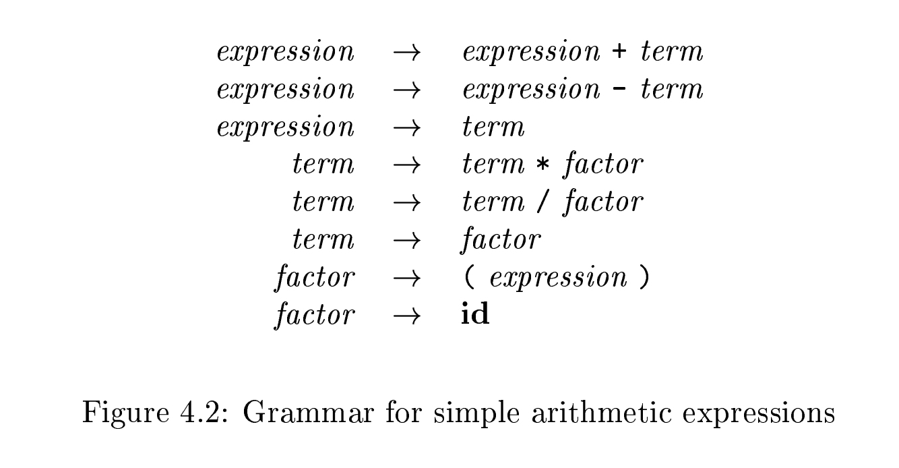

# 4.2 Context-Free Grammars

Grammars were introduced in Section 2.2 to systematically describe the syntaxof programming language constructs like **expressions** and **statements**. Usinga syntactic variable `stmt` to denote **statements** and variable `expr` to denote **expressions**, the production


species the structure of this form of **conditional statement**. Other **productions** then dene precisely what an `expr` is and what else a `stmt` can be.

This section reviews the definition of a **context-free grammar** and introduces terminology for talking about parsing. In particular, the notion of derivations is very helpful for discussing the order in which **productions** are applied during parsing.


## 4.2.1 The Formal Definition of a Context-Free Grammar

From Section 2.2, a **context-free grammar** (grammar for short) consists of **terminals**, **nonterminals**, a **start symbol**, and **productions**.

1、***Terminals*** are the basic symbols from which strings are formed. The term "token name" is a synonym for "terminal" and frequently we will use the word "token" for terminal when it is clear that we are talking about just the token name. We assume that the terminals are the first components of the tokens output by the **lexical analyzer**. In (4.4), the terminals are the keywords `if` and `else` and the symbols `(` and `)`.

2、***Nonterminals*** are **syntactic variables** that denote sets of strings. In (4.4), `stmt` and `expr` are **nonterminals**. The sets of strings denoted by **nonterminals** help define the language generated by the grammar. Nonterminals impose a hierarchical structure on the language that is key to syntax analysis and translation.

3、In a grammar, one nonterminal is distinguished as the ***start symbol***, and the set of strings it denotes is the language generated by the grammar. Conventionally, the productions for the ***start symbol*** are listed first.

4、The productions of a grammar specify the manner in which the **terminals** and **nonterminals** can be combined to form strings. Each production consists of:

(a) A **nonterminal** called the **head** or **left side** of the **production**; this production defines some of the strings denoted by the **head**.

(b) The symbo $\to$. Sometimes `::=` has been used in place of the arrow.

(c) A ***body*** or ***right side*** consisting of zero or more **terminals** and **nonterminals**. The components of the body describe one way in which strings of the nonterminal at the head can be constructed.

### Example 4.5

**Example 4.5** : The grammar in Fig. 4.2 defines simple arithmetic expressions. In this grammar, the terminal symbols are

```
id + - * / ( )
```

The **nonterminal symbols** are ***expression***, ***term*** and ***factor***, and ***expression*** is the **start symbol**



## 4.2.2 Notational Conventions 

> NOTE:
>
> 一、标题的含义是"符号表示的约定"

To avoid always having to state that "these are the terminals," "these are the nonterminals," and so on, the following **notational conventions** for grammars will be used throughout the **remainder** of this book.

### 1、These symbols are **terminals**

(a) **Lowercase letters** early in the alphabet, such as a, b, c. 

(b) **Operator symbols** such as `+`, `*`, and so on. 

(c) Punctuation symbols such as **parentheses**, comma, and so on. 

(d) The digits 0, 1,...9. 

(e) **Boldface** strings such as **id** or **if**, each of which represents a single **terminal symbol**. 


### 2、These symbols are nonterminals

(a) Uppercase letters early in the alphabet, such as A, B, C. 

(b) The letter S, which, when it appears, is usually the **start symbol**. 

(c) Lowercase, italic names such as *expr* or *stmt*. 

(d) When discussing programming constructs, uppercase letters may be used to represent **nonterminals** for the constructs. For example, nonterminals for expressions, terms, and factors are often represented by `E`, `T`, and `F`, respectively.

### 3、

Uppercase letters late in the alphabet, such as X, Y, Z, represent ***grammar symbols***; that is, either **nonterminals** or **terminals**. 

### 4、

Lowercase letters late in the alphabet, chiey u, v, ... z, represent (possibly empty) strings of terminals. 

### 5、

Lowercase Greek letters $\alpha$, $\beta$,$\gamma$,  for example, represent (possibly empty) strings of grammar symbols. Thus, a generic production can be written as $A \to \alpha$, where A is the **head** and $\alpha$ the body.

### 6、

A set of productions $A \to \alpha_1$, $A \to \alpha_2$,...,$A \to \alpha_k$, with a common head `A` (call them ***A-productions***), may be written $A \to \alpha_1 | \alpha_2 | \dots | \alpha_k$ . Call $\alpha_1 \alpha_2 \dots \alpha_k$ the alternatives  for `A`.


### Example 4.6

Example 4.6 : Using these conventions, the grammar of Example 4.5 can be rewritten concisely as


The **notational conventions** tell us that `E`, `T`, and `F` are nonterminals, with `E` the start symbol. The remaining symbols are terminals

## 4.2.3 Derivations

> NOTE: 
>
> 一、"derivation" means "推导" in Chinese.

The construction of a parse tree can be made precise by taking a **derivational view**, in which **productions** are treated as **rewriting rules**. Beginning with the **start symbol**, each rewriting step replaces a **nonterminal** by the body of one of its productions. This derivational view corresponds to the **top-down** construction of a **parse tree**, but the precision afforded by **derivations** will be especially helpful when **bottom-up** parsing is discussed. As we shall see, **bottom-up parsing** is related to a class of derivations known as "**rightmost**" derivations, in which the **rightmost nonterminal** is rewritten at each step.

> NOTE: 
>
> I still do not understand why bottom-up parsing corresponds "**rightmost**" derivations.
>
> $\Rightarrow$

For example, consider the following grammar, with a single nonterminal `E`, which adds a production $E \to - E$ to the grammar (4.3)


The production $E \to -E$ signifies(表示) that if `E` denotes an expression, the  `-E` must also denote an expression. The replacement of a single `E` by `-E` will be described by writing
$$
E \Rightarrow -E
$$
which is read, "E derives -E."  The production $E \to ( E )$ can be applie to replace any instance of `E` in any string of grammar symbols by `(E)`, e.g., $E * E \Rightarrow (E) * E$ or $E * E \Rightarrow E * (E)$.  We can take a single `E` and repeatedly apply productions in any order to get a sequence of replacements. For example
$$
E \Rightarrow -E \Rightarrow -(E) \Rightarrow -(id)
$$
We call such a sequence of replacements a derivation of `(id)` from `E`. This derivation provides a proof that the string `-(id)` is one particular instance of an expression. 

For a general definition of **derivation**, consider a nonterminal `A` in the middle of a sequence of **grammar symbols**, as in $\alpha A \beta$, where $\alpha$ and $\beta$ are  are arbitrary strings of grammar symbol. Suppose $A \to \gamma$  is a **production**. Then, we write $\alpha A \beta \Rightarrow \alpha \gamma \beta$. The symbol $\Rightarrow$ means, "derives in one step." When a sequence of derivation steps $\alpha_1 \Rightarrow \alpha_2 \Rightarrow \dots \Rightarrow \alpha_n$ rewrites $\alpha_1$ to $\alpha_n$, we say $\alpha_1$ ***derives*** $\alpha_n$. Often, we wish to say, "derives in zero or more steps." For this purpose, we can use the symbol $S \xRightarrow {\text{*}}$.  Thus,

1、$\alpha \xRightarrow {\text{*}} \alpha$ , for any string $\alpha$, and

2、If $\alpha \xRightarrow {\text{*}} \beta$ and  $\beta \Rightarrow \gamma $ , then $\alpha \xRightarrow {\text{*}} \gamma$, 

 Likewise, $\xRightarrow {\text{+}}$ means, "derives in one or more steps."

> NOTE:
>
> 一、上述latex参考自: https://tex.stackexchange.com/questions/103988/rightarrow-with-text-above-it/103993#103993


We can take a single E and repeatedly aly productions in any order to get a sequence of replacements. For example

If $S \xRightarrow{\ast} \alpha$ where $S$ is the **start symbol** of a grammar $G$, we say that $\alpha$ is a *sentential form* of G. Note that a **sentential form** may contain both **terminals** and **nonterminals**, and may be **empty**. A *sentence* of G is a **sentential form** with no **nonterminals**. The *language* generated by a grammar is its set of **sentences**.

Thus, a string of terminals $w$ is in $L(G)$, the language generated by G, if and only if $w$ is a sentence of G (or $S \xRightarrow{\ast} w $. A language that can be generated by a **grammar** is said to be a **context-free language**. If two grammars generate the same language, the grammars are said to be *equivalent*.

> NOTE: 
>
> 一、natural language is not **context-free language**.

At each step in a **derivation**, there are two choices to be made. We need to choose which **nonterminal** to replace, and having made this choice, we must pick a **production** with that nonterminal as head. 


To understand how parsers work, we shall consider **derivations** in which the **nonterminal** to be replaced at each step is chosen as follows:

1、In *leftmost derivations*, the **leftmost nonterminal** in each sentential is always chosen. If $\alpha \Rightarrow \beta $ is a step in which the leftmost nonterminal in $\alpha$ is replaced, we write $\alpha \xRightarrow[\text{lm}]{} \beta$ .

2、In *rightmost derivations*, the **rightmost nonterminal** is always chosen; we write $\alpha \xRightarrow [ \text{rm} ]{} \beta$   in this case.


If  , then we say that  is a *left-sentential form* of the grammar at hand.

Analogous definitions hold for **rightmost derivations**. Rightmost derivations are sometimes called *canonical derivations*.

## 4.2.4 Parse Trees and Derivations

A parse tree is a graphical representation of a derivation that filters out the **order** in which productions are applied to replace nonterminals. Each interior node of a parse tree represents the application of a production. The interior node is labeled with the nonterminal `A` in the head of the production; the children of the node are labeled, from left to right, by the symbols in the body of the production by which this `A` was replaced during the derivation.

> NOTE: 
>
> Left-most derivation and right-most derivation yield the same tree in the end but the order in which productions are applied to replace nonterminals is different.


## 4.2.7 Context-Free Grammars Versus Regular Expressions

> NOTE: 
>
> 下面这些内容是在阅读 wikipedia [Comparison of parser generators](https://en.wikipedia.org/wiki/Comparison_of_parser_generators) 中 [Regular languages](https://en.wikipedia.org/wiki/Comparison_of_parser_generators#Regular_languages) 章节时，发现这一段的内容正好和本节内容相关，可以作为一个补充，并且它的讲解也比较易懂：
>
> > [Regular languages](https://en.wikipedia.org/wiki/Regular_language) are a category of languages (sometimes termed [Chomsky Type 3](https://en.wikipedia.org/wiki/Chomsky_hierarchy)) which can be matched by a state machine (more specifically, by a [deterministic finite automaton](https://en.wikipedia.org/wiki/Deterministic_finite_automaton) or a [nondeterministic finite automaton](https://en.wikipedia.org/wiki/Nondeterministic_finite_automaton)) constructed from a [regular expression](https://en.wikipedia.org/wiki/Regular_expression). In particular, a regular language can match constructs like "A follows B", "Either A or B", "A, followed by zero or more instances of B", but cannot match constructs which require consistency between non-adjacent elements, such as "some instances of A followed by the same number of instances of B", and also cannot express the concept of recursive "nesting" ("every A is eventually followed by a matching B"). A classic example of a problem which a regular grammar cannot handle is the question of whether a given string contains correctly-nested parentheses. (This is typically handled by a Chomsky Type 2 grammar, also termed a [context-free grammar](https://en.wikipedia.org/wiki/Context-free_grammar).)
>
> 
>
> regular expression属于[Regular languages](https://en.wikipedia.org/wiki/Regular_language)，使用[regular grammar](https://en.wikipedia.org/wiki/Regular_grammar)，按照[Chomsky hierarchy](https://en.wikipedia.org/wiki/Chomsky_hierarchy):
>
> - [regular grammar](https://en.wikipedia.org/wiki/Regular_grammar)属于[Type-3 grammars](https://en.wikipedia.org/wiki/Chomsky_hierarchy#Type-3_grammars)
> - [context-free grammar](https://en.wikipedia.org/wiki/Context-free_grammar)属于[Type-2 grammars](https://en.wikipedia.org/wiki/Chomsky_hierarchy#Type-2_grammars)
>
> 
>
> [](https://en.wikipedia.org/wiki/File:Chomsky-hierarchy.svg)
>
> 
>
> Every **regular language** is **context-free**, every **context-free** language is **context-sensitive**, every **context-sensitive language** is **recursive** and every **recursive language** is recursively enumerable. These are all proper inclusions, meaning that there exist recursively enumerable languages that are not context-sensitive, context-sensitive languages that are not context-free and context-free languages that are not regular.


