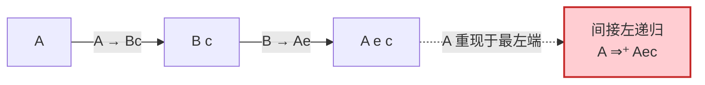
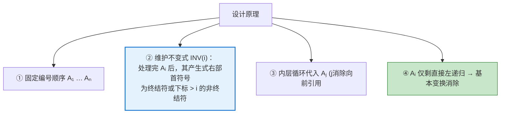
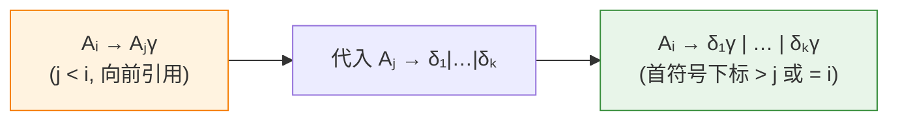
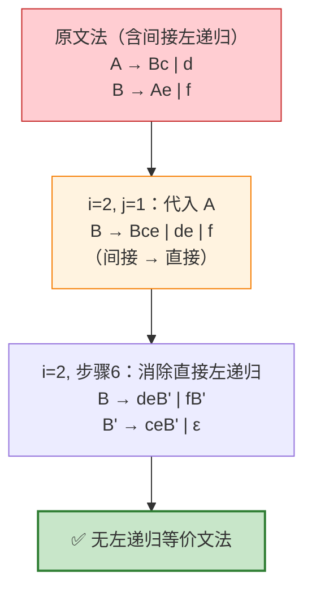
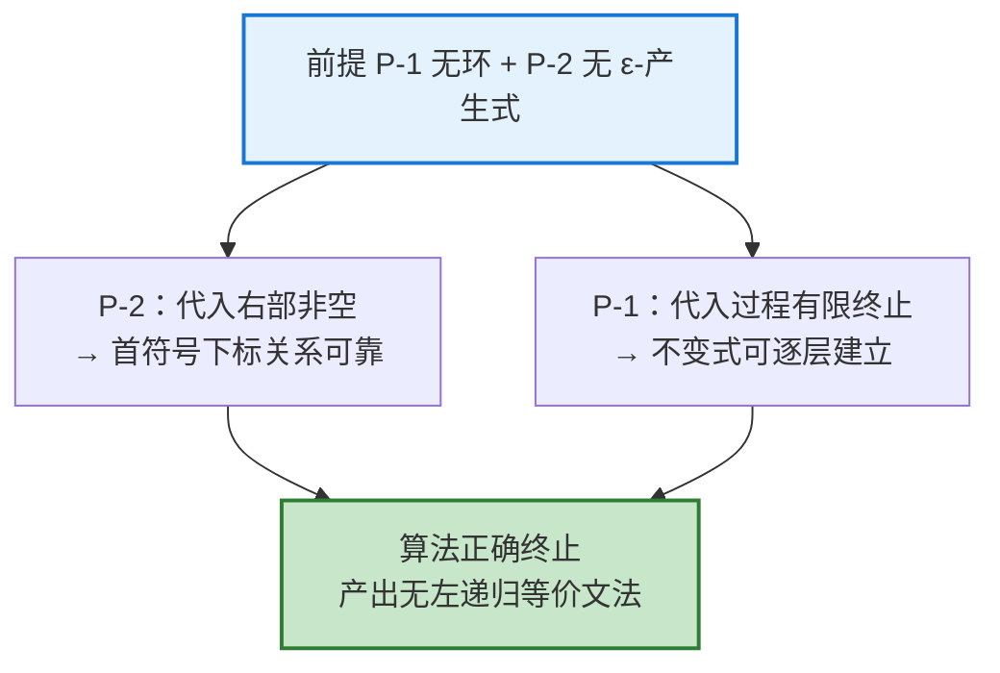

# 通用左递归消除算法技术规范

## 目录

1. 概述
2. 术语定义
3. 问题陈述
4. 前提条件
5. 算法规范
6. 算法机理分析
7. 演算示例
8. 正确性依据
9. 语义保持性约束
10. 结论

---

## 1. 概述

### 1.1 文档目的

本文档规范化描述用于消除上下文无关文法中**一般形式左递归**的 Algorithm 4.19。基本变换仅能处理直接左递归，无法识别以间接形式存在的左递归。本算法通过系统性代入与消除，处理包含间接左递归在内的全部情形。

### 1.2 适用范围

本算法适用于任何需要转换为非左递归形式以支持自顶向下分析（递归下降、LL 分析）的上下文无关文法，前提是该文法满足第 4 节所述条件。

---

## 2. 术语定义

**定义 2.1（直接左递归）**
非终结符 $A$ 存在形如 $A \to A\alpha$ 的产生式。

**定义 2.2（间接左递归）**
非终结符 $A$ 不存在直接左递归产生式，但存在推导序列 $A \overset{+}{\Rightarrow} A\gamma$，即 $A$ 经一步或多步推导后重新出现于句型最左端。

**定义 2.3（环，cycle）**
存在推导 $A \overset{+}{\Rightarrow} A$，即推导前后句型完全相同、无新增符号。

**定义 2.4（$\epsilon$-产生式）**
形如 $A \to \epsilon$ 的产生式。

---

## 3. 问题陈述

### 3.1 直接消除法的局限

基本变换以逐条产生式匹配 $A \to A\alpha$ 为识别手段，无法检出间接左递归。

### 3.2 间接左递归示例

设文法 $G_1$：

$$
\begin{align*}
A &\to Bc \mid d \\
B &\to Ae \mid f
\end{align*}
$$

$G_1$ 中无任何直接左递归产生式，但存在间接左递归：将 $B$ 代入 $A$ 的首条产生式，得 $A \Rightarrow Bc \Rightarrow Aec$，即 $A \overset{+}{\Rightarrow} Aec$。



**问题定义**：需要一种系统性方法，将文法中所有间接左递归转化为直接左递归并逐一消除，同时保持语言等价。

---

## 4. 前提条件

Algorithm 4.19 的正确性依赖以下两项前提条件：

| 编号  | 前提条件                   | 违反后果          |
| --- | ---------------------- | ------------- |
| P-1 | 文法**无环**（no cycles）    | 代入过程可能不终止     |
| P-2 | 文法**无 $\epsilon$-产生式** | 代入步骤可能遗漏部分左递归 |

**规范说明 4.1**
环与 $\epsilon$-产生式均可通过独立的预处理算法系统性消除（参见龙书练习 4.4.6 与 4.4.7）。因此上述前提不损害算法的普遍适用性：任意文法可先经规范化再输入本算法。

**规范说明 4.2（输出特征）**
本算法输出的非左递归文法**可能重新包含 $\epsilon$-产生式**，其来源为直接左递归消除步骤引入的形如 $A' \to \alpha A' \mid \epsilon$ 的产生式。此为预期行为，不影响后续自顶向下分析的适用性。

---

## 5. 算法规范

### 5.1 接口定义

| 项        | 内容                                         |
| -------- | ------------------------------------------ |
| **算法名称** | Eliminating left recursion（Algorithm 4.19） |
| **输入**   | 满足前提 P-1、P-2 的文法 $G$                       |
| **输出**   | 与 $G$ 语言等价、无左递归的文法                         |

### 5.2 过程规范（Figure 4.11）

```
1.  将非终结符排列为某一顺序 A₁, A₂, …, Aₙ
2.  for ( i 从 1 到 n ) {
3.      for ( j 从 1 到 i-1 ) {
4.          将每条形如 Aᵢ → Aⱼγ 的产生式替换为
                Aᵢ → δ₁γ | δ₂γ | … | δₖγ
            其中 Aⱼ → δ₁ | δ₂ | … | δₖ 为当前全部 Aⱼ-产生式
5.      }
6.      消除 Aᵢ-产生式中的直接左递归
7.  }
```

---

## 6. 算法机理分析

### 6.1 设计原理

算法通过**固定非终结符顺序**并**逐层维护结构不变式**，将所有间接左递归逼成直接左递归后消除。



### 6.2 结构不变式

**不变式 INV(i)**：当外层循环处理完索引 $i$ 后，$A_i$ 的所有产生式右部首符号或为终结符，或为下标严格大于 $i$ 的非终结符。

### 6.3 内层循环（步骤 3–5）：消除向前引用

对当前 $A_i$，内层循环遍历 $j < i$，将形如 $A_i \to A_j\gamma$ 的产生式中的 $A_j$ 用其全部右部展开代入。由 INV($j$) 保证 $A_j$ 右部首符号下标 $> j$，代入后 $A_i$ 产生式右部首个非终结符下标被抬高，或转化为 $A_i$ 自身（即直接左递归）。



### 6.4 直接左递归消除（步骤 6）

内层循环结束后 $A_i$ 的向前引用已全部消除，残余左递归必为直接形式。应用基本变换：

$$
A_i \to A_i\alpha \mid \beta \quad\Longrightarrow\quad A_i \to \beta A_i',\quad A_i' \to \alpha A_i' \mid \epsilon
$$

此步骤同时建立 INV($i$)。

---

## 7. 演算示例

**对象**：第 3.2 节文法 $G_1$
**顺序**：$A_1 = A,\ A_2 = B$

### 步骤 $i=1$（处理 $A$）

- 内层循环 $j \in [1, 0]$ 为空，跳过。
- $A \to Bc \mid d$ 无直接左递归，$A$ 处理完成。

### 步骤 $i=2$（处理 $B$）

- **内层循环 $j=1$**：将 $B \to Ae$ 中的 $A$ 代入 $A \to Bc \mid d$：

$$
B \to Ae \mid f \quad\Longrightarrow\quad B \to Bce \mid de \mid f
$$

  间接左递归转化为直接左递归 $B \to Bce$。

- **步骤 6**：消除直接左递归（$\alpha = ce$，$\beta \in \{de, f\}$）：

$$
\begin{align*}
B  &\to de\,B' \mid f\,B' \\
B' &\to ce\,B' \mid \epsilon
\end{align*}
$$

### 输出文法

$$
\begin{align*}
A  &\to Bc \mid d \\
B  &\to de\,B' \mid f\,B' \\
B' &\to ce\,B' \mid \epsilon
\end{align*}
$$



---

## 8. 正确性依据



- **P-2（无 $\epsilon$-产生式）**：保证步骤 4 中被代入右部 $\delta_i$ 非空，使"首符号下标"分析成立。若允许 $A_j \to \epsilon$，代入后可能暴露未处理的左递归。
- **P-1（无环）**：保证代入过程有限终止，不变式 INV 可逐层建立。

---

## 9. 语义保持性约束

**约束 9.1**：本算法与基本变换一致，**仅保证语言等价，不保证语法树结构等价**。代入与右递归改写均改变语法树形状，进而影响运算结合性。

**约束 9.2**：对于结合性敏感（不满足结合律）的运算符，须在语义动作层面显式恢复正确的结合性，不得依赖变换后文法的自然结构倾向。

---

## 10. 结论

| 维度       | 结论                                            |
| -------- | --------------------------------------------- |
| **解决问题** | 处理含间接左递归的一般情形，超越基本变换的直接左递归范围                  |
| **核心机制** | 固定非终结符顺序 → 维护不变式 INV → 代入消除向前引用 → 基本变换消除直接左递归 |
| **前提条件** | 文法须无环、无 $\epsilon$-产生式；二者均可预先规范化              |
| **输出特征** | 输出文法可能含 $\epsilon$-产生式，属正常现象                  |
| **语义约束** | 变换保持语言不变但改变结构，结合性敏感运算符须在语义动作中补救               |

---

## 附录：核心要点摘要

> Algorithm 4.19 采用"按固定顺序代入前驱非终结符、将间接左递归逼成直接左递归后逐一消除"的策略，系统性清除文法中的全部左递归。其正确性以无环、无 $\epsilon$-产生式为前提，两前提均可预先规范化处理；变换保持语言等价但改变语法树结构，故结合性敏感运算符须在语义动作层面补救。
