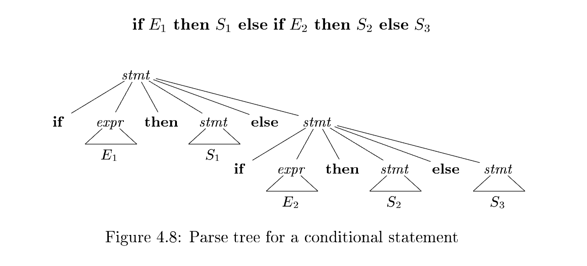
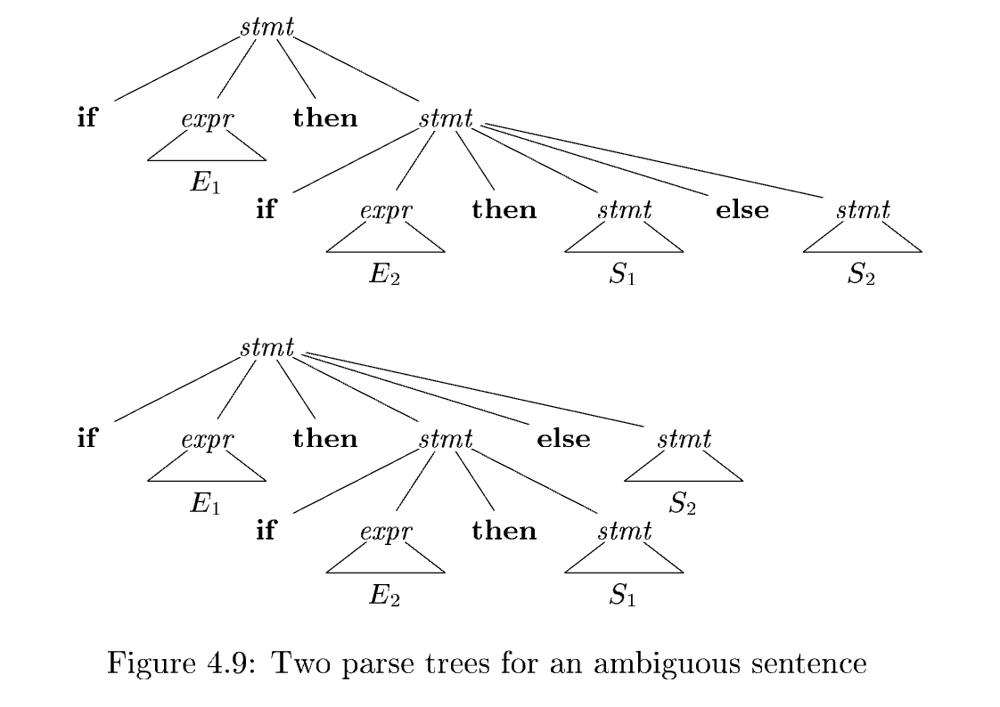

# 4.3 Writing a Grammar

Grammars are capable of describing most, but not all, of the syntax of programming languages. For instance, the requirement that identifiers be declared before they are used, cannot be described by a **context-free grammar**. Therefore, the sequences of tokens accepted by a parser form a superset of the programming language; subsequent phases of the **compiler** must analyze the output of the parser to ensure compliance with rules that are not checked by the parser.

> NOTE: 一遍在semantic analysis中完成

This section begins with a discussion of how to divide work between a **lexical analyzer** and a **parser**. We then consider several transformations that could be applied to get a grammar more suitable for parsing. One technique can **eliminate ambiguity** in the grammar, and other techniques - **left-recursion elimination** and **left factoring** - are useful for rewriting grammars so they become suitable for **top-down parsing**. We conclude this section by considering some programming language constructs that cannot be described by any grammar.

## 4.3.1 Lexical Versus Syntactic Analysis

As we observed in Section 4.2.7, everything that can be described by a regular expression can also be described by a grammar. We may therefore reasonably ask: "Why use regular expressions to define the lexical syntax of a language?" There are several reasons.

1. Separating the **syntactic structure** of a language into **lexical** and **non‑lexical** parts provides a convenient way of modularizing the **front end** of a compiler into two manageable‑sized components.
   
   1. 翻译: 将语言的语法结构拆分为词法部分与非词法部分，可以很方便地把编译器前端模块化，划分为两个规模可控的组件。

2. The lexical rules of a language are frequently quite simple, and to describe them we do not need a notation as powerful as grammars.
   
   1. 翻译: 一门语言的词法规则通常十分简单，描述词法并不需要文法那样表达能力很强的记法。

3. **Regular expressions** generally provide a more concise and easier‑to‑understand notation for tokens than grammars.
   
   1. 翻译: 针对记号（token），正则表达式通常比文法更加简洁、更容易理解。

4. More efficient **lexical analyzers** can be constructed automatically from regular expressions than from arbitrary grammars.
   
   1. 翻译: 相比于任意文法，从正则表达式可以自动生成效率更高的词法分析器。

There are no firm guidelines as to what to put into the lexical rules, as opposed to the syntactic rules. Regular expressions are most useful for describing the structure of constructs such as identifiers, constants, keywords, and white space. Grammars, on the other hand, are most useful for describing nested structures such as balanced parentheses, matching begin‑end's, corresponding if‑then‑else's, and so on. These nested structures cannot be described by regular expressions.

## 4.3.2 Eliminating Ambiguity

Sometimes an **ambiguous grammar** can be rewritten to eliminate the ambiguity. As an example, we shall eliminate the ambiguity from the following "dangling‑else" grammar:

$$
\begin{align*}
stmt &\to \textbf{if } expr \textbf{ then } stmt \\
     &\mid \textbf{if } expr \textbf{ then } stmt \textbf{ else } stmt \tag{4.14}\\
     &\mid \textbf{other}
\end{align*}
$$

Here "**other**" stands for any other statement. According to this grammar, the compound conditional statement

$$
\textbf{if } E_1 \textbf{ then } S_1 \textbf{ else if } E_2 \textbf{ then } S_2 \textbf{ else } S_3
$$

has the parse tree shown in Fig. 4.8

Grammar (4.14) is ambiguous since the string

$$
\textbf{if } E_1 \textbf{ then if } E_2 \textbf{ then } S_1 \textbf{ else } S_2 \tag{4.15}
$$

In all programming languages with **conditional statements** of this form, the first parse tree is preferred. The general rule is, "Match each else with the closest unmatched then."$^2$ This disambiguating rule can theoretically be incorporated directly into a grammar, but in practice it is rarely built into the productions.

> 2 We should note that C and its derivatives are included in this class. Even though the C family of languages do not use the keyword `then`, its role is played by the closing parenthesis for the condition that follows if.

> 翻译: 在所有具备该形式条件语句的编程语言中，都优先选择第一棵语法分析树。通用规则为：**“将每个 else 匹配到距离最近、尚未匹配的 then”**$^2$。理论上该消二义规则可以直接写进文法，但实际中很少把它嵌入产生式。

### Example 4.16

**Example 4.16**: We can rewrite the dangling‑else grammar (4.14) as the following **unambiguous grammar**. The idea is that a statement appearing between a **then** and an **else** must be "matched"; that is, the interior statement must not end with an unmatched or open **then**. A matched statement is either an **if‑then‑else** statement containing no open statements or it is any other kind of unconditional statement. Thus, we may use the grammar in Fig. 4.10. This grammar generates the same strings as the **dangling‑else grammar** (4.14), but it allows only one parsing for string (4.15); namely, the one that associates each **else** with the closest previous unmatched **then**. $\square$

$$
\begin{align*}
stmt &\to matched\_stmt \\
     &\mid open\_stmt \\
matched\_stmt &\to \textbf{if } expr \textbf{ then } matched\_stmt \textbf{ else } matched\_stmt \\
             &\mid \textbf{other} \\
open\_stmt &\to \textbf{if } expr \textbf{ then } stmt \\
           &\mid \textbf{if } expr \textbf{ then } matched\_stmt \textbf{ else } open\_stmt
\end{align*}
$$

Figure 4.10: Unambiguous grammar for if-then-else statements

## 4.3.3 Elimination of Left Recursion

A grammar is *left recursive* if it has a nonterminal $A$ such that there is a derivation $A \overset{+}{\Rightarrow} A\alpha$ for some string $\alpha$. **Top‑down parsing methods** cannot handle **left‑recursive grammars**, so a transformation is needed to eliminate **left recursion**. In Section 2.4.5, we discussed *immediate left recursion*, where there is a production of the form $A \to A\alpha$. Here, we study the general case. In Section 2.4.5, we showed how the **left‑recursive** pair of productions $A \to A\alpha \mid \beta$ could be replaced by the non‑left‑recursive productions:

$$
\begin{align*}
A &\to \beta A' \\
A' &\to \alpha A' \mid \epsilon
\end{align*}
$$

without changing the strings derivable from $A$. This rule by itself suffices for many grammars.

$$
\begin{align*}
A &\to \beta_1 A' \mid \beta_2 A' \mid \cdots \mid \beta_n A' \\
A' &\to \alpha_1 A' \mid \alpha_2 A' \mid \cdots \mid \alpha_m A' \mid \epsilon
\end{align*}
$$

The nonterminal $A$ generates the same strings as before but is no longer left recursive. This procedure eliminates all left recursion from the $A$ and $A'$ productions (provided no $\alpha_i$ is $\epsilon$), but it does not eliminate left recursion involving derivations of two or more steps. For example, consider the grammar

$$
\begin{align*}
S &\to A a \mid b \tag{4.18}\\
A &\to A c \mid S d \mid \epsilon
\end{align*}
$$

The nonterminal $S$ is left recursive because $S \Rightarrow Aa \Rightarrow Sda$, but it is not immediately left recursive.

Algorithm 4.19, below, systematically eliminates left recursion from a grammar. It is guaranteed to work if the grammar has no cycles (derivations of the form $A \overset{+}{\Rightarrow} A$) or $\epsilon$-productions (productions of the form $A \to \epsilon$). Cycles can be eliminated systematically from a grammar, as can $\epsilon$-productions (see Exercises 4.4.6 and 4.4.7).

**Algorithm 4.19**: Eliminating left recursion.

**INPUT**: Grammar $G$ with no cycles or $\epsilon$-productions.

**OUTPUT**: An equivalent grammar with no left recursion.

**METHOD**: Apply the algorithm in Fig. 4.11 to $G$. Note that the resulting non-left-recursive grammar may have $\epsilon$-productions. $\square$

1. arrange the nonterminals in some order $A_1, A_2, \dots, A_n$.
2. **for** ( each $i$ from $1$ to $n$ ) {
3.     **for** ( each $j$ from $1$ to $i-1$ ) {
4.         replace each production of the form $A_i \to A_j\gamma$ by the
            productions $A_i \to \delta_1\gamma \mid \delta_2\gamma \mid \cdots \mid \delta_k\gamma$, where
            $A_j \to \delta_1 \mid \delta_2 \mid \cdots \mid \delta_k$ are all current $A_j$-productions
5.     }
6.     eliminate the immediate left recursion among the $A_i$-productions
7. }

**Figure 4.11**: Algorithm to eliminate left recursion from a grammar