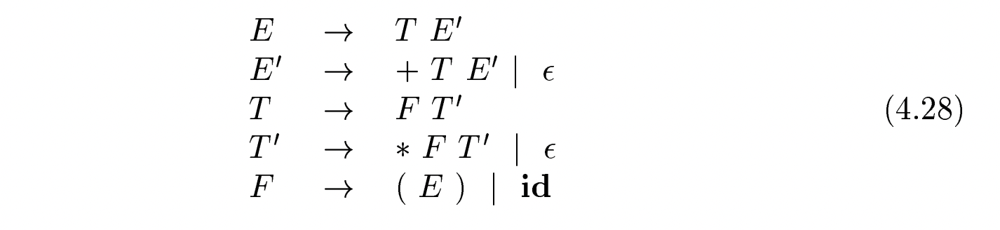
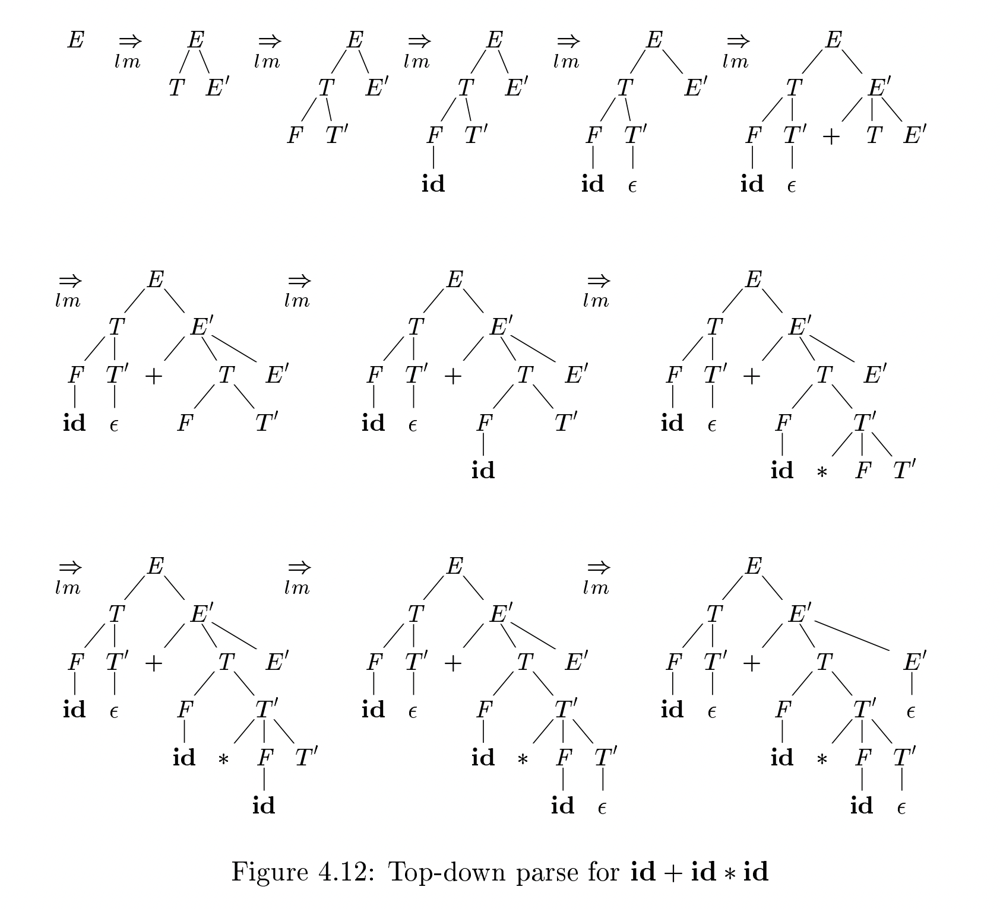
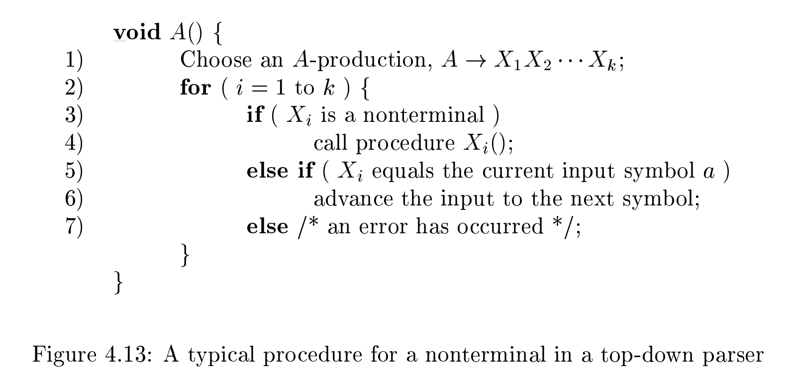
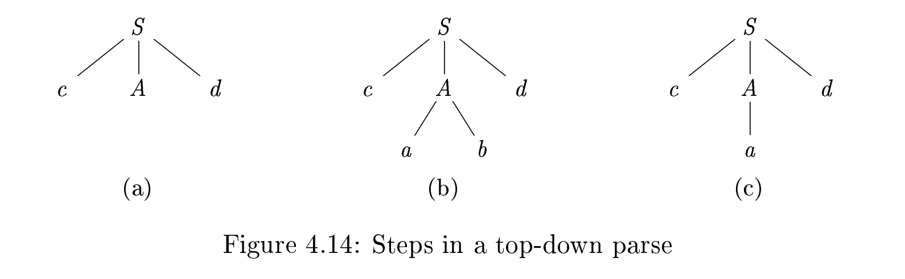
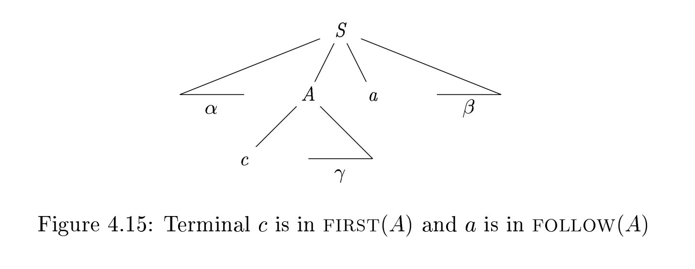

# 4.4 Top-Down Parsing

**Top-down parsing** can be viewed as the problem of constructing a **parse tree** for the input string, starting from the root and creating the nodes of the **parse tree** in **preorder** (depth-first ias discussed in Section 2.3.4). Equivalently, **top-down parsing** can be viewed as finding a **leftmost derivation** for an input string.

> NOTE: 
>
> 构建parse tree

## Example 4.27

**Example 4.27** : The sequence of **parse trees** in Fig. 4.12 for the input `id+id*id` is a **top-down parse** according to grammar (4.2), repeated here:

> NOTE:
>
> 一、grammar中，越是底层越是不可分，上述的`F`就是这样的一个例子

This sequence of trees corresponds to a **leftmost derivation** of the input.

At each step of a **top-down parse**, the key problem is that of determining the **production** to be applied for a **nonterminal**, say `A`. Once an A-productionis chosen, the rest of the parsing process consists of "matching" the **terminal symbols** in the **production body** with the input string.

The section begins with a general form of **top-down parsing**, called **recursive descent parsing**, which may require **backtracking** to find the correct **A-production** to be applied. Section 2.4.2 introduced **predictive parsing**, a special case of **recursive-descent parsing**, where no backtracking is required. Predictive parsing chooses the correct A-production by looking ahead at the input a fixed number of symbols, typically we may look only at one (that is, the **next input symbol**).

For example, consider the **top-down parse** in Fig. 4.12, which constructs a tree with two nodes labeled $E^{'}$. At the first $E^{'}$ node (in preorder), the production $E^{'} \to +T E^{'}$ is chosen; at the second $E^{'}$ node, the production $E^{'} \to \epsilon$ is chosen. A **predictive parser** can choose between $E^{'}$-productions by looking at the **next input symbol**.

> NOTE:
>
> 一、上面这段话需要结合 figure 4.12 进行阅读: "the first $E^{'}$ node"、"the second $E^{'}$ node" 都是指的 figure 4.12 中的节点

The class of grammars for which we can construct **predictive parsers** looking k symbols ahead in the input is sometimes called the **LL(k) class**. We discuss the **LL(1) class** in Section 4.4.3, but introduce certain computations, called `FIRST` and `FOLLOW`, in a preliminary Section 4.4.2. From the `FIRST` and `FOLLOW` sets for a grammar, we shall construct "**predictive parsing tables**," which make explicit the choice of production during **top-down parsing**. These sets are also useful during **bottom-up parsing**, as we shall see.

In Section 4.4.4 we give a **nonrecursive parsing algorithm** that maintains a **stack** explicitly, rather than implicitly via **recursive calls**. Finally, in Section 4.4.5 we discuss **error recovery** during **top-down parsing**.

## 4.4.1 Recursive-Descent Parsing 

A **recursive-descent parsing** program consists of a set of procedures, one for each nonterminal. Execution begins with the procedure for the **start symbol**, which halts and announces success if its procedure body scans the entire input string. Pseudocode for a typical nonterminal appears in Fig. 4.13. Note that this pseudocode is nondeterministic, since it begins by choosing the A-production to apply in a manner that is not specified.

> NOTE:
>
> 一、上面这段话中的"nondeterministic"如何理解？

General **recursive-descent** may require **backtracking**; that is, it may require repeated scans over the input. However, **backtracking** is rarely needed to parse programming language constructs, so backtracking parsers are not seen frequently. Even for situations like natural language parsing, backtracking is not very efficient, and tabular methods such as the dynamic programming algorithm of Exercise 4.4.9 or the method of Earley (see the bibliographic notes) are preferred.

> NOTE:
>
> 一、Exercise 4.4.9 就是 Earley algorithm

To allow backtracking, the code of Fig. 4.13 needs to be modied. First, we cannot choose a unique A-production at line (1), so we must try each of several productions in some order. Then, failure at line (7) is not **ultimate failure**, but suggests only that we need to return to line (1) and try another A-production. Only if there are no more A-productions to try do we declare that an input error has been found. In order to try another A-production, we need to be able to reset the **input pointer** to where it was when we first reached line (1). Thus, a **local variable** is needed to store this **input pointer** for future use.

## Example 4.29

Example 4.29 : Consider the grammar

To construct a **parse tree top-down** for the input string $w = cad$, begin with a tree consisting of a single node labeled S, and the **input pointer** pointing to `c`, the first symbol of `w`. `S` has only one production, so we use it to expand `S` and obtain the tree of Fig. 4.14(a). The **leftmost leaf**, labeled `c`, matches the first symbol of input `w`, so we advance the **input pointer** to `a`, the second symbol of `w`, and consider the next leaf, labeled `A`.

......

A **left-recursive grammar** can cause a **recursive-descent parser**, even one with backtracking, to go into an **infinite loop**. That is, when we try to expand a nonterminal `A`, we may eventually find ourselves again trying to expand A without having consumed any input.

## 4.4.2 FIRST and FOLLOW 

The construction of both **top-down** and **bottom-up** parsers is aided by two functions, FIRST and FOLLOW, associated with a grammar G. During topdown parsing, FIRST and FOLLOW allow us to choose which production to apply, based on the **next input symbol**. During **panic-mode error recovery**, sets of tokens produced by FOLLOW can be used as **synchronizing tokens**.

### FIRST

Define $FIRST(\alpha)$, where $\alpha$ is any string of grammar symbols, to be the set of terminals that begin strings derived from $\alpha$. If  $\alpha \xRightarrow {\text{*}} \epsilon$ , then $\epsilon$ is also in $FIRST(\alpha)$. For example, in Fig. 4.15, $A \xRightarrow {\text{*}} c\gamma$, so c is in FIRST(A).

This idea will be explored when **LL(1) grammars** are dened in Section 4.4.3.

### FOLLOW

Dene FOLLOW(A), for nonterminal A, to be the set of terminals a that canappear immediately to the right of A in some **sentential form**; that is, the set of terminals a such that there exists a derivation of the form $S \xRightarrow {\text{*}} \alpha A a \beta $, for some $\alpha$  and $\beta$, as in Fig. 4.15. Note that there may have been symbols between $A$ and $a$, at some time during the derivation, but if so, they derived $\epsilon$ and disappeared. In addition, if A can be the **rightmost symbol** in some **sentential form**, then `$` is in FOLLOW(A); recall that `$` is a special "endmarker" symbol that is assumed not to be a symbol of any grammar.

To compute FIRST(X) for all grammar symbols X, apply the following rules until no more terminals or  can be added to any FIRST set.

1、If `X` is a terminal, then $FIRST(X) = { X }$.

2、 If X is a nonterminal and $X \to Y_1 Y_2 \dots Y_k$ is a production for some $k \ge 1$, then place `a` in FIRST(X) if for some `i`, `a` is in $FIRST(Y_i)$, and $\epsilon$ is in all of $FIRST(Y_1), \dots ,FIRST(Y_{i-1})$; that is  $Y_1 \dots Y_{i-1} \xRightarrow {\text{*}} \epsilon$. 

> NOTE:
>
> recursive definition

3、If $X \to \epsilon$  is a production, then add $\epsilon$ to FIRST(X)
