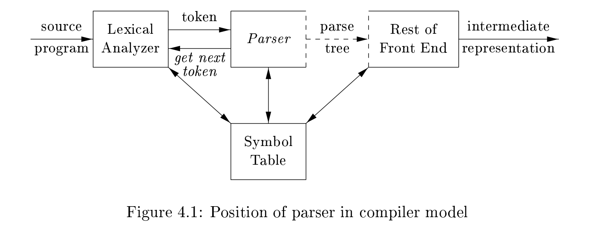
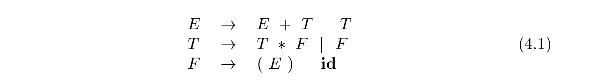
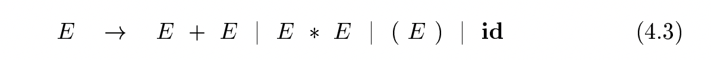

# Chapter 4 Syntax Analysis

> NOTE: 
>
> This chapter is mainly about algorithms of parsing or syntax analysis, I extend it to include algorithms  relevant to parsing in wikipedia which is listed in section **Wikipedia Parsing algorithms** 

This chapter is devoted to parsing methods that are typically used in compilers. We first present the basic concepts, then techniques suitable for **hand implementation**, and finally **algorithms that have been used in automated tools**. Since programs may contain syntactic errors, we discuss extensions of the parsing methods for **recovery from common errors**.

> NOTE:
>
> 一、"Since programs may contain syntactic errors, we discuss extensions of the parsing methods for recovery from common errors."
>
> topic: parser error handling "error recovery"
>
> 二、hand implementation、algorithm in automated tools

By design, every programming language has precise rules that prescribe the syntactic structure of well-formed programs. In C, for example, a program is made up of functions, a function out of declarations and statements, a statement out of expressions, and so on. The syntax of programming language constructs can be specied by **context-free grammars** or **BNF (Backus-Naur Form)** notation, introduced in Section 2.2. Grammars offer signicant benefits for both **language designers** and **compiler writers**.

1、A grammar gives a precise, yet easy-to-understand, syntactic specication of a programming language. 

2、From certain classes of grammars, we can construct automatically an efficient parser that determines the syntactic structure of a source program. As a side benefit, the parser-construction process can reveal **syntactic ambiguities** and trouble spots that might have slipped through the initial design phase of a language. 

> NOTE:
>
> 一、"From certain classes of grammars, we can construct automatically an efficient parser that determines the syntactic structure of a source program"
>
> 特定类型的grammar才能够自动化的构建parser，而不是所有的grammar

3、The structure imparted(给予、赋予) to a language by a properly designed grammar is useful for translating source programs into correct **object code** and for detecting errors. 

4、A grammar allows a language to be evolved or developed iteratively, by adding new constructs to perform new tasks. These new constructs can be integrated more easily into an implementation that follows the grammatical structure of the language.

## 4.1 Introduction 

In this section, we examine the way the parser fits into a typical compiler. We then look at typical grammars for arithmetic expressions. Grammars for expressions suffice for illustrating the essence of parsing, since parsing techniques for expressions carry over to most programming constructs. This section ends with a discussion of **error handling**, since the parser must respond gracefully to finding that its input cannot be generated by its grammar.

> NOTE:
>
> 一、topic: parser error handling

In our compiler model, the parser obtains a string of tokens from the **lexical analyzer**, as shown in Fig. 4.1, and verifies that the string of token names can be generated by the grammar for the source language. We expect the parser to report any **syntax errors** in an intelligible(易于理解的) fashion and to recover from commonly occurring errors to continue processing the remainder of the program. 

> NOTE:
>
> 一、"We expect the parser to report any **syntax errors** in an intelligible(易于理解的) fashion and to recover from commonly occurring errors to continue processing the remainder of the program"
>
> topic: parser error handling

Conceptually, for well-formed programs, the parser constructs a **parse tree** and passes it to the rest of the compiler for further processing. In fact, the parse tree need not be constructed explicitly, since **checking** and **translation actions** can be interspersed with parsing, as we shall see. Thus, the parser and the rest of the front end could well be implemented by a single module.

> NOTE:
>
> 一、"In fact, the parse tree need not be constructed explicitly, since checking and translation actions can be interspersed with parsing, as we shall see"
>
> attribute grammar、syntax-directed-translation
>
> "Thus, the parser and the rest of the front end could well be implemented by a single module"
>
> 这是使用 syntax-directed-translation 的优势
>
> 
>
> parser是front end的核心，它驱动着整个compiler-front-end: "since **checking** and **translation actions** can be interspersed with parsing"，这其实就是syntax-directed-translation

There are three general types of parsers for grammars: 

1、universal

Universal parsing methods such as the **Cocke-Younger-Kasami algorithm** and **Earley's algorithm** can parse any grammar (see the bibliographic notes). These general methods are, however, too inecient to use in production compilers.

2、top-down

As implied by their names, top-down methods buildparse trees from the top (root) to the bottom (leaves),

3、bottom-up

bottom-up methods start from the leaves and work their way up to the root

In either case, the input to the parser is scanned from left to right, one symbol at a time.

The most efficient top-down and bottom-up methods work only for subclasses of grammars, but several of these classes, particularly, LL and LR grammars, are expressive enough to describe most of the syntactic constructs in modern programming languages. Parsers implemented by hand often use LL grammars; for example, the predictive-parsing approach of Section 2.4.2 works for LL grammars. Parsers for the larger class of LR grammars are usually constructed using automated tools. 

In this chapter, we assume that the output of the parser is some representation of the **parse tree** for the stream of tokens that comes from the **lexical analyzer**. In practice, there are a number of tasks that might be conducted during parsing, such as collecting information about various tokens into the **symbol table**, performing type checking and other kinds of **semantic analysis**, and **generating intermediate code**. We have lumped all of these activities into the rest of the front end" box in Fig. 4.1. These activities will be covered indetail in subsequent chapters.

> NOTE:
>
> 一、syntax-directed-translation:
>
> 1、**generate symbol table** 
>
> 2、**semantic analysis: type checking**
>
> 3、**generate intermediate code**

### 4.1.2 Representative Grammars 

> NOTE:
>
> 一、标题的含义是"代表性的文法"

Some of the grammars that will be examined in this chapter are presented here for ease of reference. Constructs that begin with keywords like **while** or **int**, are relatively easy to parse, because the keyword guides the choice of the **grammar production** that must be applied to match the input. We therefore concentrate on expressions, which present more of challenge, because of the **associativity** and **precedence** of operators

> NOTE:
>
> 一、"**grammar production**"中"production"的含义是产生式

**Associativity** and **precedence** are captured in the following grammar, whichis similar to ones used in Chapter 2 for describing **expressions**, **terms**, and **factors**. `E` represents expressions consisting of **terms** separated by `+` signs, `T` represents **terms** consisting of **factors** separated by `*` signs, and `F` represents **factors** that can be either parenthesized expressions or identiers:

**Expression grammar** (4.1) belongs to the class of **LR grammars** that are suitable for **bottom-up parsing**. This grammar can be adapted to handle additional operators and additional levels of **precedence**. However, it cannot be used for **top-down parsing** because it is **left recursive**.

The following **non-left-recursive** variant of the **expression grammar** (4.1) will be used for **top-down parsing**:

The following grammar treats + and `*` alike, so it is useful for illustrating techniques for handling ambiguities during parsing:

Here, `E` represents expressions of all types. Grammar (4.3) permits more thanone **parse tree** for expressions like `a + b * c`.

### 4.1.3 Syntax Error Handling 

The remainder of this section considers the nature of **syntactic errors** and general strategies for error recovery. Two of these strategies, called **panic-mode** and **phrase-level recovery**, are discussed in more detail in connection with specic parsing methods.

The precision of parsing methods allows syntactic errors to be detected very effciently. Several parsing methods, such as the LL and LR methods, detect an error as soon as possible; that is, when the stream of tokens from the **lexical analyzer** cannot be parsed further according to the grammar for the language. More precisely, they have the ***viable-prefix property***(可行性前缀属性), meaning that they detect that an error has occurred as soon as they see a prefix of the input that cannot be completed to form a string in the language.

Another reason for emphasizing **error recovery** during parsing is that many errors appear syntactic, whatever their cause, and are exposed when parsing cannot continue. A few **semantic errors**, such as **type mismatches**, can also be detected efficiently; however, accurate detection of semantic and logical errors at compile time is in general a difficult task.

The error handler in a parser has goals that are simple to state but challenging to realize: 

1、Report the presence of errors clearly and accurately.  

2、Recover from each error quickly enough to detect subsequent errors.  

3、Add minimal overhead to the processing of correct programs.

### 4.1.4 Error-Recovery Strategies 

Once an error is detected, how should the parser recover? 

