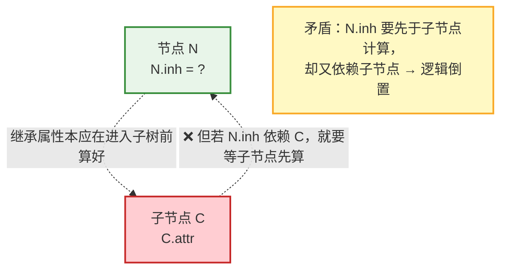
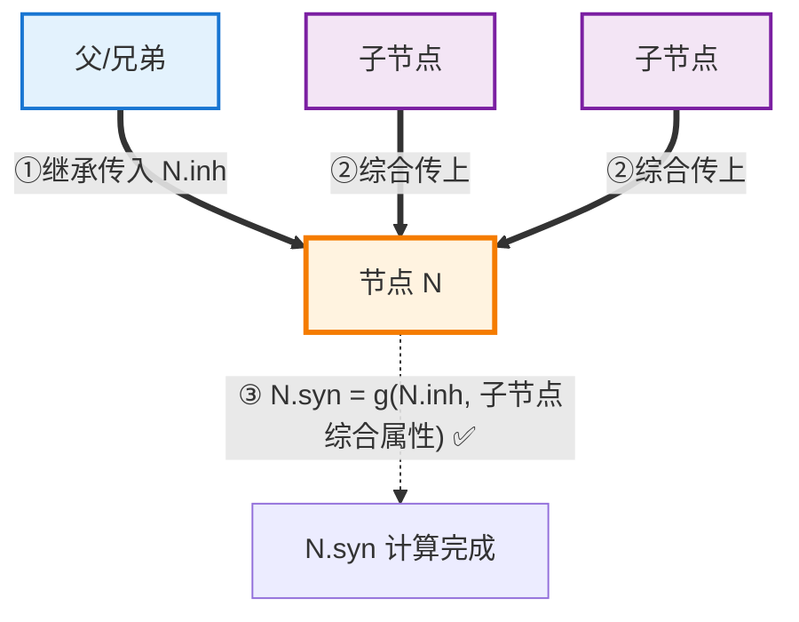
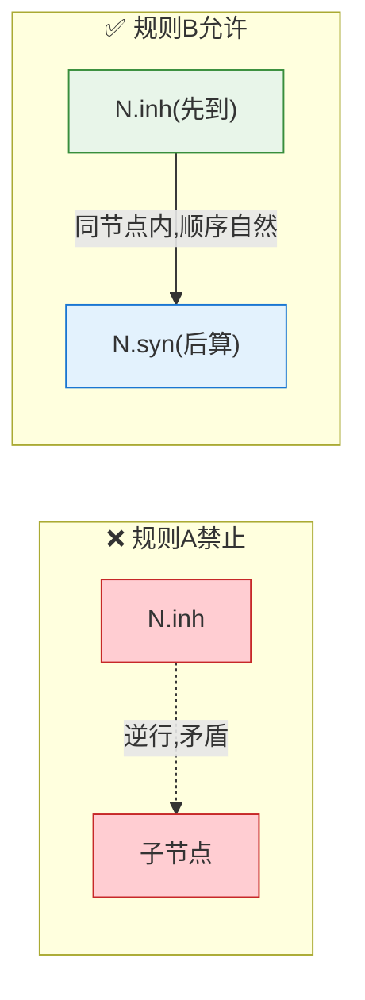

# 关于属性定义规则的两条精妙约定

## 一、先把两条规则翻译清楚

原文：

> While we do not allow an **inherited attribute** at node $N$ to be defined in terms of attribute values at the **children** of node $N$, we do allow a **synthesized attribute** at node $N$ to be defined in terms of **inherited attribute** values at node $N$ itself.

拆成两条：

| 规则           | 内容                                        | 性质   |
| ------------ | ----------------------------------------- | ---- |
| **规则 A（禁止）** | 节点 $N$ 的**继承属性** ❌ 不能用 $N$ 的**子节点**的属性来定义 | 一条红线 |
| **规则 B（允许）** | 节点 $N$ 的**综合属性** ✅ 可以用 $N$ **自身的继承属性**来定义 | 一条许可 |

上述两条规则精确地界定了属性定义的**边界**。这两条约定看似不对称，实则蕴含深刻的设计智慧。让我逐条剖析。

## 二、规则 A：为什么禁止继承属性依赖子节点？

### 2.1 这其实就是"继承属性的唯一红线"

回顾继承属性的定义——它的合法来源是 $\{$父节点, 自身, 兄弟$\}$。**"不能来自子节点"正是区分继承与综合的根本判据**：

```
继承属性依赖子节点？
    ↓
如果允许，它就变成了【综合属性】(综合=来自子节点)
    ↓
两个概念就混淆了，失去了区分的意义
```

### 2.2 更深层原因：会破坏求值顺序的确定性

继承属性的设计初衷是**"进入子树之前"就算好**（像传入的参数）。如果它反过来依赖子节点，就会产生**方向矛盾**：



> **核心**：继承属性 = "进子树前的参数"，若允许它依赖子节点，等于"参数要靠函数体的结果才能算出来"，逻辑上本末倒置，极易造成循环依赖。

---

## 三、规则 B：为什么允许综合属性依赖自身的继承属性？

这是这段话**最精妙、最容易被忽略**的一点。

### 3.1 直觉：先"收到参数"，再"算返回值"

一个节点在树遍历中的处理是有**时间顺序**的：

```
进入节点 N (自上而下)
    ↓
    ① 先接收父/兄弟传来的【继承属性】N.inh   (像函数收到参数)
    ↓
    ② 处理子树，收集子节点的【综合属性】     (像执行函数体)
    ↓
    ③ 计算 N 的【综合属性】N.syn            (像算返回值)
        —— 此时 N.inh 早已就绪，当然可以用它!
    ↓
返回上层 (自下而上)
```

**关键**：当计算 $N$ 的综合属性时，$N$ 自身的继承属性**早已在进入节点时算好了**，所以拿来用完全合理、没有任何顺序冲突。

### 3.2 图示



$N.syn$ 可以同时依赖：

- $N.inh$（自身继承属性，已就绪）✅
- 子节点的综合属性 ✅

---

## 四、两条规则的对称性分析

把"信息流动方向"和"时间先后"放在一起看，就理解了为何一禁一允：

| 场景                               | 依赖方向             | 时间关系              | 是否合法     |
| -------------------------------- | ---------------- | ----------------- | -------- |
| $N$ 的**继承**属性 ← 依赖**子节点**        | 与继承的"向下"方向**逆行** | 要求子节点先算，与"进子树前"矛盾 | ❌ **禁止** |
| $N$ 的**综合**属性 ← 依赖 $N$ 的**继承**属性 | 都在**同一节点** $N$ 内 | 继承先到、综合后算，顺序自然    | ✅ **允许** |



---

## 五、一个具体例子：$N.syn$ 用到 $N.inh$

回到类型声明文法，观察 $L \to \textbf{id}$ 这条规则。假设我们扩展它，让 $L$ 同时带一个综合属性 $L.count$（统计已声明变量数）和继承属性 $L.inh$（类型），并让综合属性引用继承属性做检查：

$$
L \to \textbf{id} \qquad
\begin{cases}
\text{addType}(\textbf{id}.entry,\ L.inh) & \text{使用继承属性} \\
L.syn = L.inh & \text{综合属性引用了自身的继承属性 ✅}
\end{cases}
$$

这里 $L.syn = L.inh$——综合属性（要向上传）直接用了自身的继承属性（从上/左传入的）。这**完全合法**，因为 $L.inh$ 在处理这个 $L$ 节点时早已就绪。

### 更典型的场景：代码生成中的 code 属性

在控制流代码生成中，节点的**综合属性 `code`**（生成的代码串，向上汇报）常常需要用到**继承属性**（如标签 `next`、`true`、`false`）：

$$
S \to \textbf{if}\ (E)\ S_1\ \textbf{else}\ S_2
$$

$$
S.code = E.code \parallel label(E.true) \parallel S_1.code \parallel gen(\text{'goto'}\ S.next) \parallel \dots
$$

- $S.code$ 是**综合属性**（向上传递生成的代码）
- 它用到了 $S.next$（**继承属性**）来生成 `goto` 目标
- ✅ 这正是"综合属性依赖自身继承属性"的实战应用

---

## 六、这对 L-属性定义意味着什么

这两条规则恰好是 **L-属性定义能够"一趟遍历"完成计算**的理论基础：

```
自顶向下遍历到节点 N 时：
    ① 继承属性 N.inh 已由父/左兄弟备好 (规则A保证不会反向依赖子节点)
    ② 递归处理子节点
    ③ 回到 N 时，用 N.inh + 子节点综合属性 算出 N.syn (规则B允许)
        ↓
    整个过程一趟深度优先遍历即可完成，无循环依赖
```

- **规则 A** 保证了继承属性不会"向下反依赖"，从而不破坏自上而下的传递方向
- **规则 B** 保证了综合属性能充分利用已有的继承上下文，使一趟遍历既能"下传"又能"上收"

---

## 七、总结

```
两条约定的本质：

规则A (禁止)：N.inh ❌ 不能依赖 N 的子节点
    原因：继承属性=进子树前的"参数"，
          若依赖子节点则方向倒置、逻辑矛盾，
          且依赖子节点者按定义就是综合属性

规则B (允许)：N.syn ✅ 可以依赖 N 自身的 N.inh
    原因：同一节点内，继承属性先到位、综合属性后计算，
          时间顺序天然相容，无冲突

统一视角：
    节点处理的时间线 = 先收继承(参数) → 处理子树 → 算综合(返回值)
        ↓
    综合可用继承(后者用前者) ✅
    继承不可用子节点(逆时序) ❌
```

> 📌 **核心洞察**：这两条看似不对称的约定，背后是**同一个时间逻辑**——把语法树节点的处理想象成一次函数调用：**继承属性是"传入的参数"，在进入节点时就已备好；综合属性是"返回值"，在处理完子树后才计算**。于是一切豁然开朗：**规则 B 允许"综合依赖自身继承"**，因为算返回值时参数早就在手里了（$S.code$ 用 $S.next$ 生成 goto 就是典型）；而**规则 A 禁止"继承依赖子节点"**，因为那等于要求"传入参数得靠函数执行结果才能算出"，时序上本末倒置，还会与"继承属性=综合属性"的定义边界冲突。这两条规则共同构成了 **L-属性定义可以一趟深度优先遍历完成**的基石——下行时把继承属性当参数传下去，上行时把综合属性当返回值收上来，参数与返回值在每个节点内和谐共处，整棵树的属性便能无循环、有序地一次算完。


