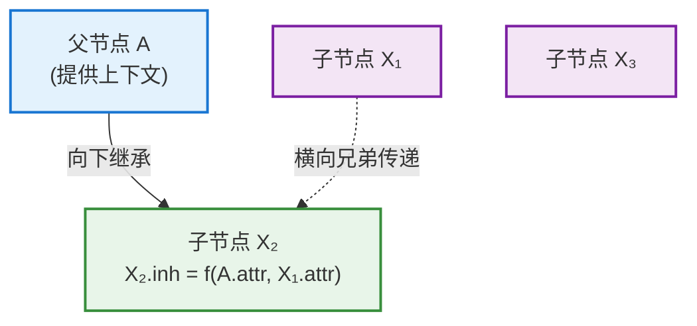
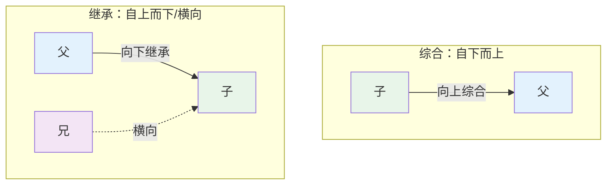
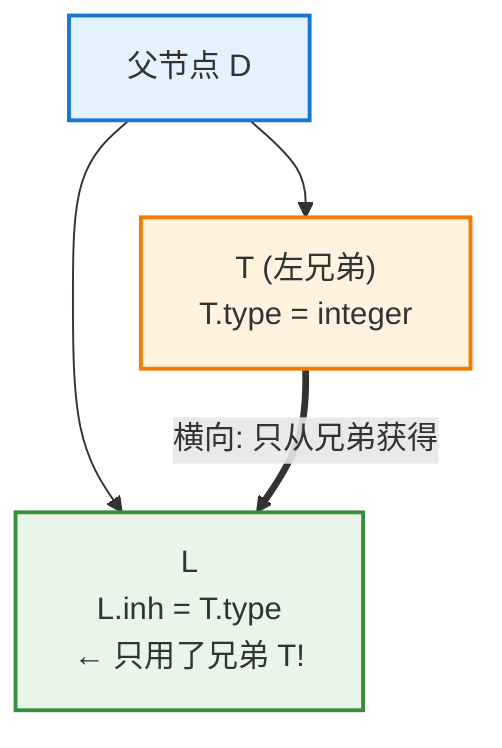
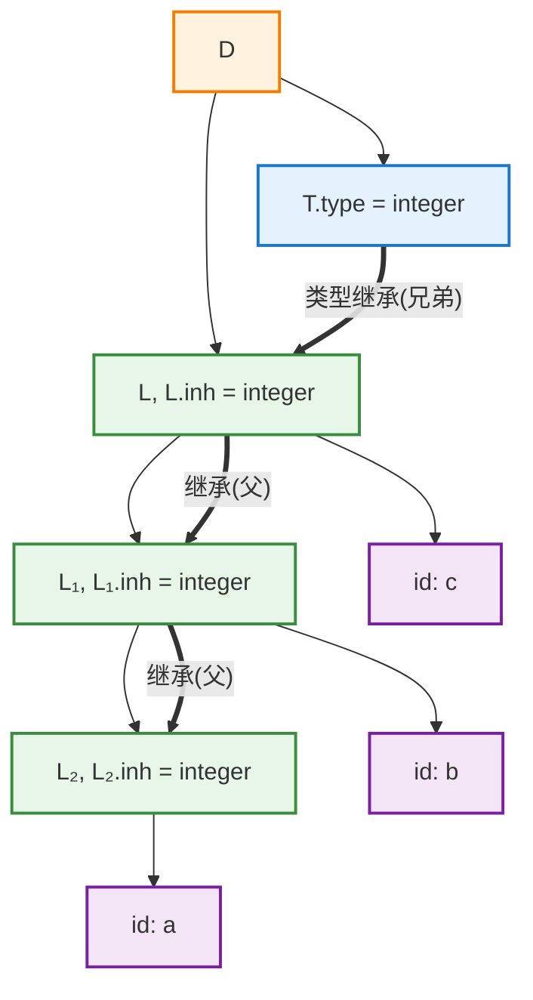
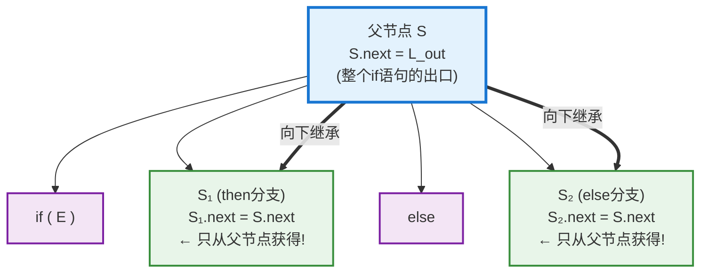
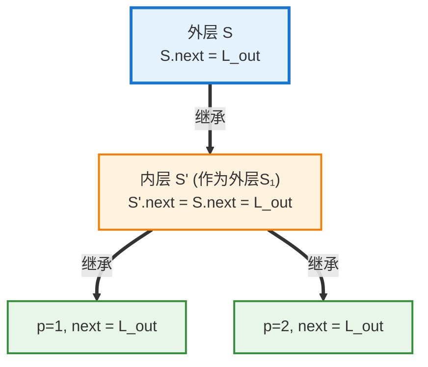
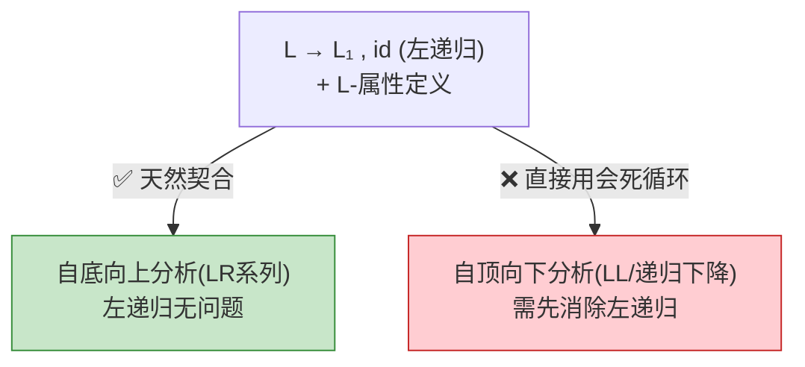
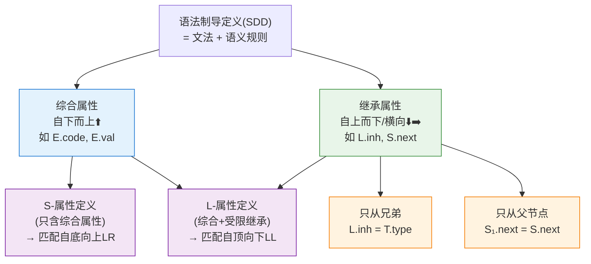

# 继承属性（Inherited Attribute）完全指南

> 本文档系统整理语法制导翻译中**继承属性**的定义、来源、典型模式、与综合属性的对比、以及文法实现中的注意事项，配以完整实例。

---

## 目录

1. [基本概念](#一基本概念)
2. [继承属性的合法来源](#二继承属性的合法来源核心)
3. [综合属性 vs 继承属性](#三综合属性-vs-继承属性)
4. [典型模式一：只从兄弟获得](#四典型模式一只从兄弟获得类型声明)
5. [典型模式二：只从父节点获得](#五典型模式二只从父节点获得控制流标签)
6. [文法实现的注意事项](#六文法实现的注意事项左递归问题)
7. [属性文法全景图](#七属性文法全景图)
8. [总结](#八总结)

---

## 一、基本概念

### 1.1 定义

> **继承属性（Inherited Attribute）**：产生式**体部**某个文法符号的属性值，由该节点的**父节点**、**兄弟节点**（以及该节点**自身**）计算得到。

**关键特征——信息"自上而下 / 横向"流动：**

```
        父节点 (提供上下文信息)
       ╱   │   ╲
      ↓    ↓    ↓  继承属性向下 / 横向传递
    子节点1 → 子节点2 → 子节点3
        (兄弟之间也可传递)
```

对于产生式 $A \to X_1 X_2 \dots X_n$，如果某个 $X_i$ 的属性由 $A$、其他 $X_j$（$j \ne i$）计算得出，那么它就是 $X_i$ 的**继承属性**。



### 1.2 为什么需要继承属性

**因为有些信息天生"从左到右"或"从上到下"流动，综合属性无法表达。**

```
场景：int a, b, c
    类型 int 在左边，变量在右边
        ↓
    综合属性(自下而上)无法把左边的类型送到右边的变量
        ↓
    必须用继承属性，让类型信息"向下、横向"流动
```

**常见应用场景：**

```
✅ 类型检查      —— 把声明的类型传播给使用处
✅ 符号表传递    —— 把当前作用域信息传给子结构
✅ 数组维度计算  —— 把外层维度传给内层
✅ 代码生成上下文—— 把标签、地址、寄存器分配信息向下传
✅ 格式/缩进     —— 把当前缩进层级传给子节点
```

---

## 二、继承属性的合法来源（核心）

### 2.1 龙书的精确定义

> An **inherited attribute** at node $N$ is defined only in terms of attribute values at **$N$'s parent, $N$ itself, and $N$'s siblings**.

即继承属性的合法来源有**三类**：

$$
\text{继承属性的值} = f(\ \underbrace{\text{父节点}}_{\text{parent}},\ \underbrace{\text{自身}}_{\text{itself}},\ \underbrace{\text{兄弟节点}}_{\text{siblings}}\ )
$$

**⚠️ 关键澄清**：定义用"and"列举的是**允许的来源集合**，**不要求同时用到全部三类**。因此以下都合法：

```
✅ 只从父节点           —— 合法
✅ 只从兄弟节点          —— 合法
✅ 只从自身其他属性      —— 合法
✅ 父+兄弟 混合          —— 合法
唯一的红线:
❌ 从【子节点】获得      —— 那就变成综合属性了，不再是继承属性
```

### 2.2 唯一判据

> **区分综合 vs 继承的唯一标准**：是否来自子节点。
> 
> - 来自**子节点** → 综合属性
> - 来自**非子节点**（父/兄弟/自身） → 继承属性

### 2.3 合法来源全景图

```mermaid
graph TB
    subgraph 产生式 A → X₁ X₂ X₃
        A["父节点 A"]:::allowed
        X1["X₁ (左兄弟)"]:::allowed
        X2["X₂ ← 求它的继承属性"]:::target
        X3["X₃ (右兄弟)"]:::allowedR
        child["X₂ 的子节点"]:::forbidden

        A -->|"✅ 父→子"| X2
        X1 -.->|"✅ 左兄弟(L-属性推荐)"| X2
        X3 -.->|"✅ 右兄弟(合法,但破坏L-属性)"| X2
        child -->|"❌ 用子节点=综合属性"| X2
    end

    classDef allowed fill:#c8e6c9,stroke:#388e3c,stroke-width:2px;
    classDef allowedR fill:#fff9c4,stroke:#f9a825,stroke-width:2px;
    classDef target fill:#e3f2fd,stroke:#1976d2,stroke-width:3px;
    classDef forbidden fill:#ffcdd2,stroke:#c62828,stroke-width:2px;
```

| 来源      | 是否合法作继承属性 | 备注                         |
| ------- | --------- | -------------------------- |
| 父节点     | ✅         | 常见                         |
| 左兄弟     | ✅         | **最典型，L-属性核心**             |
| 右兄弟     | ✅         | 合法，但会**破坏 L-属性**，不能一趟从左到右算 |
| 自身其他属性  | ✅         | 可以                         |
| **子节点** | ❌         | 用了子节点就成了**综合属性**           |

---

## 三、综合属性 vs 继承属性

### 3.1 对比总表

| 维度                        | 综合属性（Synthesized） | 继承属性（Inherited）      |
| ------------------------- | ----------------- | -------------------- |
| **值来自**                   | **子节点**（+ 自身）     | **父节点、兄弟节点**（+ 自身）   |
| **信息流向**                  | 自下而上 ⬆️           | 自上而下 / 横向 ⬇️➡️       |
| **在产生式 $A \to \alpha$ 中** | 计算**头部** $A$ 的属性  | 计算**体部**符号 $X_i$ 的属性 |
| **典型用途**                  | 求值、代码生成、返回结果      | 传递上下文、类型、符号表信息       |
| **计算时机**                  | 子树处理完**之后**       | 进入子树**之前**           |
| **类比**                    | 函数的"返回值"          | 函数的"传入参数"            |

### 3.2 方向对偶图



### 3.3 函数调用类比

```
综合属性 ≈ 函数的【返回值】(return)   —— 计算完把结果交给上层
继承属性 ≈ 函数的【参数】  (parameter)—— 上层把上下文传进来

int addType(entry, inh_type):   # inh_type 是继承(参数传入)
    ...
    return result               # result 是综合(返回给上层)
```

---

## 四、典型模式一：只从兄弟获得（类型声明）

### 4.1 场景

处理声明语句 `int a, b, c`：类型 `int` 出现在最左边，但需作用于右边**每一个变量**。类型信息必须从左向右传递——这是继承属性的经典用武之地。

### 4.2 文法与 SDD

| 产生式                      | 语义规则                                                          | 属性类型           |
| ------------------------ | ------------------------------------------------------------- | -------------- |
| $D \to T\ L$             | $L.inh = T.type$                                              | **继承（只从兄弟）** ⭐ |
| $T \to \textbf{int}$     | $T.type = \text{integer}$                                     | 综合             |
| $T \to \textbf{float}$   | $T.type = \text{float}$                                       | 综合             |
| $L \to L_1, \textbf{id}$ | $L_1.inh = L.inh$; $\text{addType}(\textbf{id}.entry, L.inh)$ | **继承（只从父节点）**  |
| $L \to \textbf{id}$      | $\text{addType}(\textbf{id}.entry, L.inh)$                    | 使用继承值          |

### 4.3 核心分析：$L.inh = T.type$ 是"只从兄弟获得"



- $L.inh$ 的值 $= T.type$，而 $T$ 是 $L$ 的**左兄弟**
- **完全没有用到父节点 $D$ 的任何属性**
- ✅ 这是"只从兄弟节点获得"的继承属性实例

### 4.4 完整注释语法树



**信息流动**：`integer` 从 $T$（综合向上）→ $L$（横向继承）→ $L_1$ → $L_2$（向下继承），像接力棒传给每个变量。

---

## 五、典型模式二：只从父节点获得（控制流标签）

### 5.1 场景

代码生成中，一条语句执行完需知道**接下来跳到哪里**（用属性 `next` 表示）。语句自己不知道，这取决于它被嵌入的**外层结构（父节点）**，因此 `next` 必须从父节点向下继承。

### 5.2 文法与 SDD

$$
S \to \textbf{if}\ (E)\ S_1\ \textbf{else}\ S_2
$$

| 语义规则                          | 属性类型   | 来源              |
| ----------------------------- | ------ | --------------- |
| $E.true = \text{newlabel}()$  | 局部     | 新建标签            |
| $E.false = \text{newlabel}()$ | 局部     | 新建标签            |
| $S_1.next = S.next$           | **继承** | **只从父节点 $S$** ⭐ |
| $S_2.next = S.next$           | **继承** | **只从父节点 $S$** ⭐ |
| $S.code = \dots$              | 综合     | 拼接子节点代码         |

### 5.3 核心分析：信息纯粹从父节点向下流动



- $S_1.next$、$S_2.next$ 都是继承属性，值均 $= S.next$（父节点）
- **完全没有用到兄弟节点**（$S_1$、$S_2$ 互不引用）
- ✅ 这是"只从父节点获得"的继承属性实例

### 5.4 代码生成演示

源码：

```c
if (x > 0)
    y = 1;      // S₁
else
    y = 2;      // S₂
// L_out
```

生成的三地址码：

```
        if x > 0 goto L1
        goto L2
L1:     y = 1                   // S₁ 的代码
        goto L_out              // 跳到 S₁.next (= S.next = L_out)
L2:     y = 2                   // S₂ 的代码
        goto L_out              // 跳到 S₂.next (= S.next = L_out)
L_out:  ...
```

**关键观察**：两个分支殊途同归，`goto L_out` 的目标都是从父节点继承来的 `S.next`。

### 5.5 嵌套时的接力传递



`L_out` 像接力棒从最外层父节点穿透多层嵌套，每层的 `next` 都**只从其父节点获得**。

### 5.6 两种模式对比

| 例子        | 语义规则                | 继承属性来源          | 适用场景          |
| --------- | ------------------- | --------------- | ------------- |
| **类型声明**  | $L.inh = T.type$    | **只从兄弟**（横向）➡️  | 同层级、从左到右的信息传递 |
| **控制流标签** | $S_1.next = S.next$ | **只从父节点**（向下）⬇️ | 从外到内、嵌套上下文下传  |

> 两者都合法，因为都**不来自子节点**。

---

## 六、文法实现的注意事项：左递归问题

### 6.1 两个独立维度

继承属性的实现常涉及一个易混淆的要点——**"L-属性定义"与"左递归"是两个独立维度**：

| 概念         | 描述的对象                      | 类型声明文法的情况                       |
| ---------- | -------------------------- | ------------------------------- |
| **L-属性定义** | **属性依赖**方向（继承属性只依赖父节点/左兄弟） | ✅ 满足                            |
| **左递归**    | **文法结构**（产生式形状）            | ⚠️ 存在（$L \to L_1, \textbf{id}$） |

> 一个文法**可以同时是** L-属性定义**又是**左递归的。

### 6.2 L-属性定义

> **L-属性定义（L-Attributed Definition）**：允许综合属性 + 受限的继承属性——每个继承属性只能依赖它**父节点**及**左边**的兄弟节点。

```
"L" = Left（从左到右）
    ↓
继承属性只依赖【父节点】和【左侧】已处理的符号
    ↓
保证可以【从左到右一趟】完成属性计算
    ↓
恰好匹配【自顶向下】和【递归下降】分析
```

### 6.3 左递归对不同分析方法的影响



### 6.4 消除左递归后的等价文法（适合递归下降）

$$
\begin{aligned}
D &\to T\ L \\
T &\to \textbf{int} \mid \textbf{float} \\
L &\to \textbf{id}\ L' \\
L' &\to , \textbf{id}\ L' \mid \varepsilon
\end{aligned}
$$

| 产生式                          | 语义规则                                                             |
| ---------------------------- | ---------------------------------------------------------------- |
| $D \to T\ L$                 | $L.inh = T.type$                                                 |
| $L \to \textbf{id}\ L'$      | $L'.inh = L.inh$; $\text{addType}(\textbf{id}.entry, L.inh)$     |
| $L' \to , \textbf{id}\ L'_1$ | $L'_1.inh = L'.inh$; $\text{addType}(\textbf{id}.entry, L'.inh)$ |
| $L' \to \varepsilon$         | （无动作）                                                            |

此版本无左递归、仍是 L-属性定义，变量按 a→b→c 从左到右自然处理，可直接用递归下降实现。

---

## 七、属性文法全景图



| 概念        | 信息流向      | 类比  | 典型例子                |
| --------- | --------- | --- | ------------------- |
| 综合属性      | 子 → 父（向上） | 返回值 | $E.code$, $E.val$   |
| 继承属性（从兄弟） | 兄 → 弟（横向） | —   | $L.inh = T.type$    |
| 继承属性（从父）  | 父 → 子（向下） | 参数  | $S_1.next = S.next$ |

---

## 八、总结

```
继承属性（Inherited Attribute）核心要点：

1. 定义：体部符号的属性 = f(父节点, 自身, 兄弟节点)
        信息【自上而下 / 横向】流动

2. 合法来源：{父节点, 自身, 兄弟} 的任意组合
        唯一红线：❌ 不能来自子节点(否则就是综合属性)

3. 两大典型模式：
        • 只从兄弟：L.inh = T.type    (类型声明,横向传递)
        • 只从父节点：S₁.next = S.next (控制流,嵌套下传)

4. 实现注意：
        • L-属性定义(依赖父+左兄弟) → 契合递归下降
        • 但要区分"左递归"(文法结构问题) → 递归下降前需消除
```

> 📌 **核心洞察**：继承属性与综合属性构成属性文法的一对孪生概念，本质区别仅在于**信息流动方向**——综合属性把子节点信息"向上汇报"给父节点（像返回值），继承属性把父节点、兄弟节点的上下文"向下/横向传递"给子节点（像参数）。理解继承属性有三个关键层次：**第一**，它的合法来源是"父节点、自身、兄弟"的任意组合，真正的分界线只有一条——不能来自子节点；**第二**，它有两大典型模式，"从兄弟获得"擅长同层级从左到右的横向传递（如类型作用于后续变量），"从父节点获得"擅长从外到内的嵌套上下文下传（如控制流标签、作用域）；**第三**，实现时要分清"L-属性定义"（属性依赖性质）与"左递归"（文法结构性质）这两个独立维度，前者契合递归下降，后者若存在则需先消除。掌握了"向上综合 / 向下·横向继承"这个方向对偶，以及"唯一红线是子节点"这个判据，就抓住了整个属性文法的灵魂。
