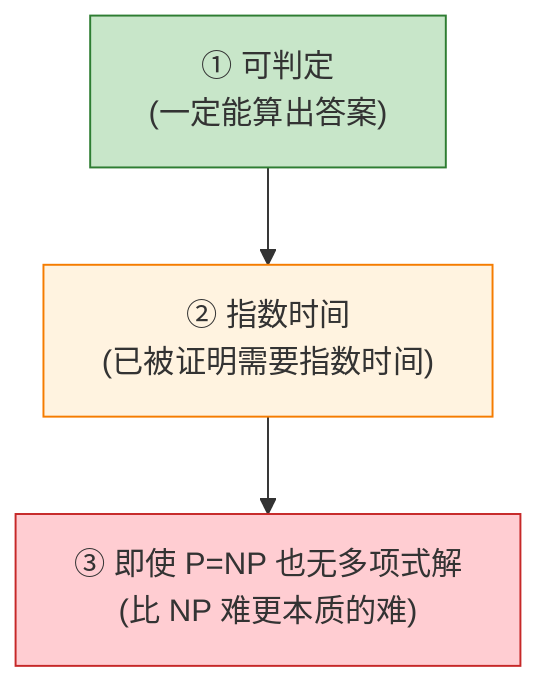
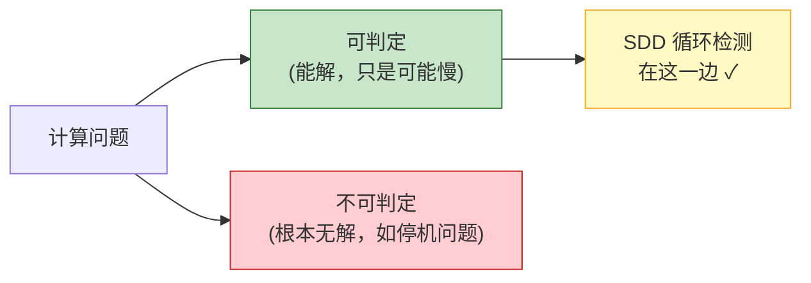
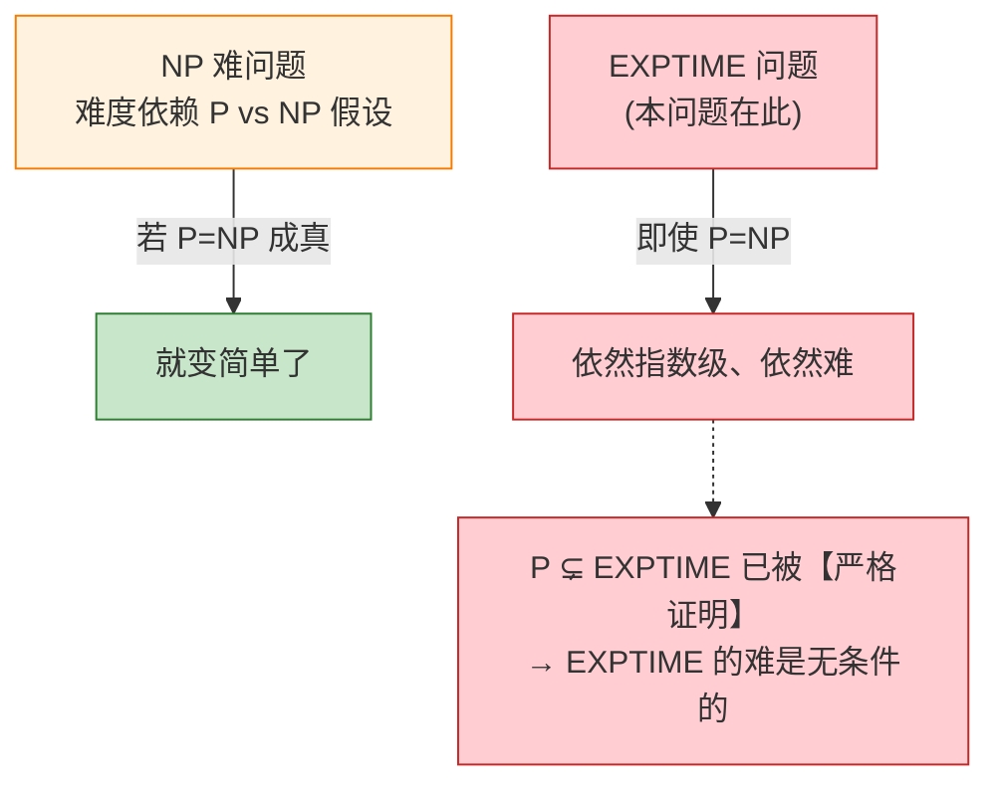
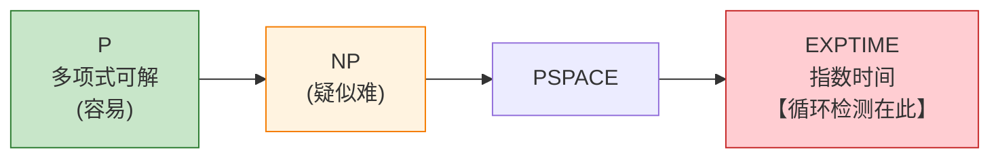
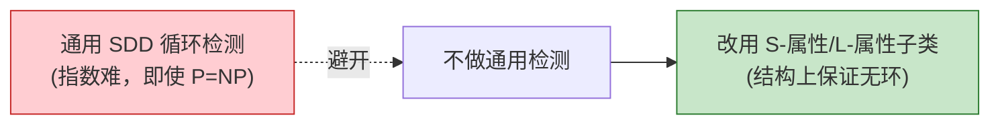

# SDD 循环依赖判定：为什么"即使 P = NP 也难解"

本文围绕编译原理经典教材《Compilers: Principles, Techniques, and Tools》（龙书）5.1 节中关于 SDD（语法制导定义）循环依赖判定的论述及其脚注展开，系统解释**"为何判定 SDD 是否存在属性循环在计算上十分困难"**——从问题本身（文法递归性与无穷分析树）、到计算复杂度层级（可判定但指数时间、"even if P = NP"的深意）、再到编译工程领域的应对方案（S-属性与 L-属性子类）。

---

## 目录

1. [问题背景：SDD 中的循环依赖是什么](#一问题背景sdd-中的循环依赖是什么)
2. [文法的递归性：无穷多分析树的根源](#二文法的递归性无穷多分析树的根源)
3. [两个层次的问题：单图判环 vs 全域存在性判定](#三两个层次的问题单图判环-vs-全域存在性判定)
4. [复杂度结论第一层：可判定（Decidable）](#四复杂度结论第一层可判定decidable)
5. [复杂度结论第二层：指数时间（内在的）](#五复杂度结论第二层指数时间内在的)
6. [复杂度结论第三层："即使 P = NP" 的深意](#六复杂度结论第三层即使-p--np-的深意)
7. [复杂度类的层级图](#七复杂度类的层级图)
8. [工程实践：采用天然无环的 SDD 子类](#八工程实践采用天然无环的-sdd-子类)
9. [总结](#九总结)

---

## 一、问题背景：SDD 中的循环依赖是什么

SDD 是在文法产生式上附加**语义规则（属性计算规则）**的一种形式化描述。每个文法符号可以有若干**属性（attributes）**，这些属性之间通过语义规则相互依赖。

- 属性的计算需要有一个**求值顺序**：某个属性的值可能依赖于其他属性的值。
- **循环性（circularity）** 指的是属性之间的依赖关系形成了环，例如：属性 A 依赖于 B，而属性 B 又（直接或间接）依赖于 A。

如果存在这样的循环依赖，就**无法找到任何合法的求值顺序**，因为每个属性都在等待对方先算出来。

龙书指出：

> **"It is computationally difficult to determine whether... circularities exist"**

判断一个 SDD 在**它可能生成的所有语法分析树**中是否存在循环，是一个**计算上非常困难**的问题。而脚注给出了更精确的复杂度论断：

```
脚注原文：
"while the problem is decidable, it cannot be solved by a
 polynomial-time algorithm, even if P = NP, since it has
 exponential time complexity."
        ↓ 拆解为三个层层递进的论断 ↓

论断①：这个问题是【可判定的】(decidable)
        → 存在算法，一定能给出正确答案并停机

论断②：它有【指数时间复杂度】(exponential time)
        → 不是"可能慢"，而是【被证明】需要指数时间

论断③：因此【即使 P = NP 成立】，也【不可能】有多项式算法
        → 它的难，独立于 P vs NP 这个未解之谜
```



> 很多人会把"计算困难"笼统理解成"NP 难"，但脚注特意强调——**这个问题的难，是一种比 NP 难更彻底、更本质的难**。下面从问题本身开始，逐层拆解。

---

## 二、文法的递归性：无穷多分析树的根源

SDD 循环判定之所以无法通过穷举解决，最基础的原因是：**一套实用的上下文无关文法，能够生成无穷多棵结构不同的分析树**，因此无法通过逐棵检查的方式完成全域判定。

### 2.1 递归产生式：无限结构的核心机制

上下文无关文法中，若某个非终结符可以通过推导重新得到自身，该文法就具备递归性。递归是文法描述"可无限扩展、无限嵌套"结构的核心手段。

以最简递归文法为例：

```
S → aS | a
```

通过递归产生式 `S → aS`，可以推导出长度任意的字符串：

- 1 步推导：`S ⇒ a`，对应字符串 `a`
- 2 步推导：`S ⇒ aS ⇒ aa`，对应字符串 `aa`
- 3 步推导：`S ⇒ aS ⇒ aaS ⇒ aaa`，对应字符串 `aaa`
- ……

每一个长度不同的字符串，都对应一棵高度、节点数不同的分析树；字符串数量无穷，分析树的总数也必然是无穷的。

### 2.2 编程语言文法的天然递归属性

所有描述程序设计语言的文法，必然包含递归结构——因为程序语法本身不存在理论上的长度与嵌套上限，需要递归规则来支撑这种扩展性：

- **算术表达式**：可无限追加运算项，每多一层运算，分析树就多一层子节点；
- **分支语句**：支持无限嵌套，如多层嵌套的 `if` 语句，每层嵌套对应分析树的一层子树；
- **语句序列**：程序可包含任意数量的语句，语句数量无理论上限，对应分析树结构也随之变化。

正是这种对"无限语法结构"的描述需求，决定了编程语言文法必须是递归的，也必然能生成无穷多棵分析树。

### 2.3 概念区分：无穷分析树 ≠ 文法二义性

需要明确两个易混淆的概念：

- **文法二义性**：同一个句子（字符串）对应多棵不同的分析树；
- **无穷多分析树**：文法能生成无穷多个不同的句子，每个句子至少对应一棵分析树，因此总数无穷。

即便文法是完全无二义的，只要具备递归性，就一定存在无穷多棵分析树。二者是完全独立的两个属性。

---

## 三、两个层次的问题：单图判环 vs 全域存在性判定

SDD 循环依赖判定的难度，核心在于问题的规模与性质和"普通有向图找环"完全不同。很多误解的本质，都是混淆了两个不同层次的问题。

### 3.1 单棵分析树的属性依赖判环：线性时间可解

如果给定**一棵已经构造完成的具体分析树**，检查其节点的属性依赖图中是否存在循环，这是一个非常基础的图论问题：

- 属性依赖关系构成一张有向图，节点是分析树的属性，边代表依赖关系；
- 使用深度优先搜索（DFS）即可在线性时间 $O(V+E)$ 内完成判环。

这个问题属于多项式时间可解的简单问题，不存在计算困难。

### 3.2 SDD 全域循环判定：无穷图集合的存在性判定

龙书中论述的"计算困难"，指的是另一个完全不同的问题：

> 给定一套完整的 SDD 规则（文法产生式 + 每条产生式的属性求值规则），判定**该 SDD 所能生成的所有分析树中，是否至少存在一棵带有属性依赖循环**。

二者的核心差异在于：

- **单棵树判环**：检查**一张确定的有向图**有没有环；
- **SDD 全域判定**：判定**无穷多张有向图构成的集合**中，是否存在至少一张带环的图。

由于分析树的数量是无穷的，无法通过穷举所有树、逐棵检查的方式求解，必须从 SDD 的规则本身出发，从逻辑上推导是否存在某种推导路径能够构造出循环依赖。这种全域存在性的判定，计算复杂度会指数级上升。

---

## 四、复杂度结论第一层：可判定（Decidable）

```
Decidable（可判定）：
    存在一个算法，对任何输入都能在【有限时间】内
    给出正确的"是/否"答案，并一定停机
        ↓
    对比：有些问题是【不可判定的】(undecidable)
        经典例子：停机问题(Halting Problem)
        → 根本不存在总能给出答案的算法
        ↓
    好消息：SDD 循环检测【不是】不可判定的
        → 至少"能算出来"，只是"算得慢"
```



> **第一层结论**：这个问题"有救"——它是可判定的，存在正确算法。问题只在于**代价**。

---

## 五、复杂度结论第二层：指数时间（内在的）

```
Exponential time complexity（指数时间复杂度）：
    算法所需时间随输入规模 n 呈指数增长，如 2^n
        ↓
    关键词是【内在(intrinsic)】：
        不是"我们暂时只想到了指数算法"
        而是"已被【数学证明】：任何算法都至少需要指数时间"
        ↓
    这是一个【下界(lower bound)】结果，铁板钉钉
```

指数增长有多恐怖：

```
输入规模 n     多项式 n²      指数 2ⁿ
    10           100           1,024
    20           400        1,048,576
    50         2,500     ~10^15（千万亿）
   100        10,000     ~10^30（宇宙尺度）
        ↓
    指数一旦上规模，任何计算机都算不动
```

```
历史注记：
    Jazayeri, Ogden, Rounds (1975) 证明了
    属性文法(attribute grammar)的循环性测试
    是【内在指数】的（本质上是 EXPTIME 级别）
        ↓
    这是脚注背后的经典理论结果
```

> **第二层结论**：这个指数复杂度是**被证明的下界**，不是"暂时没找到好算法"——它注定慢。

---

## 六、复杂度结论第三层："即使 P = NP" 的深意 ⭐

这是脚注**最精妙、最容易被误解**的一句。要理解它，先分清两种"难"：

```
【NP 难 那种"难"】—— 疑似难，但没被证死
    • NP 问题的难，取决于 P vs NP 这个【未解之谜】
    • 如果有朝一日证明了 P = NP
      → 所有 NP 问题瞬间都有多项式算法 → 变"不难"了
    • 所以 NP 难是"有条件的难"（依赖 P≠NP 这个假设）

【指数难 那种"难"】—— 确定难，已被证死
    • 指数问题(EXPTIME)的难，【不】依赖 P vs NP
    • 由【时间层级定理(Time Hierarchy Theorem)】：
        已【严格证明】 P ⊊ EXPTIME （P 真包含于 EXPTIME）
      → 存在问题铁定需要指数时间，无论 P、NP 关系如何
```

```
所以脚注说 "even if P = NP" 的意思是：
    退一万步，假设 P = NP 这个惊天结论成真了，
    (那会让所有 NP 问题都变简单)
        ↓
    这个循环检测问题【依然】是指数级、依然无多项式解！
        ↓
    因为它的难度层级(EXPTIME)【高于】NP，
    P=NP 也够不着它
        ↓
    强调：它的难是【绝对的、无条件的】
```



> **第三层结论**：作者用 "even if P = NP" 来强调——**别把这个问题误当成 NP 难那种"或许能解决"的难；它属于更高的 EXPTIME 层级，是被证明的、无条件的指数难。** 这是一个比 NP 难**更强**的负面结果。

---

## 七、复杂度类的层级图

把相关复杂度类放在一张图里，理清位置：



| 复杂度类 | 含义 | P=NP 影响它吗 |
| --- | --- | --- |
| **P** | 多项式时间可解（实用） | — |
| **NP** | 解可多项式验证；是否 = P 未知 | P=NP 则塌缩为 P |
| **EXPTIME** | 指数时间；**已知严格 ⊋ P** | **不受影响，仍指数** |

```
关键的已证明事实（时间层级定理）：
        P ⊊ EXPTIME
        ↓
    "P 严格小于 EXPTIME" 是【定理，不是猜想】
        ↓
    而 P 是否 = NP 至今是【猜想】
        ↓
    所以把问题定位在 EXPTIME，就得到了
    "无条件确定难" 的强结论
```

直觉上理解为什么会爆炸成指数（回顾前面的"无穷多棵树"）：

```
要判定一个 SDD 是否可能循环，需要考察：
    非终结符在不同上下文中，
    "哪些属性依赖哪些属性" 的所有可能【依赖模式】组合
        ↓
    一个符号的属性之间，可能的依赖关系集合
    会随属性数量【组合爆炸】
        ↓
    要在整个文法上传播、闭包这些依赖模式
    → 需要枚举指数级多的依赖关系图样
        ↓
    这就是指数复杂度的来源
```

> 简言之：不是查某一棵树，而是要对**所有可能的依赖模式组合**做闭包分析，组合数本身就是指数级的。

---

## 八、工程实践：采用天然无环的 SDD 子类

既然通用的 SDD 循环判定是被证明的指数难（连 P=NP 都救不了），编译领域并没有执着于追求通用解法，而是采用了更务实的工程思路：**放弃支持任意形式的 SDD，直接使用从定义上就绝对不会产生循环的 SDD 子类**。

```
既然"任意 SDD 是否循环"是【被证明的指数难】
        ↓
    那么在真实编译器里，
    绝【不会】去跑这个通用循环检测算法
        ↓
    而是直接采用【天生无环】的受限子类：
        • S-属性 SDD
        • L-属性 SDD
        ↓
    对这些子类，"无循环 + 有求值顺序"是
    【结构上白送的保证】，根本不需要检测
        ↓
    用"限制表达力"彻底【绕开】那个指数难题
```



龙书 5.2 节将详细介绍两类最核心的无环 SDD 子类：

| 子类 | 特点 |
| --- | --- |
| **S-属性定义（S-attributed SDD）** | 仅允许使用**综合属性（synthesized attributes）**，属性值只能从子节点流向父节点。依赖方向单一且自底向上，天然不可能形成闭环，可在自底向上语法分析过程中同步完成求值。 |
| **L-属性定义（L-attributed SDD）** | 允许同时使用综合属性与**受限的继承属性（inherited attributes）**：只能依赖父节点的继承属性，或者左侧兄弟节点的任意属性。依赖方向始终遵循"从上到下、从左到右"，同样不会形成循环，可适配自顶向下语法分析流程。 |

这种方案牺牲了 SDD 的通用性，但换来了可实现性与运行效率，完全覆盖绝大多数编译场景的需求。这也正是正文用 "Fortunately" 转折的原因——**理论上的指数难墙，被"限制到良好子类"这一工程手段彻底绕过了。**

---

## 九、总结

```
SDD 循环依赖判定的计算困难：

【问题的特殊性】
    不是普通的有向图找环（单棵树判环是线性时间可解的），
    而是对"无穷多分析树构成的集合"做全域存在性判定；
    无穷的根源：上下文无关文法必然是递归的。

【三层复杂度论断】
    ① 可判定：存在正确算法，一定能停机给出答案
    ② 指数时间（内在）：已被证明的下界，注定慢
       （Jazayeri-Ogden-Rounds 1975 的经典结果）
    ③ 即使 P=NP 也无多项式解 ← 精髓：
       本问题在 EXPTIME 层级，而 P ⊊ EXPTIME 是【已证定理】，
       所以它的难是无条件、绝对的，比"NP 难"更强

【工程对策】
    不做通用循环检测，直接采用 S-属性/L-属性子类，
    结构上白送"无环 + 有求值顺序"的保证，
    从源头让指数级难题根本不必被解决
```

> 📌 **核心洞察**：这条脚注的价值，在于它用一句极其精确的复杂度论断，**纠正了一个常见的误解——把"计算困难"笼统等同于"NP 难"**。作者特意点明 "even if P = NP"，是要传达一个远比 NP 难更强、更彻底的结论。理解它的钥匙在于区分两种截然不同的"难"：NP 难那种难是**有条件的、悬而未决的**——它建立在"P ≠ NP"这个至今无人能证明也无人能推翻的猜想之上，万一哪天 P = NP 被证明，所有 NP 难问题都会瞬间获得多项式算法而"塌方式变简单"；而 SDD 循环检测所属的 EXPTIME（指数时间）层级，其难度则是**无条件的、板上钉钉的**——因为由时间层级定理，"P 严格真包含于 EXPTIME"是一条**已被严格证明的定理**（而非猜想），这意味着 EXPTIME 中存在铁定需要指数时间的问题，无论 P 与 NP 究竟是什么关系都撼动不了它。所以作者说"即使 P = NP"，本质上是在说：**退一万步，哪怕那个最惊天动地的复杂度奇迹发生了，这个问题依然无解于多项式时间**——它的难，处在一个连 P=NP 都够不着的更高层级。而这恰恰为正文那个 "Fortunately" 的转折提供了最有力的注脚：正因为通用的循环检测被数学证明为无可救药地昂贵，聪明的编译器设计者才彻底放弃了"事后检测"这条路，转而选择 S-属性、L-属性这些**从结构上就天生无环**的受限子类——用主动施加约束的方式，从源头上让那个指数级的噩梦压根无从发生。这再次印证了编译领域的一条根本智慧：**真正高明的工程，往往不是去硬解一个理论上难解的问题，而是通过恰当的限制，让这个问题根本不必被解决。**
