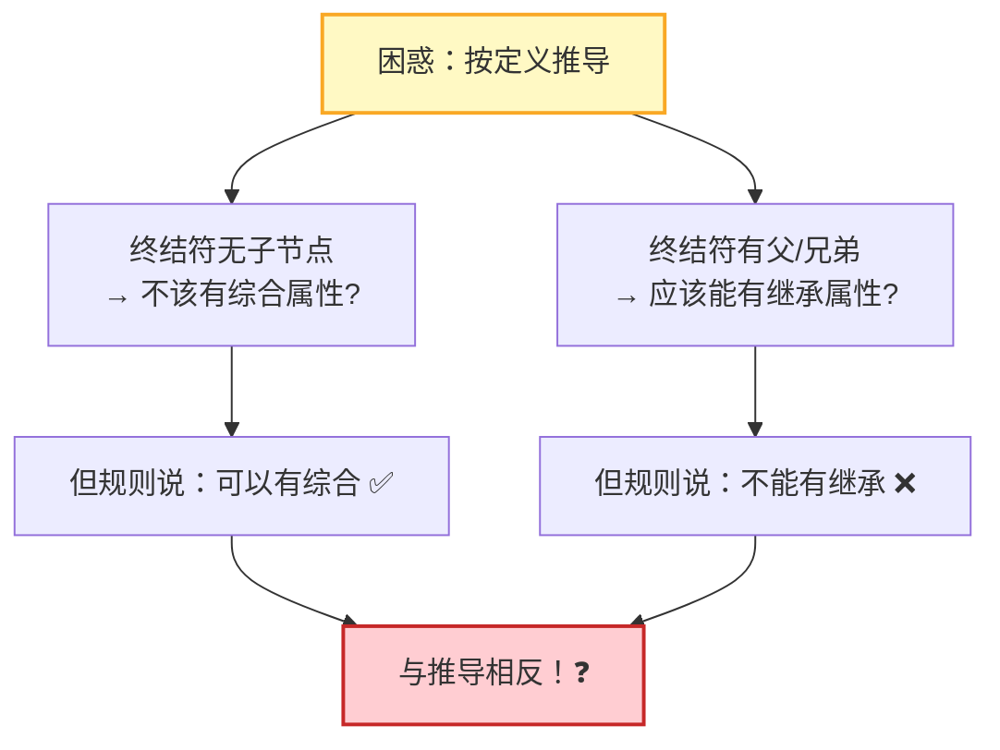
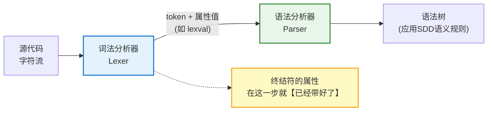
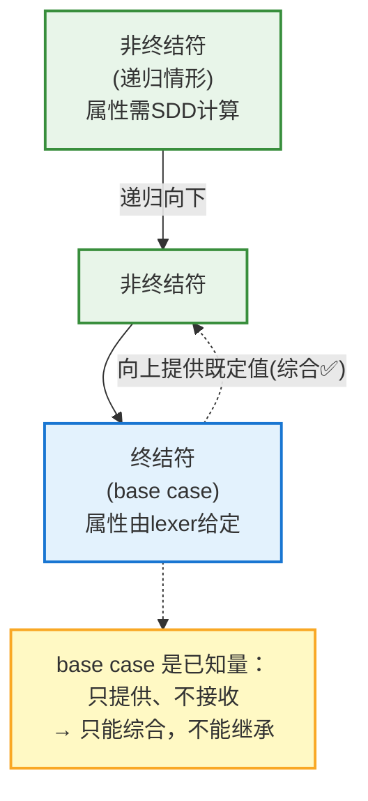
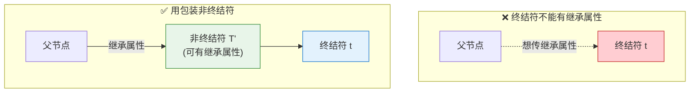
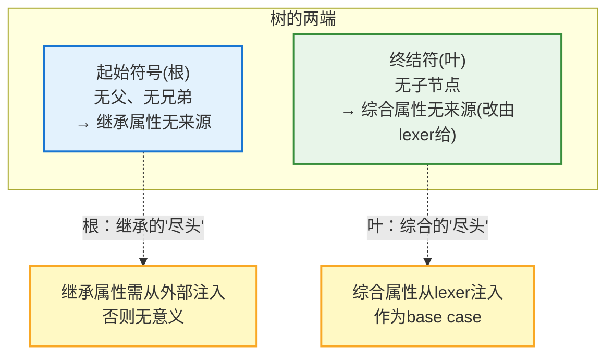

# Attribute of terminal&&start symbol

## 一、先陈述规则

> **Terminals** can have **synthesized attributes**, but not **inherited attributes**. Attributes for terminals have **lexical values** supplied by the **lexical analyzer**; there are **no semantic rules** in the SDD itself for computing them.

拆解为三个要点：

| 要点  | 内容                                      |
| --- | --------------------------------------- |
| ①   | 终结符**可以有综合属性** ✅                        |
| ②   | 终结符**不能有继承属性** ❌                        |
| ③   | 终结符的属性值由**词法分析器**提供，SDD 中**没有**计算它的语义规则 |

---

## 二、核心困惑：这不是自相矛盾吗？

用前面学过的定义直接套，会得到**两个相反的结论**：

```
按"综合属性=来自子节点"的定义：
    终结符是【叶子节点】→ 没有子节点
        ↓
    那它怎么会有综合属性？ 🤔（应该反而不能有综合属性）

按"继承属性=来自父/兄弟"的定义：
    终结符是叶子 → 有父节点、有兄弟
        ↓
    那它应该【可以】有继承属性才对？ 🤔
```

**看起来规则完全反了！** 这正是困惑的根源。



---

## 三、破解之道：终结符属性不来自 parser，而来自 lexer

困惑的根源在于——**误用了"综合属性来自子节点"这个只适用于语法分析器（parser）内部的定义**去套终结符。

### 3.1 关键转折

> **终结符的综合属性不是由语法分析器（parser）计算的，而是由词法分析器（lexer）提供的。**



### 3.2 经典例子：`digit.lexval`

龙书自己的例子——终结符 `digit` 带有综合属性 `lexval`：

```
源代码中的字符 '7'
    ↓ 词法分析器扫描
产生 token: <digit, lexval=7>
    ↓ 交给语法分析器
digit 这个终结符节点，其 lexval 属性【已经是 7 了】
    ↓
不需要 SDD 里的任何语义规则去"计算"它
```

**因此**：终结符的"综合属性"是个**特殊意义上的综合属性**——它不是从子节点综合来的（终结符确实没有子节点），而是**从外部（词法分析器）注入的既定值**。称它为"综合"，只是因为它**向上流动**（供父节点的语义规则使用），与综合属性的信息流向一致。

---

## 四、为什么终结符"不能有继承属性"？

### 4.1 直觉解释

继承属性需要**通过 SDD 的语义规则**从父节点/兄弟节点计算得出。但终结符的属性**根本不经过 SDD 计算**——它在词法分析阶段就已固定。

```
继承属性 = 需要 SDD 语义规则，从父/兄弟【算】出来
终结符属性 = 词法分析器【给】的，SDD 里没有计算它的规则
        ↓
两者机制根本不兼容
        ↓
所以终结符不能有继承属性
```

### 4.2 更本质的视角：终结符是递归的 base case

**终结符的属性相当于递归的 base case**：

```
属性计算是在语法树上递归进行的：
    非终结符的属性 = 由其子节点/父节点递归计算 (递归情形)
    终结符的属性   = 词法分析器直接给定       (base case)
        ↓
    base case 是递归的【终止点】，是"已知量"
        ↓
    它只【提供】值给上层，不【接收】需要计算的值
        ↓
    "提供值给上层" = 综合方向 ✅
    "接收计算的值" = 继承方向 ❌ (终结符作为已知量，无需也无法接收)
```



---

## 五、这个限制"重要"吗？——实践中的绕过方法

正如你笔记引用的 rici 的评论，这个限制**在实践中并不重要**，可以轻松绕过：

> If you want a terminal to have an inherited attribute, you can simulate that with a non-terminal whose only production is a right-hand side with the terminal as its only symbol.

**方法**：用一个"包装"非终结符替代：

```
想让终结符 t 拥有继承属性？
    ↓
引入非终结符 T'，加一条产生式：  T' → t
    ↓
把继承属性放在 T' 上（非终结符可以有继承属性）
    ↓
问题解决 ✅
```



> 因此这个限制**主要是为了理论表述的简洁与统一**（rici: *"convenient for some of the theoretical statements the authors want to make"*），并非实际能力的束缚。

---

## 六、回答你的追问：起始符号能有继承属性吗？

你笔记要点二问：**起始符号（start symbol）能否有继承属性？**

### 6.1 直觉答案

```
起始符号 = 语法树的【根节点】
    ↓
根节点【没有父节点】，也【没有兄弟节点】
    ↓
继承属性的来源(父/兄弟)全都不存在
    ↓
所以起始符号"自然地"没有继承属性可依赖
```

### 6.2 但需要精确区分两个层次

| 说法                                      | 是否准确     |
| --------------------------------------- | -------- |
| "起始符号**不能**定义继承属性"                      | ⚠️ 不完全准确 |
| "起始符号的继承属性**没有来源可依赖**，因而通常**无意义/无法计算**" | ✅ 准确     |

**精确表述**：起始符号在语法上**可以**声明继承属性，但由于它没有父节点和兄弟节点，这些继承属性**无处获得初值**。因此在实践中：

```
如果起始符号 S 有继承属性 S.inh：
    ↓
它无法从父/兄弟获得 (根节点没有这些)
    ↓
必须由【外部】提供初始值（类似终结符从lexer获得）
    ↓
或者：这个继承属性根本没有意义
```

### 6.3 与终结符的对偶美

起始符号与终结符恰好形成一组**对偶**：



| 维度     | 起始符号（根）      | 终结符（叶）       |
| ------ | ------------ | ------------ |
| 位置     | 树的**顶端**     | 树的**底端**     |
| 缺失的关系  | 无**父节点**、无兄弟 | 无**子节点**     |
| 受影响的属性 | **继承属性**无来源  | **综合属性**无来源  |
| 解决方式   | 由外部/程序初始化提供  | 由**词法分析器**提供 |
| 本质     | 继承信息流的**起点** | 综合信息流的**起点** |

> **对偶洞察**：继承属性自上而下流动，其"源头"在根节点——所以根节点的继承属性需外部注入；综合属性自下而上流动，其"源头"在叶节点（终结符）——所以终结符的综合属性由词法分析器注入。两者都是各自信息流的 **base case（初始条件）**。

---

## 七、总结

```
终结符属性规则的本质：

【规则】终结符：可有综合属性✅，不可有继承属性❌
        属性由【词法分析器】提供，SDD中无计算它的语义规则

【破解困惑的钥匙】
    终结符的"综合属性"不来自子节点(它确实没有子节点)，
    而是【词法分析器注入的既定值】(如 digit.lexval)
        ↓
    称"综合"是因为它【向上流动】供父节点使用
    "不能继承"是因为它的值不经SDD计算，是递归的 base case

【实践意义】
    限制可绕过：用包装非终结符 T'→t，把继承属性放 T' 上
    主要是为理论表述的简洁统一

【对偶：起始符号】
    根节点无父/无兄弟 → 继承属性无来源
        ↓
    与终结符(叶,无子→综合属性改由lexer给)恰成对偶
        ↓
    根是继承流的起点，叶是综合流的起点，
    两端都需要"外部注入初值"作为 base case
```

> 📌 **核心洞察**：这条规则之所以让无数初学者困惑，是因为大家不自觉地用"综合属性=来自子节点"这个**parser 内部的定义**去套终结符——而破解的钥匙在于意识到，**终结符的属性根本不由 parser 计算，而由 lexer 在词法分析阶段就注入好了**（如字符 `'7'` → `<digit, lexval=7>`）。所以终结符的"综合属性"是一种特殊的综合属性：它不从子节点汇总而来（终结符没有子节点），而是作为**递归求值的 base case**，从外部注入一个既定值，然后**向上**供父节点的语义规则使用——正因方向向上，才归为"综合"；正因它是已知量、不经 SDD 计算，才**不能是"继承"**。更妙的是，你敏锐追问的**起始符号**恰好与终结符构成一组对偶：终结符是语法树的**叶**（综合流的源头，由 lexer 注入），起始符号是语法树的**根**（继承流的源头，需由外部程序注入）——一个在树顶因无父/无兄弟而"继承无源"，一个在树底因无子而"综合无源"。理解了"**每种信息流都需要一个 base case 来提供初始值**"这一点，终结符只能综合、起始符号继承需外部注入这两件事，就不再是需要死记的孤立规定，而是同一个递归求值原理在语法树两端的自然体现。
