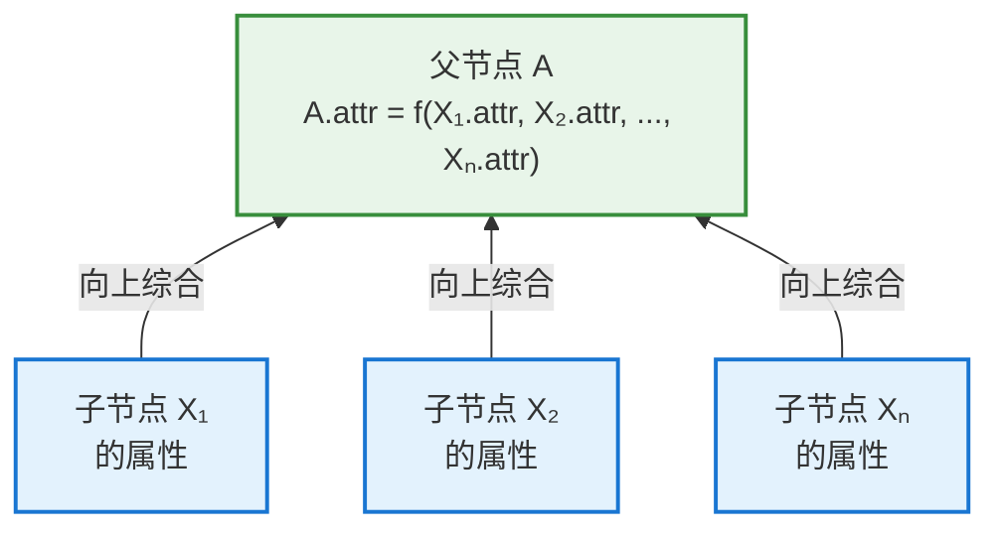
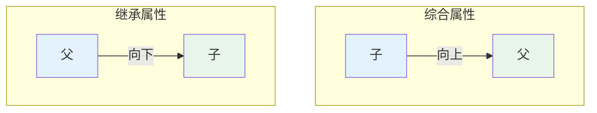
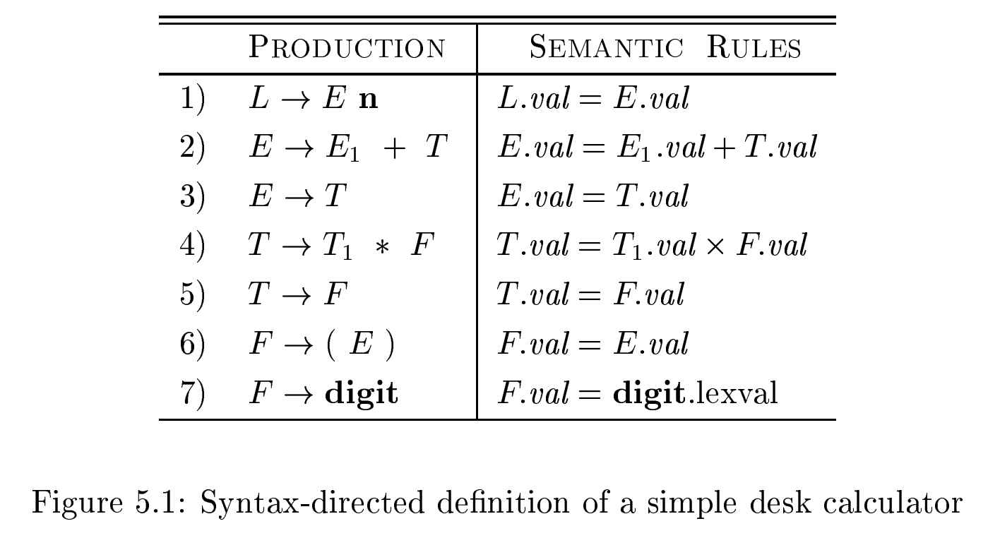
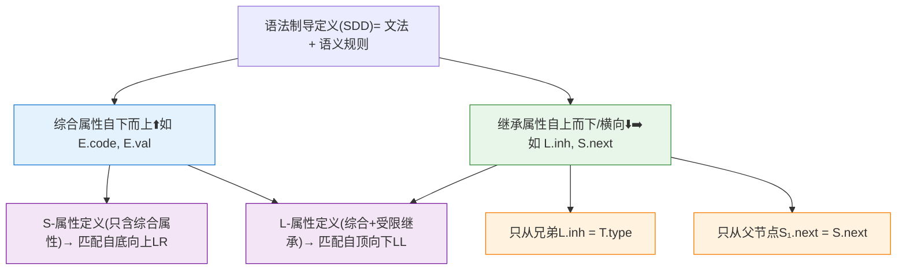
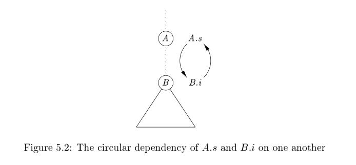
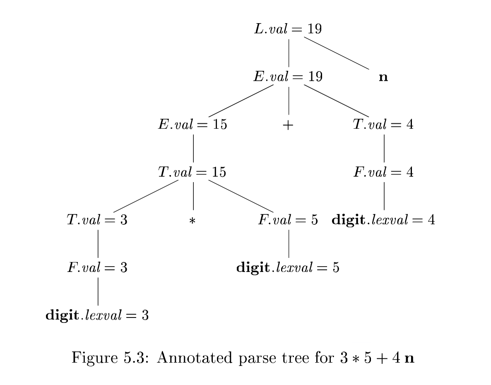
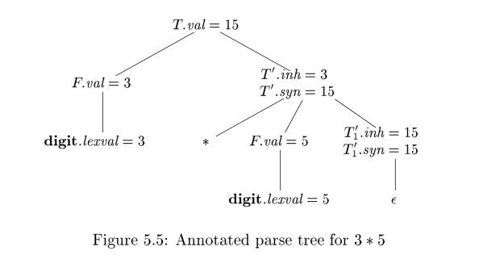

# 5.1 Syntax-Directed Definitions

> See also: geeksforgeeks [Compiler Design | Syntax Directed Definition](https://www.geeksforgeeks.org/compiler-design-syntax-directed-definition/) 

A *syntax-directed definition* (SDD) is a context-free grammar together with **attributes** and **rules**. Attributes are associated with grammar symbols and rules are associated with productions. If `X` is a symbol and `a` is one of its attributes, then we write `X.a` to denote the value of `a` at a particular parse-tree node labeled `X` . If we implement the nodes of the parse tree by records or objects, then the **attributes** of `X` can be implemented by data fields in the records that represent the nodes for `X` . 

> NOTE: SDD=CFG+attribute+rule

Attributes may be of any kind: numbers, types, table references, or strings, for instance. The strings may even be long sequences of code, say code in the intermediate language used by a compiler.

翻译: 属性可以是任意数据类型：例如数值、类型、符号表引用、字符串等。其中字符串甚至可以是一长串代码序列，比如编译器所使用的中间表示代码。

## 5.1.1 Inherited and Synthesized Attributes

We shall deal with two kinds of attributes for **nonterminals**:

1. *synthesized attribute*

2. *inherited attribute*

### Synthesized attribute(综合属性)

A *synthesized attribute* for a **nonterminal** `A` at a parse-tree node `N` is defined by a **semantic rule** associated with the production at `N` . Note that the production must have `A` as its **head**. A **synthesized attribute** at node `N` is defined only in terms of attribute values at the children of `N` and at `N` itself.

#### 补充内容

用产生式的语言描述：对于产生式 $A \to X_1 X_2 \dots X_n$，如果 $A$ 的属性由 $X_1, X_2, \dots, X_n$（以及 $A$ 自己的其他属性）计算得出，那么它就是**综合属性**。

```mermaid
graph BT
    C1["子节点 X₁<br/>的属性"]:::child
    C2["子节点 X₂<br/>的属性"]:::child
    C3["子节点 Xₙ<br/>的属性"]:::child
    P["父节点 A<br/>A.attr = f(X₁.attr, X₂.attr, ..., Xₙ.attr)"]:::parent

    C1 -->|向上综合| P
    C2 -->|向上综合| P
    C3 -->|向上综合| P

    classDef child fill:#e3f2fd,stroke:#1976d2,stroke-width:2px;
    classDef parent fill:#e8f5e9,stroke:#388e3c,stroke-width:2px;
```

##### 核心特征

1. **信息流向：自底向上**
   属性值只能从语法树的**子节点**传递、计算得到，向上汇总给父节点；
2. **计算时机**
   语法分析**归约阶段**（右部全部子节点处理完成后）才能计算父节点综合属性；
3. **最简单判定规则**
   语义规则左部一定是**产生式左部符号**的属性（$A.a = \dots$）。

##### 为什么综合属性特别重要

1 与语法分析天然契合: 

自底向上语法分析（如 LR 分析），在【归约(reduce)】时，子节点已在栈上处理完毕，恰好可以立即计算父节点的【综合属性】，综合属性与自底向上分析【完美匹配】。

2 S 属性定义（S-Attributed Definition）

> **只包含综合属性**的 SDD，称为 **S-属性定义**。

S-属性定义的优点：
    ✅ 可在【自底向上分析】的同时一趟计算完所有属性
    ✅ 无需构造完整语法树，边分析边求值
    ✅ 实现简单、高效

### Inherited attribute(继承属性)

An *inherited attribute* for a **nonterminal** `B` at a parse-tree node `N` is defined by a **semantic rule** associated with the production at the parent of `N` . Note that the production must have `B` as a symbol in its body. An **inherited attribute** at node `N` is defined only in terms of attribute values at `N` 's parent, `N` itself, and `N` 's siblings.

#### 补充内容

继承属性比综合属性要复杂很多，补充内容单独放到了文档"Inherited-attribute"中

### 综合属性 vs 继承属性

| 维度                        | 综合属性（Synthesized） | 继承属性（Inherited）    |
| ------------------------- | ----------------- | ------------------ |
| **值来自**                   | **子节点**（+ 自身）     | **父节点、兄弟节点**（+ 自身） |
| **信息流向**                  | 自下而上（向上） ⬆️       | 自上而下 / 横向 ⬇️➡️     |
| **在产生式 $A \to \alpha$ 中** | 计算头部 $A$ 的属性      | 计算体部某符号的属性         |
| **典型用途**                  | 求值、代码生成、返回结果      | 传递上下文、类型信息、符号表     |
| **计算时机**                  | 子树处理完后            | 进入子树前              |

```mermaid
graph TB
    subgraph 综合属性
        A1["父"]
        B1["子"] -->|向上| A1
    end
    subgraph 继承属性
        A2["父"] -->|向下| B2["子"]
    end

    style A1 fill:#e8f5e9
    style B1 fill:#e3f2fd
    style A2 fill:#e3f2fd
    style B2 fill:#e8f5e9
```

### 两条精妙约定

While we do not allow an **inherited attribute** at node `N` to be defined in terms of attribute values at the children of node `N` , we do allow a **synthesized attribute** at node `N` to be defined in terms of **inherited attribute** values at node `N` itself.

#### 补充内容

参见文档"2Rules" 

### Attribute of terminal

Terminals can have **synthesized attributes**, but not **inherited attributes**. Attributes for terminals have lexical values that are supplied by the **lexical analyzer**; there are no **semantic rules** in the SDD itself for computing the value of an attribute for a terminal.

#### 补充内容

参见 "attribute-of-terminal&start-symbol"

---

### An Alternative Definition of Inherited Attributes

No additional translations are enabled if we allow an **inherited attribute $B.c$** at a node N to be defined in terms of attribute values at the children of N, as well as at N itself, at its parent, and at its siblings. Such rules can be "simulated" by creating additional attributes of B, say $B_{c1},B_{c2} \dots$ . These are **synthesized attributes** that copy the needed attributes of the children of the node labeled B. We then compute $B.c$ as an **inherited attribute**, using the attributes $B_{c1},B_{c2} \dots$ in place of attributes at the children. Such attributes are rarely needed in practice.

---

### Example 5.1

The SDD in Fig. 5.1 is based on our familiar grammar for arithmetic expressions with operators `+` and `*`. It evaluates expressions terminated by an endmarker **n**. In the SDD, each of the nonterminals has a single **synthesized attribute**, called `val`. We also suppose that the terminal **digit** has a **synthesized attribute** `lexval`, which is an integer value returned by the **lexical analyzer**.

The rule for production 1, $L \to E {\bf n}$, sets $L.val$ to $E.val$, which we shall see is the **numerical value** of the entire expression.

Production 2, $E \to E_1 + T$ , also has one rule, which computes the `val` attribute for the head `E` as the sum of the values at $E_1$ and `T` . At any parse-tree node `N` labeled `E`,  the value of `val` for `E` is the sum of the values of `val` at the children of node `N` labeled `E` and `T` .

Production 3, $E \to T$ , has a single rule that defines the value of `val` for `E` to be the same as the value of `val` at the child for `T`. Production 4 is similar to the second production; its rule multiplies the values at the children instead of adding them. The rules for productions 5 and 6 copy values at a child, like that for the third production. Production 7 gives $F.val$ the value of a digit, that is, the numerical value of the token digit that the **lexical analyzer** returned.

---

### S-attributed

An SDD that involves only **synthesized attributes** is called ***S-attributed***; the SDD in Fig. 5.1 has this property. In an **S-attributed SDD**, each rule computes an attribute for the nonterminal at the head of a production from attributes taken from the body of the production.

For simplicity, the examples in this section have semantic rules without side effects. In practice, it is convenient to allow SDD's to have limited side effects, such as printing the result computed by a desk calculator or interacting with a symbol table. Once the order of evaluation of attributes is discussed
in Section 5.2, we shall allow semantic rules to compute arbitrary functions, possibly involving side effects.

An S-attributed SDD can be implemented naturally in conjunction with an **LR parser**. 

### Attribute grammar

An SDD without side effects is sometimes called an *attribute grammar*. The rules in an attribute grammar define the value of an attribute purely in terms of the values of other attributes and constants.

#### 补充内容: 属性文法全景图

```mermaid
graph TB
    SDD["语法制导定义(SDD)= 文法 + 语义规则"]

    SYN["综合属性自下而上⬆️如 E.code, E.val"]
    INH["继承属性自上而下/横向⬇️➡️如 L.inh, S.next"]

    INH_S["只从兄弟L.inh = T.type"]
    INH_P["只从父节点S₁.next = S.next"]

    S["S-属性定义(只含综合属性)→ 匹配自底向上LR"]
    L["L-属性定义(综合+受限继承)→ 匹配自顶向下LL"]

    SDD --> SYN
    SDD --> INH
    INH --> INH_S
    INH --> INH_P
    SYN --> S
    SYN --> L
    INH --> L

    style SYN fill:#e3f2fd,stroke:#1976d2
    style INH fill:#e8f5e9,stroke:#388e3c
    style INH_S fill:#fff3e0,stroke:#f57c00
    style INH_P fill:#fff3e0,stroke:#f57c00
    style S fill:#f3e5f5,stroke:#7b1fa2
    style L fill:#f3e5f5,stroke:#7b1fa2
```

| 概念        | 信息流向      | 类比  | 典型例子                |
| --------- | --------- | --- | ------------------- |
| 综合属性      | 子 → 父（向上） | 返回值 | $E.code$, $E.val$   |
| 继承属性（从兄弟） | 兄 → 弟（横向） | —   | $L.inh = T.type$    |
| 继承属性（从父）  | 父 → 子（向下） | 参数  | $S_1.next = S.next$ |

## 5.1.2 Evaluating an SDD at the Nodes of a Parse Tree

To visualize the translation specified by an **SDD**, it helps to work with **parse trees**, even though a translator need not actually build a **parse tree**. Imagine therefore that the rules of an SDD are applied by first constructing a parse tree and then using the rules to evaluate all of the attributes at each of the nodes of the **parse tree**. A **parse tree**, showing the value(s) of its attribute(s) is called an ***annotated parse tree***.

翻译: 为了直观理解语法制导定义（SDD）所规定的翻译过程，借助**语法分析树**会很有帮助 —— 尽管翻译器在实际运行时并不需要真的构建出分析树。我们可以这样设想执行流程：先构造一棵分析树，再利用 SDD 规则计算树上每个节点的全部属性值。标注出各节点属性取值的分析树，称为**带注释分析树（注释分析树）**。

How do we construct an **annotated parse tree**? In what order do we evaluate attributes? Before we can evaluate an attribute at a node of a parse tree, we must evaluate all the attributes up on which its value depends. For example, if all attributes are **synthesized**, as in Example 5.1, then we must evaluate the `val` attributes at all of the children of a node before we can evaluate the `val` attribute at the node itself.

> NOTE: 上面这段话是在引入"5.2 Evaluation Orders for SDD's"

With **synthesized attributes**, we can evaluate attributes in any **bottom-up order**, such as that of a postorder traversal of the **parse tree**; the evaluation of **S-attributed definitions** is discussed in Section 5.2.3.

### Circular dependency

For SDD's with both **inherited** and **synthesized** attributes, there is no guarantee that there is even one order in which to evaluate attributes at nodes. For instance, consider nonterminals `A` and `B` , with synthesized and inherited attributes `A.s` and `B.i`, respectively, along with the production and rules

| PRODUCTION | SEMANTIC RULES                  |
| ---------- | ------------------------------- |
| $A \to B$  | `A.s = B.i;` `B.i = A.s + 1` |

These rules are circular; it is impossible to evaluate either `A.s` at a node `N` or `B.i` at the child of `N` without first evaluating the other. The [circular dependency](https://en.wikipedia.org/wiki/Circular_dependency) of `A.s` and `B.i` at some pair of nodes in a parse tree is suggested by Fig. 5.2.

It is computationally difficult to determine whether or not there exist any **circularities** in any of the parse trees that a given SDD could have to translate. $^1$ Fortunately, there are useful sub classes of SDD's that are sufficient to guarantee that an order of evaluation exists, as we shall see in Section 5.2.

> $^1$Without going into details, while the problem is decidable, it cannot be solved by a polynomial-time algorithm, even if $\mathcal{P} = \mathcal{NP}$, since it has exponential time complexity.

翻译: 判定一个给定的语法制导定义（SDD）在其需要翻译的任意分析树中是否存在循环依赖，在计算层面是十分困难的。所幸存在几类实用的语法制导定义子类，它们能够保证一定存在合法的属性求值顺序，我们将在 5.2 节展开介绍。

> NOTE: 关于上述内容的详细说明，参见: "NP-hard-to-cycle-detection-in-dependency-graph" 

### Example 5.2

Figure 5.3 shows an **annotated parse tree** for the input string `3 * 5 + 4`, constructed using the grammar and rules of *Fig. 5.1*. The values of *lexval* are presumed supplied by the **lexical analyzer**. Each of the nodes for the nonterminals has attribute *val* computed in a **bottom-up order**, and we see the resulting values associated with each node. For instance, at the node with a child labeled `*`, after computing $T.val = 3$ and $F.val = 5$ at its first and third children, we apply the rule that says $T.val$ is the product of these two values, or $15$. $\quad \square$

**Inherited attributes** are useful when the structure of a parse tree does not "match" the abstract syntax of the source code. The next example shows how **inherited attributes** can be used to overcome such a mismatch due to a grammar designed for parsing rather than translation.

### Example 5.3

The SDD in Fig. 5.4 computes terms like `3 * 5` and `3 * 5 * 7`. The **top-down** parse of input `3 * 5` begins with the production $T \to F T'$. Here, `F` generates the digit 3, but the operator `*` is generated by `T'`. Thus, the left operand 3 appears in a different subtree of the parse tree from `*`. An **inherited attribute** will therefore be used to pass the operand to the operator. The grammar in this example is an excerpt from a non-left-recursive version of the familiar expression grammar; we used such a grammar as a running example to illustrate top-down parsing in Section 4.4.

| PRODUCTION        | SEMANTIC RULES                                  |
| ----------------- | ----------------------------------------------- |
| $T \to F T'$      | $T'.inh = F.val \\ T.val = T'.syn$              |
| $T' \to * F T_1'$ | $T_1'.inh = T'.inh * F.val \\ T'.syn= T_1'.syn$ |
| $T' \to \epsilon$ | $T'.syn = T'.inh$                               |
| $F \to digit$     | $F.val = digit.lexval$                          |

Figure 5.4: An SDD based on a grammar suitable for top-down parsing

Each of the nonterminals `T` and `F` has a **synthesized attribute** `val` ; the terminal digit has a **synthesized attribute** `lexval`. The nonterminal `T'` has two attributes: an **inherited attribute** `inh` and a **synthesized attribute** `syn`.

The semantic rules are based on the idea that the left operand of the operator `*` is inherited. More precisely, the head `T'` of the production $T' \to * F T_1'$ inherits the left operand of `*` in the production body. Given a term `x * y * z` , the root of the subtree for $* y * z$ inherits `x`. Then, the root of the subtree for
`* z` inherits the value of `* x * y` , and so on, if there are more factors in the term. Once all the factors have been accumulated, the result is passed back up the tree using **synthesized attributes**.

To see how the semantic rules are used, consider the annotated parse tree for `3 * 5` in Fig. 5.5. The leftmost leaf in the parse tree, labeled **digit**, has attribute value `lexval = 3`, where the `3` is supplied by the **lexical analyzer**. Its parent is for production 4, $F \to digit$. The only semantic rule associated with this production defines $F.val = digit.lexval$ , which equals 3.

At the second child of the root, the inherited attribute `T'.inh` is defined by the semantic rule `T'.inh = F.val` associated with production 1. Thus, the left operand, 3, for the `*` operator is passed from left to right across the children of the root. 

The production at the node for `T'` is $T' \to * F T_1'$. (We retain the subscript 1 in the annotated parse tree to distinguish between the two nodes for `T'`.) The inherited attribute $T_1'.inh $ is defined by the semantic rule $T_1'.inh = T'.inh * F.val$ associated with production 2.

With $T'.inh = 3$ and $F.val = 5$, we get $T_1'.inh = 15$. At the lower node for $T_1'$, the production is $T' \to \epsilon$. The semantic rule $T'.syn = T'.inh$ defines $T_1'.syn = 15$. The `syn` attributes at the nodes for $T'$pass the value 15 up the tree to the node for `T` , where `T.val = 15`. 