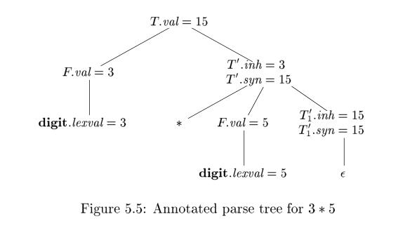

# 5.1 Syntax-Directed Definitions

> NOTE:
>
> 一、see also
>
> geeksforgeeks [Compiler Design | Syntax Directed Definition](https://www.geeksforgeeks.org/compiler-design-syntax-directed-definition/) 

A *syntax-directed definition* (SDD) is a context-free grammar together with **attributes** and **rules**. Attributes are associated with grammar symbols and rules are associated with productions. If `X` is a symbol and `a` is one of its attributes, then we write `X.a` to denote the value of `a` at a particular parse-tree node labeled `X` . If we implement the nodes of the parse tree by records or objects, then the **attributes** of `X` can be implemented by data fields in the records that represent the nodes for `X` . 

Attributes may be of any kind: numbers, types, table references, or strings, for instance. The strings may even be long sequences of code, say code in the intermediate language used by a compiler.

> NOTE: 
>
> 一、SDD=CFG+attribute+rule

## 5.1.1 Inherited and Synthesized Attributes

We shall deal with two kinds of attributes for **nonterminals**:

1、A *synthesized attribute* for a **nonterminal** `A` at a parse-tree node `N` is defined by a **semantic rule** associated with the production at `N` . Note that the production must have `A` as its **head**. A **synthesized attribute** at node `N` is defined only in terms of attribute values at the children of `N` and at `N` itself.

2、An *inherited attribute* for a **nonterminal** `B` at a parse-tree node `N` is defined by a **semantic rule** associated with the production at the parent of `N` . Note that the production must have `B` as a symbol in its body. An **inherited attribute** at node `N` is defined only in terms of attribute values at `N` 's parent, `N` itself, and `N` 's siblings.

> NOTE: 
>
> 一、The above classification method is based on how to calculate the attribute value. It is obvious that the direction of computation of **synthesized attribute** is contrast to **inherited attribute**'s. More precisely, **synthesized attribute** is suitable to **bottom-up parsing** while **inherited attribute** is suitable to **top-down parsing**. Example 5.2 show how **synthesized attribute** is calculated while example 5.3 show how **inherited attribute** is calculated. The computation of attribute will be discussed in later chapter. 
>
> 二、A SDD can has inherited attribute and inherited attribute at the same time, which is introduced in chapter 5.1.2.

While we do not allow an **inherited attribute** at node `N` to be defined in terms of attribute values at the children of node `N` , we do allow a **synthesized attribute** at node `N` to be defined in terms of **inherited attribute** values at node `N` itself.

> NOTE: **Inherited attribute**, the name has implied that the attribute is inherited from parent, so it is natural that **inherited attribute** at node `N` can not be defined in terms of attribute values at the **children** of node `N` or it will be self-contradictory.

Terminals can have **synthesized attributes**, but not **inherited attributes**. Attributes for terminals have lexical values that are supplied by the **lexical analyzer**; there are no **semantic rules** in the SDD itself for computing the value of an attribute for a terminal.

> NOTE: 
>
> 一、
>
> 1、stackoverflow [Why can terminals have synthesized attributes but not inherited attributes?](https://stackoverflow.com/questions/62308752/why-can-terminals-have-synthesized-attributes-but-not-inherited-attributes) 
>
> In Aho et al's Compilers: Principles, Techniques, and Tools on page 305 it says "Terminals can have synthesized attributes, but not inherited attributes." Here's my hang up: if synthesized attributes are attributes that can be computed based on a node's children, and inherited attributes can be computed based on a node's parent and siblings, then this feels wrong to me because since the terminals would be the leaves of the parse tree they wouldn't have any children. If they don't have any children then they shouldn't be able to have synthesized attributes. Similarly it seems that since they're leaves it would be likely they would have parent nodes and, as a result, could have inherited attributes. If someone could point out where I'm going wrong here that would be awesome.
>
> [A](https://stackoverflow.com/a/62311803)
>
> When I first read that in the dragon book, I was also confused. But if you think about it for a moment, it will become clear. The terminals synthesized attributes don't come from the parser; rather they come from the lexer. To give an example suppose you have a terminal **digit** (example taken from the dragon book). **digit** has the synthesized attribute `lexval`. This synthesized attribute does not come from the parser. It comes from the lexer instead. It should be pretty clear why terminals can't have inherited attributes :)
>
> If you want a terminal to have an inherited attribute, you can simulate that with a non-terminal whose only production is a right-hand side with the terminal as its only symbol. So the restriction is not very important in practice, but it is convenient for some of the theoretical statements the authors want to make. 
>
> – [rici](https://stackoverflow.com/users/1566221/rici) [Jun 10, 2020 at 23:40](https://stackoverflow.com/questions/62308752/why-can-terminals-have-synthesized-attributes-but-not-inherited-attributes#comment110209826_62311803) 
>
> 2、stackexchange [In syntax-directed definition, terminals are assumed to have synthesized attributes only, definition doesn't provide any semantic rules for terminals?](https://cs.stackexchange.com/questions/138190/in-syntax-directed-definition-terminals-are-assumed-to-have-synthesized-attribu) 
>
> 3、terminal的attribute相当于base case
>
> 二、How about a start symbol? It is obvious that a start symbol can not has inherited attribute because it is the ancestor and it has no parent.

---

### An Alternative Definition of Inherited Attributes

No additional translations are enabled if we allow an **inherited attribute $B.c$** at a node N to be defined in terms of attribute values at the children of N, as well as at N itself, at its parent, and at its siblings. Such rules can be "simulated" by creating additional attributes of B, say $B_{c1},B_{c2} \dots$ . These are **synthesized attributes** that copy the needed attributes of the children of the node labeled B. We then compute $B.c$ as an **inherited attribute**, using the attributes $B_{c1},B_{c2} \dots$ in place of attributes at the children. Such attributes are rarely needed in practice.

> NOTE:
>
> 一、上面这段话是什么意思？

---

---

### Example 5.1

The SDD in Fig. 5.1 is based on our familiar grammar for arithmetic expressions with operators `+` and `*`. It evaluates expressions terminated by an endmarker **n**. In the SDD, each of the nonterminals has a single **synthesized attribute**, called `val`. We also suppose that the terminal **digit** has a **synthesized attribute** `lexval`, which is an integer value returned by the **lexical analyzer**.

The rule for production 1, $L \to E {\bf n}$, sets $L.val$ to $E.val$, which we shall see is the **numerical value** of the entire expression.

Production 2, $E \to E_1 + T$ , also has one rule, which computes the `val` attribute for the head `E` as the sum of the values at $E_1$ and `T` . At any parse-tree node `N` labeled `E`,  the value of `val` for `E` is the sum of the values of `val` at the children of node `N` labeled `E` and `T` .

Production 3, $E \to T$ , has a single rule that defines the value of `val` for `E` to be the same as the value of `val` at the child for `T`. Production 4 is similar to the second production; its rule multiplies the values at the children instead of adding them. The rules for productions 5 and 6 copy values at a child, like that for the third production. Production 7 gives $F.val$ the value of a digit, that is, the numerical value of the token digit that the **lexical analyzer** returned.

---

### S-attributed

An SDD that involves only **synthesized attributes** is called ***S-attributed***; the SDD in Fig. 5.1 has this property. In an **S-attributed SDD**, each rule computes an attribute for the nonterminal at the head of a production from attributes taken from the body of the production.

For simplicity, the examples in this section have semantic rules without side effects. In practice, it is convenient to allow SDD's to have limited side effects, such as printing the result computed by a desk calculator or interacting with a symbol table. Once the order of evaluation of attributes is discussed
in Section 5.2, we shall allow semantic rules to compute arbitrary functions, possibly involving side effects.

An S-attributed SDD can be implemented naturally in conjunction with an **LR parser**. 

An SDD without side effects is sometimes called an *attribute grammar*. The rules in an attribute grammar define the value of an attribute purely in terms of the values of other attributes and constants.

## 5.1.2 Evaluating an SDD at the Nodes of a Parse Tree

To visualize the translation specified by an SDD, it helps to work with parse trees, even though a translator need not actually build a parse tree. Imagine therefore that the rules of an SDD are applied by first constructing a parse tree and then using the rules to evaluate all of the attributes at each of the nodes
of the **parse tree**. A **parse tree**, showing the value(s) of its attribute(s) is called an *annotated parse tree*.

How do we construct an **annotated parse tree**? In what order do we evaluate attributes? Before we can evaluate an attribute at a node of a parse tree, we must evaluate all the attributes up on which its value depends. For example, if all attributes are **synthesized**, as in Example 5.1, then we must evaluate the
`val` attributes at all of the children of a node before we can evaluate the `val` attribute at the node itself.

With **synthesized attributes**, we can evaluate attributes in any bottom-up order, such as that of a postorder traversal of the parse tree; the evaluation of S-attributed definitions is discussed in Section 5.2.3.

For SDD's with both inherited and synthesized attributes, there is no guarantee that there is even one order in which to evaluate attributes at nodes. For instance, consider nonterminals `A` and `B` , with synthesized and inherited attributes `A.s` and `B.i`, respectively, along with the production and rules

| PRODUCTION | SEMANTIC RULES                  |
| ---------- | ------------------------------- |
| $A \to B$  | `A.s = B.i;` `B.i = A.s + 1` |

These rules are circular; it is impossible to evaluate either `A.s` at a node `N` or `B.i` at the child of `N` without first evaluating the other. The [circular dependency](https://en.wikipedia.org/wiki/Circular_dependency) of `A.s` and `B.i` at some pair of nodes in a parse tree is suggested by Fig. 5.2.

It is computationally difficult to determine whether or not there exist any **circularities** in any of the parse trees that a given SDD could have to translate. Fortunately, there are useful sub classes of SDD's that are sufficient to guarantee that an order of evaluation exists, as we shall see in Section 5.2.

> NOTE: Below is the explanation if why determining whether or not there exist any **circularities** in any of the parse trees of a given SDD is computationally difficult: 
>
> Without going into details, while the problem is decidable, it cannot be solved by a polynomial-time algorithm, even if P = N P , since it has exponential time complexity.
>
> In fact, this is an algorithm problem to [find cycle in graph](https://en.wikipedia.org/wiki/Cycle_detection).

**Example 5.2**: skipped

**Example 5.3 :** The SDD in Fig. 5.4 computes terms like `3 * 5` and `3 * 5 * 7`. The **top-down** parse of input `3 * 5` begins with the production $T \to F T'$. Here, `F` generates the digit 3, but the operator `*` is generated by `T'`. Thus, the left operand 3 appears in a different subtree of the parse tree from `*`. An **inherited attribute** will therefore be used to pass the operand to the operator. The grammar in this example is an excerpt from a non-left-recursive version of the familiar expression grammar; we used such a grammar as a running example to illustrate top-down parsing in Section 4.4.

| PRODUCTION        | SEMANTIC RULES                                  |
| ----------------- | ----------------------------------------------- |
| $T \to F T'$      | $T'.inh = F.val \\ T.val = T'.syn$              |
| $T' \to * F T_1'$ | $T_1'.inh = T'.inh * F.val \\ T'.syn= T_1'.syn$ |
| $T' \to \epsilon$ | $T'.syn = T'.inh$                               |
| $F \to digit$     | $F.val = digit.lexval$                          |

Figure 5.4: An SDD based on a grammar suitable for top-down parsing

Each of the nonterminals `T` and `F` has a **synthesized attribute** `val` ; the terminal digit has a **synthesized attribute** `lexval`. The nonterminal `T'` has two attributes: an **inherited attribute** `inh` and a **synthesized attribute** `syn`.

The semantic rules are based on the idea that the left operand of the operator `*` is inherited. More precisely, the head `T'` of the production $T' \to * F T_1'$ inherits the left operand of `*` in the production body. Given a term `x * y * z` , the root of the subtree for $* y * z$ inherits `x`. Then, the root of the subtree for
`* z` inherits the value of `* x * y` , and so on, if there are more factors in the term. Once all the factors have been accumulated, the result is passed back up the tree using **synthesized attributes**.

To see how the semantic rules are used, consider the annotated parse tree for `3 * 5` in Fig. 5.5. The leftmost leaf in the parse tree, labeled **digit**, has attribute value `lexval = 3`, where the `3` is supplied by the **lexical analyzer**. Its parent is for production 4, $F \to digit$. The only semantic rule associated with this production defines $F.val = digit.lexval$ , which equals 3.

At the second child of the root, the inherited attribute `T'.inh` is defined by the semantic rule `T'.inh = F.val` associated with production 1. Thus, the left operand, 3, for the `*` operator is passed from left to right across the children of the root. 

The production at the node for `T'` is $T' \to * F T_1'$. (We retain the subscript 1 in the annotated parse tree to distinguish between the two nodes for `T'`.) The inherited attribute $T_1'.inh $ is defined by the semantic rule $T_1'.inh = T'.inh * F.val$ associated with production 2.

With $T'.inh = 3$ and $F.val = 5$, we get $T_1'.inh = 15$. At the lower node for $T_1'$, the production is $T' \to \epsilon$. The semantic rule $T'.syn = T'.inh$ defines $T_1'.syn = 15$. The `syn` attributes at the nodes for $T'$pass the value 15 up the tree to the node for `T` , where `T.val = 15`. 