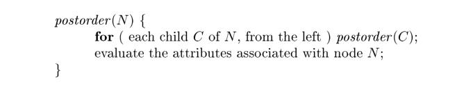

# 5.2 Evaluation Orders for SDD's

> NOTE:
>
> 作者的行文思路是首先抛出问题然后描述解决方案: 在 "5.1.2 Evaluating an SDD at the Nodes of a Parse Tree"节中抛出问题SDD evaluation的可能存在"circular dependency"导致无法计算出SDD。本节提出系统的解决方法: 使用"dependency graph"来建模这个问题，使用topological sorting可以判定。
>
> 接着进一步提出能够保证不产生"circular dependency"的SDD: 
>
> 

"Dependency graphs" are a useful tool for determining an evaluation order for the attribute instances in a given **parse tree**. While an **annotated parse tree** shows the values of attributes, a **dependency graph** helps us determine how those values can be computed.

In this section, in addition to dependency graphs, we define two important classes of SDD's: the "S-attributed" and the more general "L-attributed" SDD's. The translations specified by these two classes fit well with the parsing methods we have studied, and most translations encountered in practice can be
written to conform to the requirements of at least one of these classes.

## 5.2.1 Dependency Graphs

A *dependency graph* depicts the flow of information among the attribute instances in a particular **parse tree**; an edge from one attribute instance to another means that the value of the first is needed to compute the second. Edges express constraints implied by the **semantic rules**. In more detail:

> NOTE:
> $$
> A \to B
> $$
> 
>
> 表示B的计算需要A。

1、For each parse-tree node, say a node labeled by grammar symbol `X` , the dependency graph has a node for each attribute associated with `X` .

2、Suppose that a semantic rule associated with a production `p` defines the value of **synthesized attribute** `A.b` in terms of the value of `X.c` (the rule may define `A.b` in terms of other attributes in addition to `X.c`). Then, the dependency graph has an edge from `X.c` to `A.b`. More precisely, at every node `N` labeled `A` where production `p` is applied, create an edge to attribute `b` at `N` , from the attribute `c` at the child of `N` corresponding to this instance of the symbol `X` in the body of the production.

> Since a node `N` can have several children labeled `X` , we again assume that subscripts distinguish among uses of the same symbol at different places in the production.

> NOTE:
>
> 一、其实上面这个规则简而言之就是: production的head的**synthesized attribute**依赖于它的right、children、body

3、Suppose that a semantic rule associated with a production `p` defines the value of inherited attribute `B.c` in terms of the value of `X.a`. Then, the dependency graph has an edge from `X.a` to `B.c`. For each node `N` labeled `B` that corresponds to an occurrence of this `B` in the body of production `p`, create an edge to attribute `c` at `N` from the attribute `a` at the node `M` that corresponds to this occurrence of `X` . Note that `M` could be either the parent or a sibling of `N` .

> NOTE: 
>
> 一、What is described above is an algorithm for constructing a dependency graph.

## 5.2.2 Ordering the Evaluation of Attributes

The *dependency graph* characterizes the possible orders in which we can evaluate the attributes at the various nodes of a **parse tree**. If the dependency graph has an edge from node `M` to node `N` , then the attribute corresponding to `M` must be evaluated before the attribute of `N` . Thus, the only allowable orders of evaluation are those sequences of nodes $N_1, N_2,\dots , N_k$ such that if there is an edge of the dependency graph from $N_i$ to $N_j$, then i < j . Such an ordering embeds a directed graph into a linear order, and is called a *topological sort* of the graph.

If there is any **cycle** in the graph, then there are no **topological sorts**; that is, there is no way to evaluate the SDD on this **parse tree**. If there are no **cycles**, however, then there is always at least one topological sort. To see why, since there are no cycles, we can surely find a node with no edge entering. For if there were no such node, we could proceed from predecessor to predecessor until we came back to some node we had already seen, yielding a cycle. Make this node the first in the topological order, remove it from the dependency graph, and repeat the process on the remaining nodes.

## 5.2.3 S-Attributed Definitions

As mentioned earlier, given an SDD, it is very hard to tell whether there exist any parse trees whose **dependency graphs** have cycles. In practice, translations can be implemented using classes of SDD's that guarantee an **evaluation order**, since they do not permit dependency graphs with cycles. Moreover, the two classes introduced in this section can be implemented efficiently in connection with **top-down** or **bottom-up** parsing.

The first class is defined as follows:

- An SDD is **S-attributed** if every attribute is **synthesized**.

When an SDD is **S-attributed**, we can evaluate its attributes in any bottom-up order of the nodes of the **parse tree**. It is often especially simple to evaluate the attributes by performing a **postorder traversal** of the **parse tree** and evaluating the attributes at a node `N` when the traversal leaves `N` for the last time. That is, we apply the function `postorder`, defined below, to the root of the parse tree (see also the box "Preorder and Postorder Traversals" in Section 2.3.4):

**S-attributed definitions** can be implemented during bottom-up parsing, since a bottom-up parse corresponds to a **postorder traversal**. Specifically, **postorder** corresponds exactly to the order in which an **LR parser** reduces a **production body** to its **head**. This fact will be used in Section 5.4.2 to evaluate **synthesized attributes** and store them on the **stack** during **LR parsing**, without creating the tree nodes explicitly.

## 5.2.4 L-Attributed Definitions

The second class of SDD's is called ***L-attributed definitions***. The idea behind this class is that, between the attributes associated with a **production body**, **dependency-graph edges** can go from **left** to **right**, but not from **right** to **left** (hence "L-attributed"). 

> NOTE:
>
> 一、从更高层次来理解 "L-attributed":
>
> 在进行top-down parse的时候，它对production的使用其实就是从left到right的，因此"L-attributed"能够保证**属性值**被正确计算

More precisely, each attribute must be either

一、**Synthesized**, or

二、**Inherited**, but with the rules limited as follows. 

Suppose that there is a production $A \to X_1, X_2, \dots,  X_n$, and that there is an **inherited attribute** $X_i.a$ computed by a rule associated with this **production**. Then the rule may use only:

> NOTE:
>
> 一、"**inherited attribute** $X_i.a$ " 既然是inherited attribute，那么显然它仅仅依赖于它的parent。
>
> 二、"Then the rule may use only" 表达的含义是 "依赖"

1、**Inherited attributes** associated with the head `A`.

2、Either inherited or synthesized attributes associated with the occurrences of symbols $X_1, X_2, \dots, X_{i-1}$ located to the left of $X_i$.

> NOTE:
>
> 一、上面这段话的意思是: 位于$X_i$的左边的文法符号实例$X_1, X_2, \dots, X_{i-1}$ 相关的继承属性或者综合属性，显然这条规则是为了满足: "**dependency-graph edges** can go from **left** to **right**, but not from **right** to **left** (hence "L-attributed")"

3、Inherited or synthesized attributes associated with this occurrence of $X_i$ itself, but only in such a way that there are no cycles in a dependency graph formed by the attributes of this $X_i$.

**Example 5.8 :**  The SDD in Fig. 5.4 is **L-attributed**. To see why, consider the semantic rules for inherited attributes, which are repeated here for convenience:

The first of these rules defines the inherited attribute `T'.inh` using only `F.val` , and `F` appears to the left of `T'` in the production body, as required. The second rule defines $T_1'.inh$ using the inherited attribute `T'inh` associated with the **head**, and `F.val` , where `F` appears to the left of $T_1'$ in the production body.

In each of these cases, the rules use information "from above or from the left," as required by the class. The remaining attributes are synthesized. Hence, the SDD is L-attributed. 

**Example 5.9 :** Any SDD containing the following production and rules cannot be L-attributed:

The second rule defines an inherited attribute `B.i`, so the entire SDD cannot be S-attributed. Further, although the rule is legal, the SDD cannot be L-attributed, because the attribute `C.c` is used to help define `B.i`, and `C` is to the right of `B` in the production body. 

## 5.2.5 Semantic Rules with Controlled Side Effects

In practice, translations involve side effects: a desk calculator might print a result; a code generator might enter the type of an identifier into a symbol table. With SDD's, we strike a balance between **attribute grammars** and **translation schemes**. Attribute grammars have no side effects and allow any evaluation order consistent with the dependency graph. Translation schemes impose left-to-right evaluation and allow semantic actions to contain any program fragment; translation schemes are discussed in Section 5.4.

We shall control side effcts in SDD's in one of the following ways:

1、Permit incidental side effects that do not constrain attribute evaluation. In other words, permit side effects when attribute evaluation based on any topological sort of the dependency graph produces a "correct" translation, where "correct" depends on the application.

2、Constrain the allowable evaluation orders, so that the same translation is produced for any allowable order. The constraints can be thought of as implicit edges added to the dependency graph.

## see also

geeksforgeeks [Compiler Design | Syntax Directed Definition](https://www.geeksforgeeks.org/compiler-design-syntax-directed-definition/)