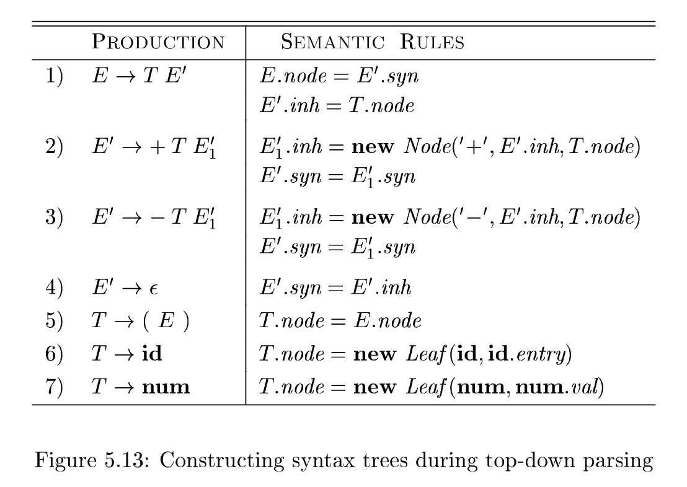
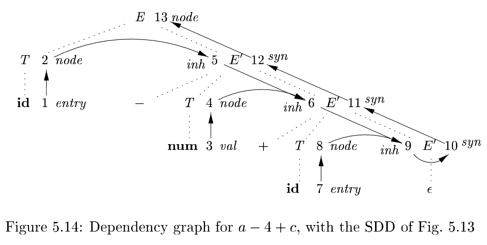
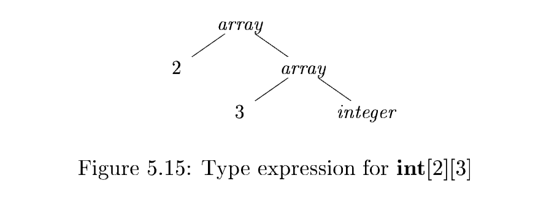

# 5.3 Applications of Syntax-Directed Translation

The **syntax-directed translation techniques** in this chapter will be applied in Chapter 6 to **type checking** and **intermediate-code generation**. Here, we consider selected examples to illustrate some representative SDD's.

The main application in this section is the construction of **syntax trees**. Since some compilers use **syntax trees** as an **intermediate representation**, a common form of SDD turns its input string into a tree. To complete the translation to **intermediate code**, the compiler may then walk the **syntax tree**, using another set of rules that are in effect an SDD on the **syntax tree** rather than the **parse tree**. (Chapter 6 also discusses approaches to **intermediate-code generation** that apply an SDD without ever constructing a tree explicitly.)

翻译: 本节的核心应用是**语法树**的构建。由于部分编译器会将语法树作为**中间表示**，因此有一种常用的语法制导定义（SDD）能够把输入字符串转换为语法树。若要完成到**中间代码**的翻译，编译器后续会遍历这棵**语法树**，使用另一套规则 —— 这套规则本质是作用于**语法树**、而非分析树的语法制导定义。

We consider two SDD's for constructing **syntax trees** for expressions:

- The first, an S-attributed definition, is suitable for use during **bottom-up parsing**. 

- The second, L-attributed, is suitable for use during **top-down parsing**.

|             | SDD          | parsing algo      |
| ----------- | ------------ | ----------------- |
| Synthesized | S-attributed | bottom-up parsing |
| Left        | L-attributed | top-down parsing  |

The final example of this section is an L-attributed definition that deals with basic and array types.

## 5.3.1 Construction of Syntax Trees

As discussed in Section 2.8.2, each node in a **syntax tree** represents a construct; the children of the node represent the meaningful components of the construct. A **syntax-tree node** representing an expression $E_1 + E_2$ has label `+` and two children representing the sub expressions $E_1$ and $E_2$.

We shall implement the nodes of a **syntax tree** by objects with a suitable number of fields. Each object will have an `op` field that is the label of the node. The objects will have additional fields as follows:

- If the node is a leaf, an additional field holds the **lexical value** for the leaf. A constructor function `Leaf (op, val )` creates a leaf object. Alternatively, if nodes are viewed as records, then `Leaf` returns a pointer to a new record for a leaf.
- If the node is an **interior node**, there are as many additional fields as the node has children in the **syntax tree**. A constructor function `Node` takes two or more arguments: $Node(op, c_1, c_2, c_3, \dots, c_k)$ creates an object with  first field `op` and k additional fields for the `k` children $c_1, c_2, c_3, \dots, c_k$.

### Example 5.11: S-attributed definition top-down parsing

The **S-attributed definition** in Fig. 5.10 constructs **syntax trees** for a simple expression grammar involving only the binary operators `+` and `-`. As usual, these operators are at the same precedence level and are jointly left associative. All nonterminals have one synthesized attribute `node` , which represents a node of the **syntax tree**.

Every time the first production $E \to E_1 + T$  is used, its rule creates a node with `+` for `op` and two children, $E_1.node$ and $T.node$, for the sub expressions. The second production has a similar rule.

For production 3, $E \to T$ , no node is created, since $E.node$ is the same as $T.node$. Similarly, no node is created for production 4, $T \to (E)$. The value of `T.node` is the same as `E.node`, since parentheses are used only for grouping; they influence the structure of the **parse tree** and the **syntax tree**, but once their job is done, there is no further need to retain them in the **syntax tree**.

*Figure 5.11* shows the construction of a syntax tree for the input $a-4+c$. The nodes of the syntax tree are shown as records, with the $op$ field first. Syntax-tree edges are now shown as solid lines. The underlying parse tree, which need not actually be constructed, is shown with dotted edges. The third type of line, shown dashed, represents the values of $E.node$ and $T.node$; each line points to the appropriate syntax-tree node.

At the bottom we see leaves for $a$, $4$ and $c$, constructed by $Leaf$. We suppose that the lexical value $\mathbf{id}.entry$ points into the **symbol table**, and the lexical value $\mathbf{num}.val$ is the numerical value of a constant. These leaves, or pointers to them, become the value of $T.node$ at the three parse-tree nodes labeled $T$, according to rules 5 and 6. Note that by rule 3, the pointer to the leaf for $a$ is also the value of $E.node$ for the leftmost $E$ in the parse tree.

Rule 2 causes us to create a node with $op$ equal to the minus sign and pointers to the first two leaves. Then, rule 1 produces the root node of the syntax tree by combining the node for $-$ with the third leaf.

If the rules are evaluated during a **postorder traversal** of the **parse tree**, or with reductions during a **bottom-up parse**, then the sequence of steps shown in *Fig. 5.12* ends with $p_5$ pointing to the root of the constructed **syntax tree**. $\quad \square$

With a grammar designed for top-down parsing, the same syntax trees are constructed, using the same sequence of steps, even though the structure of the parse trees differs significantly from that of syntax trees.

### Example 5.12: L-attributed definition

The L-attributed definition in [Fig. 5.13] performs the same translation as the S-attributed definition in [Fig. 5.10]. The attributes for the grammar symbols $E$, $T$, $\mathbf{id}$, and $\mathbf{num}$ are as discussed in Example 5.11.

The rules for building **syntax trees** in this example are similar to the rules for the desk calculator in Example 5.3. In the desk-calculator example, a term $x * y$ was evaluated by passing $x$ as an **inherited attribute**, since $x$ and $* y$ appeared in different portions of the parse tree. Here, the idea is to build a **syntax tree** for $x + y$ by passing $x$ as an **inherited attribute**, since $x$ and $+ y$ appear in different subtrees. Nonterminal $E'$ is the counterpart of nonterminal $T'$ in Example 5.3. Compare the **dependency graph** for $a - 4 + c$ in *Fig. 5.14* with that for $3 * 5$ in *Fig. 5.7*.
Nonterminal $E'$ has an **inherited attribute** $inh$ and a **synthesized attribute** $syn$. Attribute $E'.inh$ represents the partial syntax tree constructed so far. Specifically, it represents the root of the tree for the prefix of the input string that is to the left of the subtree for $E'$. At node 5 in the dependency graph in *Fig. 5.14*, $E'.inh$ denotes the root of the partial syntax tree for the identifier $a$; that is, the leaf for $a$. At node 6, $E'.inh$ denotes the root for the partial syntax tree for the input $a-4$. At node 9, $E'.inh$ denotes the syntax tree for $a-4+c$.
Since there is no more input, at node 9, $E'.inh$ points to the root of the entire **syntax tree**. The $syn$ attributes pass this value back up the **parse tree** until it becomes the value of $E.node$. Specifically, the **attribute value** at node 10 is defined by the rule $E'.syn = E'.inh$ associated with the production $E' \to \epsilon$. The **attribute value** at node 11 is defined by the rule $E'.syn = E'_1.syn$ associated with production 2 in *Fig. 5.13*. Similar rules define the attribute values at nodes 12 and 13. $\quad \square$

## 5.3.2 The Structure of a Type

**Inherited attributes** are useful when the structure of the **parse tree** differs from the abstract syntax of the input; attributes can then be used to carry information from one part of the parse tree to another. The next example shows how a mismatch in structure can be due to the design of the language, and not due to constraints imposed by the parsing method.

**Example 5.13:** In C, the type $\mathbf{int}\ [2][3]$ can be read as, "array of 2 arrays of 3 integers." The corresponding type expression $array(2, array(3, integer))$ is represented by the tree in *Fig. 5.15*. The operator $array$ takes two parameters, a number and a type. If types are represented by trees, then this operator returns a tree node labeled $array$ with two children for a number and a type.

