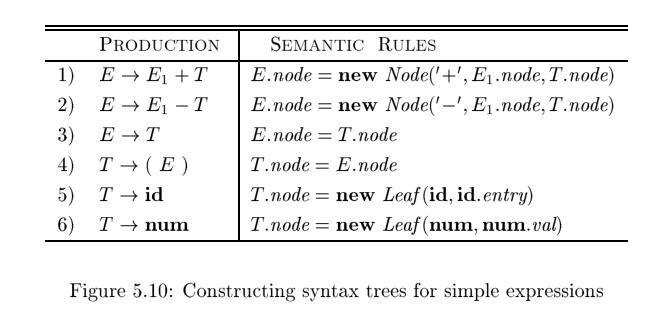
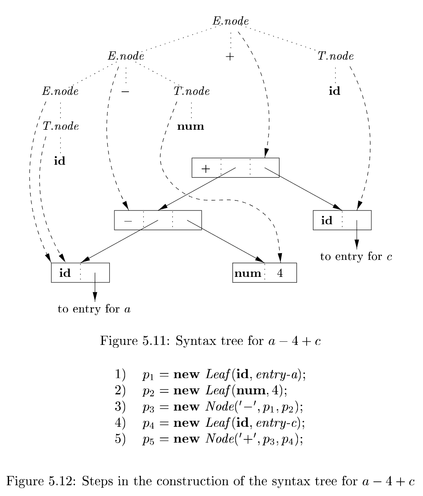

# 5.3 Applications of Syntax-Directed Translation

The syntax-directed translation techniques in this chapter will be applied in Chapter 6 to **type checking** and **intermediate-code generation**. Here, we consider selected examples to illustrate some representative SDD's.

The main application in this section is the construction of **syntax trees**. Since some compilers use **syntax trees** as an **intermediate representation**, a common form of SDD turns its input string into a tree. To complete the translation to **intermediate code**, the compiler may then walk the **syntax tree**, using another set of rules that are in effect an SDD on the **syntax tree** rather than the **parse tree**. (Chapter 6 also discusses approaches to **intermediate-code generation** that apply an SDD without ever constructing a tree explicitly.)

We consider two SDD's for constructing **syntax trees** for expressions:

- The first, an S-attributed definition, is suitable for use during bottom-up parsing. 

- The second, L-attributed, is suitable for use during top-down parsing.

The final example of this section is an L-attributed definition that deals with basic and array types.

## 5.3.1 Construction of Syntax Trees

As discussed in Section 2.8.2, each node in a **syntax tree** represents a construct; the children of the node represent the meaningful components of the construct. A **syntax-tree node** representing an expression $E_1 + E_2$ has label `+` and two children representing the sub expressions $E_1$ and $E_2$.

We shall implement the nodes of a syntax tree by objects with a suitable number of fields. Each object will have an `op` field that is the label of the node. The objects will have additional fields as follows:

- If the node is a leaf, an additional field holds the **lexical value** for the leaf. A constructor function `Leaf (op, val )` creates a leaf object. Alternatively, if nodes are viewed as records, then `Leaf` returns a pointer to a new record for a leaf.
- If the node is an **interior node**, there are as many additional fields as the node has children in the **syntax tree**. A constructor function `Node` takes two or more arguments: $Node(op, c_1, c_2, c_3, \dots, c_k)$ creates an object with  first field `op` and k additional fields for the `k` children $c_1, c_2, c_3, \dots, c_k$.

### Example 5.11

**Example 5.11 :** The **S-attributed definition** in Fig. 5.10 constructs **syntax trees** for a simple expression grammar involving only the binary operators `+` and `-`. As usual, these operators are at the same precedence level and are jointly left associative. All nonterminals have one synthesized attribute `node` , which represents a node of the syntax tree.

Every time the first production $E \to E_1 + T$  is used, its rule creates a node with `+` for `op` and two children, $E_1.node$ and $T.node$, for the sub expressions. The second production has a similar rule.

For production 3, $E \to T$ , no node is created, since $E.node$ is the same as $T.node$. Similarly, no node is created for production 4, $T \to (E)$. The value of `T.node` is the same as `E.node`, since parentheses are used only for grouping; they influence the structure of the **parse tree** and the **syntax tree**, but once their job is done, there is no further need to retain them in the **syntax tree**.

At the bottom we see leaves for $a$, $4$ and $c$, constructed by $\mathit{Leaf}$. We suppose that the lexical value $\mathbf{id}.\mathit{entry}$ points into the symbol table, and the lexical value $\mathbf{num}.\mathit{val}$ is the numerical value of a constant. These leaves, or pointers to them, become the value of $T.\mathit{node}$ at the three parse-tree nodes labeled $T$, according to rules 5 and 6. Note that by rule 3, the pointer to the leaf for $a$ is also the value of $E.\mathit{node}$ for the leftmost $E$ in the parse tree.
Rule 2 causes us to create a node with $op$ equal to the minus sign and pointers to the first two leaves. Then, rule 1 produces the root node of the syntax tree by combining the node for $-$ with the third leaf.
If the rules are evaluated during a postorder traversal of the parse tree, or with reductions during a bottom-up parse, then the sequence of steps shown in [Fig. 5.12] ends with $p_5$ pointing to the root of the constructed syntax tree. $\square$
With a grammar designed for top-down parsing, the same syntax trees are constructed, using the same sequence of steps, even though the structure of the parse trees differs significantly from that of syntax trees.

### Example 5.12

**Example 5.12**: The L-attributed definition in [Fig. 5.13] performs the same translation as the S-attributed definition in [Fig. 5.10]. The attributes for the grammar symbols $E$, $T$, $\mathbf{id}$, and $\mathbf{num}$ are as discussed in Example 5.11.

## 5.3.2 The Structure of a Type

