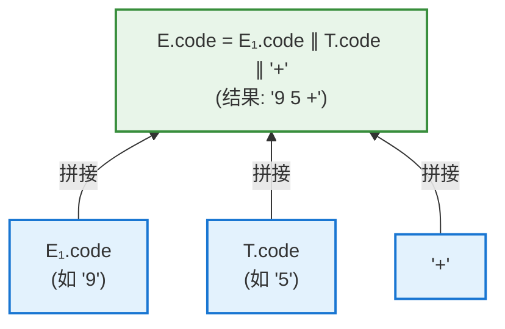
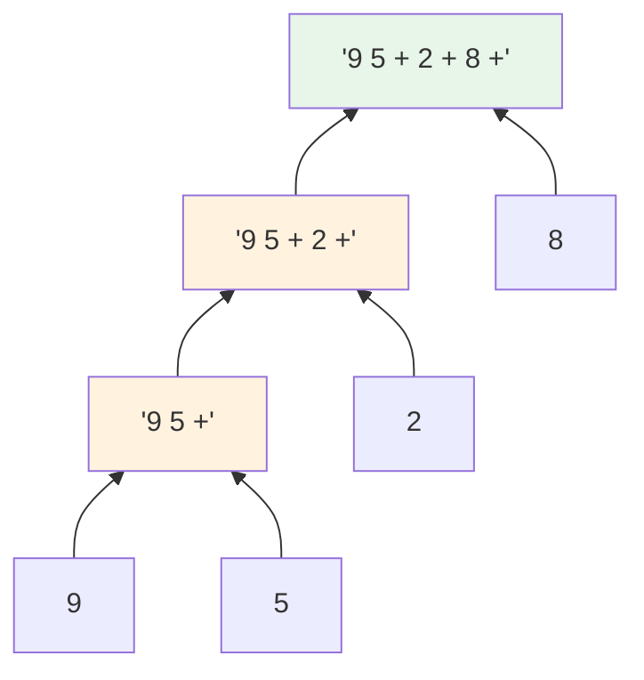

# SDD is inefficient for implementation

本文的标题的意思是"如果用SDD来作为实现是inefficient的"，它是我对原文下面这段话的总结:

> While the rule makes it explicit that the translation of $E$ is built up from the translations of $E_1$, $T$, and '$+$', it may be inefficient to implement the translation directly by manipulating strings.

这段话出自编译原理（龙书，Aho 等）中关于**语法制导定义（Syntax-Directed Definition, SDD）**的章节。要理解这句话，需要先理解上下文。

---

## 一、背景：这个例子在讲什么

### 语法制导定义（SDD）

SDD 的核心思想是：**给文法符号（如 $E$、$T$）附加属性（attribute），再用语义规则（semantic rule）描述这些属性如何计算**。

### 这个具体例子：中缀转后缀

```
中缀表达式（我们平时写的）：  9 + 5
后缀表达式（逆波兰记法）：    9 5 +
```

**产生式与语义规则（公式 5.1）：**

$$
\underbrace{E \to E_1 + T}_{\text{产生式(语法)}} \qquad \underbrace{E.code = E_1.code \parallel T.code \parallel \texttt{'+'}}_{\text{语义规则(如何算属性)}}
$$

其中：

- **`code`** 是一个字符串值属性，表示该符号翻译出的**后缀代码**
- **`∥`** 表示**字符串拼接**（concatenation）
- $E_1$ 的下标是为了区分：$E$ 出现在产生式**头部**，$E_1$ 出现在**体部**（它们是同一个非终结符 $E$，但是不同的出现位置）

### 语义规则的含义



即：$E$ 的翻译结果，由 $E_1$ 的翻译、$T$ 的翻译、加号 `'+'` **三部分拼接而成**。

---

## 二、逐句翻译这句话

> **"While the rule makes it explicit that the translation of $E$ is built up from the translations of $E_1$, $T$, and '+',"**

**翻译**：虽然这条规则**清楚地表明**：$E$ 的翻译结果是由 $E_1$、$T$ 和 `'+'` 三者的翻译**组合构建**而成的，

**含义**：这是在**肯定**这条规则的优点——它在**概念/逻辑层面**非常清晰地表达了"整体的翻译由部分的翻译组合而来"这种结构关系（这正是语法制导的精髓）。

> **"it may be inefficient to implement the translation directly by manipulating strings."**

**翻译**：但**直接通过操作字符串**来实现这个翻译，**可能是低效的**。

**含义**：这是在**指出**这条规则的缺点——如果真的按字面意思，用"字符串拼接"来实现，性能会很差。

---

## 三、为什么"直接操作字符串"会低效？

关键在于**字符串拼接的代价**。在大多数语言中，字符串是不可变的，每次拼接 `A ∥ B` 都要：

```
1. 分配一块新内存
2. 把 A 的所有字符复制过去
3. 把 B 的所有字符复制过去
```

### 问题：重复复制

考虑一个长表达式 $9 + 5 + 2 + 8 + \dots$，语法树是**左递归**结构：



**每上升一层，都要把下层已经拼好的整个字符串重新复制一遍：**

| 层级  | 当前 code           | 本次拼接需复制的字符数                       |
| --- | ----------------- | --------------------------------- |
| 第1层 | `'9 5 +'`         | 复制 `'9'`                          |
| 第2层 | `'9 5 + 2 +'`     | **复制整个 `'9 5 +'`** 再加 `'2 +'`     |
| 第3层 | `'9 5 + 2 + 8 +'` | **复制整个 `'9 5 + 2 +'`** 再加 `'8 +'` |

**已经拼好的前缀被反复复制**，导致时间复杂度退化到 $O(n^2)$（$n$ 为最终字符串长度），而理想情况应是 $O(n)$。

```
n 个操作数 → 字符串长度 ~ n
            → 每层复制前面所有内容
            → 总复制量 ≈ 1 + 2 + 3 + ... + n = O(n²)
```

---

## 四、书中隐含的"言外之意"：更高效的做法

这句话其实是在**为后文做铺垫**——它在暗示：不要天真地字面实现，而应寻求更高效的方案。常见的优化思路有：

### 方案 1：直接增量输出（不构建中间字符串）

不去构造 `E.code` 这个字符串属性，而是在遍历语法树时**直接把符号打印/输出**到目标流：

```
遇到操作数 → 立即输出
遇到 '+'   → 在子树都处理完后立即输出 '+'
```

这样每个字符**只输出一次**，复杂度 $O(n)$。这引出后续章节的 **翻译方案（Translation Scheme）** 与语义动作（semantic action）。

### 方案 2：用指针/缓冲区拼接

用可变缓冲区（如 `StringBuilder`、链表、指针）代替不可变字符串拼接，避免重复复制。

---

## 五、这句话的深层意义（核心）

```
【规范说明(specification) ≠ 实现方式(implementation)】

语义规则 E.code = E₁.code ∥ T.code ∥ '+' 的作用是：
    ✅ 清晰地【定义/描述】翻译的逻辑结构（说明"是什么"）
    ❌ 但它【不规定】必须怎样实现（不强制"怎么做"）
        ↓
按字面用字符串拼接实现 → 简单直观，但 O(n²) 低效
优化实现（直接输出等）  → 保持相同语义，但 O(n) 高效
```

---

## 六、一句话总结

> 📌 **核心洞察**：这句话在传达编译器设计中一条极其重要的思想——**"声明式的规范"与"命令式的实现"应当分离**。语义规则 $E.code = E_1.code \parallel T.code \parallel \texttt{'+'}$ 的价值在于它**用最清晰的方式声明了翻译的组合结构**（$E$ 的翻译 = 各部分翻译的拼接），这有助于人理解和推理；但它**只是一份"规范说明书"，并不强制你真的去做字符串拼接**。如果按字面实现，反复复制已拼好的前缀会导致 $O(n^2)$ 的低效；聪明的编译器会保持相同的语义，却采用"边遍历边直接输出"等 $O(n)$ 的高效手段。**这正是理论定义（SDD）与实际工程（翻译方案、代码生成）之间的桥梁**——先用清晰的规则把逻辑想清楚，再用高效的手段把它实现出来。
