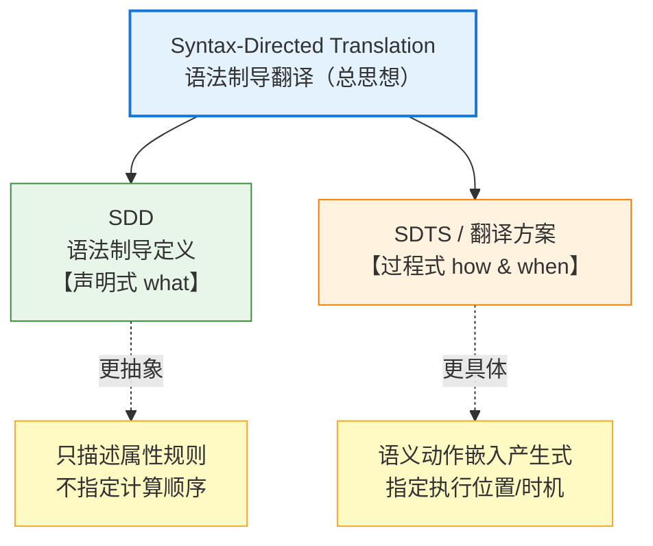
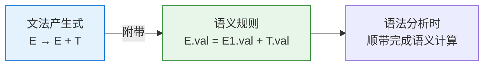
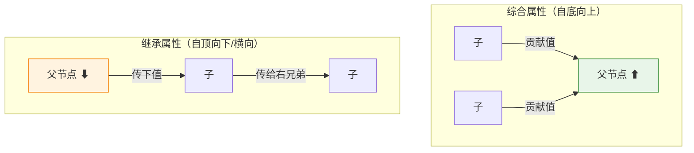
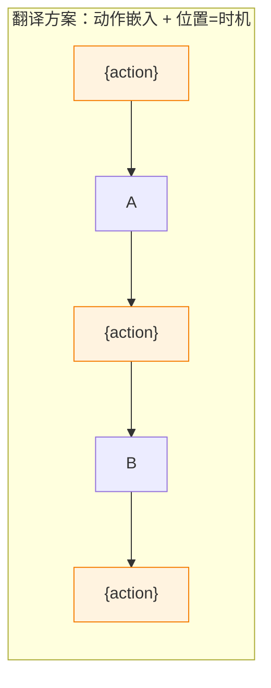
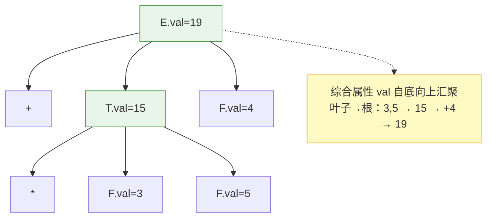

# 语法制导：SDD、SDT 与翻译方案

"Syntax-Directed Translation（语法制导翻译）"是编译原理（龙书）中**语法分析与语义处理**衔接部分的核心概念。相关的三个术语（SDT、SDD、SDTS）容易混淆，因为名字都带 "syntax-directed（语法制导）"。本文彻底厘清：三者分别是什么、区别在哪、如何配合工作。

---

## 目录

1. [先建立总图：三者的关系](#一先建立总图三者的关系)
2. ["语法制导"的核心思想](#二语法制导的核心思想)
3. [SDD：语法制导定义（是什么）](#三sdd语法制导定义是什么)
4. [属性：综合属性 vs 继承属性](#四属性综合属性-vs-继承属性)
5. [SDT / SDTS：语法制导翻译方案（怎么做）](#五sdt--sdts语法制导翻译方案怎么做)
6. [SDD vs SDT 的核心区别](#六sdd-vs-sdt-的核心区别)
7. [一个完整例子贯穿三者](#七一个完整例子贯穿三者)
8. [总结](#八总结)

---

## 一、先建立总图：三者的关系

```
三个术语，其实是【一套思想 + 两种具体形式】：

Syntax-Directed Translation (SDT，语法制导翻译)
    = 总的【思想/方法论】：让翻译过程由语法结构来驱动
        │
        ├── Syntax-Directed Definition (SDD，语法制导定义)
        │       = 【声明式(what)】：只说属性间的规则，不说何时算
        │
        └── Syntax-Directed Translation Scheme (SDTS / SDT，翻译方案)
                = 【过程式(how/when)】：把语义动作嵌入产生式中的具体位置
```



> ⚠️ **术语提示**：SDT 这个缩写有点歧义——它既可以泛指"语法制导翻译"这个大思想，也常特指"翻译方案（translation scheme）"。龙书里 SDD 和 SDT（=翻译方案）是一对经典对照。

---

## 二、"语法制导"的核心思想

先理解共同的底层思想——为什么叫"语法制导"：

```
编译要做两件事：
    ① 语法分析：判断程序结构是否合法 → 得到语法树
    ② 语义处理：算类型、生成代码、求值...
        ↓
"语法制导"的思想 = 把②【挂靠】到①上
        ↓
    每条文法产生式(grammar rule)，
    都附带一些【语义规则/动作】
        ↓
    语法分析走到哪条产生式，
    就顺带执行对应的语义规则
        ↓
    "翻译由语法结构来驱动/制导" ← 这就是 syntax-directed
```



> **一句话**：语法制导 = 把语义信息"绑"在文法产生式上，让语法分析过程顺便驱动语义处理。

---

## 三、SDD：语法制导定义（是什么）

```
SDD (Syntax-Directed Definition)：
    = 文法 + 每个文法符号的【属性(attribute)】
      + 每条产生式关联的【语义规则(semantic rules)】
        ↓
    特点：【声明式 / 说明性】
        • 只规定"属性之间应满足什么关系"
        • 【不】规定这些规则按什么顺序、何时计算
        • 属性的求值顺序由依赖关系隐式决定
```

一个 SDD 的样子（计算表达式的值）：

| 产生式             | 语义规则                      |
| --------------- | ------------------------- |
| $E \to E_1 + T$ | $E.val = E_1.val + T.val$ |
| $E \to T$       | $E.val = T.val$           |
| $T \to T_1 * F$ | $T.val = T_1.val * F.val$ |
| $T \to F$       | $T.val = F.val$           |
| $F \to ( E )$   | $F.val = E.val$           |
| $F \to digit$   | $F.val = digit.lexval$    |

```
注意：上表只说了"val 之间的等式关系"
    没说"先算哪个、后算哪个"
        ↓
    这就是 SDD 的【声明式】本质
    （计算顺序由属性依赖图决定）
```

---

## 四、属性：综合属性 vs 继承属性

SDD 里的属性分两类，这决定了信息在语法树上"往哪个方向流"：

```
综合属性(Synthesized attribute)：
    节点的属性值，由它【孩子节点】的属性算出
    → 信息【自底向上】流动（叶→根）
    例：E.val = E1.val + T.val（E 的值来自它的孩子）

继承属性(Inherited attribute)：
    节点的属性值，由它【父节点/兄弟节点】的属性算出
    → 信息【自顶向下 / 横向】流动（根/左→右）
    例：声明类型 T 传给变量列表 L：L.type = T.type
```



| 属性类型     | 值来自    | 信息流向    | 典型用途         |
| -------- | ------ | ------- | ------------ |
| **综合属性** | 子节点    | 自底向上    | 表达式求值、代码生成结果 |
| **继承属性** | 父/兄弟节点 | 自顶向下/横向 | 传递类型、符号表、上下文 |

> 特例：**S-属性 SDD**（只用综合属性）和 **L-属性 SDD**（综合 + 受限的继承属性），是能被高效实现的两类，与下面的翻译方案密切相关。

---

## 五、SDT / SDTS：语法制导翻译方案（怎么做）

```
SDTS (Syntax-Directed Translation Scheme，翻译方案)：
    = 在产生式的【右部具体位置】嵌入【语义动作(action)】
        ↓
    特点：【过程式 / 操作性】
        • 用 { ... } 把语义动作【放在产生式的某个位置】
        • 位置 = 明确指定这段代码【何时执行】
          （在识别到该位置的符号时执行）
        • 这就把"计算顺序/时机"显式化了
```

同一个表达式求值，写成翻译方案：

```
E → E₁ + T   { E.val = E₁.val + T.val; }      // 动作在末尾
E → T        { E.val = T.val; }
T → T₁ * F   { T.val = T₁.val * F.val; }
T → F        { T.val = F.val; }
F → ( E )    { F.val = E.val; }
F → digit    { F.val = digit.lexval; }
```

动作的**位置**很关键（尤其含继承属性时）：

```
S → { action1 } A { action2 } B { action3 }
        ↓            ↓           ↓
   识别A之前执行  A后B前执行   识别B之后执行
        ↓
    位置决定了执行时机 —— 这正是 SDTS 比 SDD 更"具体"之处
```



> 这就是你在 **Yacc/Bison** 里写的东西——产生式后面 `{ ... }` 里的 C 代码，本质就是翻译方案的语义动作。

---

## 六、SDD vs SDT 的核心区别

这是最需要记住的对照：

| 维度       | **SDD（语法制导定义）** | **SDT / 翻译方案**     |
| -------- | --------------- | ------------------ |
| **风格**   | 声明式（what）       | 过程式（how & when）    |
| **说明什么** | 属性间的**关系规则**    | 语义**动作**及其**执行位置** |
| **执行顺序** | 不指定，由依赖关系隐式决定   | **显式指定**（由动作位置决定）  |
| **抽象层次** | 更高、更抽象          | 更低、更接近实现           |
| **类比**   | "描述要满足的方程"      | "写出具体的执行步骤"        |
| **实现工具** | 概念性描述           | Yacc/Bison 中的实际代码  |

```
关系可以这样理解：
    SDD 说：  "E.val 应该等于 E1.val + T.val"（一个约束）
        ↓ 具体化 ↓
    SDT 说：  "在归约 E→E1+T 的那一刻，
              执行 E.val = E1.val + T.val 这段代码"（一个动作+时机）
        ↓
    SDT 是 SDD 的一种【可执行的、指定了顺序的】实现形式
```

---

## 七、一个完整例子贯穿三者

用"计算 `3 * 5 + 4` 的值"把三个概念串起来：

```
【思想层】Syntax-Directed Translation
    把"求值"这件事，挂靠到算术表达式文法上

【SDD 声明式定义】
    E → E1 + T   {E.val = E1.val + T.val}   ← 只说关系
    T → T1 * F   {T.val = T1.val * F.val}
    F → digit    {F.val = digit.lexval}
    ...

【SDT 翻译方案（指定时机）】
    自底向上分析 3 * 5 + 4，在每次归约时执行动作：
        归约 F→digit：  F.val=3, F.val=5, ...
        归约 T→T1*F：   T.val = 3*5 = 15   ← 此刻执行
        归约 E→E1+T：   E.val = 15+4 = 19  ← 此刻执行
        ↓
    最终 E.val = 19
```



```
三者协作：
    SDT思想 → 提供"翻译由语法驱动"的框架
    SDD    → 定义"val 该满足什么关系"（声明）
    SDTS   → 定义"在归约的哪一刻执行计算"（过程）
```

---

## 八、总结

```
三个术语的关系与区别：

【Syntax-Directed Translation 语法制导翻译】(总思想)
    核心：把语义规则/动作【绑定到文法产生式】上，
          让语法分析过程【驱动】语义处理

    ├──【SDD 语法制导定义】
    │     • 声明式(what)：只描述属性之间的规则关系
    │     • 不指定计算顺序（由属性依赖隐式决定）
    │     • 属性分两类：
    │         综合属性(自底向上，来自孩子)
    │         继承属性(自顶向下/横向，来自父/兄弟)
    │     • 更抽象
    │
    └──【SDTS / 翻译方案】
          • 过程式(how & when)：语义动作{...}嵌入产生式
          • 动作的【位置】显式指定【执行时机】
          • 更具体、更接近实现（如 Yacc/Bison 代码）

【一句话区分】
    SDD 说"属性该满足什么关系"（约束/方程）
    SDT 说"在分析的哪一刻执行什么动作"（步骤/时机）
    SDT 是 SDD 的可执行、定序的实现形式
```

> 📌 **核心洞察**：理解这三个术语的关键，是抓住 **"声明式 vs 过程式" 这条分界线**，以及 **"语法制导" 这个共同的底层哲学**。所谓语法制导，本质上是编译器设计中一个极其优雅的思想——**不为语义处理另建一套独立机制，而是把语义规则直接"寄生"在描述程序结构的文法产生式上**，于是语法分析走到哪里，语义计算就自然发生在哪里，两者合二为一。在这个共同框架下，SDD 和 SDT 只是同一件事的两种表达粒度：
> 
> **SDD 是"数学家视角"**，它只声明属性之间应当满足的关系（$E.val = E_1.val + T.val$），把"何时算、按什么顺序算"留给属性依赖关系去隐式决定，因而更抽象、更接近规范说明；
> 
> **SDT（翻译方案）则是"工程师视角"**，它把语义动作用 `{...}` 精确地钉在产生式的某个位置上，从而明确规定了"在识别到这个位置时就执行这段代码"，把时机与顺序显式化，因而更接近真实实现——你在 Yacc/Bison 里敲的每一段动作代码，就是翻译方案的化身。
> 
> 而综合属性与继承属性的区分，则决定了信息在语法树上是自底向上汇聚（如表达式求值）还是自顶向下传递（如类型分发），这直接影响了一个 SDD 能否被某种分析方式高效实现。可以说，从 SDD 到 SDT，正是编译器从"我想要什么样的翻译"走向"我如何一步步实现这个翻译"的关键一跃。
