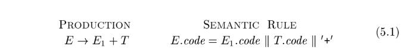
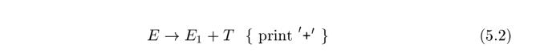

# Chapter 5 Syntax-Directed Translation

This chapter develops the theme of Section 2.3: the translation of languages guided by **context-free grammars**. The translation techniques in this chapter will be applied in Chapter 6 to **type checking** and **intermediate-code generation**. The techniques are also useful for implementing little languages for specialized tasks; this chapter includes an example from **typesetting**.

> NOTE: typesetting是一类语言，比如latex，它的字面意思是"排版"，这个例子在 Example 5.18

## SDD

We associate information with a language construct by attaching **attributes** to the grammar symbol(s) representing the construct, as discussed in Section 2.3.2. A **syntax-directed definition** specifies the values of **attributes** by associating **semantic rules** with the **grammar productions**. For example, an infix-to-postfix translator might have a production and rule

This production has two nonterminals, $E$ and $T$; the subscript in $E_1$ distinguishes the occurrence of $E$ in the production body from the occurrence of $E$ as the head. Both $E$ and $T$ have a string-valued attribute $code$. The semantic rule specifies that the string $E.code$ is formed by concatenating $E_1.code$, $T.code$, and the character '$+$'. While the rule makes it explicit that the translation of $E$ is built up from the translations of $E_1$, $T$, and '$+$', it may be inefficient to implement the translation directly by manipulating strings.

> NOTE: 最后一段话"While the rule makes it explicit that the translation of $E$ is built up from the translations of $E_1$, $T$, and '$+$', it may be inefficient to implement the translation directly by manipulating strings"是承上启下的，它的具体含义参见"Inefficient-to-implement-translation-directly-by-manipulating-strings"

## SDT

From Section 2.3.5, a syntax-directed translation scheme embeds program fragments called **semantic actions** within production bodies, as in

By convention, **semantic actions** are enclosed within curly braces. (If curly
braces occur as grammar symbols, we enclose them within single quotes, as in$'\{'$ and $'\}'$.) The position of a **semantic action** in a **production body** determines the order in which the action is executed. In production $(5.2)$, the action occurs at the end, after all the grammar symbols; in general, semantic actions may occur at any position in a production body.

## SDD VS SDT

Between the two notations, **syntax-directed definitions** can be more readable, and hence more useful for specifications. However, **translation schemes** can be more efficient, and hence more useful for implementations.

> NOTE:
> 
> |                                    | 缩写  | 核心思想                                                        |
> | ---------------------------------- | --- | ----------------------------------------------------------- |
> | syntax-directed definition         | SDD | 给文法符号（如 E、T）附加属性（attribute），再用语义规则（semantic rule）描述这些属性如何计算 |
> | syntax-directed translation scheme | SDT | translation scheme+semantic action                          |

## L-attributed translations&&S-attributed translations

The most general approach to **syntax-directed translation** is to construct a **parse tree** or a **syntax tree**, and then to compute the values of **attributes** at the nodes of the tree by visiting the nodes of the tree. In many cases, translation can be done during parsing, without building an **explicit tree**. We shall therefore study a class of **syntax-directed translations** called "**L-attributed translations**" (L for left-to-right), which encompass(包含) virtually all translations that can be performed during parsing. We also study a smaller class, called "**S-attributed translations**" (S for synthesized), which can be performed easily in connection with a **bottom-up parse**.

