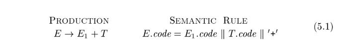

# Chapter 5 Syntax-Directed Translation


## What is syntax-directed translation

三、zhihu [C++代码与AST compiler](https://zhuanlan.zhihu.com/p/599569303)

四、zhihu [读书笔记 | 编译原理 ——一个简单的语法制导翻译器（上） - Ouyz的文章 - 知乎](https://zhuanlan.zhihu.com/p/428054996) 


### zhihu [语法制导翻译是干什么的？](https://www.zhihu.com/question/27594539/answer/43441044) 

#### [RednaxelaFX的回答 - 知乎](https://www.zhihu.com/question/27594539/answer/43441044) 

语法制导翻译，[Syntax-directed translation](https://link.zhihu.com/?target=http%3A//en.wikipedia.org/wiki/Syntax-directed_translation) ，简称SDT。

意思是在解析（parse）输入的字符串时，在特定位置执行指定的动作；换言之，根据语法把输入的字符串“翻译”为一串动作，故名“语法制导翻译”。

“特定位置”是通过把“指定动作”（称为语义动作，semantic action）嵌入到[语法规则](https://www.zhihu.com/search?q=语法规则&search_source=Entity&hybrid_search_source=Entity&hybrid_search_extra={"sourceType"%3A"answer"%2C"sourceId"%3A43441044})中指定的。

例如，如果有下述语法：

```text
E -> NUM + NUM
```

那么一个嵌入了语义动作的语法制导定义可以是：

```text
E -> NUM + { println("found op plus"); } NUM { println("value = " + ($1.value + $4.value)); }
```

这个例子中用花括号包围的代码就是语义动作，而其位置指定了在parse到什么地方的时候要执行该语义动作。例如第一组语义动作位于"+"之后、第二个NUM之前，那么parse到这个"+"之后就要执行这个语义动作。

语义动作可以看作一个“epsilon匹配”或者叫“空串匹配”，也就是说它在语法中的作用可以看作一个匹配空串的位置，也就是总是会匹配上。

```text
E -> NUM + ACTION1 NUM ACTION2
```

像这样。

#### [林一二的回答 - 知乎](https://www.zhihu.com/question/27594539/answer/2375530922) 

语法制导翻译 = 语法分析 + 翻译，这里「制导」指的是「作为判断依据」。

平时做 AST 翻译成另一种 AST 、AST 序列化成文本的时候（见 [AST转换成另一种AST](https://link.zhihu.com/?target=https%3A//onetwo.ren/wiki/%23AST%E8%BD%AC%E6%8D%A2%E6%88%90%E5%8F%A6%E4%B8%80%E7%A7%8DAST)），我们可能是用 AST 节点的 type 字段作为判断依据，然后 Switch case 执行具体的翻译操作，例如返回新的 AST 节点，或者返回一段文本。

这里的 Switch case 就是在利用当前 AST 节点，判断该做啥事。这种判断我们可以用各种其它方式来重构，例如用策略模式+依赖注入，也例如**语法制导翻译**。

重构成语法制导翻译的样子之后，我们在做语法分析的时候，就已经知道当前执行到的 AST 节点是什么了，直接从语法制导翻译的表格里取用相应的动作来执行就好了。

> NOTE:
>
> 一、上面描述了alternative to syntax-directed-translation:
>
> 1、switch case
>
> 2、策略模式+依赖注入

但是实际工作中，语法分析是独立的库，我们写转换又是独立的库，接触不到语法分析的过程，所以语法制导翻译就不常用了。

#### [Ouyz的回答 - 知乎](https://www.zhihu.com/question/27594539/answer/2200815839) 


在编译器前端组成部分中，语义分析和中间代码生成往往在实现上经常放在一起，称为**语义翻译**。此外，我们还可以在**语义分析**的时候进行**语义翻译**，这个过程就称为**语法制导翻译**，如图：


我写了一篇关于语法制导翻译器部分的读书笔记：[Ouyz：读书笔记 | 编译原理 ——一个简单的语法制导翻译器（上）](https://zhuanlan.zhihu.com/p/428054996)

对编译原理感兴趣的可以关注该系列文章或我的公众号：Imagination Space

### wikipedia [Syntax-directed translation](https://en.wikipedia.org/wiki/Syntax-directed_translation)

**Syntax-directed translation** refers to a method of [compiler](https://en.wikipedia.org/wiki/Compiler) implementation where the source language translation is completely driven by the [parser](https://en.wikipedia.org/wiki/Parser).

A common method of syntax-directed translation is translating a string into a sequence of actions by attaching one such action to each rule of a [grammar](https://en.wikipedia.org/wiki/Grammar).[[1\]](https://en.wikipedia.org/wiki/Syntax-directed_translation#cite_note-Gurari-1) Thus, parsing a string of the grammar produces a sequence of rule applications. SDT provides a simple way to attach [semantics](https://en.wikipedia.org/wiki/Semantics) to any such [syntax](https://en.wikipedia.org/wiki/Syntax).

> NOTE:
>
> semantic action

#### Overview

Syntax-directed translation fundamentally works by adding actions to the productions in a [context-free grammar](https://en.wikipedia.org/wiki/Context-free_grammar), resulting in a Syntax-Directed Definition (SDD).[[2\]](https://en.wikipedia.org/wiki/Syntax-directed_translation#cite_note-Alfred-2) Actions are steps or procedures that will be carried out when that production is used in a derivation. A grammar specification embedded with actions to be performed is called a *syntax-directed translation scheme*[[1\]](https://en.wikipedia.org/wiki/Syntax-directed_translation#cite_note-Gurari-1) (sometimes simply called a 'translation scheme'.)

> NOTE:
>
> 一、关于SDD，在`5.1-Syntax-Directed-Definitions`中进行了介绍

Each symbol in the grammar can have an *attribute*, which is a value that is to be associated with the symbol. Common attributes could include a variable type, the value of an expression, etc. Given a symbol *X*, with an attribute *t*, that attribute is referred to as *X*.*t*

Thus, given actions and attributes, the grammar can be used for translating strings from its language by applying the actions and carrying information through each symbol's attribute.


## 正文

This chapter develops the theme of Section 2.3: the translation of languages guided by **context-free grammars**. The translation techniques in this chapter will be applied in Chapter 6 to **type checking** and **intermediate-code generation**. The techniques are also useful for implementing little languages for specialized tasks; this chapter includes an example from typesetting.

We associate information with a language construct by attaching **attributes** to the grammar symbol(s) representing the construct, as discussed in Section 2.3.2. A **syntax-directed definition** specifies the values of **attributes** by associating **semantic rules** with the grammar productions. For example, an infix-to-postfix translator might have a production and rule



From Section 2.3.5, a syntax-directed translation scheme embeds program fragments called **semantic actions** within production bodies, as in


By convention, semantic actions are enclosed within curly braces.

Between the two notations, syntax-directed definitions can be more readable, and hence more useful for specifications. However, translation schemes can be more efficient, and hence more useful for implementations.

|                                    |      |                 |
| ---------------------------------- | ---- | --------------- |
| syntax-directed definition         | SDD  | semantic rule   |
| syntax-directed translation scheme | SDT  | semantic action |

The most general approach to **syntax-directed translation** is to construct a **parse tree** or a **syntax tree**, and then to compute the values of attributes at the nodes of the tree by visiting the nodes of the tree. In many cases, translation can be done during parsing, without building an explicit tree. We shall therefore
study a class of syntax-directed translations called "L-attributed translations" (L for left-to-right), which encompass virtually all translations that can be performed during parsing. We also study a smaller class, called "S-attributed translations" (S for synthesized), which can be performed easily in connection with a bottom-up parse.


## Application


### Semantic analysis

wikipedia的[Syntax-directed translation](https://en.wikipedia.org/wiki/Syntax-directed_translation)非常直接简明的描述了Syntax-directed translation的功能:

> **Syntax-directed translation** refers to a method of [compiler](https://en.wikipedia.org/wiki/Compiler) implementation where the source language translation is completely driven by the [parser](https://en.wikipedia.org/wiki/Parser).
>
> A common method of syntax-directed translation is translating a string into a sequence of actions by attaching one such action to each rule of a [grammar](https://en.wikipedia.org/wiki/Grammar). Thus, parsing a string of the grammar produces a sequence of rule applications. SDT provides a simple way to attach [semantics](https://en.wikipedia.org/wiki/Semantics) to any such [syntax](https://en.wikipedia.org/wiki/Syntax).

上面这段话已经将SDT和[semantics](https://en.wikipedia.org/wiki/Semantics)关联到一起了，其实SDT是[Semantic analysis](https://en.wikipedia.org/wiki/Semantic_analysis_(compilers))的一种实现方式，正如wikipedia的[compiler](https://en.wikipedia.org/wiki/Compiler)中所描述的：

> A compiler is likely to perform many or all of the following operations: [preprocessing](https://en.wikipedia.org/wiki/Preprocessor), [lexical analysis](https://en.wikipedia.org/wiki/Lexical_analysis), [parsing](https://en.wikipedia.org/wiki/Parsing), [semantic analysis](https://en.wikipedia.org/wiki/Semantic_analysis_(compilers)) ([syntax-directed translation](https://en.wikipedia.org/wiki/Syntax-directed_translation)), conversion of input programs to an [intermediate representation](https://en.wikipedia.org/wiki/Intermediate_representation), [code optimization](https://en.wikipedia.org/wiki/Code_optimization) and [code generation](https://en.wikipedia.org/wiki/Code_generation_(compiler)). 

