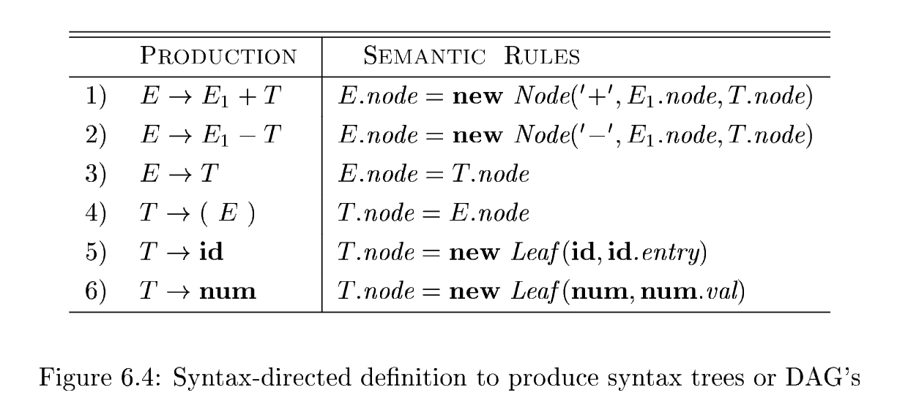
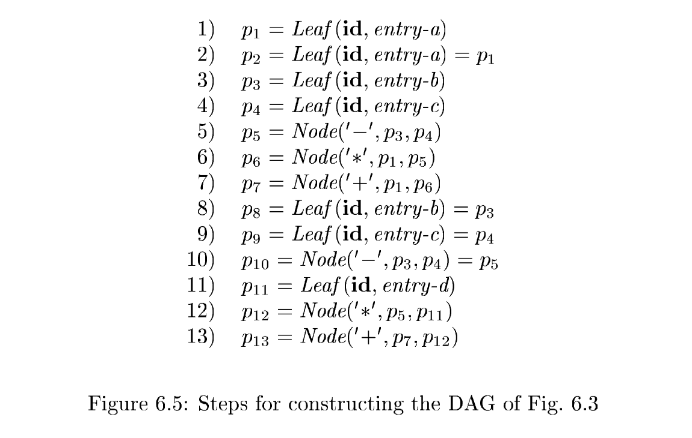
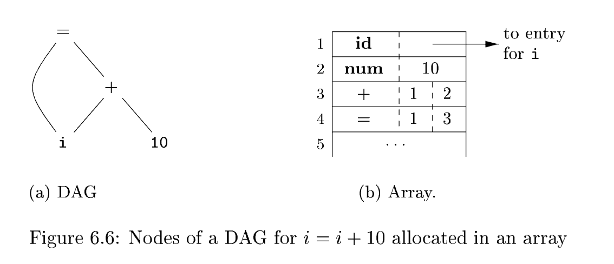
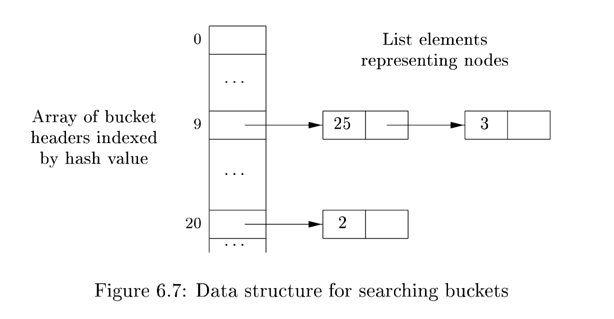

# 6.1 Variants of Syntax Trees

Nodes in a **syntax tree** represent constructs in the source program; the children of a node represent the meaningful components of a construct. A **directed acyclic graph** (hereafter called a DAG) for an expression identifies the **common subexpressions** (subexpressions that occur more than once) of the expression. As we shall see in this section, DAG's can be constructed by using the same techniques that construct **syntax trees**.

## 6.1.1 Directed Acyclic Graphs for Expressions

Like the **syntax tree** for an expression, a DAG has leaves corresponding to atomic operands and interior nodes corresponding to operators. The difference is that a node $N$ in a DAG has more than one parent if $N$ represents a **common subexpression**; in a **syntax tree**, the tree for the **common subexpression** would be replicated as many times as the subexpression appears in the original expression. Thus, a DAG not only represents expressions more succinctly, it gives the compiler important clues regarding the generation of efficient code to evaluate the expressions.

### Example 6.1

*Figure 6.3* shows the DAG for the expression

$$
a + a * (b - c) + (b - c) * d
$$

The leaf for $a$ has two parents, because $a$ appears twice in the expression. More interestingly, the two occurrences of the common subexpression $b-c$ are represented by one node, the node labeled $-$. That node has two parents, representing its two uses in the subexpressions $a*(b-c)$ and $(b-c)*d$. Even though $b$ and $c$ appear twice in the complete expression, their nodes each have one **parent**, since both uses are in the common subexpression $b-c$. $\quad \square$

The SDD of *Fig. 6.4* can construct either syntax trees or DAG’s. It was used to construct **syntax trees** in Example 5.11, where functions $Leaf$ and $Node$ created a fresh node each time they were called. It will construct a DAG if, before creating a new node, these functions first check whether an identical node already exists. If a previously created identical node exists, the existing node is returned. For instance, before constructing a new node, $Node(op, left, right)$, we check whether there is already a node with label $op$, and children $left$ and $right$, in that order. If so, $Node$ returns the existing node; otherwise, it creates a new node.

### Example 6.2

The sequence of steps shown in *Fig. 6.5* constructs the DAG in *Fig. 6.3*, provided $Node$ and $Leaf$ return an existing node, if possible, as discussed above. We assume that $entry$-$a$ points to the symbol-table entry for $a$, and similarly for the other identifiers.
When the call to $Leaf(\mathbf{id}, entry\text{-}a)$ is repeated at step 2, the node created by the previous call is returned, so $p_2 = p_1$. Similarly, the nodes returned at steps 8 and 9 are the same as those returned at steps 3 and 4 (i.e., $p_8 = p_3$ and $p_9 = p_4$). Hence the node returned at step 10 must be the same at that returned at step 5; i.e., $p_{10} = p_5$. $\quad \square$

## 6.1.2 The Value-Number Method for Constructing DAG’s

翻译: 值编号法

Often, the nodes of a **syntax tree** or DAG are stored in an array of records, as suggested by *Fig. 6.6*. Each row of the array represents one record, and therefore one node. In each record, the first field is an **operation code**, indicating the label of the node. In *Fig. 6.6*(b), leaves have one additional field, which holds the **lexical value** (either a **symbol-table pointer** or a **constant**, in this case), and **interior nodes** have two additional fields indicating the left and right children.

In this array, we refer to nodes by giving the **integer index** of the record for that node within the array. This integer historically has been called the ***value number*** for the node or for the expression represented by the node. For instance, in *Fig. 6.6*, the node labeled $+$ has value number $3$, and its left and right children have **value numbers** $1$ and $2$, respectively. In practice, we could use **pointers** to records or **references** to objects instead of integer indexes, but we shall still refer to the reference to a node as its "**value number**." If stored in an appropriate **data structure**, **value numbers** help us construct expression DAG’s efficiently; the next algorithm shows how.

### signature

Suppose that nodes are stored in an array, as in *Fig. 6.6*, and each node is referred to by its **value number**. Let the *signature* of an **interior node** be the triple $\langle op, l, r \rangle$, where $op$ is the label, $l$ its left child’s **value number**, and $r$ its right child’s **value number**. A unary operator may be assumed to have $r = 0$.

### Algorithm 6.3: value-number method

The **value-number method** for constructing the nodes of a DAG.
**INPUT**: Label $op$, node $l$, and node $r$.
**OUTPUT**: The **value number** of a node in the **array** with **signature** $\langle op,l,r \rangle$.
**METHOD**: Search the array for a node $M$ with label $op$, left child $l$, and right child $r$. If there is such a node, return the **value number** of $M$. If not, create in the array a new node $N$ with label $op$, left child $l$, and right child $r$, and return its **value number**. $\quad \square$
While Algorithm 6.3 yields the desired output, searching the entire array every time we are asked to locate one node is expensive, especially if the array holds expressions from an entire program. A more efficient approach is to use a **hash table**, in which the nodes are put into "buckets," each of which typically will have only a few nodes. The **hash table** is one of several **data structures** that support *dictionaries* efficiently.$^1$ A dictionary is an **abstract data type** that allows us to insert and delete elements of a set, and to determine whether a given element is currently in the set. A good **data structure** for dictionaries, such as a **hash table**, performs each of these operations in time that is constant or close to constant, independent of the size of the set.

> NOTE: 前文的**算法 6.3**是最朴素的值编号法：每次新建运算符节点时，完整遍历整个节点数组，逐个比对三元组$\langle op,l,r \rangle$，判断是否存在完全相同的子表达式节点。
> 
> 这种暴力遍历效率极低，表达式越多、数组越长，耗时越严重。这段话就是介绍**哈希表优化方案**，解决全数组扫描的性能问题。

To construct a **hash table** for the nodes of a DAG, we need a *hash function* $h$ that computes the index of the bucket for a signature $\langle op,l,r \rangle$, in a way that distributes the **signatures** across buckets, so that it is unlikely that any one bucket will get much more than a fair share of the nodes. The bucket index $h(op,l,r)$ is computed deterministically from $op$, $l$, and $r$, so that we may repeat the calculation and always get to the same bucket index for node $\langle op,l,r \rangle$.

The buckets can be implemented as linked lists, as in *Fig. 6.7*. An array, indexed by hash value, holds the *bucket headers*, each of which points to the first cell of a list. Within the linked list for a bucket, each cell holds the value number of one of the nodes that hash to that bucket. That is, node $\langle op,l,r \rangle$ can be found on the list whose header is at index $h(op,l,r)$ of the array.

Thus, given the input node $op$, $l$, and $r$, we compute the bucket index $h(op,l,r)$ and search the list of cells in this bucket for the given input node. Typically, there are enough buckets so that no list has more than a few cells. We may need to look at all the cells within a bucket, however, and for each value number $v$ found in a cell, we must check whether the signature $\langle op,l,r \rangle$ of the input node matches the node with value number $v$ in the list of cells (as in *Fig. 6.7*). If we find a match, we return $v$. If we find no match, we know no such node can exist in any other bucket, so we create a new cell, add it to the list of cells for bucket index $h(op,l,r)$, and return the value number in that new cell.

