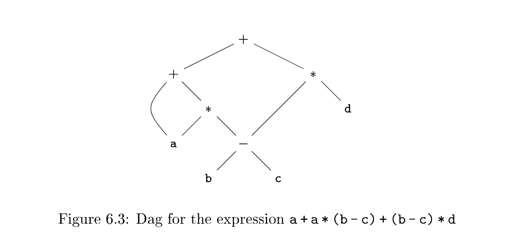

# 6.1 Variants of Syntax Trees

Nodes in a **syntax tree** represent constructs in the source program; the children of a node represent the meaningful components of a construct. A **directed acyclic graph** (hereafter called a DAG) for an expression identifies the **common subexpressions** (subexpressions that occur more than once) of the expression. As we shall see in this section, DAG's can be constructed by using the same techniques that construct **syntax trees**.

## 6.1.1 Directed Acyclic Graphs for Expressions

Like the **syntax tree** for an expression, a DAG has leaves corresponding to atomic operands and interior nodes corresponding to operators. The difference is that a node $N$ in a DAG has more than one parent if $N$ represents a **common subexpression**; in a **syntax tree**, the tree for the **common subexpression** would be replicated as many times as the subexpression appears in the original expression. Thus, a DAG not only represents expressions more succinctly, it gives the compiler important clues regarding the generation of efficient code to evaluate the expressions.

### Example 6.1

*Figure 6.3* shows the DAG for the expression

$$
a + a * (b - c) + (b - c) * d
$$

The leaf for $a$ has two parents, because $a$ appears twice in the expression. More interestingly, the two occurrences of the common subexpression $b-c$ are represented by one node, the node labeled $-$. That node has two parents, representing its two uses in the subexpressions $a*(b-c)$ and $(b-c)*d$. Even though $b$ and $c$ appear twice in the complete expression, their nodes each have one parent, since both uses are in the common subexpression $b-c$. $\quad \square$

