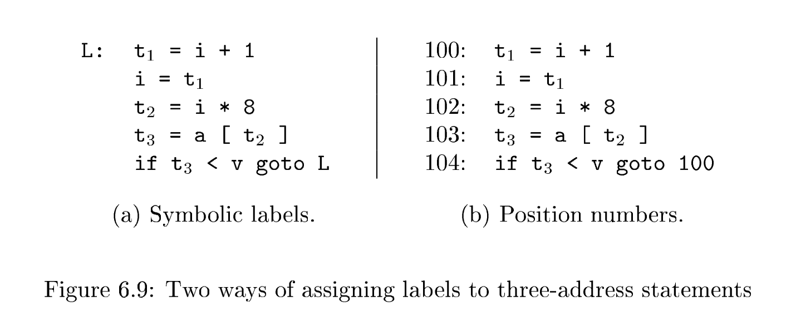

# 6.2 Three-Address Code

> NOTE: 三地址码的补充内容: 

$$
\begin{gathered}
t_1 = y * z \\
t_2 = x + t_1
\end{gathered}
$$

where $t_1$ and $t_2$ are compiler-generated temporary names. This unraveling(拆解) of multi-operator arithmetic expressions and of nested flow-of-control statements makes **three-address code** desirable for **target-code generation** and optimization, as discussed in Chapters 8 and 9. The use of names for the intermediate values computed by a program allows **three-address code** to be rearranged easily.

**翻译**: 将多运算符算术表达式逐层拆解、将嵌套控制流语句平铺展开的特性，让**三地址码**十分适合用于**目标代码生成**与代码优化，相关内容将在第 8、9 章详细讨论。三地址码使用临时变量命名程序计算产生的中间值，这一设计使得**三地址码**能够灵活重排指令顺序。

## Example 6.4

**Three-address code** is a linearized representation of a **syntax tree** or a **DAG** in which explicit names correspond to the **interior nodes** of the graph. The DAG in *Fig. 6.3* is repeated in *Fig. 6.8*, together with a corresponding three-address sequence. $\quad \square$


## 6.2.1 Addresses and Instructions

**Three-address code** is built from two concepts: **addresses** and **instructions**. In object-oriented terms, these concepts correspond to classes, and the various kinds of addresses and instructions correspond to appropriate subclasses. Alternatively, **three-address code** can be implemented using records with fields for the addresses; records called quadruples and triples are discussed briefly in Section 6.2.2.

翻译: 三地址码由两大核心概念构成：**地址**与**指令**。以面向对象视角来看，这两个概念可对应基类，各类地址、各类指令则分别对应各自的派生子类。除此之外，也可采用带地址字段的记录结构实现三地址码；6.2.2 节会简要介绍四元式、三元式两种记录实现方案。

### Address

An address can be one of the following:

- A *name*(变量名). For convenience, we allow source-program names to appear as addresses in **three-address code**. In an implementation, a source name is replaced by a pointer to its **symbol-table entry**, where all information about the name is kept.
- A *constant*(常量). In practice, a compiler must deal with many different types of constants and variables. **Type conversions** within expressions are considered in Section 6.5.2.
- A *compiler-generated temporary*(编译器生成的临时变量). It is useful, especially in optimizing compilers, to create a distinct name each time a temporary is needed. These temporaries can be combined, if possible, when registers are allocated to variables.
  - 翻译: 每当需要存储中间计算结果时，编译器都会生成一个唯一的临时变量名，该机制在优化编译器中尤为实用。后续为变量分配寄存器时，若条件允许，这些临时变量可以合并复用。
  - 关于optimizing compilers，参见: https://en.wikipedia.org/wiki/Optimizing_compiler

### instructions

We now consider the common **three-address instructions** used in the rest of this book. **Symbolic labels** will be used by instructions that alter the **flow of control(控制流)**. A **symbolic label** represents the index of a **three-address instruction** in the sequence of instructions. Actual indexes can be substituted for the labels, either by making a separate pass or by "backpatching"(回填), discussed in Section 6.7. 

翻译: 接下来我们介绍本书后续章节将会用到的常见**三地址指令**。能够改变**控制流**的指令需要用到**符号标签**。符号标签代表一条三地址指令在指令序列当中的下标编号。我们可以通过单独一趟遍历，或是借助 6.7 节讲解的**回填技术**，把符号标签替换成真实的指令下标。

Here is a list of the common three-address instruction forms:

#### Assignment instructions(二元运算赋值)

Assignment instructions of the form $x = y\ op\ z$, where $op$ is a binary arithmetic or logical operation, and $x$, $y$, and $z$ are addresses.

#### Assignments(一元运算赋值)

Assignments of the form $x = op\ y$, where $op$ is a **unary operation**. Essential **unary operations** include unary minus, logical negation, and conversion operators that, for example, convert an integer to a floating-point number.

#### *Copy* instructions(复制指令)

*Copy* instructions of the form $x = y$, where $x$ is assigned the value of $y$.

#### Unconditional jump(无条件跳转)

An unconditional jump `goto L`. The **three-address instruction** with label $L$ is the next to be executed.

#### Conditional jumps(条件跳转)

```
if x goto L
ifFalse x goto L
if x relop y goto L
```

**Conditional jumps** of the form `if x goto L` and `ifFalse x goto L`. These instructions execute the instruction with label $L$ next if $x$ is true and false, respectively. Otherwise, the following three-address instruction in sequence is executed next, as usual.

Conditional jumps such as `if x relop y goto L`, which apply a relational operator ($<$, $==$, $>=$, etc.) to $x$ and $y$, and execute the instruction with label $L$ next if $x$ stands in relation $relop$ to $y$. If not, the three-address instruction following `if x relop y goto L` is executed next, in sequence.

#### Procedure calls and returns

Procedure calls and returns are implemented using the following instructions: `param x` for parameters; `call p, n` and $y = \text{call } p, n$ for procedure and function calls, respectively; and `return y`, where $y$, representing a returned value, is optional. Their typical use is as the sequence of three-address instructions

$$
\begin{aligned}
&\text{param } x_1 \\
&\text{param } x_2 \\
&\dots \\
&\text{param } x_n \\
&\text{call } p,\,n
\end{aligned}
$$

generated as part of a call of the procedure $p(x_1,x_2,\dots,x_n)$. 

##### why n is not redundant

The integer $n$, indicating the number of actual parameters in "`call p, n`," is not redundant because calls can be nested. That is, some of the first `param` statements could be parameters of a call that comes after $p$ returns its value; that value becomes another parameter of the later call. The implementation of procedure calls is outlined in Section 6.9.

**补充说明:**  我们用一个**嵌套函数调用**的源码例子，就能直观理解这句话的含义，以及为什么 `call p, n` 里的参数个数 `n` 绝不是冗余信息。

源语言中的函数调用：

```
f( g(x), y )
```

含义：调用函数 `f`，它有两个实参；

- 第 1 个实参：内层函数 `g(x)` 的返回值
- 第 2 个实参：变量 `y`

这就是典型的**调用嵌套**：`g` 先执行并返回结果，这个结果再作为 `f` 的参数，参与后续的 `f` 调用。编译器生成的三地址指令顺序如下：

```
param x        // 给内层函数 g 准备参数
t1 = call g, 1 // 调用 g，n=1 表示：本调用对应前面 1 个 param
param t1       // 给外层函数 f 准备第 1 个参数（g 的返回值）
param y        // 给外层函数 f 准备第 2 个参数
call f, 2      // 调用 f，n=2 表示：本调用对应前面 2 个 param
```

也就是说，**排在前面的 param 指令，并不一定属于紧挨着它的下一个 call**。

- 例子里最开头的 `param x`，它不属于后面的 `call f`，而是属于更早的 `call g`；
- 内层调用 `g` 执行完返回值 `t1` 之后，这个返回值本身，又会作为外层调用 `f` 的一个参数（`param t1`），参与后面的 `call f`。

Q: 为什么 `n` 不是冗余的？

A: 如果 `call` 指令里没有 `n`，编译器就无法判断：当前这个 call 到底对应前面多少个 `param`。

- 没有 `n`：遇到 `call f` 时，会误以为前面 3 个 `param`（x、t1、y）全是它的参数，结果完全错误；
- 有了 `n=2`：就明确知道，**从当前 call 往前数 2 个 param（t1、y）才是 f 的实参**，最前面的 `param x` 属于上一层的 `call g`，和 f 无关。

这就是原文说的：`n` 不是冗余信息，核心原因就是**函数调用可以嵌套，param 指令会分属不同层级的调用，穿插排列**。

#### Indexed copy instructions

Indexed copy instructions of the form $x=y[i]$ and $x[i]=y$. The instruction $x=y[i]$ sets $x$ to the value in the location $i$ memory units beyond location $y$. The instruction $x[i]=y$ sets the contents of the location $i$ units beyond $x$ to the value of $y$.

#### Address and pointer assignments

Address and pointer assignments of the form $x = \&y$, $x = *y$, and $*x = y$. The instruction $x = \&y$ sets the $r$-value of $x$ to be the location ($l$-value) of $y$.$^2$ Presumably $y$ is a name(变量名), perhaps a temporary, that denotes an expression with an $l$-value such as $a[i][j]$, and $x$ is a pointer name or temporary. In the instruction $x = *y$, presumably $y$ is a pointer or a temporary whose $r$-value is a location. The $r$-value of $x$ is made equal to the contents of that location. Finally, $*x = y$ sets the $r$-value of the object pointed to by $x$ to the $r$-value of $y$.

### Example 6.5

Consider the statement

$$
\text{do } i = i+1; \text{ while } (a[i] < v);
$$

Two possible translations of this statement are shown in Fig. 6.9. The translation in Fig. 6.9(a) uses a **symbolic label** L, attached to the first instruction.

The translation in (b) shows position numbers for the instructions, starting arbitrarily at position 100. In both translations, the last instruction is a conditional jump to the first instruction. The multiplication $i * 8$ is appropriate for an array of elements that each take 8 units of space. $\quad \square$


