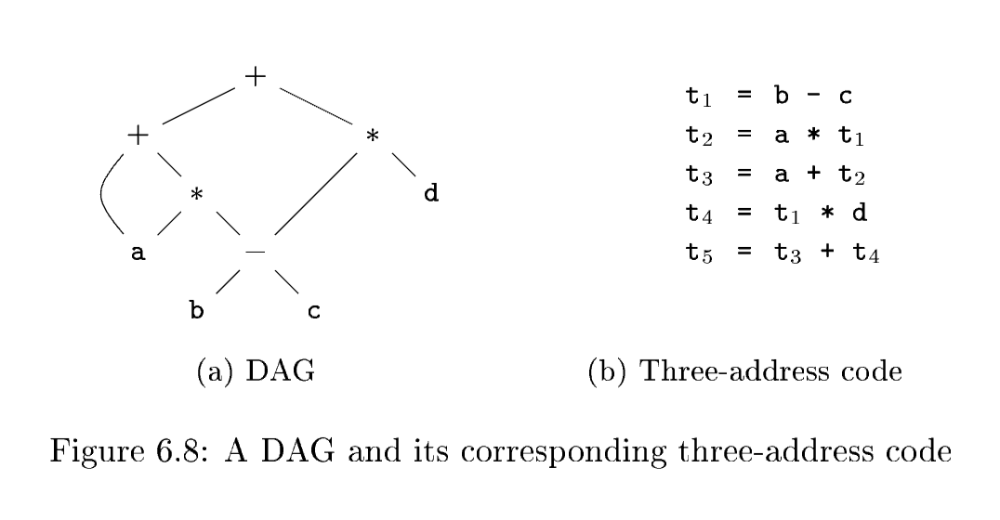

# 6.2 Three-Address Code

In three-address code, there is at most one operator on the right side of an instruction; that is, no built-up arithmetic expressions are permitted. Thus a source-language expression like $x+y*z$ might be translated into the sequence of three-address instructions

$$
\begin{gathered}
t_1 = y * z \\
t_2 = x + t_1
\end{gathered}
$$

where $t_1$ and $t_2$ are compiler-generated temporary names. This unraveling(拆解) of multi-operator arithmetic expressions and of nested flow-of-control statements makes **three-address code** desirable for **target-code generation** and optimization, as discussed in Chapters 8 and 9. The use of names for the intermediate values computed by a program allows **three-address code** to be rearranged easily.

**翻译**: 将多运算符算术表达式逐层拆解、将嵌套控制流语句平铺展开的特性，让**三地址码**十分适合用于**目标代码生成**与代码优化，相关内容将在第 8、9 章详细讨论。三地址码使用临时变量命名程序计算产生的中间值，这一设计使得**三地址码**能够灵活重排指令顺序。

## Example 6.4

**Three-address code** is a linearized representation of a **syntax tree** or a **DAG** in which explicit names correspond to the **interior nodes** of the graph. The DAG in *Fig. 6.3* is repeated in *Fig. 6.8*, together with a corresponding three-address sequence. $\quad \square$

## 6.2.1 Addresses and Instructions

**Three-address code** is built from two concepts: **addresses** and **instructions**. In object-oriented terms, these concepts correspond to classes, and the various kinds of addresses and instructions correspond to appropriate subclasses. Alternatively, **three-address code** can be implemented using records with fields for the addresses; records called quadruples and triples are discussed briefly in Section 6.2.2.

翻译: 三地址码由两大核心概念构成：**地址**与**指令**。以面向对象视角来看，这两个概念可对应基类，各类地址、各类指令则分别对应各自的派生子类。除此之外，也可采用带地址字段的记录结构实现三地址码；6.2.2 节会简要介绍四元式、三元式两种记录实现方案。

### address

An address can be one of the following:

- A *name*. For convenience, we allow source-program names to appear as addresses in **three-address code**. In an implementation, a source name is replaced by a pointer to its **symbol-table entry**, where all information about the name is kept.
- A *constant*. In practice, a compiler must deal with many different types of constants and variables. **Type conversions** within expressions are considered in Section 6.5.2.
- A *compiler-generated temporary*. It is useful, especially in optimizing compilers, to create a distinct name each time a temporary is needed. These temporaries can be combined, if possible, when registers are allocated to variables.
  - 翻译: 每当需要存储中间计算结果时，编译器都会生成一个唯一的临时变量名，该机制在优化编译器中尤为实用。后续为变量分配寄存器时，若条件允许，这些临时变量可以合并复用。

### instructions

We now consider the common three-address **instructions** used in the rest of this book. Symbolic labels will be used by instructions that alter the flow of control. A symbolic label represents the index of a three-address instruction in the sequence of instructions. Actual indexes can be substituted for the labels, either by making a separate pass or by "backpatching," discussed in Section 6.7. Here is a list of the common three-address instruction forms:

1. Assignment instructions of the form $x = y\ op\ z$, where $op$ is a binary arithmetic or logical operation, and $x$, $y$, and $z$ are addresses.

2. Assignments of the form $x = op\ y$, where $op$ is a unary operation. Essential unary operations include unary minus, logical negation, and conversion operators that, for example, convert an integer to a floating-point number.

3. *Copy* instructions of the form $x = y$, where $x$ is assigned the value of $y$.

4. An unconditional jump `goto L`. The three-address instruction with label $L$ is the next to be executed.

5. Conditional jumps of the form `if x goto L` and `ifFalse x goto L`. These instructions execute the instruction with label $L$ next if $x$ is true and false, respectively. Otherwise, the following three-address instruction in sequence is executed next, as usual.

6. Conditional jumps such as `if x relop y goto L`, which apply a relational operator ($<$, $==$, $>=$, etc.) to $x$ and $y$, and execute the instruction with label $L$ next if $x$ stands in relation $relop$ to $y$. If not, the three-address instruction following `if x relop y goto L` is executed next, in sequence.

7. Procedure calls and returns are implemented using the following instructions: `param x` for parameters; `call p, n` and $y = \text{call } p, n$ for procedure and function calls, respectively; and `return y`, where $y$, representing a returned value, is optional. Their typical use is as the sequence of three-address instructions
   
   $$
   \begin{aligned}
&\text{param } x_1 \\
&\text{param } x_2 \\
&\quad\ldots \\
&\text{param } x_n \\
&\text{call } p, n
\end{aligned}
   $$
   
   generated as part of a call of the procedure $p(x_1,x_2,\dots,x_n)$. The integer $n$, indicating the number of actual parameters in "`call p, n`," is not redundant because calls can be nested. That is, some of the first `param` statements could be parameters of a call that comes after $p$ returns its value; that value becomes another parameter of the later call. The implementation of procedure calls is outlined in Section 6.9.

8. Indexed copy instructions of the form $x=y[i]$ and $x[i]=y$. The instruction $x=y[i]$ sets $x$ to the value in the location $i$ memory units beyond location $y$. The instruction $x[i]=y$ sets the contents of the location $i$ units beyond $x$ to the value of $y$.

9. Address and pointer assignments of the form $x = \&y$, $x = *y$, and $*x = y$. The instruction $x = \&y$ sets the $r$-value of $x$ to be the location ($l$-value) of $y$.$^2$ Presumably $y$ is a name, perhaps a temporary, that denotes an expression with an $l$-value such as $a[i][j]$, and $x$ is a pointer name or temporary. In the instruction $x = *y$, presumably $y$ is a pointer or a temporary whose $r$-value is a location. The $r$-value of $x$ is made equal to the contents of that location. Finally, $*x = y$ sets the $r$-value of the object pointed to by $x$ to the $r$-value of $y$.
