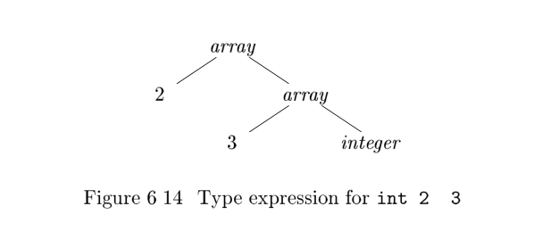

# 6.3 Types and Declarations

The applications of types can be grouped under **checking** and **translation**:

1、**Type checking** uses logical rules to reason(推理) about the behavior of a program at run time. Specifically(更加确切地说), it ensures that the types of the operands match the type expected by an operator. For example, the `&& `operator in Java expects its two operands to be booleans; the result is also of type boolean.

2、**Translation Applications**. From the type of a name, a compiler can determine the storage that will be needed for that name at run time. **Type information** is also needed to calculate the address denoted by an array reference, to insert explicit type conversions, and to choose the right version of an arithmetic operator, among other things.


In this section, we examine types and storage layout for names declared within a **procedure** or a **class**. The actual storage for a procedure call or an object is allocated at **run time**, when the procedure is called or the object is created. As we examine(检查) local declarations at **compile time**, we can, however,layout **relative addresses**, where the relative address of a name or a component of a data structure is an offset from the start of a data area.

## 6.3.1 Type Expressions

Types have structure, which we shall represent using **type expressions**: a **type expression** is either a **basic type** or is formed by applying an operator called **a type constructor**(类型构造算子) to a type expression. The sets of **basic types** and **constructors** depend on the language to be checked.

**Example 6.8** : The array type `int[2][3]` can be read as array of 2 arrays of 3 integers each and written as a **type expression** `array (2; array (3; integer))`.This type is represented by the tree in Fig. 6.14. The operator **array** takes two parameters, a number and a type(如下所示，array节点有两个子节点). 



We shall use the following definition of **type expressions**:

- A basic type is a **type expression**. Typical basic types for a language include boolean, char, integer, float, and void ; the latter denotes the absence of a value.
- A type name is a **type expression**.
- A **type expression** can be formed by applying the **array type constructor** to a number and a type expression(定义数组类型).
- A record is a data structure with named fields. A type expression can be formed by applying the **record type constructor** to the field names and their types. **Record types** will be implemented in Section 6.3.6 by applying the constructor record to a symbol table containing entries for the fields.
- A type expression can be formed by using the **type constructor->**  for **function types**. We write `s->t `for function from type `s` to type `t`. Function types will be useful when type checking is discussed in Section 6.5.
- If `s` and `t` are type expressions, then their Cartesian product `s * t` is a type expression. Products are introduced for completeness(完整性); they can be used to represent a list or tuple of types (e.g., for function parameters).We assume that associates to the left and that it has higher precedence
  than `->`.
- **Type expressions** may contain variables whose values are **type expressions**.Compiler-generated type variables will be used in Section 6.5.4.


A convenient way to represent a **type expression** is to use a graph. The value-number method of Section 6.1.2, can b e adapted to construct a DAG for a type expression, with interior nodes for type constructors and leaves for basic types, type names, and type variables; for example, see the tree in Fig. 6.14.

---

>Type Names and Recursive Types
>
>Once a class is defined, its name can be used as a **type name** in C++ or Java; for example, consider `Node` in the program fragment
>
>```java
>public class Node { ... }
>...
>public Node n;
>```
>
>Names can be used to define recursive types, which are needed for data structures such as linked lists. The pseudo code for a list element
>
>```java
>class Cell { int info; Cell next; ... }
>```
>
>
>defines the recursive type `Cell` as a class that contains a field info and a field next of type `Cell`. Similar recursive types can be defined in C using records and pointers. The techniques in this chapter carry over to recursive types.

---

## 6.3.4 Storage Layout for Local Names

From the type of a name, we can determine the amount of storage that will be needed for the name at run time. At compile time, we can use these amounts to assign each name a **relative address**. The **type** and **relative address** are saved in the **symbol-table** entry for the name. Data of varying length, such as strings, or data whose size cannot be determined until run time, such as dynamic arrays, is handled by reserving a known fixed amount of storage for a pointer to the data. Run-time storage management is discussed in Chapter 7.


---

>Address Alignment
>
>The **storage layout** for data objects is strongly influenced by the **addressing constraints** of the target machine. For example, instructions to add integers may expect integers to be aligned, that is, placed at certain positions in memory such as an address divisible by 4. Although an array of ten characters needs only enough bytes to hold ten characters, a compiler may therefore allocate 12 bytes,the next multiple of 4 ,leaving 2 bytes unused. Space left unused due to **alignment** considerations is referred to as **padding**. When space is at a premium(宝贵), a compiler may pack data so that no **padding** is left; additional instructions may then need to be executed at run time to position packed data so that it can be operated on as if it were properly aligned.

---

Suppose that storage comes in blocks of contiguous bytes, where a byte is the smallest unit of addressable memory. Typically, a byte is eight bits, and some number of bytes form a machine word. Multibyte objects are stored in consecutive bytes and given the address of the first byte.

The **width** of a **type** is the number of storage units needed for objects of that type. A basic type, such as a character, integer, or float, requires an integral number of bytes. For easy access, storage for aggregates such as arrays and classes is allocated in one contiguous block of bytes.

The **translation scheme** (SDT) (翻译方案) in Fig. 6.15 computes **types** and their **widths** for basic and array types; record types will be discussed in Section 6.3.6. The SDT uses synthesized attributes ***type*** and ***width*** for each nonterminal and two variables `t` and `w` to pass type and width information from a `B` node in a parse tree to the node for the production `C`. In a syntax-directed definition, `t` and `w` would be inherited attributes for `C` .


```
T -> B f t = B :type; w = B :width ; g
C f T :type = C :type ; T :width = C :width ; g
B -> int f B :type = integer; B :width = 4; g
B -> ?oat f B :type = ?oat; B :width = 8; g
C -> ? f C :type = t; C :width = w ; g
C -> [ num ] C
1
f C :type = array (num:value ; C
1
:type);
C :width = num:value ? C
1
:width ; g
```

