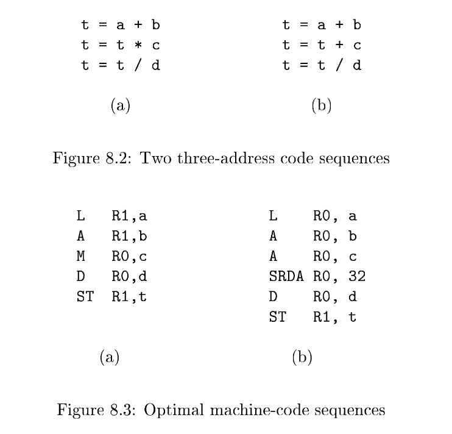

# 8.1 Issues in the Design of a Code Generator

While the details are dependent on the specifics of the **intermediate representation**, the target language, and the run‑time system, tasks such as **instruction selection**, **register allocation** and **assignment**, and **instruction ordering** are encountered in the design of almost all code generators.

翻译: 尽管实现细节取决于中间表示、目标语言以及运行时系统的具体特性，但几乎所有代码生成器的设计过程中，都会碰到指令选择、寄存器分配与指派、指令排序这类工作。

The most important criterion for a **code generator** is that it produce correct code. Correctness takes on special significance because of the number of special cases that a code generator might face. Given the premium on correctness, designing a **code generator** so it can be easily implemented, tested, and maintained is an important design goal.

翻译: 代码生成器最为核心的评判标准，就是产出正确的目标代码。由于代码生成器需要处理海量特殊场景，因此正确性有着格外关键的地位。鉴于正确性拥有极高优先级，将代码生成器设计成便于开发实现、测试以及后期维护，是一项重要的设计目标。

## 8.1.1 Input to the Code Generator

The input to the code generator is the **intermediate representation** of the source program produced by the **front end**, along with information in the **symbol table** that is used to determine the run‑time addresses of the data objects denoted by the names in the IR.

The many choices for the IR include three‑address representations such as quadruples, triples, indirect triples; virtual machine representations such as bytecodes and stack‑machine code; linear representations such as postfix notation; and graphical representations such as syntax trees and DAG's. Many of the algorithms in this chapter are couched in terms of the representations considered in Chapter 6: three‑address code, trees, and DAG's. The techniques we discuss can be applied, however, to the other intermediate representations as well.
In this chapter, we assume that the front end has scanned, parsed, and translated the source program into a relatively low‑level IR, so that the values of the names appearing in the IR can be represented by quantities that the target machine can directly manipulate, such as integers and floating‑point numbers. We also assume that all syntactic and static semantic errors have been detected, that the necessary type checking has taken place, and that type‑conversion operators have been inserted wherever necessary. The code generator can therefore proceed on the assumption that its input is free of these kinds of errors.

## 8.1.2 The Target Program

The instruction‑set architecture of the target machine has a significant impact on the difficulty of constructing a good code generator that produces high‑quality machine code. The most common target‑machine architectures are RISC (reduced instruction set computer), CISC (complex instruction set computer), and stack based.
A RISC machine typically has many registers, three‑address instructions, simple addressing modes, and a relatively simple instruction‑set architecture. In contrast, a CISC machine typically has few registers, two‑address instructions, a variety of addressing modes, several register classes, variable‑length instructions, and instructions with side effects.
In a stack‑based machine, operations are done by pushing operands onto a stack and then performing the operations on the operands at the top of the stack. To achieve high performance the top of the stack is typically kept in registers. Stack‑based machines almost disappeared because it was felt that the stack organization was too limiting and required too many swap and copy operations.
However, stack‑based architectures were revived with the introduction of the Java Virtual Machine (JVM). The JVM is a software interpreter for Java bytecodes, an intermediate language produced by Java compilers. The inter‑

## 8.1.3 Instruction Selection

The **code generator** must map the IR program into a code sequence that can be
executed by the target machine. The complexity of performing this mapping is
determined by factors such as

- the level of the IR
- the nature of the **instruction‑set architecture**
- the desired quality of the generated code.

If the IR is **high level**, the **code generator** may translate each IR statement into a sequence of **machine instructions** using **code templates**. Such **statement‑by‑statement code generation**, however, often produces poor code that needs further optimization. If the IR reflects some of the **low‑level** details of the underlying machine, then the **code generator** can use this information to generate more efficient code sequences.


The nature of the instruction set of the target machine has a strong effect on the difficulty of instruction selection. For example, the uniformity and completeness of the instruction set are important factors. If the target machine does not support each data type in a uniform manner, then each exception to the general rule requires special handling. On some machines, for example, floating‑point operations are done using separate registers.


Instruction speeds and machine idioms are other important factors. If we do not care about the efficiency of the target program, instruction selection is straightforward. For each type of three‑address statement, we can design a code skeleton that defines the target code to be generated for that construct. For example, every three‑address statement of the form x = y + z, where x, y, and z are statically allocated, can be translated into the code sequence


This strategy often pro duces redundant loads and stores. For example, the sequence of three-address statements

## 8.1.4 Register Allocation

A key problem in **code generation** is deciding what values to hold in what registers. Registers are the fastest computational unit on the target machine, but we usually do not have enough of them to hold all values. Values not held in registers need to reside in memory. Instructions involving register operands are invariably shorter and faster than those involving operands in memory, so efficient utilization of registers is particularly important.

The use of registers is often subdivided into two subproblems:

1. *Register allocation*, during which we select the set of variables that will reside in registers at each point in the program.
2. *Register assignment*, during which we pick the specific register that a variable will reside in.

Finding an optimal assignment of registers to variables is difficult, even with single‑register machines. Mathematically, the problem is **NP‑complete**. The problem is further complicated because the hardware and/or the operating system of the target machine may require that certain register‑usage conventions be observed.

### Example 8.1

**Example 8.1**: Certain machines require ***register‑pairs*** (an even and next odd‑numbered register) for some operands and results. For example, on some machines, integer multiplication and integer division involve **register pairs**. The multiplication instruction is of the form

翻译: 编号为偶数的寄存器 + 紧随其后的奇数编号寄存器

NOTE: **register‑pairs 寄存器对**：老式计算机 ALU 为支持 64 位乘法，使用相邻一偶一奇两个 32‑bit 寄存器拼接成宽位存储

```
M x, y
```

where $x$, the multiplicand, is the odd register of an even/odd register pair and $y$, the multiplier, can be anywhere. The product occupies the entire even/odd register pair. 

翻译: 其中被乘数 `x` 需要存放在一组奇偶寄存器对内的奇数寄存器；乘数 `y` 的存放位置不受限制。乘法运算结束之后，完整的乘积会占用整组奇偶寄存器对。

The division instruction is of the form

```
D x, y
```

where the dividend occupies an even/odd register pair whose even register is x;
the divisor is y. After division, the even register holds the remainder and the
odd register the quotient.

翻译: 被除数预先存放在一组奇偶寄存器对内，该组的偶数寄存器编号为`x`；`y`代表除数。除法运算完成后：偶数寄存器存储余数，奇数寄存器存放商。

Now, consider the two three‑address code sequences in [Fig. 8.2] in which the
only difference in (a) and (b) is the operator in the second statement. The
shortest assembly‑code sequences for (a) and (b) are given in [Fig. 8.3].



$Ri$ stands for register i. SRDA stands for Shift‑Right‑Double‑Arithmetic and
SRDA R0,32 shifts the dividend into R1 and clears R0 so all bits equal its sign
bit. L, ST, and A stand for load, store, and add, respectively. Note that the
optimal choice for the register into which a is to be loaded depends on what
will ultimately happen to t. $\square$

Strategies for register **allocation** and **assignment** are discussed in [Section 8.8].
[Section 8.10] shows that for certain classes of machines we can construct code
sequences that evaluate expressions using as few registers as possible.

## 8.1.5 Evaluation Order

The order in which computations are performed can affect the efficiency of the target code. As we shall see, some **computation orders** require fewer registers to hold intermediate results than others. However, picking a best order in the general case is a difficult [NP‑complete](https://en.wikipedia.org/wiki/NP-completeness) problem. Initially, we shall avoid the problem by generating code for the three‑address statements in the order in which they have been produced by the **intermediate code generator**. In [Chapter 10], we shall study **code scheduling** for **pipelined machines** that can execute several operations in a single **clock cycle**.
