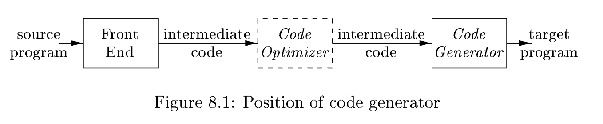

# Chapter 8 Code Generation

The final phase in our compiler model is the **code generator**. It takes as input the **intermediate representation (IR)** produced by the **front end** of the compiler, along with relevant **symbol table information**, and produces as output a semantically equivalent target program, as shown in Fig. 8.1.

The requirements imposed on a code generator are severe. The target program must preserve the semantic meaning of the source program and be of high quality; that is, it must make effective use of the available resources of the target machine. Moreover, the **code generator** itself must run efficiently.

翻译: 代码生成器需要满足严苛的设计要求

The challenge is that, mathematically, the problem of generating an optimal target program for a given source program is undecidable; many of the subproblems encountered in code generation such as **register allocation** are computationally intractable. In practice, we must be content with heuristic techniques that generate good, but not necessarily optimal, code. Fortunately, heuristics have matured enough that a carefully designed **code generator** can produce code that is several times faster than code produced by a naive one.

翻译: 难点在于：从数学理论层面来讲，为任意给定源程序生成最优目标程序属于**不可判定问题**；代码生成过程遇到的诸多子问题（例如寄存器分配）都是计算难解问题。实际工程当中，我们只能采用启发式算法，产出质量优良、却未必达到最优的目标代码。所幸现如今启发式技术已经发展成熟，一款精心设计的代码生成器，输出代码的执行速度能够达到简易版本生成代码的数倍。

Compilers that need to produce efficient target programs, include an optimization phase prior to **code generation**. The **optimizer** maps the IR into IR from which more efficient code can be generated. In general, the **code‑optimization** and **code‑generation** phases of a compiler, often referred to as the **back end**, may make multiple passes over the IR before generating the target program. **Code optimization** is discussed in detail in Chapter 9. The techniques presented in this chapter can be used whether or not an optimization phase occurs before **code generation**.

A **code generator** has three primary tasks: **instruction selection**, **register allocation and assignment**, and **instruction ordering**. The importance of these tasks is outlined in Section 8.1:

- **Instruction selection** involves choosing appropriate **target‑machine instructions** to implement the **IR statements**. 

- **Register allocation** and assignment involves deciding what values to keep in which registers. 

- **Instruction ordering** involves deciding in what order to schedule the execution of instructions.

This chapter presents algorithms that code generators can use to translate the IR into a sequence of target language instructions for **simple register machines**. The algorithms will be illustrated by using the machine model in Section 8.2. Chapter 10 covers the problem of **code generation** for complex modern machines that support a great deal of parallelism within a single instruction.

After discussing the broad issues in the design of a **code generator**, we show what kind of target code a compiler needs to generate to support the abstractions embodied in a typical source language. In Section 8.3, we outline implementations of static and stack allocation of **data areas**, and show how names(变量名) in the IR can be converted into **addresses** in the target code.

Many **code generators** partition **IR instructions** into "**basic blocks**," which consist of sequences of instructions that are always executed together. The partitioning of the IR into **basic blocks** is the subject of Section 8.4. The following section presents simple **local transformations** that can be used to transform **basic blocks** into modified basic blocks from which more efficient code can be generated. These transformations are a rudimentary(简单的) form of **code optimization**, although the deeper theory of **code optimization** will not be taken up until Chapter 9. An example of a useful, **local transformation** is the discovery of common subexpressions at the level of intermediate code and the resultant replacement of arithmetic operations by simpler copy operations.

Section 8.6 presents a simple **code‑generation algorithm** that generates code for each statement in turn, keeping operands in registers as long as possible. The output of this kind of **code generator** can be readily improved by peephole optimization techniques such as those discussed in the following Section 8.7.

The remaining sections explore **instruction selection** and **register allocation**.

# 8.1 Issues in the Design of a Code Generator

While the details are dependent on the specifics of the **intermediate representation**, the target language, and the run‑time system, tasks such as instruction selection, register allocation and assignment, and instruction ordering are encountered in the design of almost all code generators.

The most important criterion for a code generator is that it produce correct code. Correctness takes on special significance because of the number of special cases that a code generator might face. Given the premium on correctness, designing a code generator so it can be easily implemented, tested, and maintained is an important design goal.

