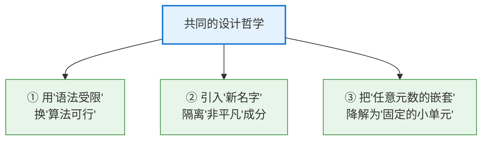
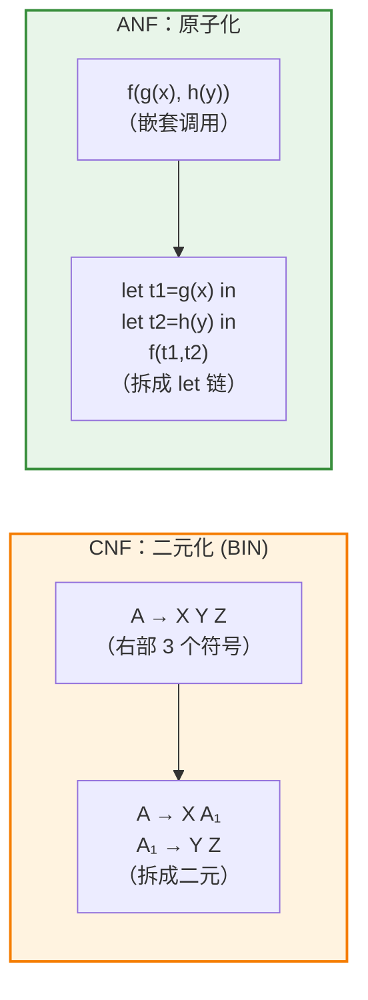
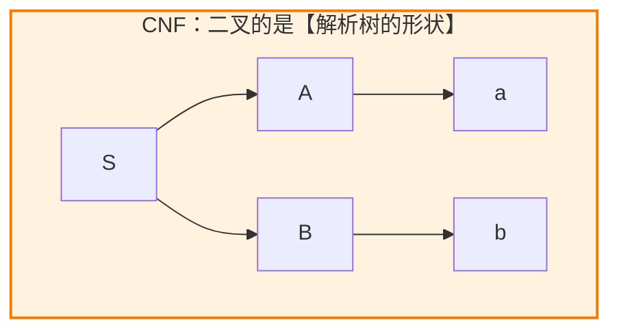
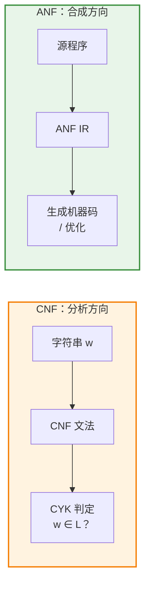

# Chomsky Normal Form vs. Administrative Normal Form：两个"范式"的深层对照

## 1. 引言：一个耐人寻味的巧合

**Chomsky Normal Form（CNF，乔姆斯基范式）** 和 **Administrative Normal Form（ANF，管理范式）** 是两个乍看毫无关系的概念：

- 一个来自**形式语言理论**，约束的是**文法的产生式**；
- 一个来自**编译器 / 程序设计**，约束的是**程序的表达式**。

它们唯一的表面共同点，似乎只是名字里都有 "**Normal Form**"。但如果深入观察，你会发现一个惊人的事实：**它们背后是同一种设计哲学的两次独立体现**——用"语法上的严格受限"换取"算法上的可计算性"。

> 📌 **一个小澄清**：这里的 "normal form"（范式）指的是"**一种标准化的受限形式**"，而非项重写理论中"不可再化简的项"那种严格意义。CNF 和 ANF 都是把一个"自由形态"的结构，改写成一个"整齐受限"的等价结构。

本文将先各自回顾，再层层揭示它们**深层的相似**与**本质的差异**。

---

## 2. 两者速览

### Chomsky Normal Form

约束**上下文无关文法的每条产生式**只能是：

$$
A \rightarrow BC \qquad A \rightarrow a \qquad (S \rightarrow \varepsilon)
$$

- 目标：让 **CYK 解析算法**（$O(n^3)$）成为可能，并简化理论证明。
- 保持：**生成同一个语言**（字符串集合不变）。

### Administrative Normal Form

约束**程序中所有复合表达式的操作数必须是原子值**，所有中间结果必须用 `let` 绑定：

$$
\texttt{let}\ x = cexp\ \texttt{in}\ exp, \qquad cexp \text{ 的子表达式都是 } aexp
$$

- 目标：简化**代码生成、优化、数据流分析**。
- 保持：**计算同一语义**（程序行为不变）。

---

## 3. 深层相似：三个共享的核心思想

尽管领域天差地别，CNF 和 ANF 却共享三条深刻的设计原则。

### 相似 ①：牺牲"表达自由"，换取"算法可行"

两者都主动放弃了原始形式的书写自由：
- CFG 本可以写任意长、任意混合的产生式，CNF 却只允许两种极简形态；
- 程序本可以任意嵌套表达式，ANF 却要求一切中间结果都得先命名。

**这种"自缚手脚"绝非折磨自己，而是为了让下游算法变简单**：
- CNF 的二叉结构 → 直接喂给 CYK 动态规划；
- ANF 的 `let` 流水线 → 直接映射为指令、直接跑数据流分析。

> 💡 **共同信条**：*规整的输入，才有高效的算法。* 两者都把"混乱"消化在转换阶段，把"整齐"留给核心算法。

### 相似 ②：引入"新名字"来隔离"非平凡"成分

这是两者**技术手法上最惊人的重合**。当一个成分"不够简单、不能直接放在这个位置"时，两者都选择——**造一个新名字，把它拎出来单独定义**：

| | CNF 的做法 | ANF 的做法 |
|---|---|---|
| **遇到的问题** | 终结符 `a` 混在长产生式里（`A → aB`） | 复合表达式嵌在参数位置（`f(g(x))`）|
| **解决手段** | 引入新**非终结符** `Xₐ`，令 `Xₐ → a`，改写为 `A → Xₐ B` | 引入新**变量** `t`，令 `let t = g(x)`，改写为 `f(t)` |
| **本质** | 给"裸终结符"起个名字，隔离出去 | 给"裸计算"起个名字，隔离出去 |

两者都在做同一件事：**把"违规的复杂片段"提取出来、赋予一个新标识符，使其余部分回归合规**。CNF 的 `Xₐ`、`A₁` 和 ANF 的 `t1`、`t2` 是同一个思想的产物。

### 相似 ③：把"任意元数的嵌套"降解为"固定小单元"

两者都执行了一种**"降元 / 扁平化"**操作：

- **CNF** 把右部长度为 $k$ 的产生式，拆成一串 **二元** 规则；
- **ANF** 把嵌套 $k$ 层的表达式，拆成一串 **每步只算一件事** 的 `let`。

结果都是：**原本"一口气做很多"的复杂结构，被拆成"一次只做一小步"的规整序列**。

---

## 4. 本质差异：它们终究是两个世界

相似再多，也不能掩盖二者根本的分野。

### 核心对照表

| 维度 | Chomsky Normal Form | Administrative Normal Form |
|------|---------------------|----------------------------|
| **所属领域** | 形式语言理论 | 编译器 / 程序设计 |
| **规范化对象** | 文法的**产生式** | 程序的**表达式** |
| **描述的东西** | 字符串的集合（**语言**）| 一次**计算过程** |
| **保持的等价** | 生成**同一语言** | 计算**同一语义** |
| **引入的辅助符号** | 新非终结符 `Xₐ`, `A₁` | 新 `let` 变量 `t1`, `t2` |
| **消除的"嵌套"** | 长产生式 → 二元规则 | 嵌套表达式 → `let` 链 |
| **使能的算法** | **CYK** 解析（$O(n^3)$）| 直接代码生成 / 数据流分析 |
| **结构结果** | **二叉**解析树 | **线性** `let` 流水线 |
| **过程方向** | 生成 / 推导（**分析**字符串）| 求值 / 执行（**编译**程序）|
| **提出者 / 背景** | Noam Chomsky（1950s，语言学）| Flanagan 等（1993，函数式编译）|

### 差异 ①：声明式 vs. 操作式

这是最根本的分野：

- **CNF 描述的是"一个语言长什么样"**——它是**声明式（declarative）**的。文法本身不"执行"，它只是刻画"哪些字符串合法"。CNF 关心的是**能否生成 / 识别**某个串。
- **ANF 描述的是"一段程序怎么算"**——它是**操作式（operational）**的。`let` 链有明确的**求值顺序**、明确的**副作用时机**。ANF 关心的是**如何一步步执行**。

> 一句话：**CNF 面向"识别"，ANF 面向"执行"**。

### 差异 ②：二叉的是"树" vs. 二叉的是"顺序"

两者都有"二元/二叉"的味道，但落点不同：

- **CNF** 的 `A → BC` 让**解析树成为严格二叉树**——它约束的是**空间上的树形结构**，这正是 CYK 能"选分割点 $k$、分治填表"的基础。
- **ANF** 的 `let` 链约束的是**时间上的执行顺序**——它把计算拉成一条**线性的时间轴**，`t1 → t2 → t3 → ...`，让求值顺序不再有歧义。

一个整理**结构**，一个整理**顺序**。

### 差异 ③：在流水线中的位置

两者都是"中间形式"，但服务于相反方向的流水线：

- **CNF** 处在**分析（analysis）**链条中：把输入串"往回解析"成结构。
- **ANF** 处在**合成（synthesis）**链条中：把源程序"往下翻译"成目标代码。

---

## 5. 一个并排的类比小结

用一句对仗来概括两者的关系：

> **CNF 把"能生成任意字符串的自由文法"，整理成"每步推导都二叉分裂的规整文法"；**
> **ANF 把"能任意嵌套的自由程序"，整理成"每步计算都原子命名的规整程序"。**

它们是**同一种智慧在两个平行宇宙中的显现**——

| 共同点 | CNF 的体现 | ANF 的体现 |
|--------|-----------|-----------|
| 受限换效率 | 二元规则 → CYK 可行 | 原子操作数 → codegen 直接 |
| 命名隔离 | 新非终结符 `Xₐ` | 新 `let` 变量 `t` |
| 降元扁平 | 长产生式 → 二元链 | 嵌套表达式 → `let` 链 |

而它们的分野也同样清晰——

| 不同点 | CNF | ANF |
|--------|-----|-----|
| 描述什么 | 语言（字符串集合）| 计算（执行过程）|
| 声明 or 操作 | 声明式 | 操作式 |
| 二叉落在 | 解析树的形状 | 执行的时间顺序 |
| 流水线方向 | 分析（识别）| 合成（编译）|

---

## 6. 结语：为什么"范式"如此普遍

CNF 与 ANF 的对照揭示了计算机科学中一个反复出现的深层主题：

> **面对"自由但混乱"的结构，聪明的做法往往是先把它规范化成"受限但整齐"的等价形式，再让核心算法在整齐的形式上高效运转。**

这个主题在别处也随处可见——SSA 之于命令式程序、DNF/CNF（布尔范式）之于逻辑公式、GNF 之于文法……每一个"范式"都是同一句智慧的变奏：

**把复杂性消化在转换阶段，把简单性留给核心算法。**

CNF 用它服务了半个世纪的形式语言解析；ANF 用它支撑了现代编译器的中间层。领域不同、对象不同、方向不同，但它们都在诉说同一个道理——**规整，是通往高效的前提。**

---

> 若你想继续深入，我可以展开：**① SSA 与 ANF 的等价性证明思路（命令式与函数式的殊途同归）**；**② 为什么 CYK 严格依赖二叉结构，能否推广到非 CNF 文法**；或 **③ 其他"范式家族"（布尔 CNF/DNF、Prenex 范式等）背后的统一原理**。告诉我你感兴趣的方向即可。😊
