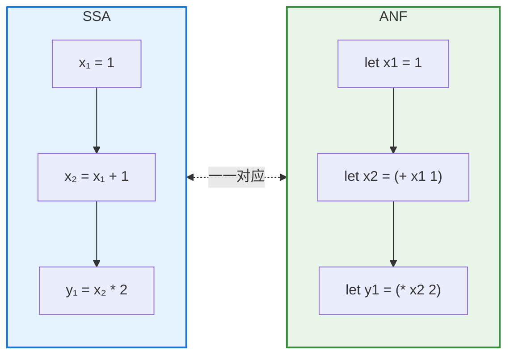
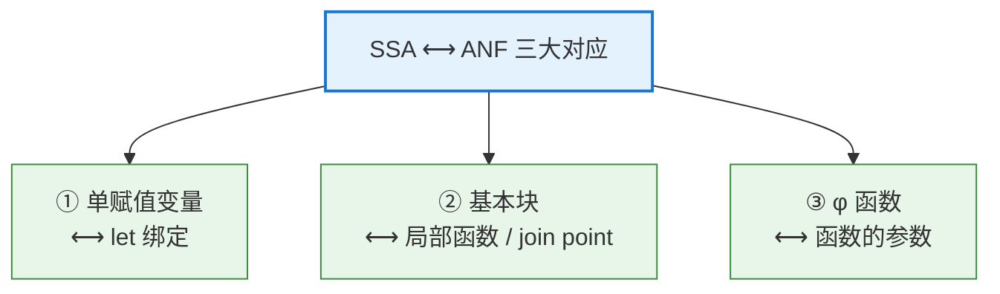
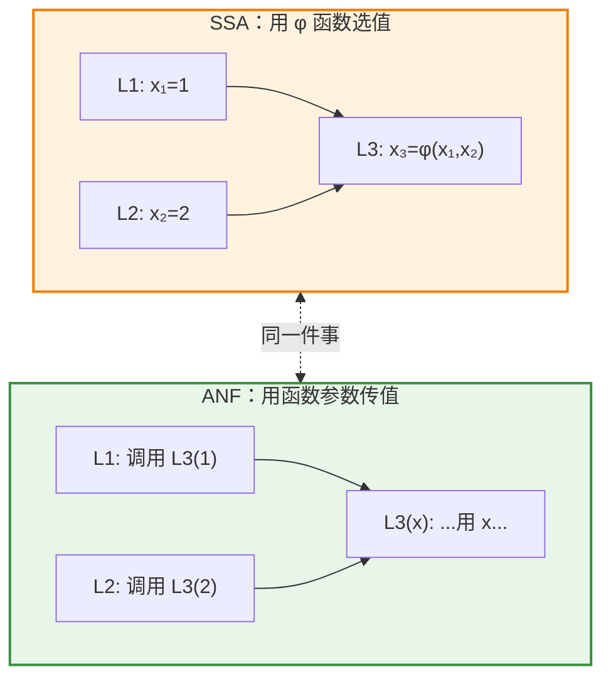
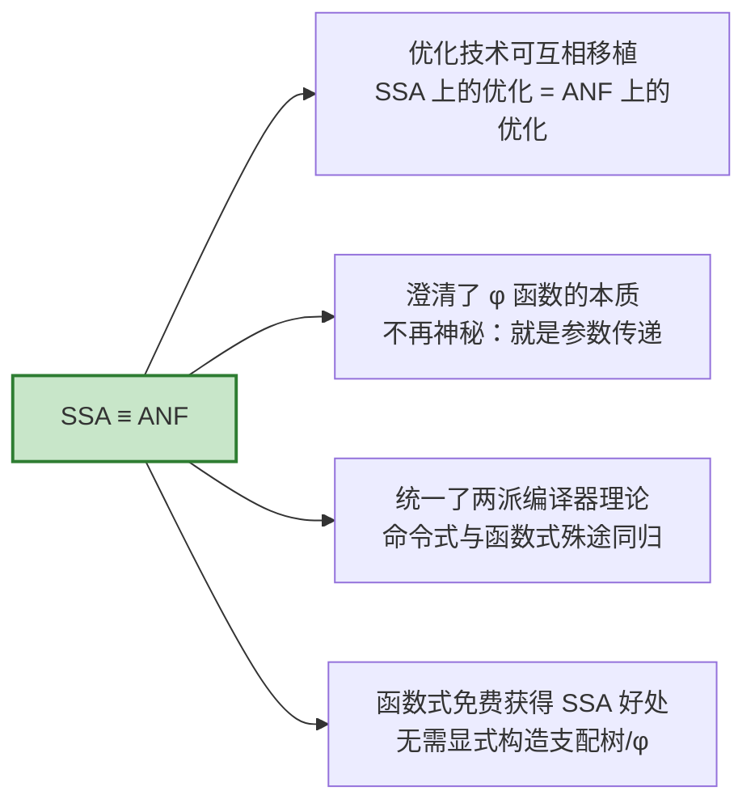

# SSA 与 ANF 的等价性：命令式与函数式的殊途同归

> 你选择了 **①**——探讨 SSA（静态单赋值）与 ANF（管理范式）为何在本质上是"同一个东西"。这是编译器理论中最优雅的结论之一。

## 1. 引言：两个世界，同一个洞见

编译器领域长期存在两条平行的技术脉络：

- **命令式阵营**（LLVM、GCC 等）：以 **SSA（Static Single Assignment）** 为核心中间表示，建立在**控制流图（CFG）**之上；
- **函数式阵营**（GHC、MLton 等）：以 **ANF 或 CPS** 为核心中间表示，建立在 **lambda 演算**之上。

长期以来，两派各说各话。直到 Richard Kelsey（1995，*"A Correspondence between Continuation Passing Style and Static Single Assignment Form"*）、以及 Andrew Appel（*"SSA is Functional Programming"*，1998）等人指出了一个惊人的事实：

> **SSA 形式与函数式中间表示（ANF/CPS）在结构上是同构的。它们是同一个思想在两种编程范式下的不同书写方式。**

本文将逐层揭示这个对应关系。

---

## 2. 先各自回顾

### SSA 的核心规则

SSA 只有一条铁律：**每个变量在程序中只被赋值一次**。

```
;; 普通命令式代码
x = 1;
x = x + 1;      // x 被重新赋值
y = x * 2;
```

转成 SSA 后，每次"重新赋值"都变成一个**新版本变量**：

```
x₁ = 1;
x₂ = x₁ + 1;    // 不是修改 x，而是定义新的 x₂
y₁ = x₂ * 2;
```

### ANF 的核心规则

ANF 的铁律：**每个中间结果都用 `let` 绑定命名，操作数必须是原子值**。

```scheme
(let ([x1 1])
  (let ([x2 (+ x1 1)])
    (let ([y1 (* x2 2)])
      y1)))
```

**第一个惊人的巧合出现了**——把上面 SSA 和 ANF 并排看：



**SSA 的"每个变量赋值一次" ≡ ANF 的"每个 `let` 绑定一个不可变的名字"**。在纯函数式世界里，`let x = ...` 天然就是"单次赋值"——**函数式变量本来就不可变，SSA 苦苦追求的"单赋值"性质，在函数式里是免费的、与生俱来的。**

这就是 Appel 那句名言的由来：**"SSA is Functional Programming"**。

---

## 3. 三组核心对应关系

直线代码的对应只是开胃菜。真正深刻的是**控制流层面**的对应。



### 对应 ①：单赋值变量 ⟷ let 绑定

已在第 2 节说明。核心：**SSA 变量的"版本" = ANF 中一次 `let` 引入的不可变绑定**。定义点唯一、名字唯一，两者天然一致。

### 对应 ②：基本块 ⟷ 局部函数

SSA 建立在**基本块（basic block）**上——一段无分支的直线代码，块之间通过跳转连接。

在函数式世界里，**一个基本块对应一个局部函数**：
- 块内的直线代码 = 函数体里的 `let` 链；
- "跳转到另一个块" = "尾调用另一个函数"。

```
;; SSA 中的两个基本块
L1:  x₁ = 1
     goto L2

L2:  y₁ = x₁ + 1
     return y₁
```

对应的函数式表示：

```scheme
(letrec ([L2 (lambda (x)          ; 块 L2 变成一个函数
               (let ([y (+ x 1)])
                 y))]
         [L1 (lambda ()           ; 块 L1 变成一个函数
               (let ([x 1])
                 (L2 x)))])       ; goto L2 变成尾调用 L2
  (L1))
```

> 💡 **控制流 = 函数调用图**。SSA 里"块 A 能跳到块 B"，等价于"函数 A 尾调用函数 B"。CFG 的边，就是调用图的边。

### 对应 ③：φ 函数 ⟷ 函数参数（最精妙的一环）

这是整个对应关系的**皇冠明珠**。

SSA 面对一个核心难题：**当多条控制流路径汇合时，某个变量可能来自不同的前驱块，该用哪个版本？** SSA 的解法是引入 **φ 函数（phi function）**：

```
L1:  x₁ = 1
     goto L3
L2:  x₂ = 2
     goto L3
L3:  x₃ = φ(x₁, x₂)   ; 若从 L1 来则取 x₁，从 L2 来则取 x₂
     y = x₃ + 10
```

`φ` 是个"魔法算子"——它根据"控制流从哪条边进来"选择对应的值。这个概念对初学者来说往往难以理解：它不是普通的运算，而是依赖"运行时走了哪条边"的隐式选择。

**而在函数式世界里，φ 函数根本不需要——它就是函数的参数！**

```scheme
(letrec ([L3 (lambda (x)        ; φ(x₁,x₂) 变成参数 x
               (let ([y (+ x 10)])
                 y))]
         [L1 (lambda ()
               (let ([x 1])
                 (L3 x)))]       ; 从 L1 汇入 → 用 x=1 调用 L3
         [L2 (lambda ()
               (let ([x 2])
                 (L3 x)))])      ; 从 L2 汇入 → 用 x=2 调用 L3
  ...)
```

对照一下：



**深刻洞见**：
- SSA 的 φ 函数说："**在汇合点，根据来路选一个值**"；
- 函数式说："**每条来路各自用不同的实参去调用同一个函数**"。

这两者完全等价！**φ 函数那个神秘的"根据控制流边选值"的语义，其实就是"不同调用点传入不同参数"这件再普通不过的事**。函数调用天然携带"我从哪来、带了什么值"的信息，根本不需要 φ 这种特殊构造。

> 一句话：**φ 函数是命令式世界为了模拟"函数参数传递"而发明的笨拙替代品。** 在函数式世界里，参数传递是原生的，所以 φ 消失了。

---

## 4. 支配关系 ⟷ 词法作用域

还有一层更精细的对应，关于"变量在哪里可见"。

**SSA 中的支配（dominance）**：变量 `x` 的使用必须被它的定义所"支配"——即从入口到使用点的每条路径都必经过定义点。这保证了"用之前一定已定义"。

**ANF 中的词法作用域（lexical scope）**：变量 `x` 只在它的 `let`（或函数参数）的作用域内可见。

这两个概念在结构上**精确对应**：

| SSA | ANF |
|-----|-----|
| 定义点**支配**使用点 | 使用点在定义的**作用域内嵌套** |
| 支配树（dominator tree）| 函数/`let` 的嵌套树 |
| "从入口必经定义点" | "被 `let` 词法包裹" |

**SSA 的支配树，就是 ANF 的作用域嵌套结构。** 命令式编译器需要专门算法（如 Lengauer-Tarjan）来构造支配树；而在函数式表示里，作用域嵌套是语法天然给定的——又是一次"函数式免费获得命令式需努力求取之物"。

---

## 5. 对应关系全景表

把所有对应关系汇总：

| SSA（命令式世界）| ANF / 函数式（函数式世界）| 说明 |
|---|---|---|
| 变量单次赋值 | `let` 不可变绑定 | 单赋值 = 不可变性 |
| SSA 版本 `x₁, x₂` | 不同的 `let` 变量名 | 版本 = 独立绑定 |
| 基本块 | 局部函数 / join point | 块 = 函数 |
| 块间跳转 `goto L` | 尾调用 `(L ...)` | 跳转 = 尾调用 |
| **φ 函数** | **函数参数** | 汇合选值 = 参数传递 |
| 控制流图 CFG | 调用图 | 边 = 调用关系 |
| 支配关系 | 词法作用域 | 支配树 = 作用域嵌套树 |
| 入口块 | 顶层函数 | 程序起点 |

---

## 6. 为什么这个等价性重要

这不只是理论上的雅趣，它有实实在在的价值：



1. **优化技术互通**。在 SSA 上成熟的优化（常量传播、死代码消除、GVN 等）可以直接翻译到 ANF 上，反之亦然。两个社区的成果可以共享。

2. **φ 函数不再神秘**。许多学生初学 SSA 时被 φ 函数困扰。一旦理解"φ 就是函数参数"，它的语义豁然开朗。

3. **函数式编译器"白赚"了 SSA 的所有好处**。GHC 等函数式编译器天然工作在 ANF/CPS 上，因此不必费力构造支配树、插入 φ 函数——这些在函数式表示里是语法自带的。

4. **理论上的统一美感**。命令式的"控制流图 + 单赋值 + φ"，和函数式的"lambda + let + 尾调用"，被证明是同一枚硬币的两面。这是计算机科学中"不同抽象殊途同归"的经典范例。

---

## 7. 一个需要注意的细节：join point

严格来说，把每个基本块都变成一个**普通函数**会带来一个问题：普通函数可能被当作一等值到处传递、形成闭包，开销较大。而基本块的跳转其实是**更受限的**——它只是控制流转移，不产生闭包。

现代编译器（如 GHC）为此引入了 **join point（汇合点）** 的概念——一种**受限的局部函数**：
- 只能被**尾调用**，不能作为值逃逸；
- 编译时可以直接实现为一个跳转标签，零开销。

**join point 精确地对应 SSA 的基本块**：它既保留了"块 = 函数"的优雅对应，又恢复了"跳转 = goto"的高效实现。这可以看作是对第 3 节 "基本块 ⟷ 函数" 对应关系的一个**工程上的精化**——让理论上的等价在实践中也不损失性能。

---

## 8. 总结

**SSA 与 ANF 的等价性**是编译器理论中最优美的结论之一，可以浓缩为一句话：

> **SSA 是命令式程序员发明的"伪装成控制流图的函数式程序"。**

具体对应关系：

- **单赋值变量 ⟷ `let` 不可变绑定**——SSA 苦求的性质，函数式与生俱来；
- **基本块 ⟷ 局部函数（join point）**，**跳转 ⟷ 尾调用**——控制流即调用图；
- **φ 函数 ⟷ 函数参数**——那个神秘的算子，不过是参数传递的乔装；
- **支配关系 ⟷ 词法作用域**——支配树就是作用域嵌套树。

**核心启示**：命令式的 SSA 和函数式的 ANF，是同一个"单次定义、显式命名、显式排序"思想在两种范式下的独立发现。理解了这一点，你就同时理解了两个世界的中间表示——**它们从来不是两样东西，而是同一个真理的两种方言。**

---

> 若你想继续深入，我可以展开：**① SSA → ANF 的具体转换算法（如何机械地把带 φ 的 CFG 翻译成 letrec）**；**② 为什么 CPS 比 ANF 更接近 SSA 的某些变体**；或 **③ join point 在 GHC 中的实际编译处理与性能考量**。告诉我你感兴趣的方向即可。😊
