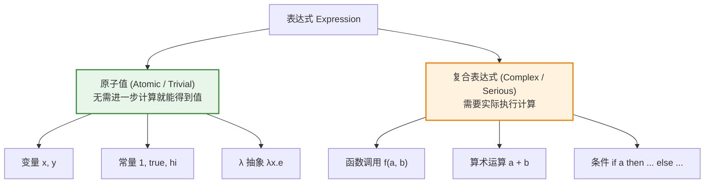
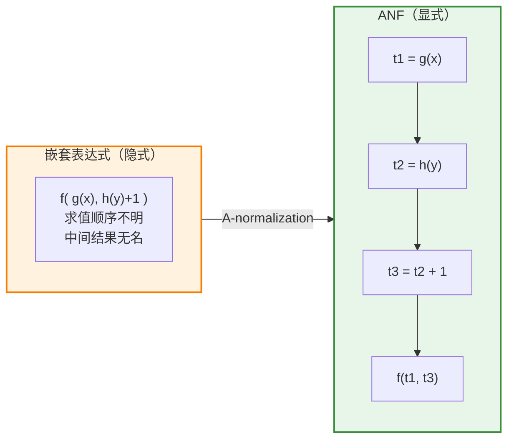
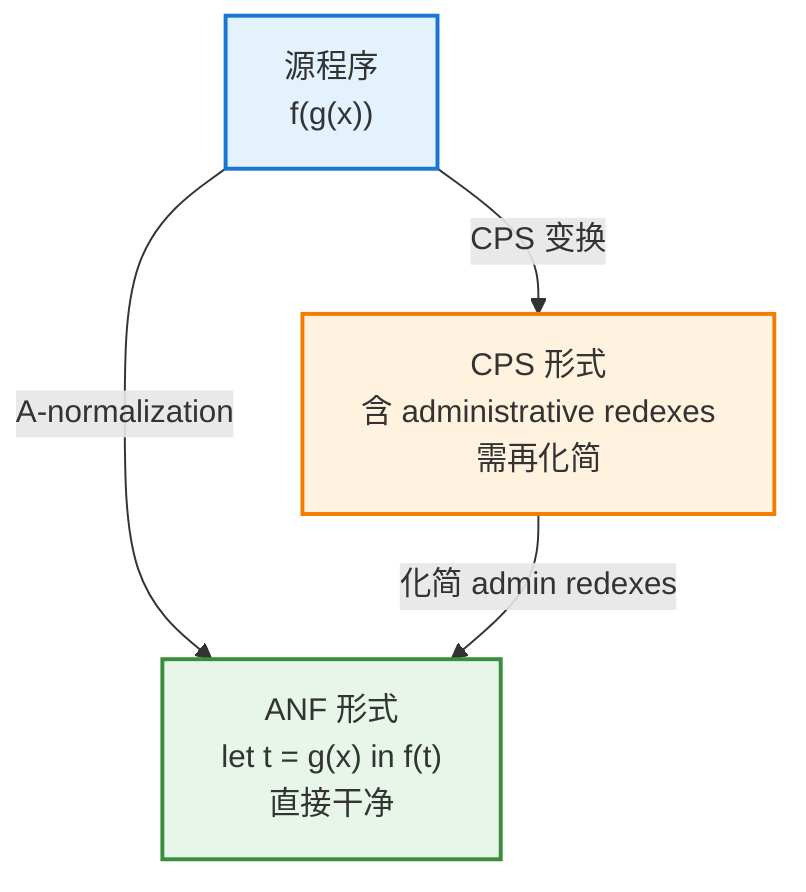
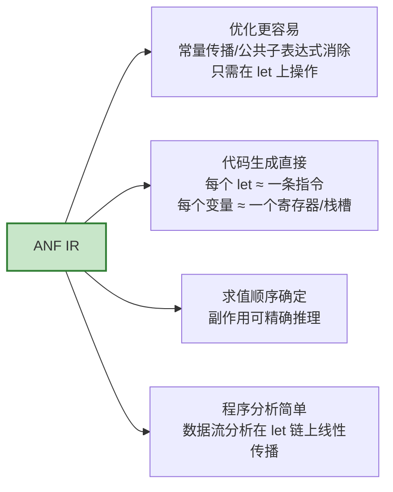

# Administrative Normal Form（ANF）：让编译器"看清"每一步计算的中间表示

## 1. 引言：为什么需要 ANF

编译器和程序分析工具面对的一个核心难题是：**源程序里的表达式可以任意嵌套，而机器执行却是一步一步、线性的**。考虑这样一个表达式：

```
f(g(x), h(y) + 1)
```

它读起来简洁，但对编译器来说却"藏"了很多东西：`g(x)` 和 `h(y)` 的求值顺序是什么？`h(y) + 1` 这个中间结果存在哪里？函数调用 `f(...)` 的两个参数何时准备好？

**Administrative Normal Form（管理范式，简称 ANF）** 就是为了解决这个问题而设计的一种**中间表示（Intermediate Representation, IR）**。它的核心思想只有一句话：

> **每一个中间计算结果都必须先绑定到一个变量（`let`），函数的参数和操作数只能是"已经算好的"简单值（原子值）。**

ANF 由 Flanagan、Sabry、Duba 和 Felleisen 在 1993 年的经典论文 *"The Essence of Compiling with Continuations"* 中正式提出。它的历史动机非常有趣——**它是作为 CPS（Continuation-Passing Style，续延传递风格）的一种"更轻量替代品"而诞生的**（详见第 6 节）。

---

## 2. 核心思想：原子值 vs. 复合表达式

理解 ANF，关键是区分两类东西：



- **原子值（atomic value）**：又叫 *trivial* 表达式——它**不触发任何实际计算**，"看一眼就知道值"（变量、常量、lambda）。
- **复合表达式（complex expression）**：又叫 *serious* 表达式——它**需要真正跑一步计算**（函数调用、算术、分支）。

**ANF 的铁律**：

> 所有复合表达式的**子表达式（操作数、参数）都必须是原子值**。任何复合表达式的结果，都必须通过 `let` 立即绑定到一个名字。

---

## 3. 形式化文法

ANF 可以用一个精确的 BNF 文法刻画。以一个带函数的最小 lambda 演算为例：

$$
\begin{aligned}
\text{（原子值）} \quad aexp &::= x \quad | \quad c \quad | \quad \lambda x.\ exp \\[4pt]
\text{（复合表达式）} \quad cexp &::= aexp_1\ aexp_2 \quad (\text{函数调用}) \\
&\quad\ |\ \ aexp_1 \oplus aexp_2 \quad (\text{基本运算}) \\
&\quad\ |\ \ \texttt{if}\ aexp\ \texttt{then}\ exp\ \texttt{else}\ exp \\[4pt]
\text{（表达式）} \quad exp &::= aexp \\
&\quad\ |\ \ \texttt{let}\ x = cexp\ \texttt{in}\ exp \\
&\quad\ |\ \ cexp
\end{aligned}
$$

**读懂这个文法的关键点**：

| 规则                    | 含义                                           |
| --------------------- | -------------------------------------------- |
| `aexp` 的操作数           | 函数调用 `aexp₁ aexp₂` 中，**函数和参数都是原子值**——不能是嵌套调用 |
| `let x = cexp in exp` | 唯一能"执行一步复杂计算"的地方，结果**必须绑定到 `x`**             |
| 求值顺序                  | `let` 的线性串联**显式固定了求值顺序**——不再有歧义              |

> 💡 **一句话记忆**：在 ANF 里，程序变成了一长串 `let` 绑定的"流水线"，每个 `let` 只做一件小事，参数全是现成的原子值。

---

## 4. 一个直观例子：从嵌套到扁平

看 ANF 如何改造开头那个表达式 `f(g(x), h(y) + 1)`。

### 转换前（普通嵌套表达式）

```scheme
(f (g x) (+ (h y) 1))
```

求值顺序、中间结果都是"隐式"的。

### 转换后（ANF）

```scheme
(let ([t1 (g x)])          ; t1 = g(x)
  (let ([t2 (h y)])        ; t2 = h(y)
    (let ([t3 (+ t2 1)])   ; t3 = t2 + 1
      (f t1 t3))))         ; 最终调用，参数全是原子值 t1, t3
```

对比一下两种形式：



**转换后带来的三个显式化收益**：

1. **求值顺序被固定**——`t1 → t2 → t3 → f` 一目了然。
2. **每个中间结果都有名字**——`t1, t2, t3`，可以直接映射到寄存器或栈槽。
3. **函数调用的参数全是原子值**——`f(t1, t3)` 中 `t1`、`t3` 都是现成的变量。

这三点正是**代码生成、寄存器分配、程序分析**梦寐以求的形式。

---

## 5. A-normalization：转换算法

把任意表达式转成 ANF 的过程叫 **A-normalization（A-规范化）**。最优雅的实现方式是使用一个基于**续延（continuation）**的递归函数。

核心是一个辅助函数 `normalize(exp, k)`，其中 `k` 是一个"续延"——它接收规范化后得到的**原子值**，并生成后续代码。

下面用伪代码（类 Scheme）展示核心逻辑：

```scheme
;; normalize-term: 规范化一个完整的表达式（顶层入口）
(define (normalize-term exp)
  (normalize exp (lambda (x) x)))

;; normalize: exp 规范化后，把得到的"原子值"交给续延 k
(define (normalize exp k)
  (match exp
    ;; 原子值：直接交给续延
    [(? atomic? a)        (k a)]

    ;; 函数调用：先递归规范化函数和每个参数，
    ;; 保证它们都变成原子值后，再组装调用
    [`(,fn ,arg)
      (normalize fn (lambda (t-fn)
        (normalize arg (lambda (t-arg)
          (k `(,t-fn ,t-arg))))))]

    ;; let 绑定
    [`(let ([,x ,e1]) ,e2)
      (normalize e1 (lambda (t1)
        `(let ([,x ,t1])
           ,(normalize e2 k))))]))

;; normalize-name: 强制把结果绑定到一个新变量，交回原子值给 k
(define (normalize-name exp k)
  (normalize exp (lambda (t)
    (if (atomic? t)
        (k t)                          ; 已是原子值，直接用
        (let ([g (gensym)])            ; 否则生成新变量绑定
          `(let ([,g ,t]) ,(k g)))))))
```

**算法精髓**：`normalize-name` 是关键——**每当遇到一个复合表达式出现在"必须是原子值"的位置时，就生成一个新变量 `let` 绑定它**，然后把这个新变量当作原子值继续往下传。这就是那些中间变量 `t1, t2, t3` 的来源。

---

## 6. ANF vs. CPS：为什么 ANF 更受欢迎

ANF 的诞生本身就是为了替代 CPS。理解两者的关系，是理解 ANF 价值的关键。

**CPS（续延传递风格）** 把"接下来要做什么"显式表示为一个续延函数，一切控制流都变成函数调用：

```scheme
;; f(g(x)) 的 CPS 形式
(g x (lambda (t) (f t halt)))
```

CPS 的问题在于：它引入了大量**"管理性"的续延（administrative redexes）**——这些续延纯粹是编译产物，不对应源程序里的真实计算，需要一轮额外的化简才能去掉。**ANF 的名字（"Administrative" Normal Form）正来源于此——它直接产出"已经消除了管理性冗余"的结果。**

### 对比总览

| 维度        | ANF                    | CPS               |
| --------- | ---------------------- | ----------------- |
| **控制流表示** | 用 `let` 串联，隐式顺序        | 用续延函数显式传递         |
| **可读性**   | 接近源码，直观                | 嵌套 lambda，晦涩      |
| **中间冗余**  | 无 administrative redex | 有，需额外化简           |
| **返回点**   | 隐式（`let` 的结果）          | 显式（续延参数）          |
| **表达能力**  | 一等续延（call/cc）表达较笨拙     | 天然支持复杂控制流         |
| **典型使用者** | GHC、MLton、许多现代编译器      | Scheme 编译器、SML/NJ |



> 论文的核心洞见是：**"CPS 变换 + 化简 administrative redex"的组合，其效果等价于直接做 A-normalization**。既然如此，为什么不跳过 CPS 那道弯路、直接生成干净的 ANF 呢？这就是 ANF 的价值主张。

**需要注意的权衡**：ANF 并非在所有场景都优于 CPS。当程序涉及**一等续延（如 `call/cc`）或复杂的非局部控制流**时，CPS 的表达能力更强、更自然。此外，ANF 在做某些优化（如跨越 `join point` 的变换）时，需要小心维护其不变式。现代编译器（如 GHC）因此发展出了 **ANF 的变体（如带 join point 的 ANF）** 来兼顾两者优点。

---

## 7. ANF 为编译器带来了什么

ANF 之所以被广泛采用，是因为它让后续的几乎每一个编译阶段都变简单了。



具体来说：

1. **优化变得局部化**。像常量折叠、公共子表达式消除（CSE）、内联，都可以直接在 `let` 绑定的层面进行——因为每个计算都有了名字和明确的位置。

2. **代码生成近乎"翻译"**。ANF 的每个 `let x = cexp` 几乎可以一对一地映射为一条中间指令或机器指令，变量则对应寄存器/栈槽。这大大简化了后端。

3. **副作用与求值顺序显式化**。在有副作用的语言里，`let` 串联固定了求值顺序，使得副作用的推理变得精确可靠——这对正确性至关重要。

4. **数据流分析线性化**。由于程序结构变成了 `let` 的线性链条，活跃变量分析、到达定值等经典数据流分析都能沿着 `let` 链顺畅传播。

---

## 8. 与 SSA 的关系

熟悉 LLVM 等现代编译器的读者可能会联想到 **SSA（Static Single Assignment，静态单赋值）形式**。ANF 和 SSA 关系非常密切：

|           | ANF                     | SSA              |
| --------- | ----------------------- | ---------------- |
| **出身背景**  | 函数式编程 / lambda 演算       | 命令式编程 / 控制流图     |
| **核心机制**  | `let` 绑定 + 词法作用域        | 每个变量只赋值一次 + φ 函数 |
| **控制流汇合** | 通过 `let` / 函数嵌套的作用域自然表达 | 通过 φ 节点显式表达      |

学界有一个著名结论：**ANF 和 SSA 在本质上是等价的**——ANF 中 `let` 绑定的作用域嵌套，对应 SSA 中的支配关系（dominance）；ANF 的函数式表达对应 SSA 的 φ 函数。可以说，它们是**同一个思想在两种编程范式下的不同表述**："每个值定义一次、显式命名、显式排序"。

---

## 9. 总结

**Administrative Normal Form** 是一种朴素而强大的中间表示，其精髓可以浓缩为：

- **核心铁律**：复合表达式的所有操作数必须是**原子值**；所有中间结果必须用 **`let` 绑定命名**。
- **本质效果**：把任意嵌套的表达式**扁平化**为一串线性的 `let` 流水线，让求值顺序、中间结果、副作用全部**显式化**。
- **历史动机**：作为 **CPS 的轻量替代**而生——直接产出"已消除 administrative redex"的干净结果，兼顾了 CPS 的规范性与源码的可读性。
- **工程价值**：让**优化、代码生成、数据流分析**都大幅简化，因此被 GHC、MLton 等众多现代编译器采用。
- **理论地位**：与命令式世界的 **SSA 形式本质等价**，是"单次定义、显式命名、显式排序"这一核心思想的函数式表述。

如果你正在设计一门语言的编译器或分析工具，ANF 往往是一个绝佳的起点：**它足够简单以至于容易实现，又足够规范以至于让后续的一切都变得井井有条**。

---

> 若你想进一步深入，我可以继续展开：**① A-normalization 算法处理 `if` 分支和 `let` 嵌套的完整细节**；**② 带 join point 的 ANF（GHC 的做法）如何解决分支合并处的代码重复问题**；或 **③ ANF 与 SSA 相互转换的具体构造**。告诉我你感兴趣的方向即可。😊

### 一、ANF 基础定义与核心概念

ANF 全称 **Administrative Normal Form**，通用译名为**管理正规式**，也常简称为 A-范式。它是函数式编译、高层中间表示（IR）领域的经典语法范式，由 Sabry & Felleisen 于 1992 年正式提出，核心思想是：

> **彻底消除所有嵌套的复合表达式，强制每一步中间计算都显式绑定到独立变量，让程序的执行顺序完全显性、无歧义。**

所谓“管理型（Administrative）”，指范式引入的临时变量仅服务于编译器的结构化管理，不改变程序语义与计算结果，属于“辅助管理用”的绑定。

#### 两类表达式的划分

ANF 的约束建立在表达式分类之上：

1. **原子表达式（Atomic Expression）**
   求值无副作用、瞬间完成的基础项，包括：变量、常量、字面量、类型参数等。它们可以直接作为参数传递，无需额外执行步骤。
2. **复合表达式（Compound Expression）**
   包含实际计算、可能产生副作用的表达式，包括：算子/函数调用、条件分支、循环体、结构体构造等。它们的执行需要消耗时间、存在明确的先后顺序。

#### ANF 两条核心语法规则

1. **参数原子性**：所有函数、算子的调用参数，必须是原子表达式，不能直接传入另一个复合表达式。
2. **复合必绑定**：所有复合表达式的结果，必须通过 `let` 绑定到一个变量，再以变量形式参与后续计算。

---

### 二、直观示例：非ANF vs ANF

我们以深度学习计算图的常见写法为例，直观对比两种形式的差异。

#### 示例1：基础算子嵌套

- **非ANF（嵌套写法）**
  
  ```
  %out = relu(add(matmul(%x, %w), %bias))
  ```
  
  `matmul` 的结果直接嵌套传入 `add`，`add` 的结果又直接嵌套传入 `relu`，执行顺序隐含在嵌套结构中。

- **ANF 规范化后**
  
  ```
  let %tmp0 = matmul(%x, %w)
  let %tmp1 = add(%tmp0, %bias)
  let %out = relu(%tmp1)
  ```
  
  每一步算子调用都被独立绑定到临时变量，参数位置只有变量名，执行顺序从上到下完全明确。

#### 示例2：带条件的复杂嵌套

- **非ANF**
  
  ```
  %result = if (greater(%score, %threshold)) { add(%a, %b) } else { mul(%a, %b) }
  ```
  
  条件判断的条件、两个分支的返回值都是复合表达式，全部嵌套在一处。

- **ANF 规范化后**
  
  ```
  let %cond = greater(%score, %threshold)
  let %result = if (%cond) {
      let %true_val = add(%a, %b)
      %true_val
  } else {
      let %false_val = mul(%a, %b)
      %false_val
  }
  ```
  
  条件表达式先绑定为变量，分支内部的计算也各自绑定，所有复合计算都有明确的归属与顺序。

---

### 三、标准转换方法

任意符合语法的表达式，都可以通过**自底向上的命名转换法**等价转换为 ANF 形式，这也是 TVM `ToANormalForm` Pass 的核心逻辑。

#### 转换核心思路

递归遍历表达式树，对每个子表达式执行两步操作：

1. 若子表达式是复合表达式且处于参数/返回值位置，则将其提取到外层，用 `let` 绑定到一个新的临时变量
2. 原位置替换为对应的临时变量（原子表达式）

#### 转换步骤示例

以 `add(matmul(%A, %B), %bias)` 为例：

1. 最外层是 `add` 调用，检查两个参数：
   - 第一个参数 `matmul(%A, %B)` 是复合表达式，不满足原子性要求
   - 第二个参数 `%bias` 是变量，属于原子表达式，无需处理
2. 将 `matmul(%A, %B)` 提取到外层，绑定为 `let %tmp0 = matmul(%A, %B)`
3. 原 `add` 的第一个参数替换为 `%tmp0`，得到 `add(%tmp0, %bias)`
4. 最终组合为顺序绑定的 ANF 形式：
   
   ```
   let %tmp0 = matmul(%A, %B)
   let %result = add(%tmp0, %bias)
   ```

整个转换过程严格保持语义等价，仅改变表达式的组织结构，不修改计算逻辑与结果。

---

### 四、编译器普遍采用 ANF 的核心价值

ANF 是高层IR的“通用基础设施”，几乎所有现代函数式编译器、深度学习图编译器（如 TVM Relax、MLIR、Swift SIL）都会先将IR规范化为ANF，再开展后续优化，核心收益有四点：

#### 1. 消除求值顺序歧义，统一语义

嵌套表达式的求值顺序依赖语言的隐式约定（如从左到右、从右到左），当算子存在副作用、或依赖运行时状态时，不同的求值顺序会导致不同结果。ANF 让执行顺序完全显性，所有Pass对程序语义的理解完全一致，从根源上避免了优化前后的语义偏差。

#### 2. 大幅简化IR变换Pass的实现

非ANF的嵌套表达式需要递归遍历深层语法树，子图匹配、算子融合、常量折叠等优化都需要处理复杂的嵌套边界。ANF 把所有算子都拉平到顶层的 `let` 绑定序列中，Pass只需线性遍历绑定列表即可完成匹配与修改，极大降低了开发复杂度，也减少了边界bug。

#### 3. 支撑精准的内存与生命周期分析

ANF 中每个张量变量都有唯一的**定义点**（let绑定处）和明确的**使用点**，编译器可以基于顺序绑定链，精准计算每个变量的生命周期（从定义到最后一次使用的范围），进而实现：

- 张量内存复用：生命周期不重叠的变量可以共享同一块内存
- 及时内存释放：变量最后一次使用后立即释放显存
- 精准峰值内存统计

这对显存敏感的深度学习推理场景至关重要。

#### 4. 平滑对接后续降级与代码生成

ANF 的顺序化绑定结构，与底层虚拟机字节码、三地址码的扁平化指令序列天然对应。编译时可以直接将每个 `let` 绑定映射为一条虚拟机指令或底层计算指令，无需额外处理嵌套结构，代码生成逻辑更简洁可靠。

---

### 五、易混概念深度辨析

ANF 常与 SSA、三地址码等概念同时出现，但约束维度、所处层级完全不同。

| 概念              | 核心约束                  | 所属层级       | 核心目标            |
| --------------- | --------------------- | ---------- | --------------- |
| **ANF（管理正规式）**  | 禁止复合表达式嵌套，强制中间结果变量绑定  | 高层计算图IR    | 显性化执行顺序，简化图优化   |
| **SSA（静态单赋值）**  | 每个变量只能赋值一次，定义后不可修改    | 全层级IR通用约束  | 简化数据流分析，支撑优化变换  |
| **三地址码（3AC）**   | 每条指令最多含3个操作数，单步完成一次运算 | 低层IR       | 贴近硬件执行模型，支撑指令生成 |
| **CPS（延续传递风格）** | 所有函数通过“延续回调”表达执行顺序    | 理论范式/函数式IR | 统一表达控制流，支撑语义证明  |

#### 关键补充

- **ANF + SSA 是黄金组合**：绝大多数现代编译器IR（包括 TVM Relax）会同时满足两者——既没有嵌套表达式，每个变量也只赋值一次。两者正交互补，共同为优化提供最干净的IR结构。
- ANF 是高层范式，三地址码是低层范式：思想同源（拆分复杂计算为单步），但ANF保留算子、函数等高阶语义，面向图优化；三地址码面向硬件执行，面向后端代码生成。

---

### 六、在 TVM Relax 中的落地与作用

ANF 是 Relax 计算图的标准规范形式，贯穿整个图优化流水线：

1. **编译入口的强制规范化**
   从 PyTorch/ONNX 等前端导入模型、生成初始 Relax IR 后，第一步通常执行 `relax.transform.ToANormalForm()` Pass，将所有嵌套表达式展开为ANF形式，为后续优化统一基础。

2. **核心优化Pass的前置依赖**
   算子融合、数据流模式匹配（DPL）、公共子表达式消除、形状推导、内存规划等几乎所有图优化Pass，都默认输入IR为ANF形式；若IR不满足ANF约束，Pass会直接校验失败。

3. **对接字节码生成的桥梁**
   ANF 的顺序 `let` 绑定链，与 Relax VM 字节码的扁平化指令序列一一对应，编译时可以直接映射为寄存器分配、算子调用、内存管理等虚拟机指令。
