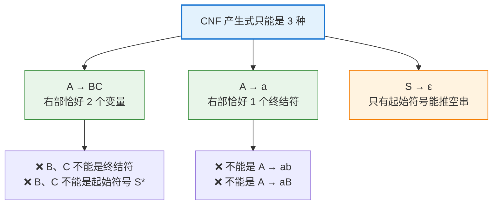
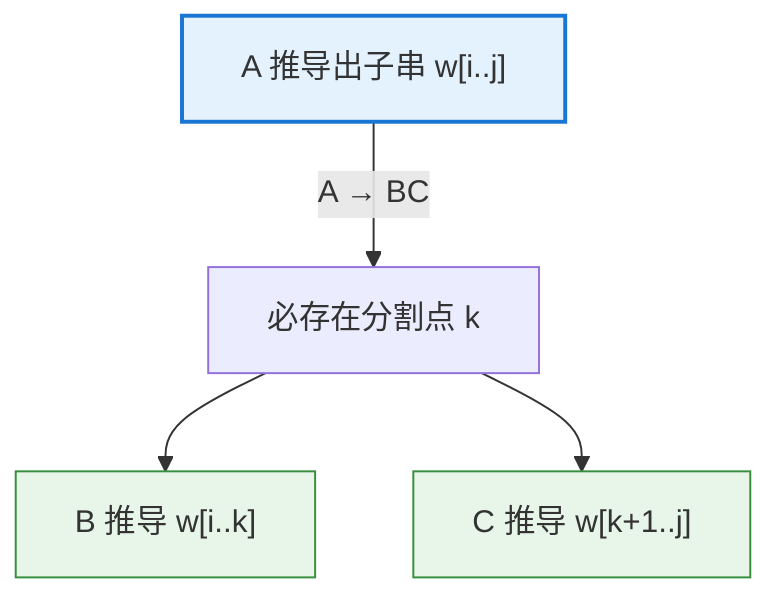

# Chomsky normal form

# Chomsky Normal Form（乔姆斯基范式）：让上下文无关文法变得"整齐可算"

## 1. 引言：为什么需要一种"标准形式"

上下文无关文法（Context-Free Grammar, CFG）是描述编程语言语法、自然语言结构的核心工具。但一个 CFG 的产生式可以写得非常"自由"：

```
S → a S b | S S | ε | A
A → a A | a
```

这种自由带来了麻烦——**产生式右部的长度和形态千变万化**，让很多算法（尤其是解析算法和理论证明）难以统一处理。比如：

- 有的规则右部很长（`S → a S b`，长度 3）；
- 有的规则产生空串（`S → ε`）；
- 有的规则只是把一个变量"改名"成另一个变量（`S → A`，叫**单元产生式**）。

**Chomsky Normal Form（乔姆斯基范式，简称 CNF）** 就是为消除这种混乱而设计的一种**受限但等价**的文法形式。它的核心思想只有一句话：

> **每条产生式要么是"一个变量 → 两个变量"，要么是"一个变量 → 一个终结符"。**

这个看似严苛的限制，换来了巨大的好处：**每一步推导都变得规整、可预测**，从而让像 CYK 这样的多项式时间解析算法成为可能（详见第 6 节）。CNF 由语言学家 **Noam Chomsky** 提出，是形式语言理论中最重要的范式之一。

---

## 2. 核心定义

先约定记号：

- 大写字母 $A, B, C$ 表示**变量（非终结符，variable / non-terminal）**；
- 小写字母 $a, b$ 表示**终结符（terminal）**；
- $S$ 表示**起始符号（start symbol）**；
- $\varepsilon$ 表示**空串**。

一个 CFG 处于 **Chomsky Normal Form**，当且仅当它的**每一条产生式**都是以下三种形式之一：

$$
\begin{aligned}
A &\rightarrow BC \qquad &&\text{（一个变量} \to \text{恰好两个变量）}\\
A &\rightarrow a \qquad &&\text{（一个变量} \to \text{恰好一个终结符）}\\
S &\rightarrow \varepsilon \qquad &&\text{（仅起始符号可产生空串，可选）}
\end{aligned}
$$

**关键约束（务必牢记）**：



> 📌 一个细节：在标准定义中，若允许 $S \to \varepsilon$，则**起始符号 $S$ 不允许出现在任何产生式的右部**——这是为了保证空串这一特殊情况被干净地隔离。

---

## 3. 一个直观例子

先看一个满足 CNF 的文法，感受它的"整齐"：

$$
\begin{aligned}
S &\rightarrow AB \mid BC \\
A &\rightarrow BA \mid a \\
B &\rightarrow CC \mid b \\
C &\rightarrow AB \mid a
\end{aligned}
$$

**验证**：每条规则右部要么是两个变量（`AB`、`BC`、`BA`、`CC`），要么是单个终结符（`a`、`b`）——完全合规 ✅。

再看一个**不满足** CNF 的文法，并逐条指出问题：

| 产生式         | 是否合规 | 问题              |
| ----------- | ---- | --------------- |
| `S → a S b` | ❌    | 右部长度为 3，且混有终结符  |
| `S → S S`   | ✅    | 恰好两个变量          |
| `S → A`     | ❌    | 单元产生式（右部只有一个变量） |
| `A → a A`   | ❌    | 右部混有终结符和变量      |
| `S → ε`     | △    | 仅当 S 是起始符号时才允许  |

正是这些"不合规"的情形，需要通过下一节的转换算法一一消除。

---

## 4. 转换算法：把任意 CFG 化为 CNF

**核心定理**：任何上下文无关文法都可以转换成一个与之**等价**（生成完全相同语言，可能除空串的处理外）的 CNF 文法。

转换分为**五个步骤**，顺序很重要：


> ⚠️ **步骤顺序的讲究**：不同教材顺序略有差异。一个稳妥的顺序是 **START → BIN → DEL → UNIT → TERM**，或如上图。关键原则是：**先消除 ε 和单元产生式，再做终结符剥离和二元化，避免相互引入新的违规规则**。下面按经典的 **START, TERM, BIN, DEL, UNIT** 讲解思路，并说明其陷阱。

我们以下面这个文法为例，起始符号为 `S`：

$$
\begin{aligned}
S &\rightarrow ASA \mid aB \\
A &\rightarrow B \mid S \\
B &\rightarrow b \mid \varepsilon
\end{aligned}
$$

### 步骤 ① START：引入新起始符号

添加一个新起始符号 $S_0$ 和产生式 $S_0 \rightarrow S$。这保证**起始符号永远不出现在任何产生式右部**，为后续处理 $\varepsilon$ 扫清障碍。

$$
S_0 \rightarrow S, \quad S \rightarrow ASA \mid aB, \quad A \rightarrow B \mid S, \quad B \rightarrow b \mid \varepsilon
$$

### 步骤 ② DEL：消除 ε 产生式

找出所有**可空变量（nullable）**——即能推导出 $\varepsilon$ 的变量。这里 $B \to \varepsilon$，所以 `B` 可空；进而 `A → B` 使得 `A` 也可空。

对每条含有可空变量的产生式，**枚举"保留 / 删除"该变量的所有组合**，加入对应的新规则，然后删除 $\varepsilon$ 产生式本身：

- `S → ASA`：`A` 可空 → 加入 `S → SA`、`S → AS`、`S → S`
- `S → aB`：`B` 可空 → 加入 `S → a`
- `A → B`：`B` 可空，但删掉 `B` 就变成 `A → ε`，这会被后续处理

结果（删除 `B → ε`）：

$$
\begin{aligned}
S_0 &\rightarrow S \\
S &\rightarrow ASA \mid aB \mid SA \mid AS \mid S \mid a \\
A &\rightarrow B \mid S \\
B &\rightarrow b
\end{aligned}
$$

### 步骤 ③ UNIT：消除单元产生式

单元产生式形如 $A \rightarrow B$（右部只有一个变量）。做法是：**把 $B$ 能产生的所有东西，直接"接管"到 $A$ 上**，然后删除该单元规则。

这里的单元产生式有 `S₀ → S`、`S → S`、`A → B`、`A → S`：

- `S → S`：自环，直接删除。
- `S₀ → S`：把 `S` 的所有非单元右部搬给 `S₀`：`S₀ → ASA | aB | SA | AS | a`
- `A → B`：`B → b`，故 `A → b`
- `A → S`：把 `S` 的右部搬给 `A`：`A → ASA | aB | SA | AS | a`

结果：

$$
\begin{aligned}
S_0 &\rightarrow ASA \mid aB \mid SA \mid AS \mid a \\
S &\rightarrow ASA \mid aB \mid SA \mid AS \mid a \\
A &\rightarrow ASA \mid aB \mid SA \mid AS \mid a \mid b \\
B &\rightarrow b
\end{aligned}
$$

### 步骤 ④ TERM：剥离终结符

对于右部**长度 ≥ 2 且含有终结符**的产生式（如 `S₀ → aB`），把每个终结符 `a` 替换为一个新变量 $X_a$，并添加 $X_a \rightarrow a$：

引入 $A_a \rightarrow a$，把所有长右部中的 `a` 替换为 `A_a`：

$$
\begin{aligned}
S_0 &\rightarrow ASA \mid A_a B \mid SA \mid AS \mid a \\
S &\rightarrow ASA \mid A_a B \mid SA \mid AS \mid a \\
A &\rightarrow ASA \mid A_a B \mid SA \mid AS \mid a \mid b \\
B &\rightarrow b \\
A_a &\rightarrow a
\end{aligned}
$$

注意：`S₀ → a` 这类**右部只有单个终结符**的规则本身就合法，**无需替换**。

### 步骤 ⑤ BIN：二元化（拆分长产生式）

对右部长度 ≥ 3 的规则（这里是 `ASA`），引入新变量把它拆成一串二元规则：

$$
A \rightarrow ASA \quad\Longrightarrow\quad A \rightarrow A A_1,\quad A_1 \rightarrow SA
$$

对每条 `... → ASA` 应用（可共享新变量 $A_1$）：

$$
\begin{aligned}
S_0 &\rightarrow A A_1 \mid A_a B \mid SA \mid AS \mid a \\
S &\rightarrow A A_1 \mid A_a B \mid SA \mid AS \mid a \\
A &\rightarrow A A_1 \mid A_a B \mid SA \mid AS \mid a \mid b \\
A_1 &\rightarrow SA \\
B &\rightarrow b \\
A_a &\rightarrow a
\end{aligned}
$$

**至此，每条产生式都是 `A → BC` 或 `A → a` 形式——转换完成！** ✅

---

## 5. 转换后的规模：会膨胀多少？

CNF 转换是**多项式时间**的，但要注意**产生式数量可能膨胀**：

| 步骤        | 潜在膨胀来源                      |
| --------- | --------------------------- |
| DEL（消 ε）  | 枚举可空变量的组合，最坏 **指数级**（若不加控制） |
| UNIT（消单元） | 单元规则的传递闭包，二次方级              |
| BIN（二元化）  | 长度为 $k$ 的规则拆成 $k-1$ 条，线性    |

> ⚠️ **最需警惕的是 DEL 步骤**：如果一条产生式右部有 $k$ 个可空变量，朴素枚举会产生 $2^k$ 条新规则。因此**先做 BIN 再做 DEL** 常常更优——因为二元化后每条规则右部至多 2 个符号，可空变量的组合被限制在常数级。这也是为什么步骤顺序值得斟酌。

总体上，转换后文法大小相对原文法是**多项式级**（在合理的步骤顺序下，通常是 $O(n^2)$ 量级）。

---

## 6. CNF 最大的应用：CYK 算法

CNF 之所以如此重要，**最核心的原因是它让 CYK（Cocke–Younger–Kasami）解析算法成为可能**——这是一个判定"字符串 $w$ 是否属于文法语言 $L(G)$"的**多项式时间**动态规划算法。

**为什么 CNF 是 CYK 的前提？** 因为 CNF 保证了每一步推导都是二叉的：



由于 `A → BC` 恰好把一个子串**一分为二**，CYK 可以自底向上填一张三角形的动态规划表：

- **表格**：$P[i][j]$ 存放"能推导出子串 $w_i \dots w_j$ 的所有变量集合"。
- **递推**：$A \in P[i][j]$ 当且仅当存在分割点 $k$ 和规则 $A \to BC$，使得 $B \in P[i][k]$ 且 $C \in P[k+1][j]$。
- **判定**：若起始符号 $S \in P[1][n]$（$n$ 为串长），则 $w$ 属于该语言。

CYK 的时间复杂度为 $O(n^3 \cdot |G|)$，其中 $n$ 是字符串长度、$|G|$ 是文法规模——**这正是 CNF 那"整齐的二叉结构"带来的直接红利**。

---

## 7. CNF 的理论价值

除了 CYK，CNF 还在形式语言理论中扮演关键角色：

1. **推导长度可精确计算**。在 CNF 中，一个长度为 $n$ 的非空串，其推导恰好用了 **$2n - 1$ 步**（$n-1$ 步 `A → BC` 生成结构 + $n$ 步 `A → a` 生成终结符）。这个整齐的性质是许多归纳证明的基石。

2. **有限性、成员性判定的统一处理**。语言是否为空、是否有限、字符串是否属于语言，在 CNF 下都有干净的判定算法。

3. **泵引理与其他理论工具**的证明常常借助 CNF 的规整结构。

4. **解析树是二叉树**。CNF 文法的语法分析树（除叶子外）是一棵**严格二叉树**，结构清晰，便于分析。

---

## 8. 与其他范式的对比：Greibach Normal Form

CNF 常与另一种范式 **Greibach Normal Form（GNF，格雷巴赫范式）** 相提并论：

|           | Chomsky Normal Form (CNF) | Greibach Normal Form (GNF)  |
| --------- | ------------------------- | --------------------------- |
| **产生式形式** | $A \to BC$ 或 $A \to a$    | $A \to a\alpha$（终结符 + 若干变量） |
| **右部起始**  | 可以是变量                     | **必须以终结符开头**                |
| **主要用途**  | CYK 解析、理论证明               | 下推自动机构造、消除左递归               |
| **推导特点**  | 二叉结构，自底向上                 | 每步消耗一个输入符号，天然适合自顶向下         |

两者都能表达任意上下文无关语言，只是**侧重的算法场景不同**：CNF 服务于自底向上的 CYK，GNF 则天然适配自顶向下、逐字符消耗输入的解析。

---

## 9. 总结

**Chomsky Normal Form** 是上下文无关文法的一种规整化标准形式，其精髓可以浓缩为：

- **核心定义**：每条产生式只能是 $A \to BC$（一变量→两变量）、$A \to a$（一变量→一终结符），外加可选的 $S \to \varepsilon$。
- **转换保证**：任何 CFG 都能通过 **START → DEL → UNIT → TERM → BIN** 五步转换成等价的 CNF（步骤顺序影响规模，先二元化可避免 ε 消除的指数膨胀）。
- **最大价值**：CNF 的"二叉推导结构"是 **CYK 算法** 得以在 $O(n^3)$ 时间内解析任意 CFG 的前提。
- **理论意义**：让推导长度精确（$2n-1$ 步）、解析树二叉化，成为众多形式语言证明的基础工具。
- **同类对照**：与侧重自顶向下解析的 **GNF** 互补，二者共同覆盖了 CFG 规范化的核心需求。

一句话记忆：**CNF 用"把一切拆成二叉规则"的代价，换来了上下文无关语言在算法上的可计算性与可分析性。**

---

> 若你想继续深入，我可以展开：**① CYK 算法填表过程的完整逐步演示（含具体字符串解析）**；**② CNF 转换中 ε 消除为何可能指数膨胀的详细分析与优化**；或 **③ 从 CNF 出发证明上下文无关语言泵引理的思路**。告诉我你感兴趣的方向即可。😊
