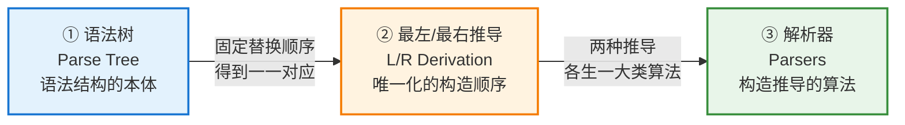
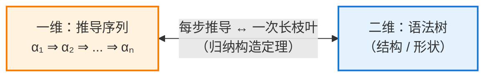
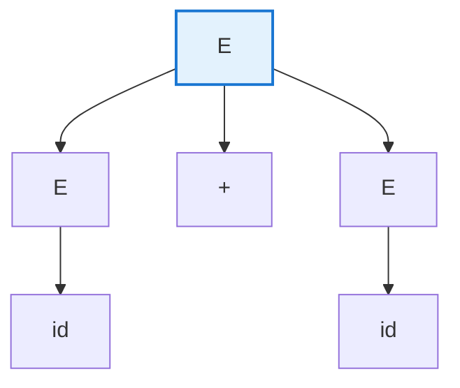
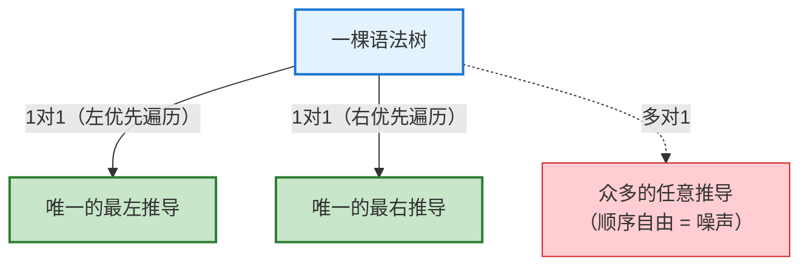
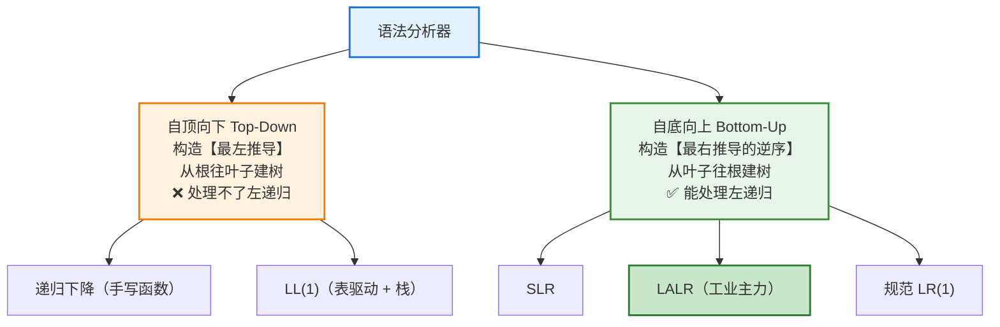
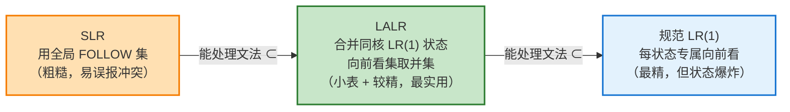
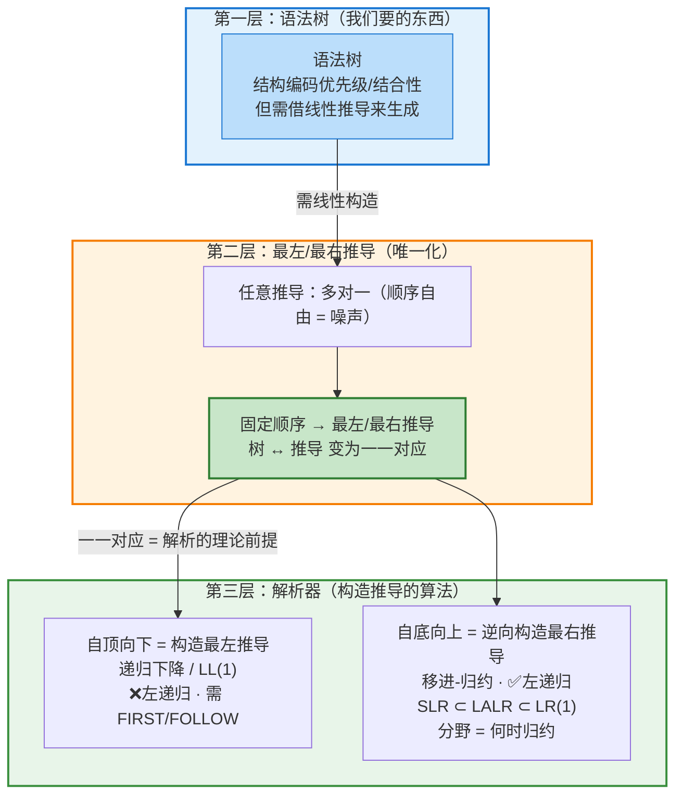

# 从语法树到解析器：编译原理中一条贯穿的主线

> 本文尝试把编译原理"语法分析"部分的三块核心内容——**语法树、最左/最右推导、各类解析器**——串成一条完整的逻辑主线，回答一个根本问题：*我们是如何从"语法结构的抽象表达"，一步步推演出"实际可用的解析算法"的？*

---

## 摘要

语法分析器（parser）的任务，是判断一段输入是否符合文法，并给出它的语法结构。这个"语法结构"的本体是**语法树**。然而语法树是二维结构，无法被算法直接构造，我们必须借助线性的**推导序列**(一维)来生成它。可是任意推导存在"顺序自由"，导致一棵树对应多个推导，产生歧义。于是引入**最左/最右推导**固定构造顺序，使"树 ↔ 推导"成为**一一对应**——这正是所有**确定性解析算法**得以成立的理论前提。最终，两种推导分别催生了两大类解析器：自顶向下（LL、递归下降）与自底向上（LR、SLR、LALR）。

---

## 第一部分：语法树——我们真正要的东西

### 1.1 语法树是语法结构的本体

语法树（parse tree）是一棵树：**根是起始符号，内部节点是非终结符，叶子是终结符或 ε**。把所有叶子从左到右读出来，就得到它所表示的字符串（称为**产出 / yield**）。

语法树的核心价值在于：**它的结构（形状）唯一决定了程序的语法含义**——包括运算符的**优先级**（靠文法分层实现，高优先级运算被"埋"在树的更深处）和**结合性**（靠递归方向实现，左递归产生向左偏斜的树，即左结合）。这正是编译器真正要"读懂"的东西：把一维的字符流，翻译成二维的、蕴含求值顺序的结构。

### 1.2 树需要借助推导来生成

问题在于：树是二维结构，而输入是一维的 token 流，算法处理的也是线性序列。因此我们需要一种**线性的、逐步的构造过程**来"生成"这棵树——这就是**推导（derivation）**。

推导从起始符号出发，反复用产生式把某个非终结符替换成其右部，得到一系列**句型（sentential form）**，最终得到全是终结符的目标串。它与语法树的基础对应关系可由**归纳构造定理**建立：

- **基础**：推导起点 $\alpha_1 = A$ 对应一棵单节点树；
- **归纳**：推导每替换一个符号（$X_j \to Y_1\cdots Y_m$），就在树上把对应的叶子 $X_j$"长出" $m$ 个孩子 $Y_1,\dots,Y_m$（若为 ε 产生式则挂一个 ε 孩子）；
- **不变式**：全程维持"树的产出（叶子从左到右）= 当前句型"。

> **一个关键细节**：定位"句型中第 $j$ 个符号"对应哪个叶子时，必须**跳过 ε 叶子**来计数——因为 ε 代表空串、不出现在句型中。这保证了叶子序列与句型严格对齐。

---

## 第二部分：最左/最右推导——把"多对一"变成"一一对应"

### 2.1 问题：任意推导是"多对一"的

当一个句型里同时存在**多个非终结符**时，我们可以**自由选择先替换哪一个**。以有歧义文法 $E \to E + E \mid \mathbf{id}$ 为例，对句型 `E + E` 把两个 `E` 都变成 `id`，有两种顺序：

$$
\text{甲：}\; E{+}E \Rightarrow \mathbf{id}{+}E \Rightarrow \mathbf{id}{+}\mathbf{id}
$$

$$
\text{乙：}\; E{+}E \Rightarrow E{+}\mathbf{id} \Rightarrow \mathbf{id}{+}\mathbf{id}
$$

两个推导序列不同（中间步骤不一样），但对应的**语法树完全相同**：

**根源在于**：树只记录"谁是谁的孩子"这种**结构关系**，完全**不记录"先展开谁"这种时间顺序**。因此替换顺序上的差异被树"抹平"了，造成一棵树对应多个推导——这种"顺序自由"是对确定语法结构毫无帮助的噪声。

### 2.2 解决：固定顺序 → 一一对应

- **最左推导（leftmost）**：每一步总是替换句型中**最左边**的非终结符；
- **最右推导（rightmost）**：每一步总是替换句型中**最右边**的非终结符。

一旦规定"永远选最左"或"永远选最右"，"选哪个非终结符"这个自由就被消除，从而恢复一一对应。严格论证分两个方向：

- **树 → 推导（唯一）**：给定树，"当前最左（最右）的非终结符是谁"由树的结构**唯一确定**，相当于对树做**固定方向的深度优先遍历**（最左推导 = 左优先先序遍历）。全程没有任何一步可以自由选择，路径唯一。
- **推导 → 树（唯一）**：由归纳构造定理保证，任何推导只能机械地生成唯一一棵树。

两个方向都唯一 ⟹ **一一对应（双射）**。

**成果**：每棵**语法树**都恰好拥有**一个专属的最左推导**和**一个专属的最右推导**（二者一般不同，但都由这棵树唯一确定）。这把"确定语法结构"这个二维问题，转化成了"构造一个唯一的线性推导序列"这个一维问题。

### 2.3 承上启下：为什么一一对应是解析器的理论前提

这是整条主线最关键的连接点：

> **正因为"树 ↔ 最左/最右推导"是一一对应的，解析器才可以只专注于构造那个唯一的推导——它构造出的推导，就精确地、无歧义地对应输入程序的语法结构（树）。**

如果推导与树是"多对一"的，那么"构造一个推导"就无法唯一确定树，解析将失去意义。一一对应保证了：**"构造特定顺序的推导" = "确定唯一的语法树" = "完成语法分析"**。这直接决定了解析器的两条技术路线。

---

## 第三部分：解析器——构造推导的具体算法

所有解析器本质上都在做同一件事——**构造那个唯一的推导，从而确定树**——区别只在于"以哪种推导为目标""从哪个方向构造"。

### 3.1 命名约定：读懂 LL、LR、(1)

| 记号        | 第一个字母                  | 第二个字母                  | 括号中数字         |
| --------- | ---------------------- | ---------------------- | ------------- |
| **LL(1)** | **L**eft-to-right 扫描输入 | **L**eftmost 最左推导      | 向前看 1 个 token |
| **LR(1)** | **L**eft-to-right 扫描输入 | **R**ightmost 最右推导（逆序） | 向前看 1 个 token |

两者都从左到右扫描输入，区别在第二个字母：**LL 构造最左推导，LR 构造最右推导的逆序**。

### 3.2 两大阵营（对应两种推导）

### 3.3 自顶向下阵营：构造最左推导

**递归下降（Recursive-Descent）**：为每个非终结符写一个函数——遇终结符就"匹配并吃掉"，遇非终结符就"调用对应函数"。文法的递归结构直接翻译成函数间的递归调用，直观、易调试、易插入自定义逻辑，很多真实编译器（如 GCC 的 C++ 前端）都采用手写递归下降。

**LL(1)**：与递归下降是"同一枚硬币的两面"——它是**表驱动**版本，用"分析表 + 栈"模拟同样的过程。根据"栈顶符号 + 当前 token"查 LL(1) 分析表（由 **FIRST 集**与 **FOLLOW 集**构造）决定用哪条产生式展开。

两者的**共同限制**（因为要构造最左推导）：

- **不能有左递归**（否则 `E()` 无限递归 / 无法预测），必须先消除；
- **不能有公共左因子**（如 $A \to \alpha\beta \mid \alpha\gamma$，看到 α 分不清走哪条），需提取左因子改写。

### 3.4 自底向上阵营：逆向构造最右推导

**核心机制——移进-归约（shift-reduce）**：

- **移进（Shift）**：把下一个输入 token 压入栈；
- **归约（Reduce）**：当栈顶匹配某产生式右部时，替换回其左部非终结符。

不断移进、在时机成熟时归约，直到整个输入收敛为**起始符号**。**归约的顺序恰好是最右推导的逆序**。它用一个由 LR(0) 项目集构造的**状态机（DFA）** 跟踪"识别到产生式的哪个部分"，配合 ACTION/GOTO 表决策。因为可以"看到完整右部再归约"，所以**能处理左递归、能力远超 LL**，是几乎所有主流工具（Yacc、Bison）的技术基础。

**LR 三兄弟的唯一分野——如何决定"何时归约"**：

- **SLR（Simple LR）**：用**全局的 FOLLOW(A)** 判断是否归约 $A \to \alpha$。最简单，但 FOLLOW 集是对整个文法算的、太粗糙，在具体状态下常误报冲突；
- **规范 LR(1)（Canonical LR）**：把向前看符号嵌入每个项目 $[A\to\alpha\cdot\beta,\ a]$，用**每个状态专属的精确向前看集**。能力最强，但状态数急剧爆炸、表极大，实际少用；
- **LALR（Look-Ahead LR）**：从规范 LR(1) 出发，**合并"LR(0) 核心相同"的状态**并把向前看集取并集。结果是**状态数≈SLR（表小）、能力≈LR(1)（较精）**，成为工业界黄金标准（Yacc/Bison 默认输出）。唯一代价是合并时偶尔引入新的 reduce-reduce 冲突，但实际极少发生。

### 3.5 五种解析器全面对比

| 特性         | 递归下降      | LL(1)   | SLR          | LALR       | 规范 LR(1) |
| ---------- | --------- | ------- | ------------ | ---------- | -------- |
| **方向**     | 自顶向下      | 自顶向下    | 自底向上         | 自底向上       | 自底向上     |
| **推导**     | 最左        | 最左      | 最右(逆)        | 最右(逆)      | 最右(逆)    |
| **实现方式**   | 手写函数      | 表驱动+栈   | 表驱动+状态机      | 表驱动+状态机    | 表驱动+状态机  |
| **能处理左递归** | ❌         | ❌       | ✅            | ✅          | ✅        |
| **文法能力**   | 弱         | 弱       | 中            | 较强         | 最强       |
| **状态/表大小** | —         | 小       | 小            | 小          | **很大**   |
| **向前看信息**  | 1 token   | 1 token | 全局 FOLLOW(粗) | 状态专属并集(较精) | 状态专属(最精) |
| **实际使用**   | 手写编译器、小语言 | 教学、部分工具 | 教学为主         | **工业标准**   | 理论价值为主   |

**能力包含关系**：LL ⊊ 自底向上；LR 家族内部 **SLR ⊊ LALR ⊊ 规范 LR(1)**。

---

## 第四部分：全景整合

| 层次        | 主角             | 核心问题       | 结论                                          |
| --------- | -------------- | ---------- | ------------------------------------------- |
| **① 语法树** | Parse Tree     | 语法结构如何表达？  | 树的结构编码优先级与结合性，是解析的最终目标；需借线性推导生成             |
| **② 推导**  | L/R Derivation | 如何唯一地生成树？  | 任意推导"多对一"太乱；固定最左/最右顺序后，树↔推导变**一一对应**        |
| **③ 解析器** | Parsers        | 如何用算法构造推导？ | 最左推导→自顶向下（LL/递归下降）；最右推导逆序→自底向上（LR/SLR/LALR） |

---

## 结论

本文用一条主线贯穿了语法分析的三块核心内容，其最深刻的逻辑可以概括为一句话：

> **语法树是目标，推导是桥梁，解析器是工具。**

- 我们真正要的是**语法树**，因为它的结构决定了程序的语法含义；
- 但树要靠线性的**推导**来生成，而任意推导"多对一"会造成歧义，于是用**最左/最右推导**固定顺序，换来**一一对应**；
- 这个一一对应正是**所有确定性解析算法能够成立的理论前提**——只要构造出那个唯一的推导，就等于确定了唯一的树；
- 两种推导分别催生两大类解析器：**LL / 递归下降**构造最左推导（自顶向下，怕左递归），**LR 家族**逆向构造最右推导（自底向上，能力更强）；而 LR 家族内部（**SLR ⊂ LALR ⊂ LR(1)**）的差别，全在于"用多精确的向前看信息决定何时归约"——**LALR 以最小代价换取最实用能力，成为工业标准**。

理解了这条主线，你就不再是孤立地记忆"LL 是什么、LR 是什么"，而是从"为什么需要它们、它们从哪里来"的高度，把整个语法分析的知识体系融会贯通。

