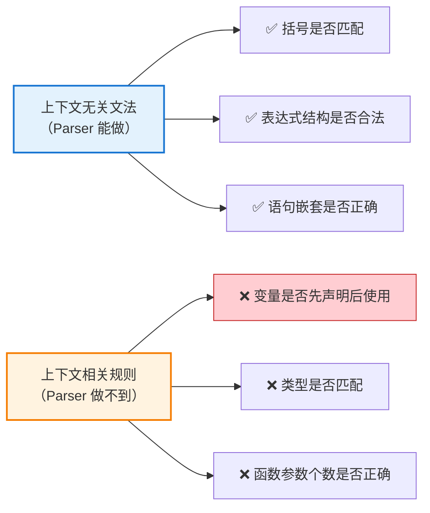
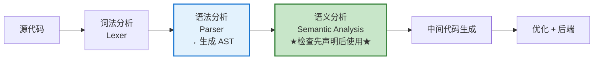
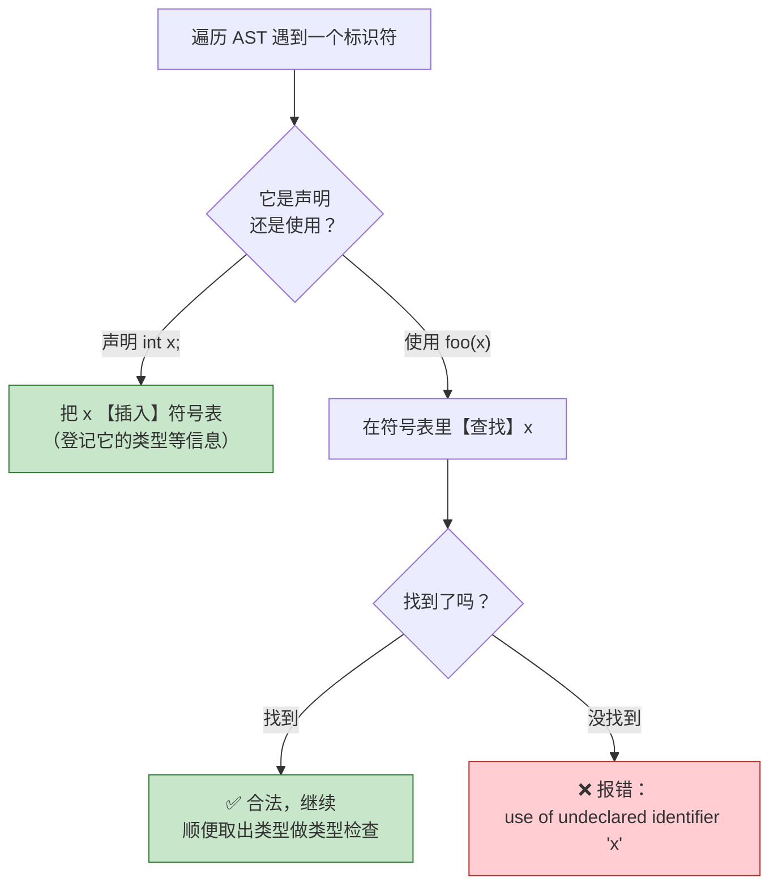
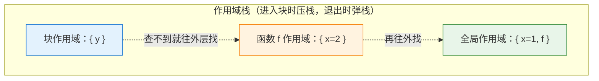
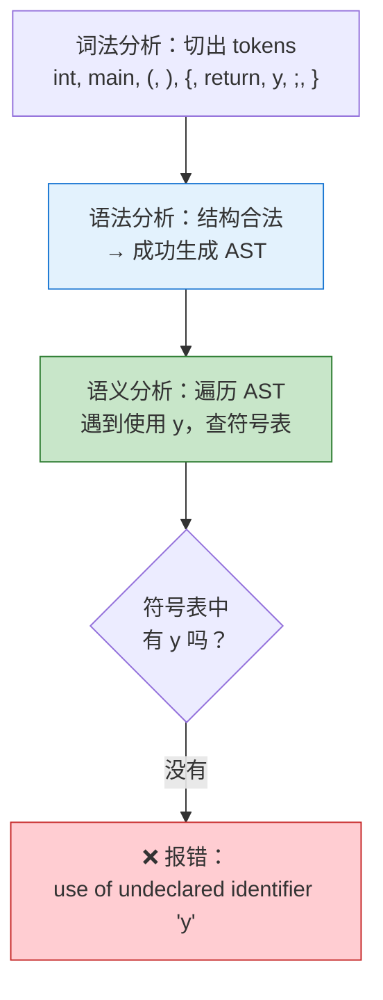

# 编译器如何实现"标识符先声明后使用"：语义分析与符号表

> 上下文无关文法（CFG）能力强大，却并非万能。诸如"变量必须先声明后使用"这类看似简单的规则，却超出了 CFG 的表达范围。本文探讨真实编译器是如何弥补这一缺陷的——答案的核心，是**语义分析阶段**与一张名为**符号表**的数据结构。

---

## 摘要

**上下文无关文法**只能描述编程语言语法的一个子集。像"标识符必须先声明后使用"这类规则，因为涉及跨越任意距离、依赖上下文的信息，无法用 CFG 表达。因此，**语法分析器**（parser）接受的 token 序列构成了**真实语言**的一个**超集**——它会放过一些"语法对、语义错"的程序。编译器的后续阶段，即**语义分析**，必须借助**符号表**来完成这些 CFG 无法胜任的检查。本文剖析这一机制的原理，包括符号表的作用、作用域的处理，以及不同语言在处理时机上的差异。

---

## 1. 为什么这不是语法分析器的工作

### 1.1 上下文无关文法的能力边界

CFG 能够优雅地描述"表达式的结构""语句的嵌套""括号是否匹配"这类**结构性规则**，但它描述不了"这个变量在使用前是否声明过"这类规则。

根本原因在于：**"声明"和"使用"之间可能相隔任意远，并且依赖上下文。**

```c
int x;        // 声明在这里
...           // 中间可能隔了 1000 行
foo(x);       // 使用在这里 —— 是否合法，取决于前面有没有那句声明
```

要检查 `foo(x)` 中的 `x` 是否合法，就必须"记住"前面出现过的所有声明。而 CFG 的产生式**没有记忆能力**——它只关心局部符号如何组合成结构，无法维护一张"已声明标识符的清单"。这类需要"上下文"的规则，属于**上下文相关（context-sensitive）** 乃至更复杂的范畴。



### 1.2 Parser 接受的是"超集"

正因如此，parser 接受的 token 序列是真实语言的**超集**——它会放过一些"语法正确、但语义错误"的程序（比如使用了未声明的变量）。这些错误，被留给**后续阶段**来抓。

---

## 2. 谁来负责：语义分析阶段

"先声明后使用"这类检查，由编译器的**语义分析阶段（Semantic Analysis）** 完成。它位于语法分析之后：



语义分析的核心武器，是一个叫 **符号表（Symbol Table）** 的数据结构。

---

## 3. 核心机制：符号表 + 作用域

### 3.1 符号表是什么

**符号表本质上就是一张"已声明标识符的登记册"**——一个从"名字"到"信息"的映射（通常用哈希表实现）：

| 标识符名  | 类型          | 声明位置  | 作用域 | 其他信息（是否初始化等） |
| ----- | ----------- | ----- | --- | ------------ |
| `x`   | int         | 第 5 行 | 全局  | ...          |
| `foo` | 函数 int→void | 第 8 行 | 全局  | ...          |

编译器遍历 AST 时，对每个遇到的标识符做出判断：



于是**"先声明后使用"的检查逻辑就变得很简单**：遍历到"使用"处时，去符号表里查这个名字——**查得到就是先声明过了，查不到就报"未声明"错误**。由于编译器**从前往后**遍历，声明会先于使用被插入表中，"顺序"关系自然得到保证。

### 3.2 作用域：为什么符号表通常是"一叠"表

真实语言有**嵌套作用域**（函数、代码块 `{}`）。同一个名字在不同作用域可以指代不同的东西：

```c
int x = 1;          // 全局的 x
void f() {
    int x = 2;      // 局部的 x，遮蔽了全局的
    {
        int y = x;  // 这里的 x 指局部的 2
    }
    // 出了内层块，y 不再可见
}
```

为处理这种情况，符号表通常组织成**一叠（栈式）作用域**：每进入一个新作用域就压入一层，退出时弹出：



**查找规则**：从当前（最内层）作用域开始找，找不到就逐层向外，直到全局。这一套机制同时实现了三件事——**"先声明后使用"、"就近遮蔽"、"出作用域即失效"**。

---

## 4. 不同语言的处理差异

"先声明后使用"这条规则的**严格程度**因语言而异，处理时机也不同：

| 语言             | 是否要求先声明后使用                     | 检查时机                   |
| -------------- | ------------------------------ | ---------------------- |
| **C / C++**    | 严格要求（编译期）                      | 编译期语义分析                |
| **Java / C#**  | 要求，但同一类内方法/字段可后声明              | 编译期，可能需多趟遍历            |
| **Python**     | 运行时才知道名字是否存在                   | 运行时（`NameError`），不是编译期 |
| **JavaScript** | `var` 有变量提升，`let/const` 有暂时性死区 | 部分编译期 + 部分运行时          |

> 💡 对于像 C++ 这种存在"相互引用"（如两个函数互相调用）的情况，编译器可能需要**多趟遍历（multiple passes）**：先扫一遍收集所有顶层声明进符号表，再扫一遍检查使用。这就绕过了"物理上必须写在前面"的限制，但本质仍是**靠符号表记录声明信息**。

---

## 5. 一次完整流程的直观演示

以一段有错的 C 代码为例：

```c
int main() {
    return y;   // y 从未声明
}
```

编译器的处理过程是：



**注意关键点**：这段代码在**语法分析阶段完全没有问题**——它的结构（一个返回语句）是合法的。错误直到**语义分析阶段**、查符号表查不到 `y` 时才被发现。这生动印证了引文所说的："parser 接受的是真实语言的超集，后续阶段才确保合规。"

---

## 6. 总结

- **为什么 parser 做不了**：CFG 没有"记忆"，无法维护一张"已声明标识符清单"，而"声明"与"使用"可能相隔任意远、依赖上下文，属于上下文相关规则。因此 parser 接受的是真实语言的**超集**，会放过"语法对、语义错"的程序。

- **谁来做**：编译器的**语义分析阶段**，核心工具是**符号表**——一张"名字 → 信息"的登记册。遇到声明就**插入**，遇到使用就**查找**：查得到即合法，查不到即报"未声明"错误。由于编译器从前往后遍历，声明先于使用入表，"顺序"关系自然得到保证。

- **作用域**：符号表通常组织成**栈式的嵌套作用域**，进入块时压栈、退出时弹栈，查找时从内向外，从而同时实现"先声明后使用""就近遮蔽""出作用域失效"。

- **语言差异**：不同语言对这条规则的严格程度和检查时机不同——C/C++ 在编译期严格检查，Python 则推迟到运行时；存在相互引用时，编译器可能采用多趟遍历，但本质始终是靠符号表记录声明信息。

**一句话记忆**：

> "先声明后使用"靠的不是文法，而是语义分析阶段的一张符号表——**声明时登记、使用时查询**。语法分析器只保证"结构对"，而"变量是否声明过"这类跨上下文的规则，交由携带记忆能力的符号表在后续阶段来把关。
