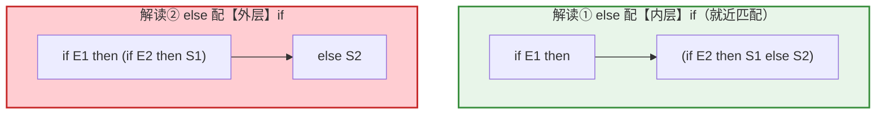
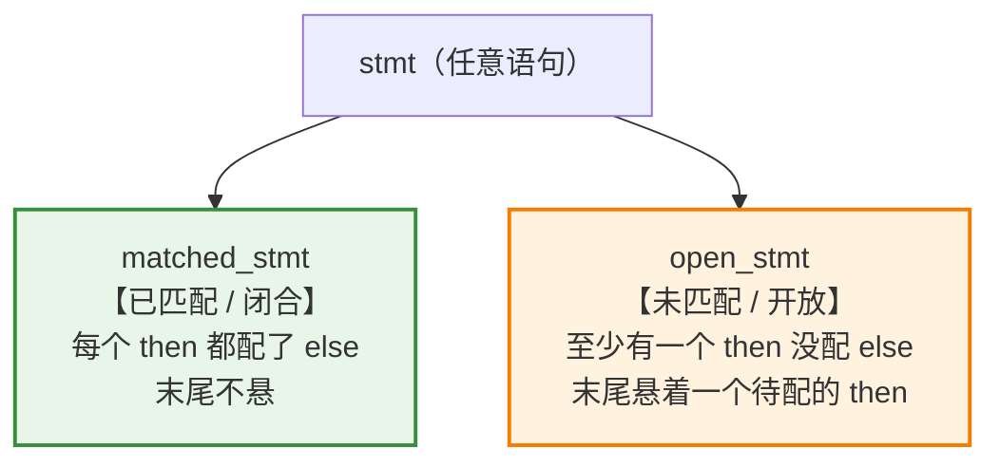
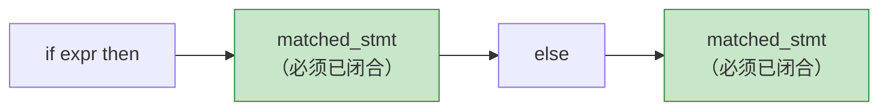
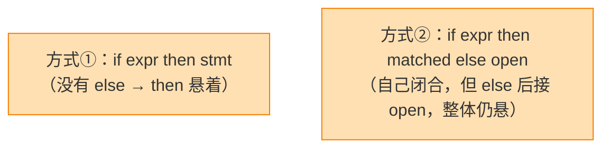
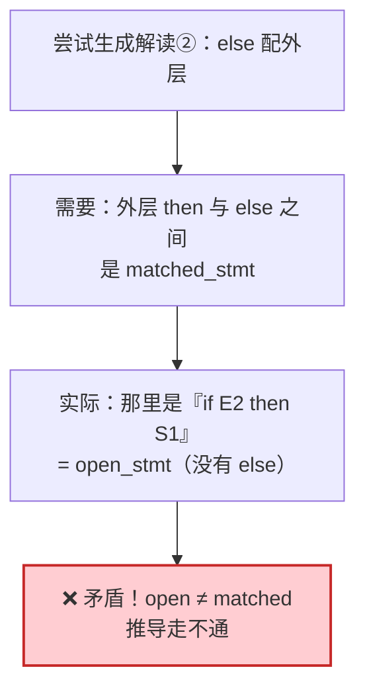
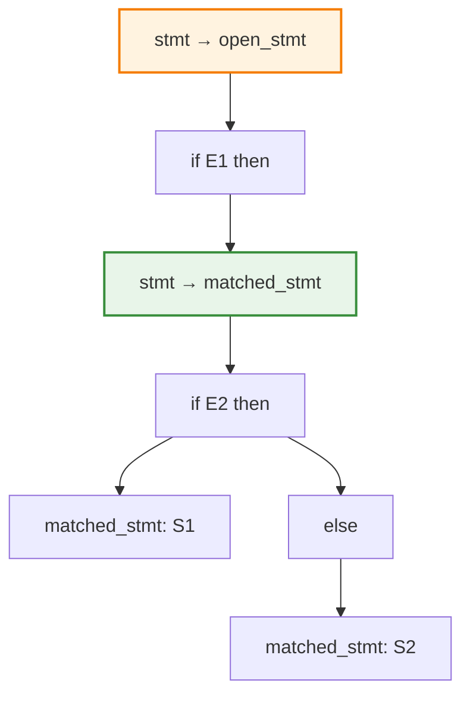

# 结构即语义：从悬空 else 问题看文法如何编码意图

龙书 4.3.2 Eliminating Ambiguity 节介绍了if-then-else文法，本文对它进行深入分析。


> 在此前的讨论中，我们反复触及一个核心命题——**语法树的结构，就是程序的语义（structure is semantic）**。表达式的运算优先级、结合性，乃至语句的归属关系，统统体现在树的形状上。本文以编译原理中最经典的**悬空 else（dangling-else）** 问题为案例，展示一个深刻的道理：**当自然文法产生歧义时，我们真正要做的，不是修补语法，而是把想要的"语义"重新雕刻进文法的结构里。**

---

## 摘要

"结构即语义"意味着：一段程序的含义，取决于分析器为它构造出**哪一棵**语法树。当一个文法对同一输入能构造出多棵树时（即歧义文法），就等于说这段程序**有多种互相冲突的语义**——这是编译器无法接受的。悬空 else 问题正是这一困境的典型：`if E1 then if E2 then S1 else S2` 中的 else 归属不明，对应两种不同的执行语义。本文剖析如何通过**区分"匹配语句"与"未匹配语句"** 来重构文法，使得唯一合法的树恰好编码了我们期望的**"就近匹配"语义**——这是"用结构表达语义"的一次精彩实践。

---

## 1. 回顾主线：为什么"结构即语义"

在讨论表达式文法时我们已经看到：`a + b * c` 之所以等于 `a + (b*c)` 而非 `(a+b)*c`，不是因为某条运行时规则，而是因为文法把 `*` 安排在了语法树**更深的层次**。


**结构决定语义**这条原则有一个直接推论：

> 如果一个输入能生成**两棵不同的树**，那它就有**两种不同的语义**——文法出现了歧义，编译器无所适从。

因此，**消除歧义 = 迫使文法只生成那棵"语义正确"的树**。悬空 else 是检验这一思想的最佳战场。

---

## 2. 病灶：一个有歧义的自然文法

最朴素的 if 语句文法写起来天经地义：

$$
stmt \to \textbf{if } expr \textbf{ then } stmt \mid \textbf{if } expr \textbf{ then } stmt \textbf{ else } stmt \mid \textbf{other}
$$

但它对下面这句有歧义：

```
if E1 then if E2 then S1 else S2
```

`else S2` 到底属于哪个 if？两种解读，对应**两棵树、两种语义**：



这两棵树的**运行行为截然不同**——当 `E1` 为真、`E2` 为假时，解读①会执行 `S2`，解读②则什么都不执行。**结构不同 ⟹ 语义不同**，这正是"结构即语义"的反面警示。

绝大多数语言规定采用**解读①：else 与最近的、尚未匹配的 then 配对**（**就近匹配**）。于是问题变成：

> **如何把"就近匹配"这条语义规则，编码进文法的结构，使文法只能生成解读①那棵树？**

---

## 3. 药方：用文法结构区分"闭合"与"开放"

解决方案的精髓，是把语句按其**结构是否闭合**分成两类——这本身就是"用结构承载语义"的体现：



对应的无歧义文法：

$$
\begin{align*}
stmt &\to matched\_stmt \mid open\_stmt \\
matched\_stmt &\to \textbf{if } expr \textbf{ then } matched\_stmt \textbf{ else } matched\_stmt \mid \textbf{other} \\
open\_stmt &\to \textbf{if } expr \textbf{ then } stmt \\
           &\mid \textbf{if } expr \textbf{ then } matched\_stmt \textbf{ else } open\_stmt
\end{align*}
$$

| 概念               | 含义                      | 结构特征            |
| ---------------- | ----------------------- | --------------- |
| **matched_stmt** | 内部所有 `then` 都有配对 `else` | 闭合，末尾不悬         |
| **open_stmt**    | 至少一个 `then` 未配对 `else`  | 开放，末尾悬着待配的 then |

---

## 4. 逐条解读：语义如何被"焊进"结构

### 4.1 顶层：语句非此即彼

$$
stmt \to matched\_stmt \mid open\_stmt
$$

任何语句，要么闭合，要么开放，二者穷尽所有情况。

### 4.2 matched_stmt：then 与 else 必须成对，且中间必须是闭合的

$$
matched\_stmt \to \textbf{if } expr \textbf{ then } matched\_stmt \textbf{ else } matched\_stmt \mid \textbf{other}
$$



> 💡 **全文灵魂**：为什么 then 与 else 之间**必须**是 matched_stmt（而非 open）？因为——如果那里允许放一个 open_stmt（末尾悬着 then 的语句），这个 else 就会被内层那个悬着的 then "抢"去配对，而不是配当前的 if。强制那里必须闭合，就**从结构上堵死了 else 被内层截走的可能**。这一步，就是把"就近匹配"这条语义**雕刻进了产生式的结构**。

### 4.3 open_stmt：如何合法地"制造悬着的 then"

$$
open\_stmt \to \textbf{if } expr \textbf{ then } stmt \mid \textbf{if } expr \textbf{ then } matched\_stmt \textbf{ else } open\_stmt
$$



- **方式①**：`if...then` 后无 else，then 显然悬着，整体开放。
- **方式②**：本 if 虽配了 else，但 else 后跟的是 open_stmt——那个内层 open 末尾仍悬着一个 then，故整体依旧开放。

---

## 5. 见证奇迹：歧义为何消失

回到那句引发争议的输入，用新文法去尝试生成**解读②（else 配外层）**：



- 要生成解读②，外层必须用 matched 规则：$\textbf{if } expr \textbf{ then } \underline{matched\_stmt} \textbf{ else } \dots$
- 这要求中间的 `if E2 then S1` 是 matched_stmt；
- 但 `if E2 then S1` 没有 else，它**只能是 open_stmt**——矛盾！

于是解读②**在文法层面无法被推导出来**，只剩解读①这唯一合法的树：



**唯一的树 ⟹ 唯一的语义**。而这唯一的结构，恰好就是"else 配内层"——正是我们想要的就近匹配。

---

## 6. 升华：这就是"结构即语义"的完整闭环

把整件事串起来，就能看到"结构即语义"如何贯穿始终：


这与我们处理**运算符优先级**时的手法一模一样：

| 场景          | 想要的语义      | 编码手段（结构技巧）            | 结果            |
| ----------- | ---------- | --------------------- | ------------- |
| **表达式优先级**  | `*` 先于 `+` | 分层文法：`E→E+T`, `T→T*F` | `*` 落在更深层，唯一树 |
| **表达式结合性**  | `-` 左结合    | 左递归 `E→E-T`           | 树向左倾斜，唯一树     |
| **悬空 else** | else 就近匹配  | 分 matched/open，闭合约束   | else 归内层，唯一树  |

它们本质上是同一件事——**通过设计文法的结构，让"合法的树"与"正确的语义"一一对应**。歧义之所以危险，正因为它破坏了这种对应，让"结构"无法忠实反映"语义"。

---

## 7. 总结

- **核心命题**：结构即语义——语法树的形状决定了程序的含义。歧义文法之所以不可接受，是因为它让同一程序拥有多棵树、多种冲突语义。

- **悬空 else 的病灶**：朴素 if 文法对 `if E1 then if E2 then S1 else S2` 产生两棵树，对应"else 配内层"与"else 配外层"两种截然不同的执行语义。

- **药方**：把语句按结构分为 **matched（闭合）** 与 **open（开放）**，并在 matched 规则中强制要求 **then 与 else 之间必须是 matched_stmt**——这一约束从结构上杜绝了 else 被内层 then 截走的可能。

- **效果**：任何"else 配外层"的推导都会陷入"open ≠ matched"的矛盾而失败，文法只剩唯一合法的树，歧义消除，且这棵树的结构恰好编码了就近匹配语义。

- **方法论统一**：无论是优先级、结合性还是悬空 else，消除歧义的手段殊途同归——**用文法结构去承载语义意图**，让唯一的树对应唯一的、正确的含义。

**一句话记忆**：

> 消除悬空 else 的本质，不是给语法打补丁，而是**把"就近匹配"这条语义，翻译成"then 只有在前文闭合时才能配 else"这条结构约束**——当语义被成功焊进结构，歧义便无处容身。这，正是"结构即语义"最优雅的一次证明。
